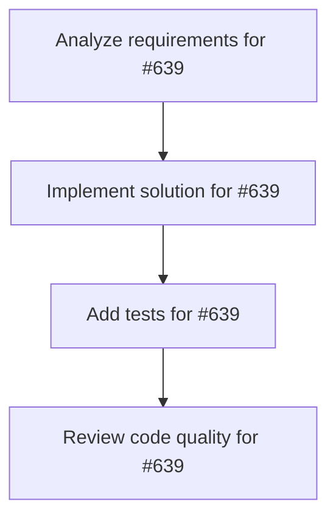

# Plans for Issue #639

**Title**: [Phase 1.4] リアルタイムログストリーミング - パフォーマンス最適化

**URL**: https://github.com/customer-cloud/miyabi-private/issues/639

---

## 📋 Summary

- **Total Tasks**: 4
- **Estimated Duration**: 60 minutes
- **Execution Levels**: 4
- **Has Cycles**: ✅ No

## 📝 Task Breakdown

### 1. Analyze requirements for #639

- **ID**: `task-639-analysis`
- **Type**: Docs
- **Assigned Agent**: IssueAgent
- **Priority**: 0
- **Estimated Duration**: 5 min

**Description**: Analyze issue requirements and create detailed specification

### 2. Implement solution for #639

- **ID**: `task-639-impl`
- **Type**: Feature
- **Assigned Agent**: CodeGenAgent
- **Priority**: 1
- **Estimated Duration**: 30 min
- **Dependencies**: task-639-analysis

**Description**: ## 📋 タスク概要

リアルタイムログストリーミングのパフォーマンスを最適化する。

## 🎯 目的

大量のログ（1000行以上）でもUIがフリーズしないようにする。

## 📝 最適化項目

### 1. Virtual Scrolling導入

**現状の問題**: 1000行のログを全てDOMに描画するとパフォーマンスが低下

**解決策**: `react-window` を使用した仮想スクロール

```typescript
import { FixedSizeList as List } from 'react-window';

const LogViewer = ({ logs }: { logs: string[] }) => {
  const Row = ({ index, style }: { index: number; style: React.CSSProperties }) => (
    <div style={style} className="log-line">
      {logs[index]}
    </div>
  );

  return (
    <List
      height={600}
      itemCount={logs.length}
      itemSize={20}
      width="100%"
    >
      {Row}
    </List>
  );
};
```

**効果**: 1000行 → 常に可視範囲の20-30行のみ描画

### 2. State更新の最適化

**現状の問題**: 毎回 `[...prev.output, line]` で配列をコピー

**解決策**: バッチ更新

```typescript
// バッファリング
const logBuffer = useRef<string[]>([]);

const flushLogs = useCallback(() => {
  if (logBuffer.current.length === 0) return;
  
  setActiveExecution((prev) => ({
    ...prev,
    output: [...prev.output, ...logBuffer.current],
  }));
  
  logBuffer.current = [];
}, []);

// 100ms毎にフラッシュ
useEffect(() => {
  const interval = setInterval(flushLogs, 100);
  return () => clearInterval(interval);
}, [flushLogs]);
```

**効果**: State更新頻度を1/10以下に削減

### 3. Memoization

```typescript
const MemoizedLogLine = React.memo(({ line }: { line: string }) => (
  <div className="log-line">{line}</div>
));
```

### 4. CSS最適化

```css
.log-container {
  /* GPU acceleration */
  transform: translateZ(0);
  will-change: scroll-position;
  
  /* レイアウトスラッシング防止 */
  contain: layout style paint;
}
```

## 📊 パフォーマンス目標

| メトリクス | 現状 | 目標 |
|-----------|------|------|
| 1000行描画時間 | ~2000ms | <500ms |
| CPU使用率 | ~80% | <30% |
| メモリ使用量 | ~200MB | <100MB |
| スクロール FPS | ~30fps | 60fps |

## ✅ 成功基準

- [ ] Virtual scrolling実装
- [ ] バッチ更新実装
- [ ] パフォーマンス目標達成
- [ ] E2Eテストで検証

## 📊 成果物

- 最適化されたコード
- パフォーマンスベンチマーク結果

## 🔗 関連ドキュメント

- 実装計画: `docs/IMPLEMENTATION_PLAN.md` (Phase 1, Task 1.4)
- react-window: https://github.com/bvaughn/react-window

## ⏱️ 見積もり時間

**1日**

---

🤖 Generated with Claude Code

### 3. Add tests for #639

- **ID**: `task-639-test`
- **Type**: Test
- **Assigned Agent**: CodeGenAgent
- **Priority**: 2
- **Estimated Duration**: 15 min
- **Dependencies**: task-639-impl

**Description**: Create comprehensive test coverage

### 4. Review code quality for #639

- **ID**: `task-639-review`
- **Type**: Refactor
- **Assigned Agent**: ReviewAgent
- **Priority**: 3
- **Estimated Duration**: 10 min
- **Dependencies**: task-639-test

**Description**: Run quality checks and code review

## 🔄 Execution Plan (DAG Levels)

Tasks can be executed in parallel within each level:

### Level 0 (Parallel Execution)

- `task-639-analysis` - Analyze requirements for #639

### Level 1 (Parallel Execution)

- `task-639-impl` - Implement solution for #639

### Level 2 (Parallel Execution)

- `task-639-test` - Add tests for #639

### Level 3 (Parallel Execution)

- `task-639-review` - Review code quality for #639

## 📊 Dependency Graph



## ⏱️ Timeline Estimation

- **Sequential Execution**: 60 minutes (1.0 hours)
- **Parallel Execution (Critical Path)**: 10 minutes (0.2 hours)
- **Estimated Speedup**: 6.0x

---

*Generated by CoordinatorAgent on 2025-11-01 11:02:10 UTC*
