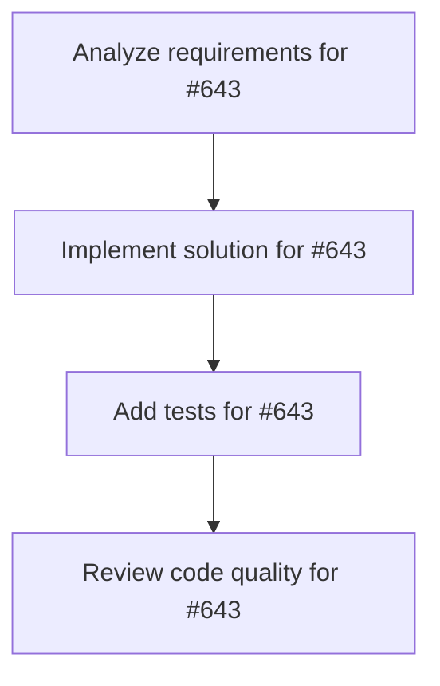

# Plans for Issue #643

**Title**: [Phase 2.4] ビジネスエージェントUI統合 - エージェント検索機能

**URL**: https://github.com/customer-cloud/miyabi-private/issues/643

---

## 📋 Summary

- **Total Tasks**: 4
- **Estimated Duration**: 60 minutes
- **Execution Levels**: 4
- **Has Cycles**: ✅ No

## 📝 Task Breakdown

### 1. Analyze requirements for #643

- **ID**: `task-643-analysis`
- **Type**: Docs
- **Assigned Agent**: IssueAgent
- **Priority**: 0
- **Estimated Duration**: 5 min

**Description**: Analyze issue requirements and create detailed specification

### 2. Implement solution for #643

- **ID**: `task-643-impl`
- **Type**: Feature
- **Assigned Agent**: CodeGenAgent
- **Priority**: 1
- **Estimated Duration**: 30 min
- **Dependencies**: task-643-analysis

**Description**: ## 📋 タスク概要

エージェント名やキャラクター名で検索できる機能を実装する。

## 🎯 目的

21個のエージェントから目的のエージェントを素早く見つけられるようにする。

## 📝 実装内容

### 検索UI

```tsx
const AgentSearch = ({ value, onChange }: { value: string; onChange: (val: string) => void }) => {
  return (
    <div className="relative mb-4">
      <Search className="absolute left-3 top-1/2 transform -translate-y-1/2 w-4 h-4 text-gray-400" />
      <input
        type="text"
        value={value}
        onChange={(e) => onChange(e.target.value)}
        placeholder="Search agents... (e.g., しきるん, Coordinator)"
        className="
          w-full pl-10 pr-4 py-2 border border-gray-300 rounded-lg
          focus:ring-2 focus:ring-blue-500 focus:border-blue-500
        "
      />
      {value && (
        <button
          onClick={() => onChange('')}
          className="absolute right-3 top-1/2 transform -translate-y-1/2 text-gray-400 hover:text-gray-600"
        >
          <X className="w-4 h-4" />
        </button>
      )}
    </div>
  );
};
```

### 検索ロジック

```typescript
const [searchQuery, setSearchQuery] = useState<string>("");

const filteredAgents = useMemo(() => {
  let agents = AVAILABLE_AGENTS;

  // カテゴリフィルタ
  if (selectedCategory !== "all") {
    agents = agents.filter((agent) => {
      if (selectedCategory === "coding") {
        return !agent.category || agent.category === "coding";
      }
      return agent.category === selectedCategory;
    });
  }

  // 検索クエリ
  if (searchQuery.trim()) {
    const query = searchQuery.toLowerCase();
    agents = agents.filter((agent) =>
      agent.displayName.toLowerCase().includes(query) ||
      agent.characterName.toLowerCase().includes(query) ||
      (agent.description && agent.description.toLowerCase().includes(query))
    );
  }

  return agents;
}, [selectedCategory, searchQuery]);
```

### キーボードショートカット

```tsx
useEffect(() => {
  const handleKeyDown = (e: KeyboardEvent) => {
    // Cmd+F / Ctrl+F で検索フォーカス
    if ((e.metaKey || e.ctrlKey) && e.key === 'f') {
      e.preventDefault();
      searchInputRef.current?.focus();
    }
  };

  window.addEventListener('keydown', handleKeyDown);
  return () => window.removeEventListener('keydown', handleKeyDown);
}, []);
```

### 検索結果表示

```tsx
{filteredAgents.length === 0 && (
  <div className="text-center py-8 text-gray-500">
    <Search className="w-12 h-12 mx-auto mb-2 opacity-30" />
    <p>No agents found matching "{searchQuery}"</p>
    <button
      onClick={() => setSearchQuery('')}
      className="mt-2 text-blue-600 hover:underline"
    >
      Clear search
    </button>
  </div>
)}
```

## ✅ 成功基準

- [ ] 検索フォームが実装されている
- [ ] リアルタイム検索（入力中に結果更新）
- [ ] Cmd+F でフォーカス可能
- [ ] 検索結果0件時の適切なUI表示
- [ ] クリアボタンで検索リセット

## 📊 成果物

- `AgentSearch` コンポーネント
- 統合された検索ロジック

## 🔗 関連ドキュメント

- 実装計画: `docs/IMPLEMENTATION_PLAN.md` (Phase 2, Task 2.4)

## ⏱️ 見積もり時間

**2日**

---

🤖 Generated with Claude Code

### 3. Add tests for #643

- **ID**: `task-643-test`
- **Type**: Test
- **Assigned Agent**: CodeGenAgent
- **Priority**: 2
- **Estimated Duration**: 15 min
- **Dependencies**: task-643-impl

**Description**: Create comprehensive test coverage

### 4. Review code quality for #643

- **ID**: `task-643-review`
- **Type**: Refactor
- **Assigned Agent**: ReviewAgent
- **Priority**: 3
- **Estimated Duration**: 10 min
- **Dependencies**: task-643-test

**Description**: Run quality checks and code review

## 🔄 Execution Plan (DAG Levels)

Tasks can be executed in parallel within each level:

### Level 0 (Parallel Execution)

- `task-643-analysis` - Analyze requirements for #643

### Level 1 (Parallel Execution)

- `task-643-impl` - Implement solution for #643

### Level 2 (Parallel Execution)

- `task-643-test` - Add tests for #643

### Level 3 (Parallel Execution)

- `task-643-review` - Review code quality for #643

## 📊 Dependency Graph



## ⏱️ Timeline Estimation

- **Sequential Execution**: 60 minutes (1.0 hours)
- **Parallel Execution (Critical Path)**: 10 minutes (0.2 hours)
- **Estimated Speedup**: 6.0x

---

*Generated by CoordinatorAgent on 2025-11-01 11:00:35 UTC*
