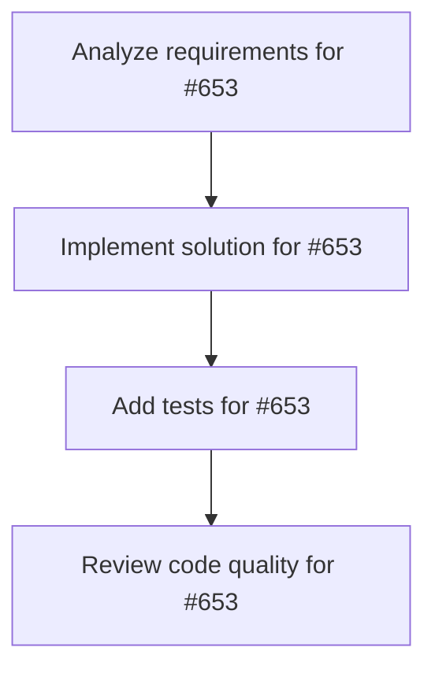

# Plans for Issue #653

**Title**: Autopilot Codex workflow without external LLM

**URL**: https://github.com/customer-cloud/miyabi-private/issues/653

---

## 📋 Summary

- **Total Tasks**: 4
- **Estimated Duration**: 60 minutes
- **Execution Levels**: 4
- **Has Cycles**: ✅ No

## 📝 Task Breakdown

### 1. Analyze requirements for #653

- **ID**: `task-653-analysis`
- **Type**: Docs
- **Assigned Agent**: IssueAgent
- **Priority**: 0
- **Estimated Duration**: 5 min

**Description**: Analyze issue requirements and create detailed specification

### 2. Implement solution for #653

- **ID**: `task-653-impl`
- **Type**: Feature
- **Assigned Agent**: CodeGenAgent
- **Priority**: 1
- **Estimated Duration**: 30 min
- **Dependencies**: task-653-analysis

**Description**: ## Summary
- Codex/Claude Code need to run unattended when CodeGenAgent is unusable due to missing LLM providers.
- Establish an autopilot pipeline that keeps Task Execution Protocol (MCP First, logging, worktree isolation) while allowing Codex CLI to implement tasks without human supervision.

## Requirements
1. Define `.ai/plans/<issue>/Autopilot.yaml` schema to describe autopilot steps (command, expectation, optional rollback) and document in repo.
2. Create `scripts/autopilot/run_codex.sh` that:
   - spins up isolated worktree per issue and tears it down safely
   - iterates plan steps, invoking `codex exec --full-auto` / `codex apply`
   - captures stdout/stderr into `.ai/logs/codex/autopilot-<timestamp>.log`
   - runs optional post-step commands (e.g., `cargo fmt`, `cargo test`)
   - aborts on consecutive failures, records failure report, and exits non-zero
3. Implement summary + status logging (`.ai/logs/autopilot/status-*.log`, `summary-*.md`) and automatic issue comment when execution completes or fails.
4. Add security guardrails: mask secrets, restrict env vars, block network if LLM not required, confirm no stray worktree remains.
5. Provide documentation (e.g., in `.codex/agents/specs/` or `docs/`) covering usage flow, configuration, success criteria, and audit script usage.

## Acceptance Criteria
- Running the script with a sample plan (e.g., Issue #646) produces structured logs, summary markdown, and cleans up worktree.
- Failure scenario creates `FAILED-<timestamp>.log`, posts escalation comment via `gh issue comment`, and leaves environment safe.
- Audit script (`scripts/audit/codex_autopilot_check.sh`) validates logs/worktree cleanliness and returns PASS on successful run.

## References
- docs/setup/OLLAMA_INTEGRATION_COMPLETE.md
- .ai/plans/646/Plans-latest.md
- AGENTS.md (Task Execution Protocol)

### 3. Add tests for #653

- **ID**: `task-653-test`
- **Type**: Test
- **Assigned Agent**: CodeGenAgent
- **Priority**: 2
- **Estimated Duration**: 15 min
- **Dependencies**: task-653-impl

**Description**: Create comprehensive test coverage

### 4. Review code quality for #653

- **ID**: `task-653-review`
- **Type**: Refactor
- **Assigned Agent**: ReviewAgent
- **Priority**: 3
- **Estimated Duration**: 10 min
- **Dependencies**: task-653-test

**Description**: Run quality checks and code review

## 🔄 Execution Plan (DAG Levels)

Tasks can be executed in parallel within each level:

### Level 0 (Parallel Execution)

- `task-653-analysis` - Analyze requirements for #653

### Level 1 (Parallel Execution)

- `task-653-impl` - Implement solution for #653

### Level 2 (Parallel Execution)

- `task-653-test` - Add tests for #653

### Level 3 (Parallel Execution)

- `task-653-review` - Review code quality for #653

## 📊 Dependency Graph

## ⏱️ Timeline Estimation

- **Sequential Execution**: 60 minutes (1.0 hours)
- **Parallel Execution (Critical Path)**: 10 minutes (0.2 hours)
- **Estimated Speedup**: 6.0x

---

*Generated by CoordinatorAgent on 2025-11-01 10:40:49 UTC*
