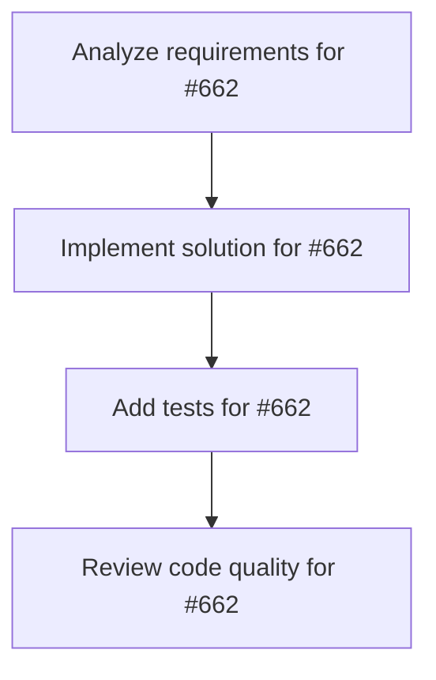

# Plans for Issue #662

**Title**: [Ops] PRクリーンナップ運用ルールをmiyabi_defへ反映

**URL**: https://github.com/customer-cloud/miyabi-private/issues/662

---

## 📋 Summary

- **Total Tasks**: 4
- **Estimated Duration**: 60 minutes
- **Execution Levels**: 4
- **Has Cycles**: ✅ No

## 📝 Task Breakdown

### 1. Analyze requirements for #662

- **ID**: `task-662-analysis`
- **Type**: Docs
- **Assigned Agent**: IssueAgent
- **Priority**: 0
- **Estimated Duration**: 5 min

**Description**: Analyze issue requirements and create detailed specification

### 2. Implement solution for #662

- **ID**: `task-662-impl`
- **Type**: Feature
- **Assigned Agent**: CodeGenAgent
- **Priority**: 1
- **Estimated Duration**: 30 min
- **Dependencies**: task-662-analysis

**Description**: ## 背景
PRレビュー時に生成物コミット禁止などのクリーンナップルールが策定された。

## ToDo
- [ ] miyabi_def/variables/pr_merge_rules.yaml へ上記ルールを追加
- [ ] 必要なら関連ファイルを更新し整合性を取る
- [ ] ルール更新後にミヤビ定義の再生成手順を確認

## 完了条件
- クリーンナップルールが定義ファイルに追加されている
- 追加内容が日本語で明記されている
- 自動生成物から生成ファイルを再生成する必要性を確認

### 3. Add tests for #662

- **ID**: `task-662-test`
- **Type**: Test
- **Assigned Agent**: CodeGenAgent
- **Priority**: 2
- **Estimated Duration**: 15 min
- **Dependencies**: task-662-impl

**Description**: Create comprehensive test coverage

### 4. Review code quality for #662

- **ID**: `task-662-review`
- **Type**: Refactor
- **Assigned Agent**: ReviewAgent
- **Priority**: 3
- **Estimated Duration**: 10 min
- **Dependencies**: task-662-test

**Description**: Run quality checks and code review

## 🔄 Execution Plan (DAG Levels)

Tasks can be executed in parallel within each level:

### Level 0 (Parallel Execution)

- `task-662-analysis` - Analyze requirements for #662

### Level 1 (Parallel Execution)

- `task-662-impl` - Implement solution for #662

### Level 2 (Parallel Execution)

- `task-662-test` - Add tests for #662

### Level 3 (Parallel Execution)

- `task-662-review` - Review code quality for #662

## 📊 Dependency Graph

## ⏱️ Timeline Estimation

- **Sequential Execution**: 60 minutes (1.0 hours)
- **Parallel Execution (Critical Path)**: 10 minutes (0.2 hours)
- **Estimated Speedup**: 6.0x

---

*Generated by CoordinatorAgent on 2025-11-01 03:19:47 UTC*
