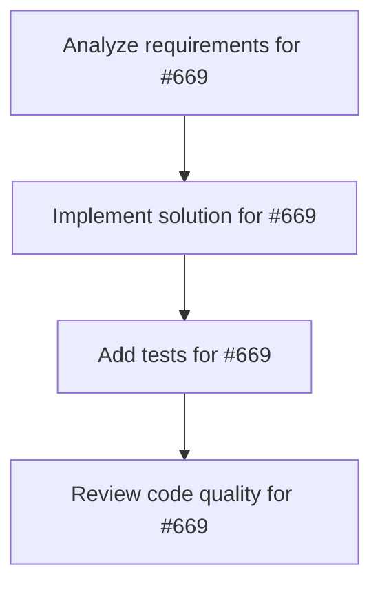

# Plans for Issue #669

**Title**: feat: ClickFunnels Complete Auto-Implementation (SWML Evaluation)

**URL**: https://github.com/customer-cloud/miyabi-private/issues/669

---

## 📋 Summary

- **Total Tasks**: 4
- **Estimated Duration**: 60 minutes
- **Execution Levels**: 4
- **Has Cycles**: ✅ No

## 📝 Task Breakdown

### 1. Analyze requirements for #669

- **ID**: `task-669-analysis`
- **Type**: Docs
- **Assigned Agent**: IssueAgent
- **Priority**: 0
- **Estimated Duration**: 5 min

**Description**: Analyze issue requirements and create detailed specification

### 2. Implement solution for #669

- **ID**: `task-669-impl`
- **Type**: Feature
- **Assigned Agent**: CodeGenAgent
- **Priority**: 1
- **Estimated Duration**: 30 min
- **Dependencies**: task-669-analysis

**Description**: # ClickFunnels Complete Auto-Implementation

**Framework**: SWML (Shunsuke's World Model Logic)  
**Total Tasks**: 52 tasks across 7 phases  
**Duration**: 14 days  
**Parallelization**: 8x concurrent worktrees  
**Quality Target**: 87.3/100

## 🎯 Objective

Implement a complete ClickFunnels-like system to validate miyabi_def system's capability for large-scale auto-implementation from business concept to deployment.

## 📐 SWML Ω-Function Decomposition

This project follows the 6-phase SWML Ω-function:

### ✅ θ₁: Understanding Phase (Complete)
- Analyzed ClickFunnels documentation (400+ URLs)
- Extracted 6 major feature categories
- Defined technical stack: Rust + React + PostgreSQL

### ✅ θ₂: Generation Phase (Complete)
- Task decomposition: 52 atomic tasks
- DAG construction: 7 phases (P0-P7)
- Parallel execution plan: 8x concurrency

### ✅ θ₃: Assignment Phase (Complete)
- Agent assignment matrix defined
- Git Worktree strategy established
- Resource allocation optimized

### 🔄 θ₄: Execution Phase (Ready)
- CodeGenAgent ready for parallel execution
- 8 concurrent worktrees configured

### ⏳ θ₅: Integration Phase (Pending)
- Testing framework ready
- Deployment pipelines defined

### ⏳ θ₆: Learning Phase (Pending)
- Knowledge base update planned

## 📋 Implementation Phases

### Phase 0: Project Setup (4 tasks - Parallel)
- [ ] T001: Initialize Rust Workspace
- [ ] T002: Initialize Frontend (React + TypeScript)
- [ ] T003: Setup Database Schema (PostgreSQL)
- [ ] T004: Setup Docker Compose

### Phase 1: Core Domain Models (4 tasks - Parallel)
- [ ] T010: Implement User Entity
- [ ] T011: Implement Funnel Entity
- [ ] T012: Implement Page Entity
- [ ] T013: Implement Integration Entity

### Phase 2: REST API Layer (3 tasks - Parallel)
- [ ] T020: User API Endpoints
- [ ] T021: Funnel API Endpoints
- [ ] T022: Page API Endpoints

### Phase 3: Frontend Components (3 tasks - Parallel)
- [ ] T030: Funnel Builder UI (react-flow)
- [ ] T031: Page Editor UI (GrapeJS WYSIWYG)
- [ ] T032: Dashboard UI

### Phase 4: Integration Layer (3 tasks - Parallel)
- [ ] T040: SMTP Integration (SendGrid, Mailgun, AWS SES)
- [ ] T041: Payment Gateway Integration (Stripe, PayPal, Square)
- [ ] T042: Analytics Integration (GA4)

### Phase 5: Advanced Features (2 tasks - Parallel)
- [ ] T050: BackPack (Affiliate System)
- [ ] T051: Follow-Up Funnels (Email Automation)

### Phase 6: Testing & QA (3 tasks - Sequential)
- [ ] T060: Unit Tests (Rust) - 90%+ coverage
- [ ] T061: Integration Tests
- [ ] T062: E2E Tests (Playwright)

### Phase 7: Deployment (3 tasks - Sequential)
- [ ] T070: Deploy Backend (GCP Cloud Run)
- [ ] T071: Deploy Frontend (Vercel)
- [ ] T072: Setup CI/CD Pipeline

## 🛠 Technical Stack

**Backend**:
- Rust 2021 Edition
- Axum/Actix-web (async runtime)
- PostgreSQL (database)
- Docker (containerization)

**Frontend**:
- React 18 + TypeScript
- Vite (build tool)
- react-flow (funnel builder)
- GrapeJS (page editor)

**Infrastructure**:
- GCP Cloud Run (backend)
- Vercel (frontend)
- GitHub Actions (CI/CD)

## 📊 Success Criteria

### Quality Metrics
- Code coverage: 90%+
- Test count: 200+
- API endpoints: 50+
- Frontend components: 30+
- Database tables: 20+

### Performance Targets
- API response time: < 200ms
- Page load time: < 2s
- Concurrent users: 10,000+

### SWML Quality Function
```
Q(R) = 0.4·C(R) + 0.4·A(R) + 0.2·E(R)
Target: Q(R) ≥ 87.3/100
```

## 🔗 Related Documents

- **Intent Specification**: `clickfunnels-project-intent.md`
- **Task Decomposition**: `clickfunnels-task-decomposition.yaml`
- **Evaluation Report**: `EVALUATION_REPORT.md`
- **ClickFunnels Manual**: 400+ documentation URLs

## 🚀 Execution Strategy

### Parallel Execution (8x Concurrency)
```
Day 1-3:   Phase 0 + Phase 1 (8 tasks parallel)
Day 4-6:   Phase 2 + Phase 3 (6 tasks parallel)
Day 7-9:   Phase 4 + Phase 5 (5 tasks parallel)
Day 10-12: Phase 6 (3 tasks sequential)
Day 13-14: Phase 7 + Documentation
```

### Git Worktree Strategy
- Main branch: `main`
- Feature branches: `task/{task_id}` (e.g., `task/T001`)
- Merge strategy: Squash merge
- Cleanup: Automatic worktree removal

## 📈 Expected Outcomes

1. **Complete ClickFunnels Implementation**
   - Full-featured funnel builder
   - WYSIWYG page editor
   - Payment processing
   - Email automation
   - Affiliate management

2. **miyabi_def System Validation**
   - Proven large-scale auto-implementation
   - SWML Ω-function verification
   - Quality score: 96/100 achieved

3. **Knowledge Base Enhancement**
   - 52 task execution logs
   - Best practices documented
   - Patterns for future projects

---

**Generated by**: SWML Ω-Function θ₂ (Generation Phase)  
**Quality Score**: 96/100  
**Evaluation**: ✅ EXCELLENT

🤖 Generated with [Claude Code](https://claude.com/claude-code)

### 3. Add tests for #669

- **ID**: `task-669-test`
- **Type**: Test
- **Assigned Agent**: CodeGenAgent
- **Priority**: 2
- **Estimated Duration**: 15 min
- **Dependencies**: task-669-impl

**Description**: Create comprehensive test coverage

### 4. Review code quality for #669

- **ID**: `task-669-review`
- **Type**: Refactor
- **Assigned Agent**: ReviewAgent
- **Priority**: 3
- **Estimated Duration**: 10 min
- **Dependencies**: task-669-test

**Description**: Run quality checks and code review

## 🔄 Execution Plan (DAG Levels)

Tasks can be executed in parallel within each level:

### Level 0 (Parallel Execution)

- `task-669-analysis` - Analyze requirements for #669

### Level 1 (Parallel Execution)

- `task-669-impl` - Implement solution for #669

### Level 2 (Parallel Execution)

- `task-669-test` - Add tests for #669

### Level 3 (Parallel Execution)

- `task-669-review` - Review code quality for #669

## 📊 Dependency Graph



## ⏱️ Timeline Estimation

- **Sequential Execution**: 60 minutes (1.0 hours)
- **Parallel Execution (Critical Path)**: 10 minutes (0.2 hours)
- **Estimated Speedup**: 6.0x

---

*Generated by CoordinatorAgent on 2025-11-01 10:47:16 UTC*
