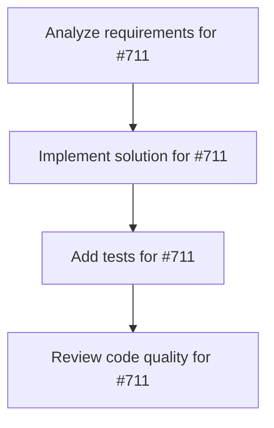

# Plans for Issue #711

**Title**: fix(deps): Migrate to tree-sitter-rust 0.24 LanguageFn API

**URL**: https://github.com/customer-cloud/miyabi-private/issues/711

---

## 📋 Summary

- **Total Tasks**: 4
- **Estimated Duration**: 60 minutes
- **Execution Levels**: 4
- **Has Cycles**: ✅ No

## 📝 Task Breakdown

### 1. Analyze requirements for #711

- **ID**: `task-711-analysis`
- **Type**: Docs
- **Assigned Agent**: IssueAgent
- **Priority**: 0
- **Estimated Duration**: 5 min

**Description**: Analyze issue requirements and create detailed specification

### 2. Implement solution for #711

- **ID**: `task-711-impl`
- **Type**: Bug
- **Assigned Agent**: CodeGenAgent
- **Priority**: 1
- **Estimated Duration**: 30 min
- **Dependencies**: task-711-analysis

**Description**: ## 🐛 Problem

AST parsing functionality in `miyabi-knowledge` is temporarily disabled due to breaking changes in tree-sitter-rust 0.24.0.

**Root Cause**: Dependabot PR #698 upgraded tree-sitter-rust from 0.20.4 → 0.24.0, which introduced breaking API changes:
- `language()` function removed
- Replaced with `LANGUAGE` constant of type `LanguageFn`

## 📍 Affected Code

**File**: `crates/miyabi-knowledge/src/ast_context.rs:199`

**Current (Temporary Workaround)**:
```rust
pub fn new_rust() -> Result<Self> {
    return Err(AstError::ParseError(
        "AST parsing temporarily disabled due to tree-sitter-rust 0.24 breaking change".to_string()
    ));
}
```

## ✅ Required Changes

Migrate from `language()` function to `LanguageFn` constant and re-enable 10 failing tests.

## 📚 Resources

- tree-sitter-rust Changelog for 0.24.0 migration guide
- https://docs.rs/tree-sitter-language/

## 🎯 Acceptance Criteria

- [ ] `FileContextTracker::new_rust()` returns `Ok`
- [ ] All 10 AST-related tests pass
- [ ] Migration documented

## 🔗 Related

- Dependabot PR #698
- Fix commit: 31f83e3a1

---

🤖 Generated with [Claude Code](https://claude.com/claude-code)

### 3. Add tests for #711

- **ID**: `task-711-test`
- **Type**: Test
- **Assigned Agent**: CodeGenAgent
- **Priority**: 2
- **Estimated Duration**: 15 min
- **Dependencies**: task-711-impl

**Description**: Create comprehensive test coverage

### 4. Review code quality for #711

- **ID**: `task-711-review`
- **Type**: Refactor
- **Assigned Agent**: ReviewAgent
- **Priority**: 3
- **Estimated Duration**: 10 min
- **Dependencies**: task-711-test

**Description**: Run quality checks and code review

## 🔄 Execution Plan (DAG Levels)

Tasks can be executed in parallel within each level:

### Level 0 (Parallel Execution)

- `task-711-analysis` - Analyze requirements for #711

### Level 1 (Parallel Execution)

- `task-711-impl` - Implement solution for #711

### Level 2 (Parallel Execution)

- `task-711-test` - Add tests for #711

### Level 3 (Parallel Execution)

- `task-711-review` - Review code quality for #711

## 📊 Dependency Graph



## ⏱️ Timeline Estimation

- **Sequential Execution**: 60 minutes (1.0 hours)
- **Parallel Execution (Critical Path)**: 10 minutes (0.2 hours)
- **Estimated Speedup**: 6.0x

---

*Generated by CoordinatorAgent on 2025-11-03 13:10:33 UTC*
