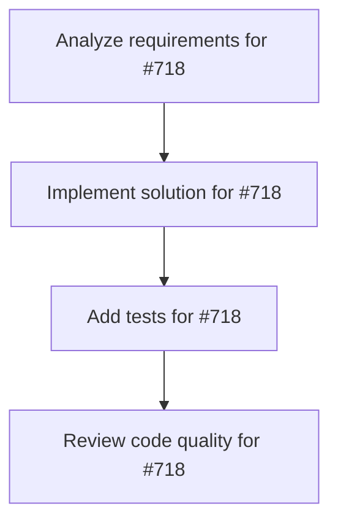

# Plans for Issue #718

**Title**: feat: Implement conditional branching (.branch()) for workflow DSL (#715 Phase 1-3)

**URL**: https://github.com/customer-cloud/miyabi-private/issues/718

---

## 📋 Summary

- **Total Tasks**: 4
- **Estimated Duration**: 60 minutes
- **Execution Levels**: 4
- **Has Cycles**: ✅ No

## 📝 Task Breakdown

### 1. Analyze requirements for #718

- **ID**: `task-718-analysis`
- **Type**: Docs
- **Assigned Agent**: IssueAgent
- **Priority**: 0
- **Estimated Duration**: 5 min

**Description**: Analyze issue requirements and create detailed specification

### 2. Implement solution for #718

- **ID**: `task-718-impl`
- **Type**: Feature
- **Assigned Agent**: CodeGenAgent
- **Priority**: 1
- **Estimated Duration**: 30 min
- **Dependencies**: task-718-analysis

**Description**: ## Parent Issue

Part of #715 Epic: Full Rust Agentic Framework - Phase 1 (Workflow DSL)  
Depends on #716 (WorkflowBuilder API)

## Objective

Implement conditional branching logic in workflows, allowing dynamic path selection based on step results.

## Background

Mastra's `.branch()` enables workflows to take different paths based on conditions:

```typescript
// Mastra example
workflow
  .step('test', testAgent)
  .branch('deploy', {
    pass: 'production',
    fail: 'rollback'
  });
```

Miyabi needs similar functionality for dynamic workflow routing.

## Implementation Plan

### 1. Define Condition Types

**File**: `crates/miyabi-workflow/src/condition.rs`

```rust
use serde::{Deserialize, Serialize};
use serde_json::Value;

#[derive(Debug, Clone, Serialize, Deserialize)]
pub enum Condition {
    /// Always true
    Always,
    
    /// Check field value equality
    FieldEquals {
        field: String,
        value: Value,
    },
    
    /// Check field value comparison
    FieldGreaterThan {
        field: String,
        value: f64,
    },
    
    /// Custom Rust expression (via rhai or similar)
    Expression {
        expr: String,
    },
    
    /// Multiple conditions (AND)
    And(Vec<Condition>),
    
    /// Multiple conditions (OR)
    Or(Vec<Condition>),
}

impl Condition {
    pub fn evaluate(&self, context: &Value) -> bool {
        match self {
            Condition::Always => true,
            
            Condition::FieldEquals { field, value } => {
                context.get(field).map(|v| v == value).unwrap_or(false)
            }
            
            Condition::FieldGreaterThan { field, value } => {
                context
                    .get(field)
                    .and_then(|v| v.as_f64())
                    .map(|v| v > *value)
                    .unwrap_or(false)
            }
            
            Condition::Expression { expr } => {
                // Use rhai for safe expression evaluation
                evaluate_expression(expr, context)
            }
            
            Condition::And(conditions) => {
                conditions.iter().all(|c| c.evaluate(context))
            }
            
            Condition::Or(conditions) => {
                conditions.iter().any(|c| c.evaluate(context))
            }
        }
    }
}

fn evaluate_expression(expr: &str, context: &Value) -> bool {
    // Placeholder - integrate rhai scripting engine
    // For MVP, use simple field checks only
    false
}
```

### 2. Add Branch Step Type

**File**: `crates/miyabi-workflow/src/builder.rs` (update)

```rust
#[derive(Clone)]
pub enum StepType {
    Sequential,
    Parallel,
    Conditional {
        branches: Vec<ConditionalBranch>,
    },
}

#[derive(Clone)]
pub struct ConditionalBranch {
    pub condition: Condition,
    pub next_step: String,
}

impl WorkflowBuilder {
    pub fn branch_on(
        &mut self,
        name: &str,
        branches: Vec<(&str, Condition, &str)>,
    ) -> &mut Self {
        // branches: vec![
        //   ("pass", Condition::FieldEquals { field: "success", value: true }, "deploy"),
        //   ("fail", Condition::Always, "rollback"),
        // ]
        
        let step_id = format!("step-{}", self.steps.len());
        let dependencies = self.current_step
            .as_ref()
            .map(|id| vec![id.clone()])
            .unwrap_or_default();
        
        let conditional_branches: Vec<ConditionalBranch> = branches
            .iter()
            .map(|(_, cond, next)| ConditionalBranch {
                condition: cond.clone(),
                next_step: next.to_string(),
            })
            .collect();
        
        let step = Step {
            id: step_id.clone(),
            name: name.to_string(),
            agent_type: AgentType::CoordinatorAgent,
            dependencies,
            step_type: StepType::Conditional {
                branches: conditional_branches,
            },
        };
        
        self.steps.push(step);
        self.current_step = Some(step_id);
        self
    }
    
    /// Simplified branch() for common case: pass/fail
    pub fn branch(&mut self, name: &str, pass_step: &str, fail_step: &str) -> &mut Self {
        self.branch_on(
            name,
            vec![
                (
                    "pass",
                    Condition::FieldEquals {
                        field: "success".to_string(),
                        value: serde_json::Value::Bool(true),
                    },
                    pass_step,
                ),
                ("fail", Condition::Always, fail_step),
            ],
        )
    }
}
```

### 3. Conditional Execution Logic

**File**: `crates/miyabi-workflow/src/executor.rs` (new)

```rust
pub struct WorkflowExecutor {
    workflow: WorkflowBuilder,
    state: WorkflowState,
}

impl WorkflowExecutor {
    pub async fn execute_step(&mut self, step: &Step) -> Result<String, anyhow::Error> {
        match &step.step_type {
            StepType::Sequential | StepType::Parallel => {
                // Normal execution
                let result = self.run_agent(&step.agent_type, &step.id).await?;
                Ok(step.id.clone())
            }
            
            StepType::Conditional { branches } => {
                // Get previous step result
                let context = self.state.get_step_result(&step.dependencies[0])?;
                
                // Evaluate conditions and find matching branch
                for branch in branches {
                    if branch.condition.evaluate(&context) {
                        return Ok(branch.next_step.clone());
                    }
                }
                
                Err(anyhow::anyhow!("No branch condition matched"))
            }
        }
    }
}
```

### 4. DAG Generation for Branches

**File**: `crates/miyabi-workflow/src/builder.rs` (update `build_dag`)

```rust
impl WorkflowBuilder {
    pub fn build_dag(&self) -> Result<DAG, anyhow::Error> {
        let mut nodes = Vec::new();
        let mut edges = Vec::new();
        
        for step in &self.steps {
            let task = /* ... */;
            nodes.push(task);
            
            match &step.step_type {
                StepType::Conditional { branches } => {
                    // Add edges to all possible branch targets
                    for branch in branches {
                        edges.push(Edge {
                            from: step.id.clone(),
                            to: branch.next_step.clone(),
                        });
                    }
                }
                _ => {
                    // Normal edges
                    for dep in &step.dependencies {
                        edges.push(Edge {
                            from: dep.clone(),
                            to: step.id.clone(),
                        });
                    }
                }
            }
        }
        
        let levels = self.compute_levels(&nodes, &edges)?;
        Ok(DAG { nodes, edges, levels })
    }
}
```

### 5. Usage Example

```rust
use miyabi_workflow::{WorkflowBuilder, Condition};
use miyabi_types::agent::AgentType;

let workflow = WorkflowBuilder::new("ci-cd")
    .step("build", AgentType::CodeGenAgent)
    .step("test", AgentType::ReviewAgent)
    .branch("deploy-decision", "deploy", "rollback")
    .step("deploy", AgentType::DeploymentAgent)
    .step("rollback", AgentType::CodeGenAgent);

// OR advanced usage:
workflow
    .step("quality-check", AgentType::ReviewAgent)
    .branch_on("route", vec![
        ("high-quality", Condition::FieldGreaterThan {
            field: "quality_score".to_string(),
            value: 0.9,
        }, "fast-deploy"),
        ("medium-quality", Condition::FieldGreaterThan {
            field: "quality_score".to_string(),
            value: 0.7,
        }, "manual-review"),
        ("low-quality", Condition::Always, "reject"),
    ]);
```

## Testing

**File**: `crates/miyabi-workflow/tests/branching_test.rs`

```rust
#[tokio::test]
async fn test_conditional_branch_success() {
    let workflow = WorkflowBuilder::new("test")
        .step("start", AgentType::IssueAgent)
        .branch("decision", "success-path", "failure-path")
        .step("success-path", AgentType::CodeGenAgent)
        .step("failure-path", AgentType::ReviewAgent);
    
    let dag = workflow.build_dag().unwrap();
    
    // Verify DAG has conditional edges
    let decision_step = dag.nodes.iter()
        .find(|n| n.id.contains("decision"))
        .unwrap();
    
    let edges_from_decision: Vec<_> = dag.edges.iter()
        .filter(|e| e.from == decision_step.id)
        .collect();
    
    assert_eq!(edges_from_decision.len(), 2); // 2 branches
}

#[test]
fn test_condition_evaluation() {
    let cond = Condition::FieldEquals {
        field: "status".to_string(),
        value: serde_json::json!("passed"),
    };
    
    let context = serde_json::json!({
        "status": "passed",
        "score": 95
    });
    
    assert!(cond.evaluate(&context));
}
```

## Acceptance Criteria

- [ ] `Condition` enum supports field checks and expressions
- [ ] `.branch()` and `.branch_on()` methods implemented
- [ ] Conditional steps generate correct DAG with multiple edges
- [ ] Executor can evaluate conditions and select branch
- [ ] All tests pass
- [ ] Documentation with examples

## Dependencies

- Optional: `rhai = "1.0"` for expression evaluation (can defer to Phase 2)

## Estimated Duration

**3-4 days**

---

🤖 Generated with [Claude Code](https://claude.com/claude-code)

Co-Authored-By: Claude <noreply@anthropic.com>

### 3. Add tests for #718

- **ID**: `task-718-test`
- **Type**: Test
- **Assigned Agent**: CodeGenAgent
- **Priority**: 2
- **Estimated Duration**: 15 min
- **Dependencies**: task-718-impl

**Description**: Create comprehensive test coverage

### 4. Review code quality for #718

- **ID**: `task-718-review`
- **Type**: Refactor
- **Assigned Agent**: ReviewAgent
- **Priority**: 3
- **Estimated Duration**: 10 min
- **Dependencies**: task-718-test

**Description**: Run quality checks and code review

## 🔄 Execution Plan (DAG Levels)

Tasks can be executed in parallel within each level:

### Level 0 (Parallel Execution)

- `task-718-analysis` - Analyze requirements for #718

### Level 1 (Parallel Execution)

- `task-718-impl` - Implement solution for #718

### Level 2 (Parallel Execution)

- `task-718-test` - Add tests for #718

### Level 3 (Parallel Execution)

- `task-718-review` - Review code quality for #718

## 📊 Dependency Graph



## ⏱️ Timeline Estimation

- **Sequential Execution**: 60 minutes (1.0 hours)
- **Parallel Execution (Critical Path)**: 10 minutes (0.2 hours)
- **Estimated Speedup**: 6.0x

---

*Generated by CoordinatorAgent on 2025-11-04 22:57:26 UTC*
