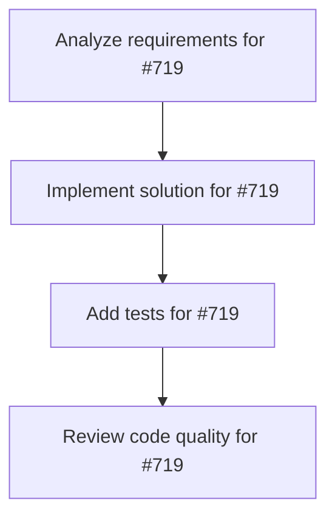

# Plans for Issue #719

**Title**: feat: Integrate WorkflowBuilder with CoordinatorAgent (#715 Phase 1-4)

**URL**: https://github.com/customer-cloud/miyabi-private/issues/719

---

## 📋 Summary

- **Total Tasks**: 4
- **Estimated Duration**: 60 minutes
- **Execution Levels**: 4
- **Has Cycles**: ✅ No

## 📝 Task Breakdown

### 1. Analyze requirements for #719

- **ID**: `task-719-analysis`
- **Type**: Docs
- **Assigned Agent**: IssueAgent
- **Priority**: 0
- **Estimated Duration**: 5 min

**Description**: Analyze issue requirements and create detailed specification

### 2. Implement solution for #719

- **ID**: `task-719-impl`
- **Type**: Feature
- **Assigned Agent**: CodeGenAgent
- **Priority**: 1
- **Estimated Duration**: 30 min
- **Dependencies**: task-719-analysis

**Description**: ## Parent Issue

Part of #715 Epic: Full Rust Agentic Framework - Phase 1 (Workflow DSL)  
Depends on #716, #717, #718

## Objective

Integrate the new `WorkflowBuilder` API with the existing `CoordinatorAgent` to enable end-to-end workflow execution.

## Background

Currently, `CoordinatorAgent` executes DAGs directly. With the new `WorkflowBuilder`, we need:
1. Seamless conversion from Builder -> DAG -> Execution
2. State tracking integration
3. Conditional branching support
4. Agent execution coordination

## Implementation Plan

### 1. Update CoordinatorAgent

**File**: `crates/miyabi-coordinator/src/coordinator.rs` (update)

```rust
use miyabi_workflow::{WorkflowBuilder, ExecutionState, WorkflowState};

impl CoordinatorAgent {
    /// Execute a workflow from WorkflowBuilder
    pub async fn execute_workflow(
        &self,
        workflow: &WorkflowBuilder,
        state_path: &str,
    ) -> Result<ExecutionReport, MiyabiError> {
        // Convert workflow to DAG
        let dag = workflow.build_dag()
            .map_err(|e| MiyabiError::Workflow(e.to_string()))?;
        
        // Initialize state tracking
        let state_db = WorkflowState::new(state_path)
            .map_err(|e| MiyabiError::Workflow(e.to_string()))?;
        
        let workflow_id = uuid::Uuid::new_v4().to_string();
        let mut execution_state = ExecutionState {
            workflow_id: workflow_id.clone(),
            session_id: self.session_id.clone(),
            current_step: None,
            completed_steps: Vec::new(),
            failed_steps: Vec::new(),
            step_results: HashMap::new(),
            status: WorkflowStatus::Running,
            created_at: chrono::Utc::now().timestamp() as u64,
            updated_at: chrono::Utc::now().timestamp() as u64,
        };
        
        state_db.save(&execution_state)
            .map_err(|e| MiyabiError::Workflow(e.to_string()))?;
        
        // Execute DAG with state tracking
        self.execute_dag_with_state(dag, &mut execution_state, &state_db).await
    }
    
    async fn execute_dag_with_state(
        &self,
        dag: DAG,
        state: &mut ExecutionState,
        state_db: &WorkflowState,
    ) -> Result<ExecutionReport, MiyabiError> {
        let mut task_results = Vec::new();
        
        for level in &dag.levels {
            // Execute tasks in parallel within level
            let level_tasks: Vec<_> = level.iter()
                .filter_map(|task_id| {
                    dag.nodes.iter().find(|n| &n.id == task_id)
                })
                .collect();
            
            let mut level_handles = Vec::new();
            
            for task in level_tasks {
                state.current_step = Some(task.id.clone());
                state_db.save(state)
                    .map_err(|e| MiyabiError::Workflow(e.to_string()))?;
                
                // Check for conditional branching
                if let Some(step) = workflow.steps.iter().find(|s| s.id == task.id) {
                    if let StepType::Conditional { branches } = &step.step_type {
                        // Evaluate condition and select branch
                        let selected = self.evaluate_branch(branches, state)?;
                        
                        // Skip other branches, only execute selected
                        state.step_results.insert(
                            task.id.clone(),
                            serde_json::json!({ "selected_branch": selected }),
                        );
                        continue;
                    }
                }
                
                // Execute agent for this task
                let agent_type = task.assigned_agent.clone()
                    .ok_or_else(|| MiyabiError::Workflow("No agent assigned".to_string()))?;
                
                let handle = self.execute_agent(agent_type, task.clone());
                level_handles.push((task.id.clone(), handle));
            }
            
            // Wait for all tasks in level to complete
            for (task_id, handle) in level_handles {
                match handle.await {
                    Ok(result) => {
                        state.completed_steps.push(task_id.clone());
                        state.step_results.insert(
                            task_id.clone(),
                            serde_json::to_value(&result)
                                .unwrap_or(serde_json::Value::Null),
                        );
                        task_results.push(result);
                    }
                    Err(e) => {
                        state.failed_steps.push(task_id.clone());
                        state.status = WorkflowStatus::Failed;
                        state_db.save(state)
                            .map_err(|e| MiyabiError::Workflow(e.to_string()))?;
                        return Err(e);
                    }
                }
                
                state_db.save(state)
                    .map_err(|e| MiyabiError::Workflow(e.to_string()))?;
            }
        }
        
        state.status = WorkflowStatus::Completed;
        state_db.save(state)
            .map_err(|e| MiyabiError::Workflow(e.to_string()))?;
        
        Ok(ExecutionReport {
            session_id: self.session_id.clone(),
            device_identifier: self.device_identifier.clone(),
            start_time: state.created_at,
            end_time: chrono::Utc::now().timestamp() as u64,
            total_duration_ms: (state.updated_at - state.created_at) * 1000,
            summary: ExecutionSummary {
                total: task_results.len() as u32,
                completed: state.completed_steps.len() as u32,
                failed: state.failed_steps.len() as u32,
                escalated: 0,
                success_rate: state.completed_steps.len() as f32 
                    / task_results.len() as f32,
            },
            tasks: task_results,
            metrics: vec![],
            escalations: vec![],
        })
    }
    
    fn evaluate_branch(
        &self,
        branches: &[ConditionalBranch],
        state: &ExecutionState,
    ) -> Result<String, MiyabiError> {
        // Get context from previous step
        let prev_step_id = &state.current_step
            .as_ref()
            .ok_or_else(|| MiyabiError::Workflow("No previous step".to_string()))?;
        
        let context = state.step_results.get(prev_step_id)
            .ok_or_else(|| MiyabiError::Workflow("No previous result".to_string()))?;
        
        // Evaluate conditions
        for branch in branches {
            if branch.condition.evaluate(context) {
                return Ok(branch.next_step.clone());
            }
        }
        
        Err(MiyabiError::Workflow("No branch matched".to_string()))
    }
    
    async fn execute_agent(
        &self,
        agent_type: AgentType,
        task: Task,
    ) -> Result<TaskResult, MiyabiError> {
        // Route to appropriate agent
        match agent_type {
            AgentType::CodeGenAgent => {
                let agent = CodeGenAgent::new(/* ... */);
                agent.execute(&task).await
            }
            AgentType::ReviewAgent => {
                let agent = ReviewAgent::new(/* ... */);
                agent.execute(&task).await
            }
            // ... other agents
            _ => Err(MiyabiError::Workflow(format!("Unsupported agent: {:?}", agent_type))),
        }
    }
}
```

### 2. Add Workflow CLI Command

**File**: `crates/miyabi-cli/src/commands/workflow.rs` (new)

```rust
use clap::Parser;
use miyabi_workflow::WorkflowBuilder;
use miyabi_coordinator::CoordinatorAgent;

#[derive(Parser)]
pub struct WorkflowCommand {
    /// Workflow file (YAML or JSON)
    #[arg(short, long)]
    file: String,
    
    /// State persistence directory
    #[arg(short, long, default_value = ".miyabi/workflows")]
    state_dir: String,
}

impl WorkflowCommand {
    pub async fn run(&self) -> Result<(), anyhow::Error> {
        // Load workflow definition
        let workflow_def = std::fs::read_to_string(&self.file)?;
        let workflow: WorkflowDefinition = if self.file.ends_with(".yaml") {
            serde_yaml::from_str(&workflow_def)?
        } else {
            serde_json::from_str(&workflow_def)?
        };
        
        // Build workflow
        let mut builder = WorkflowBuilder::new(&workflow.name);
        for step in &workflow.steps {
            match &step.step_type {
                "step" => builder.step(&step.name, step.agent_type),
                "then" => builder.then(&step.name, step.agent_type),
                "parallel" => /* ... */,
                "branch" => /* ... */,
                _ => return Err(anyhow::anyhow!("Unknown step type: {}", step.step_type)),
            };
        }
        
        // Execute via CoordinatorAgent
        let coordinator = CoordinatorAgent::new(/* ... */);
        let report = coordinator.execute_workflow(&builder, &self.state_dir).await?;
        
        println!("Workflow completed: {:?}", report.summary);
        Ok(())
    }
}
```

### 3. Workflow Definition Format

**Example**: `workflows/ci-cd.yaml`

```yaml
name: ci-cd-pipeline
version: 1.0

steps:
  - name: checkout
    type: step
    agent: CodeGenAgent
    
  - name: build
    type: then
    agent: CodeGenAgent
    
  - name: test
    type: then
    agent: ReviewAgent
    
  - name: deploy-decision
    type: branch
    branches:
      - condition:
          field: test_result.success
          equals: true
        next: deploy-prod
      - condition: always
        next: rollback
    
  - name: deploy-prod
    type: step
    agent: DeploymentAgent
    
  - name: rollback
    type: step
    agent: CodeGenAgent
```

## Testing

**File**: `crates/miyabi-coordinator/tests/workflow_integration_test.rs`

```rust
#[tokio::test]
async fn test_workflow_execution() {
    let workflow = WorkflowBuilder::new("test")
        .step("step1", AgentType::IssueAgent)
        .then("step2", AgentType::CodeGenAgent)
        .then("step3", AgentType::ReviewAgent);
    
    let coordinator = CoordinatorAgent::new_test();
    let temp_dir = tempfile::tempdir().unwrap();
    
    let report = coordinator
        .execute_workflow(&workflow, temp_dir.path().to_str().unwrap())
        .await
        .unwrap();
    
    assert_eq!(report.summary.total, 3);
    assert_eq!(report.summary.completed, 3);
}

#[tokio::test]
async fn test_workflow_with_branching() {
    let workflow = WorkflowBuilder::new("branching-test")
        .step("check", AgentType::ReviewAgent)
        .branch("decision", "pass", "fail")
        .step("pass", AgentType::DeploymentAgent)
        .step("fail", AgentType::CodeGenAgent);
    
    let coordinator = CoordinatorAgent::new_test();
    let report = coordinator.execute_workflow(&workflow, ".miyabi/test").await.unwrap();
    
    // Verify branching worked
    assert!(report.summary.completed > 0);
}
```

## Acceptance Criteria

- [ ] `CoordinatorAgent::execute_workflow()` works end-to-end
- [ ] State tracking integrated with workflow execution
- [ ] Conditional branching executes correct path
- [ ] Parallel execution within levels works
- [ ] CLI command `miyabi workflow run --file workflow.yaml` works
- [ ] All integration tests pass
- [ ] Documentation updated

## Dependencies

- Depends on #716, #717, #718

## Estimated Duration

**3-4 days**

---

🤖 Generated with [Claude Code](https://claude.com/claude-code)

Co-Authored-By: Claude <noreply@anthropic.com>

### 3. Add tests for #719

- **ID**: `task-719-test`
- **Type**: Test
- **Assigned Agent**: CodeGenAgent
- **Priority**: 2
- **Estimated Duration**: 15 min
- **Dependencies**: task-719-impl

**Description**: Create comprehensive test coverage

### 4. Review code quality for #719

- **ID**: `task-719-review`
- **Type**: Refactor
- **Assigned Agent**: ReviewAgent
- **Priority**: 3
- **Estimated Duration**: 10 min
- **Dependencies**: task-719-test

**Description**: Run quality checks and code review

## 🔄 Execution Plan (DAG Levels)

Tasks can be executed in parallel within each level:

### Level 0 (Parallel Execution)

- `task-719-analysis` - Analyze requirements for #719

### Level 1 (Parallel Execution)

- `task-719-impl` - Implement solution for #719

### Level 2 (Parallel Execution)

- `task-719-test` - Add tests for #719

### Level 3 (Parallel Execution)

- `task-719-review` - Review code quality for #719

## 📊 Dependency Graph



## ⏱️ Timeline Estimation

- **Sequential Execution**: 60 minutes (1.0 hours)
- **Parallel Execution (Critical Path)**: 10 minutes (0.2 hours)
- **Estimated Speedup**: 6.0x

---

*Generated by CoordinatorAgent on 2025-11-03 21:41:28 UTC*
