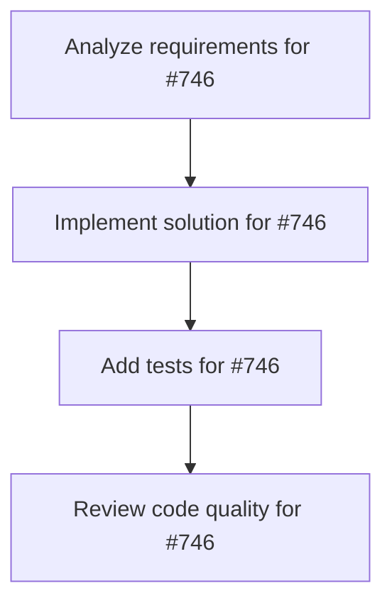

# Plans for Issue #746

**Title**: ops: define policy for auto-generated .ai artifacts

**URL**: https://github.com/customer-cloud/miyabi-private/issues/746

---

## 📋 Summary

- **Total Tasks**: 4
- **Estimated Duration**: 60 minutes
- **Execution Levels**: 4
- **Has Cycles**: ✅ No

## 📝 Task Breakdown

### 1. Analyze requirements for #746

- **ID**: `task-746-analysis`
- **Type**: Docs
- **Assigned Agent**: IssueAgent
- **Priority**: 0
- **Estimated Duration**: 5 min

**Description**: Analyze issue requirements and create detailed specification

### 2. Implement solution for #746

- **ID**: `task-746-impl`
- **Type**: Feature
- **Assigned Agent**: CodeGenAgent
- **Priority**: 1
- **Estimated Duration**: 30 min
- **Dependencies**: task-746-analysis

**Description**: ## Summary
- decide how to handle `.ai/metrics`, `.ai/improvements`, and other auto-generated artifacts in git
- clean current branches so reviews are not flooded with generated files
- document the agreed workflow (ignore vs commit vs relocate)

## Acceptance Criteria
- policy for generated artifacts is documented (e.g. README or CONTRIBUTING)
- repository `.gitignore` and CI config updated accordingly
- existing branches cleaned or guidance provided for cleanup

### 3. Add tests for #746

- **ID**: `task-746-test`
- **Type**: Test
- **Assigned Agent**: CodeGenAgent
- **Priority**: 2
- **Estimated Duration**: 15 min
- **Dependencies**: task-746-impl

**Description**: Create comprehensive test coverage

### 4. Review code quality for #746

- **ID**: `task-746-review`
- **Type**: Refactor
- **Assigned Agent**: ReviewAgent
- **Priority**: 3
- **Estimated Duration**: 10 min
- **Dependencies**: task-746-test

**Description**: Run quality checks and code review

## 🔄 Execution Plan (DAG Levels)

Tasks can be executed in parallel within each level:

### Level 0 (Parallel Execution)

- `task-746-analysis` - Analyze requirements for #746

### Level 1 (Parallel Execution)

- `task-746-impl` - Implement solution for #746

### Level 2 (Parallel Execution)

- `task-746-test` - Add tests for #746

### Level 3 (Parallel Execution)

- `task-746-review` - Review code quality for #746

## 📊 Dependency Graph

## ⏱️ Timeline Estimation

- **Sequential Execution**: 60 minutes (1.0 hours)
- **Parallel Execution (Critical Path)**: 10 minutes (0.2 hours)
- **Estimated Speedup**: 6.0x

---

*Generated by CoordinatorAgent on 2025-11-04 05:38:42 UTC*
