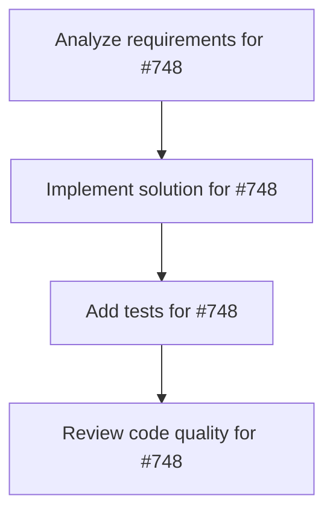

# Plans for Issue #748

**Title**: feat: drive workflow DSL phase 1 to completion

**URL**: https://github.com/customer-cloud/miyabi-private/issues/748

---

## 📋 Summary

- **Total Tasks**: 4
- **Estimated Duration**: 60 minutes
- **Execution Levels**: 4
- **Has Cycles**: ✅ No

## 📝 Task Breakdown

### 1. Analyze requirements for #748

- **ID**: `task-748-analysis`
- **Type**: Docs
- **Assigned Agent**: IssueAgent
- **Priority**: 0
- **Estimated Duration**: 5 min

**Description**: Analyze issue requirements and create detailed specification

### 2. Implement solution for #748

- **ID**: `task-748-impl`
- **Type**: Feature
- **Assigned Agent**: CodeGenAgent
- **Priority**: 1
- **Estimated Duration**: 30 min
- **Dependencies**: task-748-analysis

**Description**: ## Summary
- push Phase 1 of Workflow DSL (#715) forward: finish #716-#719 implementation plan
- ensure `miyabi-workflow` has adequate unit/integration coverage for sequential/parallel/branch use cases
- integrate builder outputs with CoordinatorAgent (`miyabi-agent-coordinator`) and validate end-to-end

## Acceptance Criteria
- backlog for #716-#719 updated with remaining work, estimates, dependencies
- new tests cover builder edge cases plus coordinator integration path
- demo run (manual or automated) showing CoordinatorAgent executing a workflow built via DSL

### 3. Add tests for #748

- **ID**: `task-748-test`
- **Type**: Test
- **Assigned Agent**: CodeGenAgent
- **Priority**: 2
- **Estimated Duration**: 15 min
- **Dependencies**: task-748-impl

**Description**: Create comprehensive test coverage

### 4. Review code quality for #748

- **ID**: `task-748-review`
- **Type**: Refactor
- **Assigned Agent**: ReviewAgent
- **Priority**: 3
- **Estimated Duration**: 10 min
- **Dependencies**: task-748-test

**Description**: Run quality checks and code review

## 🔄 Execution Plan (DAG Levels)

Tasks can be executed in parallel within each level:

### Level 0 (Parallel Execution)

- `task-748-analysis` - Analyze requirements for #748

### Level 1 (Parallel Execution)

- `task-748-impl` - Implement solution for #748

### Level 2 (Parallel Execution)

- `task-748-test` - Add tests for #748

### Level 3 (Parallel Execution)

- `task-748-review` - Review code quality for #748

## 📊 Dependency Graph

## ⏱️ Timeline Estimation

- **Sequential Execution**: 60 minutes (1.0 hours)
- **Parallel Execution (Critical Path)**: 10 minutes (0.2 hours)
- **Estimated Speedup**: 6.0x

---

*Generated by CoordinatorAgent on 2025-11-04 05:49:06 UTC*
