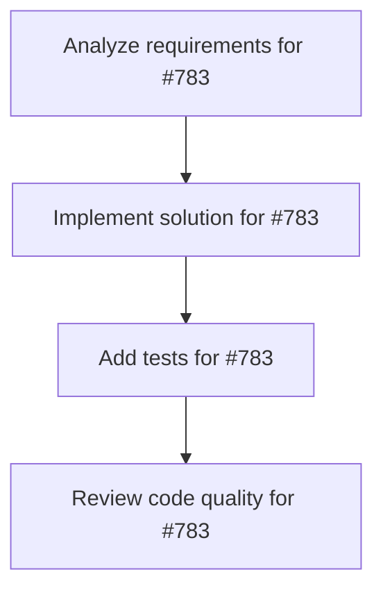

# Plans for Issue #783

**Title**: BytePlusハッカソン: Miyabiマルチエージェント動画制作実証 (賞金500万円)

**URL**: https://github.com/customer-cloud/miyabi-private/issues/783

---

## 📋 Summary

- **Total Tasks**: 4
- **Estimated Duration**: 60 minutes
- **Execution Levels**: 4
- **Has Cycles**: ✅ No

## 📝 Task Breakdown

### 1. Analyze requirements for #783

- **ID**: `task-783-analysis`
- **Type**: Docs
- **Assigned Agent**: IssueAgent
- **Priority**: 0
- **Estimated Duration**: 5 min

**Description**: Analyze issue requirements and create detailed specification

### 2. Implement solution for #783

- **ID**: `task-783-impl`
- **Type**: Feature
- **Assigned Agent**: CodeGenAgent
- **Priority**: 1
- **Estimated Duration**: 30 min
- **Dependencies**: task-783-analysis

**Description**: # BytePlusハッカソン: Miyabiマルチエージェント動画制作実証

## 🎯 目的

Miyabiのマルチエージェントオーケストレーション能力を実証し、Global Video Hackathon 2025（賞金500万円）に参加する。

## 📋 要件

### ✅ 動画制作要件
- [ ] Seedance API統合実装 
- [ ] image-to-video パイプライン構築
- [ ] 動画生成タスク管理システム
- [ ] 動画品質確認・検証機能

### ✅ Miyabiオーケストレーション実証
- [ ] tmuxマルチエージェント環境構築
- [ ] オーケストレーター/コーディネーター協調動作
- [ ] エージェント間通信プロトコル実装
- [ ] タスクキュー管理システム

### ✅ プロセス記録 (評価対象)
- [ ] 全エージェント動作ログ記録
- [ ] 意思決定プロセス可視化
- [ ] パフォーマンスメトリクス収集
- [ ] 動画制作フロー図生成

### ✅ 提出物準備
- [ ] 最終動画ファイル生成
- [ ] プロセスドキュメント作成
- [ ] アプリケーションパッケージ準備
- [ ] コンテスト応募フォーム提出

## 🛠️ 技術スタック

- **AI Video API**: Seedance (BytePlus)
- **オーケストレーション**: Miyabi マルチエージェントシステム
- **並列実行基盤**: tmux
- **コラボレーション**: Lark

## 📊 コンテスト詳細

- **イベント名**: Global Video Hackathon 2025
- **主催**: BytePlus + Way to AGI
- **賞金総額**: 約500万円
  - 🥇 1位: 150万円相当クレジット
  - 🥈 2位: 100万円相当
  - 🥉 3位: 50万円相当
  - ⭐ 審査員特別賞: 150万円相当
- **URL**: https://www.customercloud.co/global-video-hackathon-2025-top

## 🔌 Seedance API仕様

```bash
# 1. 動画生成タスク作成
curl -X POST https://ark.ap-southeast.bytepluses.com/api/v3/contents/generations/tasks \
  -H "Content-Type: application/json" \
  -H "Authorization: Bearer $ARK_API_KEY" \
  -d '{
    "model": "seedance-1-0-pro-250528",
    "content": [
        {
            "type": "text",
            "text": "動画の説明 --resolution 1080p --duration 5 --camerafixed false"
        },
        {
            "type": "image_url",
            "image_url": {"url": "画像URL"}
        }
    ]
}'

# 2. タスク結果取得
curl -X GET https://ark.ap-southeast.bytepluses.com/api/v3/contents/generations/tasks/{id} \
  -H "Authorization: Bearer $ARK_API_KEY"
```

## ⚠️ 制約事項

- Seedance API使用必須
- コンテスト締切厳守
- プロセス透明性確保（評価対象）
- BytePlus + Lark アカウント必須

## 📈 成功条件

- [ ] 動画生成成功
- [ ] マルチエージェント協調動作実証
- [ ] プロセス記録完全性
- [ ] コンテスト応募完了
- [ ] 受賞可能性のある品質達成

## 🤖 Agent実行設定

- **自動実行**: 有効
- **優先度**: High
- **期待実行時間**: 60-120分

---

🤖 Generated with [Claude Code](https://claude.com/claude-code)


### 3. Add tests for #783

- **ID**: `task-783-test`
- **Type**: Test
- **Assigned Agent**: CodeGenAgent
- **Priority**: 2
- **Estimated Duration**: 15 min
- **Dependencies**: task-783-impl

**Description**: Create comprehensive test coverage

### 4. Review code quality for #783

- **ID**: `task-783-review`
- **Type**: Refactor
- **Assigned Agent**: ReviewAgent
- **Priority**: 3
- **Estimated Duration**: 10 min
- **Dependencies**: task-783-test

**Description**: Run quality checks and code review

## 🔄 Execution Plan (DAG Levels)

Tasks can be executed in parallel within each level:

### Level 0 (Parallel Execution)

- `task-783-analysis` - Analyze requirements for #783

### Level 1 (Parallel Execution)

- `task-783-impl` - Implement solution for #783

### Level 2 (Parallel Execution)

- `task-783-test` - Add tests for #783

### Level 3 (Parallel Execution)

- `task-783-review` - Review code quality for #783

## 📊 Dependency Graph



## ⏱️ Timeline Estimation

- **Sequential Execution**: 60 minutes (1.0 hours)
- **Parallel Execution (Critical Path)**: 10 minutes (0.2 hours)
- **Estimated Speedup**: 6.0x

---

*Generated by CoordinatorAgent on 2025-11-08 06:53:31 UTC*
