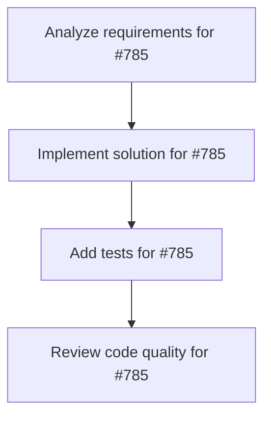

# Plans for Issue #785

**Title**: [Phase 1-B] tmuxオーケストレーション環境セットアップ

**URL**: https://github.com/customer-cloud/miyabi-private/issues/785

---

## 📋 Summary

- **Total Tasks**: 4
- **Estimated Duration**: 60 minutes
- **Execution Levels**: 4
- **Has Cycles**: ✅ No

## 📝 Task Breakdown

### 1. Analyze requirements for #785

- **ID**: `task-785-analysis`
- **Type**: Docs
- **Assigned Agent**: IssueAgent
- **Priority**: 0
- **Estimated Duration**: 5 min

**Description**: Analyze issue requirements and create detailed specification

### 2. Implement solution for #785

- **ID**: `task-785-impl`
- **Type**: Feature
- **Assigned Agent**: CodeGenAgent
- **Priority**: 1
- **Estimated Duration**: 30 min
- **Dependencies**: task-785-analysis

**Description**: # tmuxオーケストレーション環境セットアップ

**親Issue:** #783
**Phase:** 1 (基盤構築)
**依存:** なし

## 📋 タスク

- [ ] miyabi-orchestra セッション構成設計
- [ ] オーケストレーターペイン設定
- [ ] ワーカーペイン自動生成機能
- [ ] WaterSpider監視ペイン設定
- [ ] ペインタイトル・UI/UX設定
- [ ] セッション管理スクリプト作成

## 🎨 構成

```
Window 1: Dashboard
└── Orchestrator (指揮)
└── WaterSpider (監視)

Window 2: Workers
├── Worker-1 (CodeGen)
├── Worker-2 (Review)
├── Worker-3 (Deploy)
└── Worker-N (動的拡張)
```

## 📈 成功条件

- [ ] セッション自動起動
- [ ] 全ペイン正常配置
- [ ] タイトル視認性確保
- [ ] 動的スケール対応

🤖 Generated with [Claude Code](https://claude.com/claude-code)


### 3. Add tests for #785

- **ID**: `task-785-test`
- **Type**: Test
- **Assigned Agent**: CodeGenAgent
- **Priority**: 2
- **Estimated Duration**: 15 min
- **Dependencies**: task-785-impl

**Description**: Create comprehensive test coverage

### 4. Review code quality for #785

- **ID**: `task-785-review`
- **Type**: Refactor
- **Assigned Agent**: ReviewAgent
- **Priority**: 3
- **Estimated Duration**: 10 min
- **Dependencies**: task-785-test

**Description**: Run quality checks and code review

## 🔄 Execution Plan (DAG Levels)

Tasks can be executed in parallel within each level:

### Level 0 (Parallel Execution)

- `task-785-analysis` - Analyze requirements for #785

### Level 1 (Parallel Execution)

- `task-785-impl` - Implement solution for #785

### Level 2 (Parallel Execution)

- `task-785-test` - Add tests for #785

### Level 3 (Parallel Execution)

- `task-785-review` - Review code quality for #785

## 📊 Dependency Graph



## ⏱️ Timeline Estimation

- **Sequential Execution**: 60 minutes (1.0 hours)
- **Parallel Execution (Critical Path)**: 10 minutes (0.2 hours)
- **Estimated Speedup**: 6.0x

---

*Generated by CoordinatorAgent on 2025-11-08 07:02:41 UTC*
