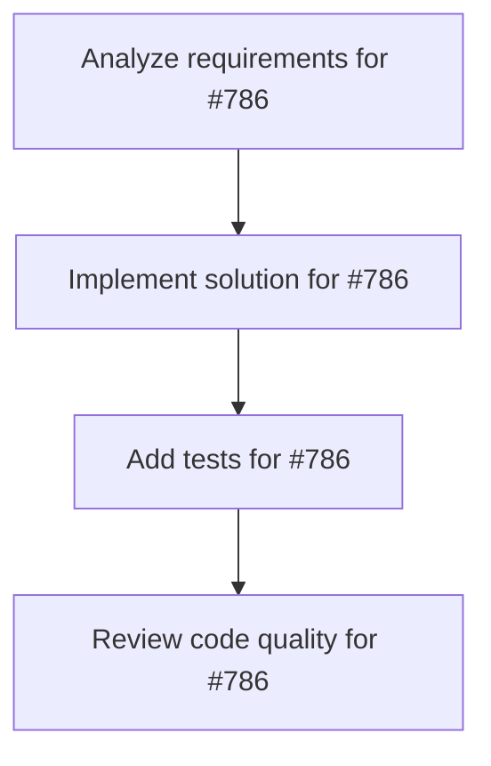

# Plans for Issue #786

**Title**: [Phase 1-C] ログ記録・監視システム実装

**URL**: https://github.com/customer-cloud/miyabi-private/issues/786

---

## 📋 Summary

- **Total Tasks**: 4
- **Estimated Duration**: 60 minutes
- **Execution Levels**: 4
- **Has Cycles**: ✅ No

## 📝 Task Breakdown

### 1. Analyze requirements for #786

- **ID**: `task-786-analysis`
- **Type**: Docs
- **Assigned Agent**: IssueAgent
- **Priority**: 0
- **Estimated Duration**: 5 min

**Description**: Analyze issue requirements and create detailed specification

### 2. Implement solution for #786

- **ID**: `task-786-impl`
- **Type**: Feature
- **Assigned Agent**: CodeGenAgent
- **Priority**: 1
- **Estimated Duration**: 30 min
- **Dependencies**: task-786-analysis

**Description**: # ログ記録・監視システム実装

**親Issue:** #783
**Phase:** 1 (基盤構築)
**依存:** なし

## 📋 タスク

- [ ] 構造化ログシステム実装
- [ ] エージェント動作ログ記録
- [ ] パフォーマンスメトリクス収集
- [ ] リアルタイム監視ダッシュボード
- [ ] SLA異常検知機能
- [ ] ログ可視化ツール

## 📊 記録項目

- エージェント起動/終了時刻
- タスク実行時間
- API呼び出し回数/レスポンス時間
- エージェント間通信ログ
- エラー/警告メッセージ
- リソース使用率

## 📈 成功条件

- [ ] 全イベント記録完全性
- [ ] リアルタイム可視化
- [ ] SLA異常即座検知
- [ ] ログ検索機能

🤖 Generated with [Claude Code](https://claude.com/claude-code)

### 3. Add tests for #786

- **ID**: `task-786-test`
- **Type**: Test
- **Assigned Agent**: CodeGenAgent
- **Priority**: 2
- **Estimated Duration**: 15 min
- **Dependencies**: task-786-impl

**Description**: Create comprehensive test coverage

### 4. Review code quality for #786

- **ID**: `task-786-review`
- **Type**: Refactor
- **Assigned Agent**: ReviewAgent
- **Priority**: 3
- **Estimated Duration**: 10 min
- **Dependencies**: task-786-test

**Description**: Run quality checks and code review

## 🔄 Execution Plan (DAG Levels)

Tasks can be executed in parallel within each level:

### Level 0 (Parallel Execution)

- `task-786-analysis` - Analyze requirements for #786

### Level 1 (Parallel Execution)

- `task-786-impl` - Implement solution for #786

### Level 2 (Parallel Execution)

- `task-786-test` - Add tests for #786

### Level 3 (Parallel Execution)

- `task-786-review` - Review code quality for #786

## 📊 Dependency Graph

## ⏱️ Timeline Estimation

- **Sequential Execution**: 60 minutes (1.0 hours)
- **Parallel Execution (Critical Path)**: 10 minutes (0.2 hours)
- **Estimated Speedup**: 6.0x

---

*Generated by CoordinatorAgent on 2025-11-08 06:55:31 UTC*
