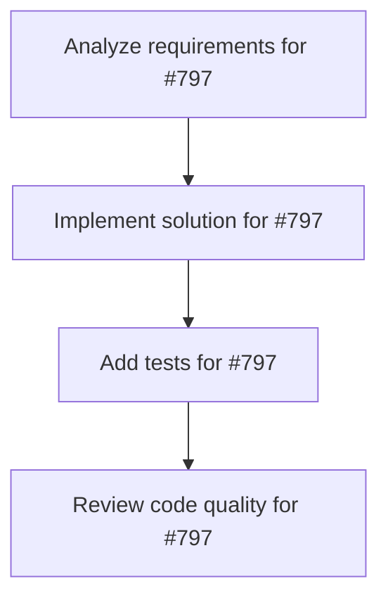

# Plans for Issue #797

**Title**: 【マスターイシュー】Mayu プロジェクト TypeScript Migration 完全管理

**URL**: https://github.com/customer-cloud/miyabi-private/issues/797

---

## 📋 Summary

- **Total Tasks**: 4
- **Estimated Duration**: 60 minutes
- **Execution Levels**: 4
- **Has Cycles**: ✅ No

## 📝 Task Breakdown

### 1. Analyze requirements for #797

- **ID**: `task-797-analysis`
- **Type**: Docs
- **Assigned Agent**: IssueAgent
- **Priority**: 0
- **Estimated Duration**: 5 min

**Description**: Analyze issue requirements and create detailed specification

### 2. Implement solution for #797

- **ID**: `task-797-impl`
- **Type**: Feature
- **Assigned Agent**: CodeGenAgent
- **Priority**: 1
- **Estimated Duration**: 30 min
- **Dependencies**: task-797-analysis

**Description**: # 【マスターイシュー】Mayu プロジェクト - TypeScript Migration 完全管理

**プロジェクト**: Mayu - Marketing Activity Unified Yielder
**リポジトリ**: https://github.com/ShunsukeHayashi/mayu
**ステータス**: 🟡 進行中 (70% 完了)
**優先度**: P0 (Critical)
**期限**: 2025-11-09

---

## 📊 全体進捗

- **進捗率**: 70%
- **TypeScriptエラー削減**: 83% (60+ → 10)
- **残り作業時間**: 約1時間

---

## 📋 サブイシュー

- [ ] Phase 3: ToolResult標準化 (6関数、45分)
- [ ] Phase 4: 型安全性修正 (4箇所、15分)  
- [ ] Phase 5: ビルド検証 (15分)
- [ ] Phase 6: PR & マージ (10分)

---

## 🔗 リンク

- Mayu Issue: https://github.com/ShunsukeHayashi/mayu/issues/1
- Branch: feature/genai-migration
- Worktree: .worktrees/phase-2-genai-migration

---

**作成**: 2025-11-08
**期限**: 2025-11-09

### 3. Add tests for #797

- **ID**: `task-797-test`
- **Type**: Test
- **Assigned Agent**: CodeGenAgent
- **Priority**: 2
- **Estimated Duration**: 15 min
- **Dependencies**: task-797-impl

**Description**: Create comprehensive test coverage

### 4. Review code quality for #797

- **ID**: `task-797-review`
- **Type**: Refactor
- **Assigned Agent**: ReviewAgent
- **Priority**: 3
- **Estimated Duration**: 10 min
- **Dependencies**: task-797-test

**Description**: Run quality checks and code review

## 🔄 Execution Plan (DAG Levels)

Tasks can be executed in parallel within each level:

### Level 0 (Parallel Execution)

- `task-797-analysis` - Analyze requirements for #797

### Level 1 (Parallel Execution)

- `task-797-impl` - Implement solution for #797

### Level 2 (Parallel Execution)

- `task-797-test` - Add tests for #797

### Level 3 (Parallel Execution)

- `task-797-review` - Review code quality for #797

## 📊 Dependency Graph

## ⏱️ Timeline Estimation

- **Sequential Execution**: 60 minutes (1.0 hours)
- **Parallel Execution (Critical Path)**: 10 minutes (0.2 hours)
- **Estimated Speedup**: 6.0x

---

*Generated by CoordinatorAgent on 2025-11-08 07:02:43 UTC*
