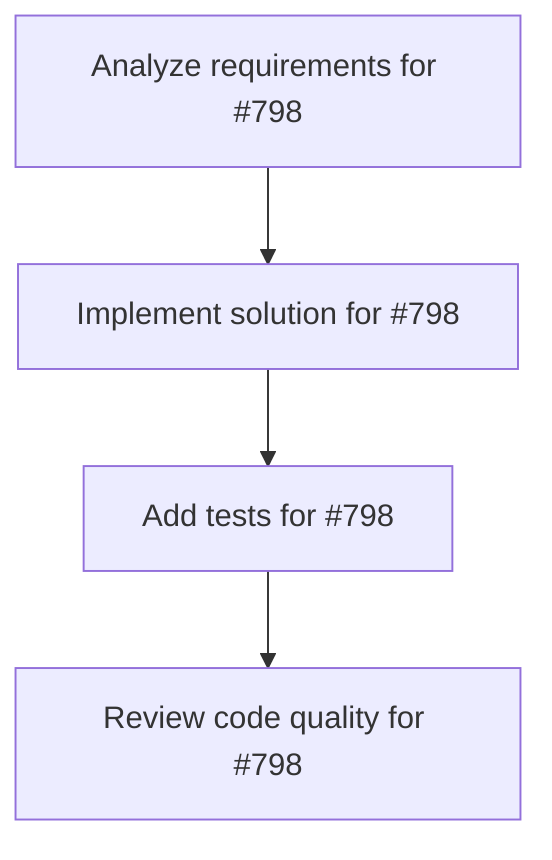

# Plans for Issue #798

**Title**: 【SUB-3】Phase 3: ToolResult標準化 (toolRegistry.ts)

**URL**: https://github.com/customer-cloud/miyabi-private/issues/798

---

## 📋 Summary

- **Total Tasks**: 4
- **Estimated Duration**: 60 minutes
- **Execution Levels**: 4
- **Has Cycles**: ✅ No

## 📝 Task Breakdown

### 1. Analyze requirements for #798

- **ID**: `task-798-analysis`
- **Type**: Docs
- **Assigned Agent**: IssueAgent
- **Priority**: 0
- **Estimated Duration**: 5 min

**Description**: Analyze issue requirements and create detailed specification

### 2. Implement solution for #798

- **ID**: `task-798-impl`
- **Type**: Feature
- **Assigned Agent**: CodeGenAgent
- **Priority**: 1
- **Estimated Duration**: 30 min
- **Dependencies**: task-798-analysis

**Description**: # Phase 3: ToolResult標準化

**親イシュー**: #797
**優先度**: P0
**見積**: 45分
**ステータス**: 🟡 進行中 (0/6)

---

## 🎯 目的

toolRegistry.tsの6関数をToolResult形式に変換し、一貫したエラーハンドリングを実装。

---

## ✅ タスク

- [ ] `generate_persona` (line 89)
- [ ] `generate_customer_journey` (line 133)
- [ ] `generate_email_sequence` (line 183)
- [ ] `analyze_competitors` (line 232)
- [ ] `perform_swot_analysis` (line 269)
- [ ] `generate_funnel_data` (line 316)

---

## 📝 実装パターン

参照: `adCreativeTools.ts`

\`\`\`typescript
execute: async (params): Promise<ToolResult> => {
  try {
    const response = await ai.models.generateContent({
      model: 'gemini-2.0-flash-exp',
      contents: prompt
    });
    
    return {
      success: true,
      data: { /* your data */ }
    };
  } catch (error) {
    return {
      success: false,
      error: error instanceof Error ? error.message : 'Unknown error'
    };
  }
}
\`\`\`

---

**ファイル**: `apps/web/src/services/tools/toolRegistry.ts`
**Worktree**: `.worktrees/phase-2-genai-migration`

### 3. Add tests for #798

- **ID**: `task-798-test`
- **Type**: Test
- **Assigned Agent**: CodeGenAgent
- **Priority**: 2
- **Estimated Duration**: 15 min
- **Dependencies**: task-798-impl

**Description**: Create comprehensive test coverage

### 4. Review code quality for #798

- **ID**: `task-798-review`
- **Type**: Refactor
- **Assigned Agent**: ReviewAgent
- **Priority**: 3
- **Estimated Duration**: 10 min
- **Dependencies**: task-798-test

**Description**: Run quality checks and code review

## 🔄 Execution Plan (DAG Levels)

Tasks can be executed in parallel within each level:

### Level 0 (Parallel Execution)

- `task-798-analysis` - Analyze requirements for #798

### Level 1 (Parallel Execution)

- `task-798-impl` - Implement solution for #798

### Level 2 (Parallel Execution)

- `task-798-test` - Add tests for #798

### Level 3 (Parallel Execution)

- `task-798-review` - Review code quality for #798

## 📊 Dependency Graph

## ⏱️ Timeline Estimation

- **Sequential Execution**: 60 minutes (1.0 hours)
- **Parallel Execution (Critical Path)**: 10 minutes (0.2 hours)
- **Estimated Speedup**: 6.0x

---

*Generated by CoordinatorAgent on 2025-11-08 07:02:45 UTC*
