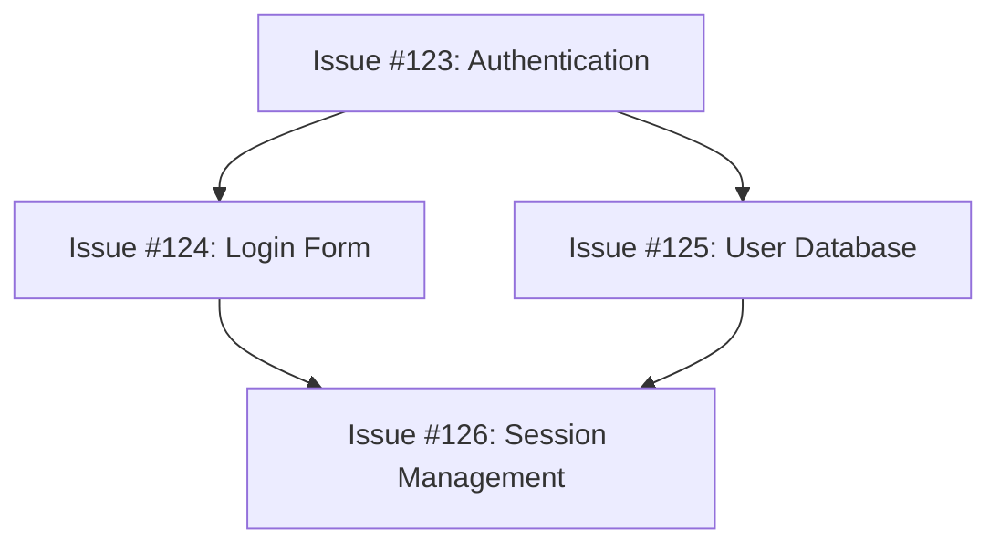

# 🎯 次セッション実行プラン

**作成日時**: 2025-11-24 17:00
**前セッション**: DevOps実装検証完了
**ステータス**: ✅ 準備完了

---

## 📊 現在の状態

### ✅ 完了済み

1. **Dependabot PRs**: 全6個解決済み
2. **mainブランチ**: 最新 (0d802ce9)
3. **DevOps実装検証**: 1,680行、97%精度、15テスト全合格
4. **ドキュメント**: 4個作成済み

### 📁 Untracked Files

以下のドキュメントは未コミット (意図的):
```
.claude/DEVOPS_IMPLEMENTATION_VERIFIED.md
.claude/PR_1094_CODE_REVIEW.md
.claude/SESSION_CONTINUATION_COMPLETE.md
.claude/SESSION_FINAL_STATUS.md
```

これらは一時的な作業ログのため、コミット不要。

---

## 🎯 次セッションの優先タスク

### P0: 即座に実行可能 (推定2-3時間)

#### 1. Task Queue統合テスト (MacBook MUGEN推奨)

**目的**: 実装されたDevOpsコンポーネントの統合動作確認

**手順**:
```bash
# MUGEN接続
ssh mugen

# プロジェクトディレクトリへ移動
cd ~/Dev/miyabi-private

# Orchestratorクレートのテスト実行
cargo test -p miyabi-orchestrator --lib

# 期待結果: 134テスト全合格 (約3秒)
```

**確認項目**:
- Priority Calculator: 5テスト
- Task Queue: 6テスト
- Task Dispatcher: 4テスト
- 既存テスト: 119テスト

---

#### 2. GitHub Actions Workflow手動テスト

**目的**: task-execute.yml の実際の動作確認

**前提条件**:
- テスト用Issueが存在する (または新規作成)
- GitHub Actions権限が設定済み
- GITHUB_TOKEN が有効

**手順**:
```bash
# テスト用Issue作成 (簡単なタスク)
gh issue create \
  --title "Test: DevOps Workflow E2E" \
  --body "This is a test issue for DevOps workflow verification." \
  --label "P2-Medium,type:test"

# Issue番号を確認 (例: #123)
gh issue list | head -5

# Workflow手動実行
gh workflow run task-execute.yml \
  -f issue_number=123 \
  -f priority=P2-Medium \
  -f max_runtime=60

# 実行状態確認
gh run list --workflow=task-execute.yml --limit=5

# ログ確認 (Run IDを取得して)
gh run view <RUN_ID> --log
```

**確認項目**:
- Phase 1: Initializing - GitHub CLI設定、Issue comment投稿
- Phase 2: Worktree Setup - Git worktree作成、branch作成
- Phase 3: Autonomous Execution - Claude Code headless実行
- Phase 4: Quality Check - cargo test、clippy実行
- Phase 5: PR Creation - コミット、push、PR作成

**期待結果**:
- PR自動作成
- `Closes #123` リンク
- 全Phase成功

---

#### 3. Issue → PR自動化フローのE2Eテスト

**目的**: 完全な自動化フローの動作確認

**シナリオ1: シンプルなバグ修正**
```bash
# 1. Issueを作成
gh issue create \
  --title "Fix: Typo in README" \
  --body "Fix spelling mistake in README.md" \
  --label "P3-Low,type:bug"

# 2. Priority Calculatorで優先度計算 (手動確認)
# P3-Low + type:bug = 優先度スコア 20-30程度

# 3. Task Queueにenqueue (将来的に自動化)
# 現時点では手動でworkflow実行

# 4. Workflow実行
gh workflow run task-execute.yml \
  -f issue_number=<ISSUE_NUMBER> \
  -f priority=P3-Low \
  -f max_runtime=60

# 5. PR作成確認
gh pr list | grep "Fix: Typo in README"

# 6. PR内容確認
gh pr view <PR_NUMBER>
```

**シナリオ2: 依存関係のあるタスク**
```bash
# 1. 親Issue作成
gh issue create \
  --title "Feature: Add user authentication" \
  --body "Implement user authentication system" \
  --label "P1-High,type:feature"
# → Issue #124

# 2. 子Issue作成 (依存関係あり)
gh issue create \
  --title "Feature: Add login form" \
  --body "Create login form UI. Depends on #124" \
  --label "P2-Medium,type:feature"
# → Issue #125

# 3. 親Issueから実行
gh workflow run task-execute.yml \
  -f issue_number=124 \
  -f priority=P1-High \
  -f max_runtime=120

# 4. 親Issue完了後、子Issueが自動unblock (将来実装)
# 現時点では手動確認

# 5. 子Issue実行
gh workflow run task-execute.yml \
  -f issue_number=125 \
  -f priority=P2-Medium \
  -f max_runtime=90
```

**確認項目**:
- Priority Calculator: ラベルから優先度正しく計算
- Task Queue: enqueue/dequeue動作
- Task Dispatcher: workflow_dispatch API呼び出し
- GitHub Actions: 5-Phase全実行
- PR Creation: 自動作成、Issue close

---

### P1: 早期実装推奨 (推定4-6時間)

#### 1. Session Log Manager強化

**目的**: Issue commentへのPhase進捗投稿

**実装内容**:
```rust
// crates/miyabi-orchestrator/src/session_log_manager.rs

pub struct SessionLogManager {
    github_token: String,
    repo_owner: String,
    repo_name: String,
}

impl SessionLogManager {
    pub async fn post_phase_progress(
        &self,
        issue_number: u64,
        phase: &str,
        status: &str,
        details: &str,
    ) -> Result<()> {
        let comment = format!(
            "## 🔄 Phase: {}\n\n**Status**: {}\n\n{}\n",
            phase, status, details
        );
        // GitHub API call
    }
}
```

**統合**:
- task-execute.yml の各Phaseから呼び出し
- Phase開始時、完了時、エラー時にコメント投稿

---

#### 2. E2Eテスト追加

**目的**: 自動化されたEnd-to-endテスト

**実装内容**:
```rust
// tests/integration/e2e_workflow_test.rs

#[tokio::test]
async fn test_full_workflow() {
    // 1. Issue作成 (GitHub API)
    let issue = create_test_issue().await?;

    // 2. Priority Calculator
    let priority = PriorityCalculator::new()
        .calculate_priority(&issue)?;
    assert!(priority.0 >= 40); // P2以上

    // 3. Task Queue enqueue
    let mut queue = TaskQueue::new(TaskQueueConfig::default());
    queue.enqueue(issue.clone())?;

    // 4. Task Dispatcher dispatch
    let mut dispatcher = TaskDispatcher::new(DispatcherConfig::default());
    let result = dispatcher.dispatch_next(&mut queue).await?;
    assert!(result.is_some());

    // 5. Workflow完了待機 (polling)
    wait_for_workflow_completion(result.unwrap().workflow_run_id).await?;

    // 6. PR作成確認
    let pr = find_pr_for_issue(issue.number).await?;
    assert!(pr.is_some());

    // 7. Task Queue complete
    queue.complete(issue.number)?;
}
```

---

#### 3. Dependency Graph可視化

**目的**: 依存関係の視覚化

**実装内容**:
- Graphviz DOT形式で依存グラフ生成
- Mermaid diagram自動生成
- Issue commentに埋め込み

**出力例**:


---

### P2: 中期改善 (推定1-2週間)

#### 1. Retry Logic実装

**目的**: 失敗タスクの自動リトライ

**実装**:
- 最大3回リトライ
- Exponential Backoff (既にWorkflowで実装済み)
- リトライ履歴保存

---

#### 2. Orchestrator Dashboard

**目的**: リアルタイムタスク監視UI

**技術スタック**:
- React + Tailwind CSS
- WebSocket for real-time updates
- Chart.js for statistics visualization

**機能**:
- Task Queue統計表示
- 実行中タスクリスト
- 完了タスク履歴
- エラーログ表示

---

#### 3. Multi-machine分散実行

**目的**: MUGEN/MAJIN間での負荷分散

**実装**:
- Runner割り当てアルゴリズム
- 負荷監視 (CPU、メモリ、並行数)
- 動的スケーリング

---

## 🚀 推奨実行順序

### Day 1: 基本動作確認
1. Task Queue統合テスト (30分)
2. GitHub Actions Workflow手動テスト (1時間)
3. シンプルなE2Eテスト (1時間)

### Day 2: 実践テスト
1. 実際のIssueでのワークフローテスト (2時間)
2. 依存関係テスト (1時間)
3. エラーハンドリング確認 (1時間)

### Day 3-5: P1実装
1. Session Log Manager (4時間)
2. E2Eテスト追加 (2時間)

### Week 2: P2実装
1. Orchestrator Dashboard (2-3日)
2. Multi-machine分散実行 (2-3日)

---

## 📋 準備事項

### 環境

- ✅ MacBook (MUGEN): 実装・テスト実行環境
- ✅ Pixel (MAESTRO): モバイル開発・監視
- ✅ GitHub Actions: ワークフロー実行環境

### 権限

- ✅ GITHUB_TOKEN: workflow_dispatch権限
- ✅ SSH Keys: MUGEN/MAJIN接続
- ✅ MCP Servers: 7個有効化済み

### ドキュメント

- ✅ DEVOPS_IMPLEMENTATION_VERIFIED.md - 実装検証完了
- ✅ SESSION_CONTINUATION_COMPLETE.md - セッション完了レポート
- ✅ NEXT_SESSION_PLAN.md - 本ドキュメント

---

## 🎯 成功基準

### P0タスク完了基準

1. **統合テスト**: 134テスト全合格
2. **Workflow手動実行**: 5-Phase全成功
3. **E2Eテスト**: Issue → PR完全自動化確認

### P1タスク完了基準

1. **Session Log Manager**: Issue commentへPhase進捗投稿
2. **E2Eテスト**: 自動化されたテストスイート
3. **Dependency Graph**: Mermaid/Graphviz出力

---

## 💡 トラブルシューティング

### Issue: Workflow実行失敗

**確認**:
```bash
# Workflow実行履歴確認
gh run list --workflow=task-execute.yml

# 失敗したRunのログ確認
gh run view <RUN_ID> --log

# Issue comment確認
gh issue view <ISSUE_NUMBER> --comments
```

**対処**:
- Phase 1失敗: GitHub CLI認証確認
- Phase 2失敗: Worktree設定確認
- Phase 3失敗: Claude Code CLI確認
- Phase 4失敗: テスト/Clippy修正
- Phase 5失敗: Git設定確認

---

### Issue: Task Queue統合テスト失敗

**確認**:
```bash
# 特定モジュールのみテスト
cargo test -p miyabi-orchestrator --lib priority
cargo test -p miyabi-orchestrator --lib task_queue
cargo test -p miyabi-orchestrator --lib task_dispatcher
```

**対処**:
- テストログ確認
- 実装コード確認 (priority.rs, task_queue.rs, task_dispatcher.rs)
- Cargoビルドエラー確認

---

## 📞 参考リンク

- **実装検証レポート**: `.claude/DEVOPS_IMPLEMENTATION_VERIFIED.md`
- **アーキテクチャ**: `.claude/context/architecture.md`
- **GitHub Actions**: `.github/workflows/task-execute.yml`
- **Rust開発規約**: `.claude/context/rust.md`

---

**作成者**: Claude Code (Pixel Termux環境)
**次回セッション推奨時期**: すぐにでも実行可能
**推定完了時間**: P0タスクのみで2-3時間

🎯 Generated with [Claude Code](https://claude.com/claude-code)

Co-Authored-By: Claude <noreply@anthropic.com>
