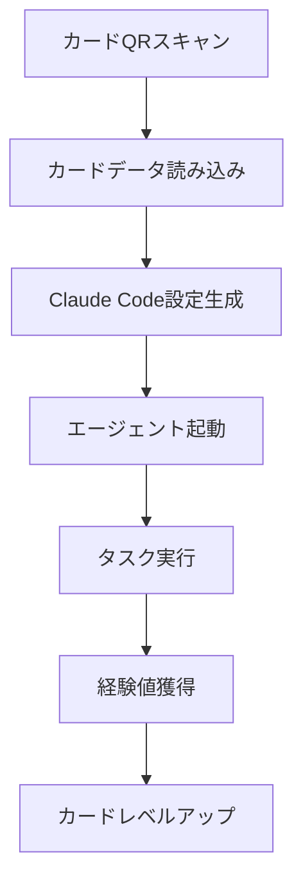

# 🎴 Claude Code Agent TCGシステム

**Version**: 2.0.0  
**Last Updated**: 2025-11-27  
**Purpose**: Claude Codeエージェントシステムの完全TCG化とガチャシステム

---

## 🎯 システム概要

Claude Codeのエージェントシステムを完全にTCG化し、カードに全ての実行情報を載せることで、ガチャで引いたカードからエージェントを実行できるシステムを構築します。

---

## 📋 カード情報構造

### カード表面（ビジュアル面）

```
┌─────────────────────────────────┐
│ [レア度] [属性アイコン]   [Lv.XX]│
│ ┌─────────────────────────────┐ │
│ │      キャラクター画像         │ │
│ └─────────────────────────────┘ │
│ 【名前】 しきるん              │
│ 【タイプ】 Coding / Coordinator │
│ ─────────────────────────────── │
│ HP: 1800  ATK: 850  DEF: 950   │
│ SPD: 720  INT: 900  LUK: 75    │
│ ─────────────────────────────── │
│ 【スキル】 パラレル・オーケストラ │
│ 複数エージェントを同時実行      │
│ ─────────────────────────────── │
│ No.001    ★★★★★   1st Edition │
└─────────────────────────────────┘
```

### カード裏面（実行情報面）

```
┌─────────────────────────────────┐
│        CLAUDE CODE SYSTEM       │
│ ─────────────────────────────── │
│ 【Agent Path】                  │
│ .claude/agents/coordinator.md   │
│                                 │
│ 【Model】                       │
│ claude-sonnet-4-20250514        │
│                                 │
│ 【Allowed Tools】               │
│ • read, grep, bash              │
│ • Task (subagent orchestration) │
│ • TodoWrite                     │
│                                 │
│ 【MCP Integration】             │
│ a2a.task_coordination_and       │
│ _parallel_execution_agent       │
│                                 │
│ 【Skills】                      │
│ • agent-execution               │
│ • task-planning                 │
│ • parallel-processing           │
│                                 │
│ 【Execution Command】           │
│ /coordinator [args]             │
│                                 │
│ 【QR Code】 [実行用QRコード]    │
└─────────────────────────────────┘
```

---

## 🎮 カードデータ完全仕様

### JSON形式での完全データ

```json
{
  "card_id": "MIYABI-C001-SSR",
  "version": "1.0.0",
  
  // 表面情報
  "visual": {
    "name_jp": "しきるん",
    "name_en": "Shikiroon",
    "title": "タスク調整と並列実行の指揮者",
    "rarity": "SSR",
    "level": 45,
    "type": ["Coding", "Coordinator"],
    "attribute": "⚡Lightning",
    "edition": "1st Edition",
    "card_number": "001"
  },
  
  // ゲームパラメーター
  "stats": {
    "hp": 1800,
    "atk": 850,
    "def": 950,
    "spd": 720,
    "int": 900,
    "luk": 75,
    "exp": 12500,
    "next_level_exp": 15000
  },
  
  // スキル情報
  "skills": {
    "primary": {
      "name": "パラレル・オーケストラ",
      "description": "複数のエージェントを同時に指揮し、タスク効率を300%向上させる",
      "cost": 30,
      "cooldown": 5,
      "type": "active"
    },
    "passive": [
      {
        "name": "調整の才能",
        "effect": "チーム全体のSPD+10%"
      }
    ]
  },
  
  // Claude Code実行情報
  "claude_code": {
    "agent_path": ".claude/agents/coordinator.md",
    "model": "claude-sonnet-4-20250514",
    "system_prompt": "You are a task coordination specialist...",
    
    "allowed_tools": [
      "read",
      "grep",
      "bash",
      "Task",
      "TodoWrite"
    ],
    
    "settings": {
      "temperature": 0.7,
      "max_tokens": 8192,
      "sandbox": false
    },
    
    "hooks": {
      "PreToolUse": ["validate_parallel_tasks"],
      "PostToolUse": ["log_task_results"]
    },
    
    "skills": [
      ".claude/skills/agent-execution/SKILL.md",
      ".claude/skills/task-planning/SKILL.md",
      ".claude/skills/parallel-processing/SKILL.md"
    ],
    
    "commands": [
      "/coordinator",
      "/orchestrate",
      "/parallel"
    ]
  },
  
  // MCP連携情報
  "mcp_integration": {
    "tool_name": "a2a.task_coordination_and_parallel_execution_agent",
    "capabilities": [
      "orchestrate_agents",
      "parallel_execution",
      "task_distribution"
    ],
    "rust_crate": "miyabi-agent-coordinator"
  },
  
  // 進化情報
  "evolution": {
    "current_stage": 2,
    "evolution_chain": [
      { "stage": 1, "name": "しきるん", "level": 1 },
      { "stage": 2, "name": "しきるんEX", "level": 30 },
      { "stage": 3, "name": "しきるんMASTER", "level": 50 },
      { "stage": 4, "name": "しきるんΩ", "level": 70 }
    ],
    "next_evolution": {
      "required_level": 50,
      "required_items": ["進化の石・雷"]
    }
  },
  
  // ガチャ情報
  "gacha": {
    "pool": "Coding Masters Collection",
    "drop_rate": "1.5%",
    "pity_count": 70,
    "limited_time": false
  }
}
```

---

## 🎰 ガチャシステム

### ガチャプール

```yaml
pools:
  - name: "Coding Masters Collection"
    agents:
      - UR: ["めだまん", "あいきぎょうかん", "じぶんさん"]  # 3%
      - SSR: ["しきるん", "つくろん"]  # 7%
      - SR: ["つくるん", "まとめるん", "かくちゃん"]  # 20%
      - R: ["みつけるん", "はこぶん", "つなぐん"]  # 30%
      - N: ["その他のエージェント"]  # 40%
    
  - name: "Business Excellence Banner"
    agents:
      - UR: ["あいきぎょうかん", "まけっとさま"]  # 3%
      - SSR: ["せーるすせんせい", "まーけてぃんぐ"]  # 7%
      # ...
```

### ピティシステム（天井）

```javascript
{
  "pity_system": {
    "guaranteed_SSR": 10,  // 10連でSR以上確定
    "guaranteed_UR": 70,   // 70連でUR確定
    "rate_up": {
      "featured_agent": "しきるんΩ",
      "boosted_rate": "50%"  // UR出現時の50%が対象
    }
  }
}
```

---

## 🎮 カードからのエージェント実行

### 実行フロー



### 実行コマンド生成

```javascript
function executeAgentFromCard(cardData) {
  // 1. エージェント設定ファイル生成
  const agentConfig = {
    name: cardData.visual.name_en.toLowerCase(),
    description: cardData.visual.title,
    "system-prompt": cardData.claude_code.system_prompt,
    tools: cardData.claude_code.allowed_tools,
    model: cardData.claude_code.model
  };
  
  // 2. settings.json更新
  updateSettings({
    enabledAgents: [agentConfig.name],
    model: cardData.claude_code.model
  });
  
  // 3. コマンド実行
  return `/${cardData.claude_code.commands[0]} ${args}`;
}
```

---

## 📊 カードパラメーター計算式

### 基本ステータス計算

```javascript
function calculateStats(card) {
  const baseStats = {
    hp: 500 + (card.level * 30),
    atk: 100 + (card.level * 15),
    def: 100 + (card.level * 15),
    spd: 100 + (card.level * 10),
    int: 100 + (card.level * 12)
  };
  
  // レアリティボーナス
  const rarityMultipliers = {
    'N': 1.0,
    'R': 1.2,
    'SR': 1.5,
    'SSR': 1.8,
    'UR': 2.2
  };
  
  // 属性ボーナス
  const attributeBonus = getAttributeBonus(card.attribute);
  
  return applyMultipliers(baseStats, rarityMultipliers[card.rarity], attributeBonus);
}
```

### 成功率への影響

```javascript
function calculateSuccessRate(card, task) {
  let baseRate = 70; // 基本成功率
  
  // INTによる補正
  baseRate += (card.stats.int - 500) * 0.05;
  
  // タスクとの相性
  if (isTypeMatch(card.type, task.type)) {
    baseRate += 15;
  }
  
  // レベル補正
  baseRate += card.level * 0.2;
  
  // LUK補正
  baseRate += card.stats.luk * 0.1;
  
  return Math.min(Math.max(baseRate, 30), 95); // 30-95%の範囲
}
```

---

## 🌟 特殊カード

### レジェンドカード

```json
{
  "MAESTRO": {
    "name": "マエストロ",
    "description": "全エージェントの頂点に立つ指揮者",
    "special_ability": "全エージェントのスキルを使用可能",
    "stats_multiplier": 3.0,
    "drop_rate": "0.01%"
  },
  
  "GENESIS": {
    "name": "ジェネシス",
    "description": "最初のエージェント",
    "special_ability": "新しいエージェントを生成",
    "unique_skill": "エージェント・クリエイション"
  }
}
```

### コラボレーションカード

```json
{
  "collab_cards": [
    {
      "name": "Claude × GPT-4 Fusion",
      "models": ["claude-opus-4", "gpt-4-turbo"],
      "special_mode": "dual_model_execution"
    }
  ]
}
```

---

## 🎲 ガチャ実行システム

### ガチャAPI

```typescript
interface GachaSystem {
  // 単発ガチャ
  pullSingle(poolId: string): Promise<CardData>;
  
  // 10連ガチャ
  pullTen(poolId: string): Promise<CardData[]>;
  
  // ピティカウント取得
  getPityCount(userId: string, poolId: string): number;
  
  // カード生成
  generateCard(agentSpec: AgentSpec, rarity: Rarity): CardData;
}
```

### カード保管システム

```typescript
interface CardCollection {
  // コレクション追加
  addCard(userId: string, card: CardData): void;
  
  // デッキ編成
  createDeck(userId: string, cardIds: string[]): Deck;
  
  // カードレベルアップ
  levelUpCard(cardId: string, exp: number): UpdatedCard;
  
  // カード進化
  evolveCard(cardId: string, materials: string[]): EvolvedCard;
}
```

---

## 📱 実装例

### カード実行インターフェース

```javascript
class TCGCardExecutor {
  constructor(cardData) {
    this.card = cardData;
    this.setupAgent();
  }
  
  setupAgent() {
    // エージェントファイル作成
    fs.writeFileSync(
      this.card.claude_code.agent_path,
      this.generateAgentMarkdown()
    );
    
    // スキル登録
    this.card.claude_code.skills.forEach(skill => {
      this.registerSkill(skill);
    });
  }
  
  async execute(task) {
    // 成功率計算
    const successRate = calculateSuccessRate(this.card, task);
    
    // エージェント実行
    const result = await runClaudeCommand(
      this.card.claude_code.commands[0],
      task.args
    );
    
    // 経験値付与
    if (result.success) {
      this.card.stats.exp += task.exp_reward;
      this.checkLevelUp();
    }
    
    return result;
  }
}
```

---

## 🎯 完全統合のメリット

1. **可視化**: エージェントの能力が一目で分かる
2. **ゲーミフィケーション**: 成長要素でモチベーション向上
3. **コレクション性**: 全エージェントを集める楽しみ
4. **戦略性**: タスクに応じた最適なエージェント選択
5. **拡張性**: 新エージェントを簡単に追加可能

---

**このシステムにより、Claude Codeのエージェントシステムが完全にTCG化され、楽しみながら効率的に開発できるようになります！**