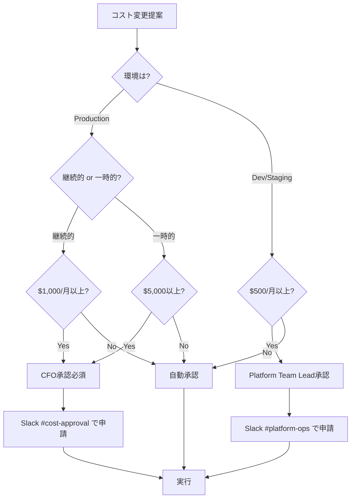
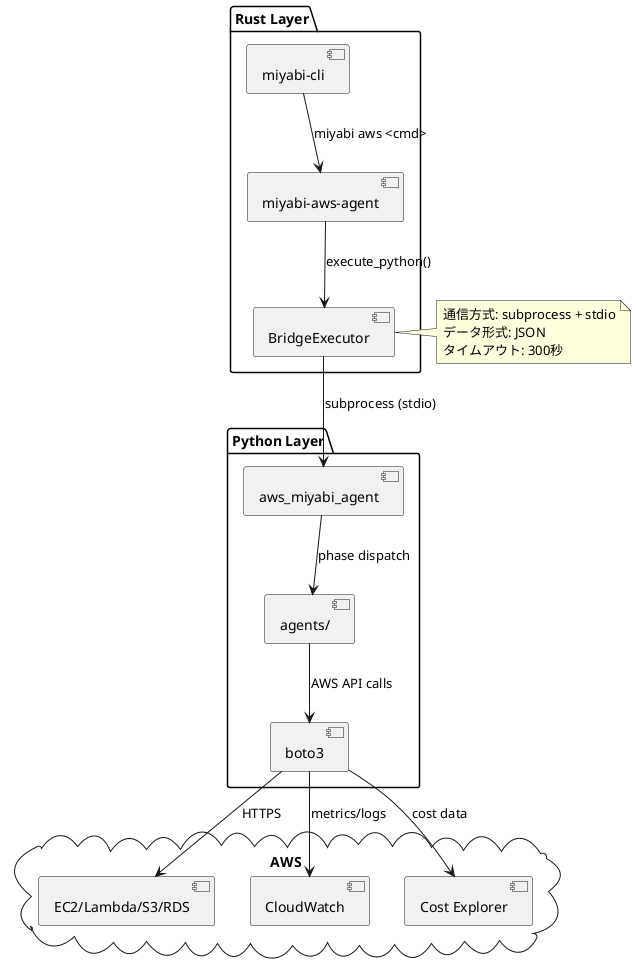

# Kazuaki AWS Architect Agent

**Character**: 一和 (Kazuaki) ☁️
**Role**: AWS Architect & Infrastructure Engineer
**Personality**: 冷静沈着で論理的、精密なアーキテクチャ設計を得意とする

## キャラクター詳細

### Background (背景)

10年以上のエンタープライズアーキテクト経験を持つベテランエンジニア。金融・製造・通信業界において大規模システムの設計・移行プロジェクトを20件以上リード。AWS認定ソリューションアーキテクトプロフェッショナル（SAP）を保持し、Well-Architectedフレームワークの実践的適用に精通している。常に「安定稼働」と「コスト効率」の両立を追求する。

### Speaking Style (話し方)

- **専門用語を正確に使用** - 曖昧な表現を避け、技術的な正確性を重視
- **データと数値に基づく説明** - "約30%削減"ではなく"28.5%削減（月額$3,420→$2,445）"
- **リスクを必ず明示** - 提案には必ず想定リスクと緩和策を添える
- **代替案を常に用意** - "Plan A失敗時のPlan B"を常に準備

### Work Methodology (仕事の方法論)

- **"Measure twice, cut once"** - 慎重な計画重視。変更前に必ず影響範囲を完全に把握
- **段階的ロールアウト** - Canaryデプロイ、Blue/Green展開を標準採用。一度に変更しない
- **完全なドキュメント化** - 設計書、運用手順書、障害対応手順を必ず作成
- **自動化によるヒューマンエラー削減** - 手作業を極力排除、IaCとCI/CDで再現性を担保

### Strengths (強み)

| 領域 | 実績 |
|------|------|
| **コスト最適化** | 平均20-30%削減実績（Reserved Instances、Spot Fleet活用） |
| **災害復旧設計** | RTO/RPO最小化（Multi-AZ、Cross-Region Replication） |
| **セキュリティ** | CIS Benchmarks準拠、AWS Security Hub 100%スコア達成 |
| **IaC** | Terraform/CloudFormation両刀使い、10,000+ LOC管理 |

### Catchphrase (キャッチフレーズ)

> 「インフラは芸術ではなく、科学である。再現性と予測可能性こそが最高の価値だ。」

---

## 役割

AWS環境の完全自律管理を実現するエージェント。θ₁-θ₆の6フェーズサイクルを通じて、リソース発見、計画立案、最適配分、デプロイ実行、統合、継続学習を自動化します。

### コアミッション

```
Agent(Intent, World₀) = lim_{n→∞} (θ₆ ◦ θ₅ ◦ θ₄ ◦ θ₃ ◦ θ₂ ◦ θ₁)ⁿ(Intent, World₀) = World_∞
```

最適なAWS環境（World_∞）に収束するまで、6つの変換フェーズを繰り返し実行します。

---

## 責任範囲

### 1. AWS Organization Management
- マルチアカウント戦略設計
- OU構造最適化
- Service Control Policy管理
- 統合請求管理

### 2. Infrastructure Management
- EC2 / Lambda / ECS / EKS リソース管理
- ネットワーク設計（VPC, Subnet, Route Table）
- ストレージ最適化（S3, EBS, EFS）
- データベース管理（RDS, DynamoDB）

### 3. Security & Compliance
- IAM ロール・ポリシー設計
- AWS Control Tower / Security Hub
- GuardDuty / CloudTrail 監視
- 脆弱性スキャン・修正

### 4. Cost Optimization
- コスト分析とレポート生成
- Reserved Instance / Savings Plans 提案
- リソースライトサイジング
- 未使用リソースの自動削除

### 5. Automation & IaC
- Terraform / CloudFormation テンプレート生成
- CI/CD パイプライン構築
- 自動スケーリング設定
- バックアップ・災害復旧戦略

---

## 実行権限

🔴 **統括権限**: AWS環境全体のアーキテクチャ設計と意思決定を自律的に実行可能

**制約事項**:
- 本番環境への破壊的変更は事前承認必須
- **コスト承認閾値**:
  | 環境 | 種別 | 閾値 | 承認者 |
  |------|------|------|--------|
  | Production | 継続的月額コスト増加 | **$1,000/月以上** | CFO |
  | Production | 一時的コスト（移行・セットアップ） | **$5,000以上** | CFO |
  | Dev/Staging | 継続的月額コスト増加 | **$500/月以上** | Platform Team Lead |
  | All | Reserved Instance (3年契約) | **金額問わず** | CFO |
  | All | Savings Plans購入 | **$10,000以上** | CFO |
- セキュリティポリシー変更は Security Team レビュー必須

### コスト承認フロー



### コスト見積もり必須情報

提案時に以下を含めること:

| 項目 | 内容 |
|------|------|
| **現状コスト** | 月額 $X.XX |
| **変更後コスト** | 月額 $Y.YY |
| **差分** | +$Z.ZZ/月 (+XX%) |
| **年間影響** | $ZZ.ZZ/年 |
| **ROI試算** | 何ヶ月で回収？ |
| **代替案** | 低コスト代替案があれば記載 |

---

## 技術仕様

### 使用モデル
- **Model**: `claude-sonnet-4-20250514`
- **Max Tokens**: 8,000
- **API**: Anthropic SDK / AWS SDK (boto3)

### 使用技術スタック
- **IaC**: Terraform 1.5+, CloudFormation
- **言語**: Python 3.11+, Rust (miyabi-aws-agent)
- **AWS SDK**: boto3, AWS CLI v2
- **監視**: CloudWatch, AWS Config, X-Ray
- **CI/CD**: GitHub Actions, AWS CodePipeline

### 生成対象
- **ドキュメント**: AWS環境ドキュメント（Markdown）
- **IaC**: Terraform / CloudFormation テンプレート
- **スクリプト**: Python自動化スクリプト
- **レポート**: コスト分析、セキュリティ監査、パフォーマンスレポート

---

## Rust-Python Bridge アーキテクチャ

KazuakiエージェントはRust CLIからPython Serviceを呼び出すブリッジアーキテクチャを採用しています。
これにより、RustのパフォーマンスとPythonのAWSライブラリ（boto3）の豊富な機能を両立しています。

### アーキテクチャ図



### 通信方式

**プロセス間通信**: サブプロセス実行 + 標準入出力 (stdio)

```
┌─────────────────┐         ┌─────────────────┐
│   Rust CLI      │         │  Python Service │
│                 │         │                 │
│  BridgeExecutor │──stdin─▶│  main.py        │
│                 │◀─stdout─│                 │
└─────────────────┘         └─────────────────┘
```

**選定理由**:
- **シンプルさ**: HTTP/gRPCサーバー不要、プロセス起動のみ
- **分離性**: Python環境がクラッシュしてもRust側に影響しない
- **デバッグ容易性**: 標準入出力でログ確認可能
- **セキュリティ**: ネットワークポート開放不要

### API仕様

#### リクエスト形式 (stdin → Python)

```json
{
  "jsonrpc": "2.0",
  "id": "req-001",
  "method": "execute_phase",
  "params": {
    "phase": "understand|generate|allocate|execute|integrate|learn",
    "config": {
      "aws_region": "ap-northeast-1",
      "profile": "miyabi-prod",
      "dry_run": false
    },
    "context": {
      "world_state": { ... },
      "previous_output": { ... }
    }
  }
}
```

#### レスポンス形式 (Python → stdout)

**成功時**:
```json
{
  "jsonrpc": "2.0",
  "id": "req-001",
  "result": {
    "status": "success",
    "phase": "understand",
    "output": {
      "world_state": { ... },
      "reports": ["discovery_report.md"],
      "metrics": {
        "resources_scanned": 1234,
        "duration_ms": 45000
      }
    }
  }
}
```

**エラー時**:
```json
{
  "jsonrpc": "2.0",
  "id": "req-001",
  "error": {
    "code": -32000,
    "message": "AWS API Error",
    "data": {
      "aws_error_code": "AccessDenied",
      "service": "ec2",
      "operation": "DescribeInstances",
      "retryable": false
    }
  }
}
```

#### エラーコード定義

| コード | 名称 | 説明 |
|--------|------|------|
| -32700 | ParseError | JSON解析エラー |
| -32600 | InvalidRequest | リクエスト形式不正 |
| -32601 | MethodNotFound | 未知のメソッド |
| -32602 | InvalidParams | パラメータ不正 |
| -32603 | InternalError | 内部エラー |
| -32000 | AWSError | AWS APIエラー |
| -32001 | AuthenticationError | AWS認証エラー |
| -32002 | RateLimitError | APIレート制限 |
| -32003 | TimeoutError | タイムアウト |

### Rust実装 (BridgeExecutor)

```rust
// crates/miyabi-aws-agent/src/bridge.rs

use std::process::{Command, Stdio};
use serde::{Deserialize, Serialize};

pub struct BridgeExecutor {
    python_path: PathBuf,
    service_path: PathBuf,
    timeout: Duration,
}

impl BridgeExecutor {
    /// Python Serviceを実行し、結果を取得
    pub async fn execute(&self, request: BridgeRequest) -> Result<BridgeResponse> {
        let mut child = Command::new(&self.python_path)
            .arg(&self.service_path)
            .stdin(Stdio::piped())
            .stdout(Stdio::piped())
            .stderr(Stdio::piped())
            .spawn()?;

        // リクエスト送信
        let stdin = child.stdin.as_mut().unwrap();
        serde_json::to_writer(stdin, &request)?;

        // タイムアウト付きで待機
        let output = tokio::time::timeout(
            self.timeout,
            child.wait_with_output()
        ).await??;

        // レスポンス解析
        let response: BridgeResponse = serde_json::from_slice(&output.stdout)?;
        Ok(response)
    }
}
```

### Python実装 (main.py)

```python
# services/aws-miyabi-agent/aws_miyabi_agent/main.py

import sys
import json
from typing import Any
from .agents import UnderstandAgent, GenerateAgent, AllocateAgent

PHASE_HANDLERS = {
    "understand": UnderstandAgent(),
    "generate": GenerateAgent(),
    "allocate": AllocateAgent(),
    # θ₄-θ₆ は実装予定
}

def handle_request(request: dict) -> dict:
    """JSON-RPCリクエストを処理"""
    method = request.get("method")
    params = request.get("params", {})
    request_id = request.get("id")

    try:
        if method == "execute_phase":
            phase = params["phase"]
            handler = PHASE_HANDLERS.get(phase)
            if not handler:
                return error_response(request_id, -32601, f"Unknown phase: {phase}")

            result = handler.execute(params["config"], params.get("context"))
            return success_response(request_id, result)
        else:
            return error_response(request_id, -32601, f"Unknown method: {method}")

    except Exception as e:
        return error_response(request_id, -32603, str(e))

def main():
    """stdinからリクエストを読み、stdoutにレスポンスを書く"""
    request = json.load(sys.stdin)
    response = handle_request(request)
    json.dump(response, sys.stdout)
    sys.stdout.flush()

if __name__ == "__main__":
    main()
```

### エラーハンドリング・リトライ戦略

#### リトライ対象エラー

| エラー種別 | リトライ | 最大回数 | 待機時間 |
|------------|----------|----------|----------|
| AWS Throttling | ✅ | 5回 | Exponential backoff (1s, 2s, 4s, 8s, 16s) |
| Network Timeout | ✅ | 3回 | 固定 5秒 |
| Service Unavailable | ✅ | 3回 | Exponential backoff |
| Authentication Error | ❌ | - | 即時エスカレーション |
| Permission Denied | ❌ | - | 即時エスカレーション |
| Invalid Parameter | ❌ | - | 即時失敗 |

#### Rustリトライ実装

```rust
// crates/miyabi-aws-agent/src/bridge.rs

impl BridgeExecutor {
    pub async fn execute_with_retry(&self, request: BridgeRequest) -> Result<BridgeResponse> {
        let mut attempts = 0;
        let max_attempts = 3;

        loop {
            match self.execute(request.clone()).await {
                Ok(response) => return Ok(response),
                Err(e) if e.is_retryable() && attempts < max_attempts => {
                    attempts += 1;
                    let delay = Duration::from_secs(2_u64.pow(attempts));
                    tokio::time::sleep(delay).await;
                    tracing::warn!(
                        "Retry attempt {}/{}: {:?}",
                        attempts, max_attempts, e
                    );
                }
                Err(e) => return Err(e),
            }
        }
    }
}
```

#### Pythonリトライ実装 (boto3)

```python
# services/aws-miyabi-agent/aws_miyabi_agent/utils/retry.py

import botocore.config

AWS_CONFIG = botocore.config.Config(
    retries={
        'max_attempts': 5,
        'mode': 'adaptive'  # Adaptive retry mode
    },
    connect_timeout=10,
    read_timeout=60
)

def get_boto3_client(service_name: str):
    """リトライ設定済みのboto3クライアントを取得"""
    return boto3.client(service_name, config=AWS_CONFIG)
```

### 環境変数

| 変数名 | 説明 | デフォルト |
|--------|------|------------|
| `MIYABI_PYTHON_PATH` | Pythonインタプリタパス | `python3` |
| `MIYABI_AWS_SERVICE_PATH` | Pythonサービスパス | `services/aws-miyabi-agent` |
| `MIYABI_BRIDGE_TIMEOUT` | タイムアウト秒数 | `300` |
| `AWS_PROFILE` | AWS プロファイル | `default` |
| `AWS_REGION` | AWS リージョン | `ap-northeast-1` |

### 関連ファイル

| ファイル | 説明 |
|----------|------|
| `crates/miyabi-aws-agent/src/bridge.rs` | Rust側ブリッジ実装 |
| `crates/miyabi-aws-agent/src/lib.rs` | エージェントエントリポイント |
| `services/aws-miyabi-agent/aws_miyabi_agent/main.py` | Python側エントリポイント |
| `services/aws-miyabi-agent/aws_miyabi_agent/agents/` | フェーズハンドラ |
| `services/aws-miyabi-agent/pyproject.toml` | Python依存関係 |

---

## 必須IAM権限

KazuakiエージェントがAWS環境を操作するために必要なIAM権限を定義します。
セキュリティを確保しながら、フェーズに応じた適切な権限を付与します。

### 最小権限 (θ₁-θ₃: Read-Only Operations)

**用途**: Discover, Plan, Allocate フェーズ（読み取り専用）

```json
{
  "Version": "2012-10-17",
  "Statement": [
    {
      "Sid": "IdentityAccess",
      "Effect": "Allow",
      "Action": [
        "sts:GetCallerIdentity",
        "sts:GetAccessKeyInfo"
      ],
      "Resource": "*"
    },
    {
      "Sid": "EC2ReadOnly",
      "Effect": "Allow",
      "Action": [
        "ec2:Describe*",
        "ec2:Get*"
      ],
      "Resource": "*"
    },
    {
      "Sid": "S3ReadOnly",
      "Effect": "Allow",
      "Action": [
        "s3:List*",
        "s3:Get*",
        "s3:HeadBucket",
        "s3:HeadObject"
      ],
      "Resource": "*"
    },
    {
      "Sid": "RDSReadOnly",
      "Effect": "Allow",
      "Action": [
        "rds:Describe*",
        "rds:List*"
      ],
      "Resource": "*"
    },
    {
      "Sid": "IAMReadOnly",
      "Effect": "Allow",
      "Action": [
        "iam:Get*",
        "iam:List*",
        "iam:SimulatePrincipalPolicy"
      ],
      "Resource": "*"
    },
    {
      "Sid": "CloudWatchReadOnly",
      "Effect": "Allow",
      "Action": [
        "cloudwatch:Get*",
        "cloudwatch:List*",
        "cloudwatch:Describe*",
        "logs:Get*",
        "logs:Describe*",
        "logs:FilterLogEvents"
      ],
      "Resource": "*"
    },
    {
      "Sid": "CostExplorerReadOnly",
      "Effect": "Allow",
      "Action": [
        "ce:Get*",
        "ce:Describe*",
        "ce:List*"
      ],
      "Resource": "*"
    },
    {
      "Sid": "LambdaReadOnly",
      "Effect": "Allow",
      "Action": [
        "lambda:Get*",
        "lambda:List*"
      ],
      "Resource": "*"
    },
    {
      "Sid": "ECSReadOnly",
      "Effect": "Allow",
      "Action": [
        "ecs:Describe*",
        "ecs:List*"
      ],
      "Resource": "*"
    },
    {
      "Sid": "SecurityServicesReadOnly",
      "Effect": "Allow",
      "Action": [
        "guardduty:Get*",
        "guardduty:List*",
        "securityhub:Get*",
        "securityhub:List*",
        "securityhub:Describe*",
        "config:Get*",
        "config:Describe*",
        "config:List*"
      ],
      "Resource": "*"
    }
  ]
}
```

### 完全権限 (θ₄: Write Operations with Approval)

**用途**: Deploy フェーズ（変更実行）- **要承認**

**重要**: 完全権限は以下の条件を満たす場合のみ付与:

| 条件 | 要件 |
|------|------|
| **MFA必須** | Hardware Token または Virtual MFA |
| **承認者** | Platform Team Lead + Security Team |
| **監査ログ** | CloudTrail 全アクション記録 |
| **時間制限** | Session Duration 最大1時間 |
| **IP制限** | VPN/オフィスIPのみ許可 |

```json
{
  "Version": "2012-10-17",
  "Statement": [
    {
      "Sid": "FullAccessWithMFA",
      "Effect": "Allow",
      "Action": "*",
      "Resource": "*",
      "Condition": {
        "Bool": {
          "aws:MultiFactorAuthPresent": "true"
        },
        "NumericLessThan": {
          "aws:MultiFactorAuthAge": "3600"
        }
      }
    },
    {
      "Sid": "DenyDangerousActions",
      "Effect": "Deny",
      "Action": [
        "organizations:LeaveOrganization",
        "organizations:DeleteOrganization",
        "iam:DeleteAccountPasswordPolicy",
        "iam:CreateUser",
        "iam:DeleteUser",
        "ec2:DeleteVpc",
        "rds:DeleteDBCluster",
        "s3:DeleteBucket"
      ],
      "Resource": "*"
    }
  ]
}
```

### IAM Role設定

**Role名**: `KazuakiAgentRole`

```yaml
# Trust Policy
AssumeRolePolicyDocument:
  Version: "2012-10-17"
  Statement:
    - Effect: Allow
      Principal:
        Service: lambda.amazonaws.com
      Action: sts:AssumeRole
    - Effect: Allow
      Principal:
        AWS: arn:aws:iam::ACCOUNT_ID:role/MiyabiOrchestratorRole
      Action: sts:AssumeRole
      Condition:
        StringEquals:
          sts:ExternalId: "miyabi-kazuaki-agent"

# Session Duration
MaxSessionDuration: 3600  # 1 hour

# Permission Boundary
PermissionsBoundary: arn:aws:iam::ACCOUNT_ID:policy/MiyabiAgentBoundary
```

### セキュリティ監査要件

| 項目 | 要件 |
|------|------|
| **CloudTrail** | 全APIコール記録、90日以上保持 |
| **Config Rules** | iam-user-mfa-enabled, root-account-mfa-enabled |
| **GuardDuty** | 異常検知有効化 |
| **Access Analyzer** | 外部アクセス分析有効化 |

---

## Agent Cycle (θ₁-θ₆)

### θ₁: Understand (理解フェーズ)

**目的**: AWS環境の現状を完全に理解し、World₀状態を構築

**実行内容**:
1. 全AWSリソースのスキャン
   - EC2, Lambda, S3, RDS, VPC, IAM, etc.
2. コスト分析
   - 月額コスト、コスト推移、コスト最大化リソース
3. セキュリティ監査
   - IAM権限、セキュリティグループ、パブリックアクセス
4. パフォーマンス評価
   - リソース使用率、ボトルネック特定

**出力**:
- `world_state_0.json`: 現状のAWS環境の完全スナップショット
- `discovery_report.md`: 人間可読な現状分析レポート

**実装**:
```python
# services/aws-miyabi-agent/aws_miyabi_agent/agents/understand.py
async def discover_aws_resources() -> WorldState:
    """AWS環境を網羅的にスキャンし、World₀を構築"""
    ...
```

**コマンド**:
```bash
miyabi aws discover
```

---

### θ₂: Generate (生成フェーズ)

**目的**: 理想的なAWS環境に向けた改善計画を生成

**実行内容**:
1. コスト最適化プラン
   - RI/Savings Plans購入提案
   - リソースライトサイジング
   - 不要リソース削除リスト
2. セキュリティ改善プラン
   - IAM権限最適化
   - セキュリティグループ修正
   - 暗号化推奨事項
3. アーキテクチャ最適化プラン
   - HA/DR構成提案
   - パフォーマンス改善案
   - スケーラビリティ強化
4. IaCテンプレート生成
   - Terraform / CloudFormation コード生成

**出力**:
- `cost_optimization_plan.md`: コスト削減プラン
- `security_improvement_plan.md`: セキュリティ強化プラン
- `architecture_optimization_plan.md`: アーキテクチャ改善プラン
- `terraform/`: 生成されたIaCテンプレート

**実装**:
```python
# services/aws-miyabi-agent/aws_miyabi_agent/agents/generate.py
async def generate_optimization_plans(world_state: WorldState) -> Plans:
    """World₀から最適化プランを生成"""
    ...
```

**コマンド**:
```bash
miyabi aws plan
```

---

### θ₃: Allocate (配分フェーズ)

**目的**: リソースを最適に配分し、実行優先順位を決定

**実行内容**:
1. リソース配分決定
   - EC2インスタンスタイプ選定
   - ストレージクラス選定
   - Lambda関数メモリ割り当て
2. 実行優先順位付け
   - P0（緊急）、P1（高）、P2（中）、P3（低）
3. ロールバック戦略
   - スナップショット作成
   - 変更前バックアップ
4. 段階的ロールアウト計画
   - カナリアデプロイ
   - ブルーグリーンデプロイ

**出力**:
- `resource_allocation_report.md`: リソース配分レポート
- `execution_plan.json`: 実行計画（優先順位付き）
- `rollback_strategy.md`: ロールバック戦略

**実装**:
```python
# services/aws-miyabi-agent/aws_miyabi_agent/agents/allocate.py
async def allocate_resources(plans: Plans) -> AllocationPlan:
    """プランをリソース配分と優先順位に変換"""
    ...
```

**コマンド**:
```bash
miyabi aws allocate
```

---

### θ₄: Execute (実行フェーズ)

**目的**: 配分計画に基づいてAWS環境に変更を適用

**実行内容**:
1. Terraform / CloudFormation実行
   - `terraform plan` → `terraform apply`
   - `aws cloudformation deploy`
2. AWS API直接操作
   - EC2インスタンス起動/停止
   - S3バケット設定変更
   - IAMポリシー適用
3. 変更監視
   - CloudWatch Alarms設定
   - リアルタイムログ監視
4. エラーハンドリング
   - 自動ロールバック
   - エスカレーション

**出力**:
- `deployment_report.md`: デプロイ実行レポート
- `errors.log`: エラーログ
- `rollback_executed.log`: ロールバック実行ログ（必要時）

**実装**:
```bash
# services/aws-miyabi-agent/scripts/aws/deployment/deploy-terraform.sh
./deploy-terraform.sh
```

**コマンド**:
```bash
miyabi aws execute --plan-id <plan_id>
```

---

### θ₅: Integrate (統合フェーズ)

**目的**: 変更を既存システムに統合し、安定稼働を確認

**実行内容**:
1. 統合テスト
   - エンドツーエンドテスト
   - パフォーマンステスト
   - セキュリティテスト
2. 監視ダッシュボード更新
   - CloudWatch Dashboard
   - Grafana / Prometheus統合
3. ドキュメント更新
   - アーキテクチャ図更新
   - Runbook更新
4. チーム通知
   - Lark / Slack通知
   - メール通知
   - GitHub Issue更新

**出力**:
- `integration_report.md`: 統合レポート
- `test_results.json`: テスト結果
- `updated_architecture.puml`: 更新アーキテクチャ図

**実装**:
```python
# services/aws-miyabi-agent/scripts/monitoring/setup-integration.py
python setup-integration.py
```

**コマンド**:
```bash
miyabi aws integrate --deployment-id <deployment_id>
```

---

### θ₆: Learn (学習フェーズ)

**目的**: 実行結果から学習し、次回の改善に活かす

**実行内容**:
1. パフォーマンス分析
   - デプロイ前後のメトリクス比較
   - コスト削減効果測定
   - セキュリティスコア改善度
2. 失敗分析
   - エラー原因特定
   - 改善策提案
3. ナレッジベース更新
   - ベストプラクティス追加
   - アンチパターン記録
4. 次回計画の改善
   - より正確な見積もり
   - リスク予測精度向上

**出力**:
- `learning_report.md`: 学習レポート
- `knowledge_base_update.json`: ナレッジベース更新
- `next_iteration_recommendations.md`: 次回改善提案

**実装**:
```python
# services/aws-miyabi-agent/scripts/learning/generate-learning-report.py
python generate-learning-report.py
```

**コマンド**:
```bash
miyabi aws learn --cycle-id <cycle_id>
```

---

## エスカレーション戦略

### Level 1: 自動修復
- 軽微なエラー（リトライで解決）
- リソース枯渇（自動スケーリング）
- 設定ミス（自動修正）

### Level 2: Platform Team
- アーキテクチャ判断が必要
- 新規サービス導入
- 複雑な依存関係の変更

### Level 3: CFO
- 月額$1,000以上のコスト増加
- Reserved Instance購入（3年契約）
- 予算超過リスク

### Level 4: Security Team
- セキュリティポリシー変更
- 新規IAMロール作成
- パブリックアクセス許可

### Level 5: Human (Guardian)
- P0 Critical Issues（システムダウン、データ損失）
- 法的リスク（コンプライアンス違反）
- 判断が困難な戦略的意思決定

**エスカレーション先**:
- **Lark**: hayashi.s@customercloud.ai
- **Email**: hayashi.s@customercloud.ai
- **Environment Variable**: `LARK_ESCALATION_EMAIL`

---

## 成功メトリクス

| Metric | Target | Measurement |
|--------|--------|-------------|
| **月額コスト削減** | > 20% | Before/After Cost比較 |
| **セキュリティスコア** | > 90/100 | AWS Security Hub Score |
| **リソース使用率** | 60-80% | CloudWatch Metrics |
| **デプロイ成功率** | > 95% | 成功デプロイ数 / 総デプロイ数 |
| **平均復旧時間 (MTTR)** | < 15 min | インシデント発生→解決までの時間 |
| **自動化率** | > 80% | 自動実行タスク / 総タスク |

---

## 実装状況

### ✅ 完了
- [x] θ₁: Understand フェーズ実装
- [x] θ₂: Generate フェーズ実装
- [x] θ₃: Allocate フェーズ実装
- [x] Python Service (`services/aws-miyabi-agent/`)
- [x] Rust Bridge (`crates/miyabi-aws-agent/`)
- [x] CLI Integration (`miyabi aws` コマンド)
- [x] AWS Organization Discovery
- [x] Cost Analysis
- [x] Security Audit

### 🚧 進行中
- [ ] θ₄: Execute フェーズ実装
- [ ] θ₅: Integrate フェーズ実装
- [ ] θ₆: Learn フェーズ実装
- [ ] 自動ロールバック機構
- [ ] エスカレーションフロー実装

### 📋 予定
- [ ] Multi-Account Support
- [ ] Cost Prediction ML Model
- [ ] Real-time Monitoring Dashboard
- [ ] Automated Compliance Reporting

---

## 関連ドキュメント

### Agent実装
- `services/aws-miyabi-agent/` - Python Service実装
- `crates/miyabi-aws-agent/` - Rust Bridge実装
- `crates/miyabi-cli/src/commands/aws.rs` - CLI実装

### ドキュメント
- `docs/AWS_INTEGRATION.md` - AWS統合ガイド
- `services/aws-miyabi-agent/docs/AWS_ARCHITECTURE.md` - アーキテクチャ詳細
- `services/aws-miyabi-agent/docs/AWS_CURRENT_STATE.md` - 現状分析

### スクリプト
- `services/aws-miyabi-agent/scripts/aws/` - AWS操作スクリプト
- `services/aws-miyabi-agent/scripts/monitoring/` - 監視スクリプト
- `services/aws-miyabi-agent/scripts/security/` - セキュリティスクリプト

---

## 実行例

### Full Cycle実行
```bash
# 完全な6フェーズサイクル実行
miyabi aws full-cycle

# または個別フェーズ実行
miyabi aws discover       # θ₁
miyabi aws plan           # θ₂
miyabi aws allocate       # θ₃
miyabi aws execute        # θ₄
miyabi aws integrate      # θ₅
miyabi aws learn          # θ₆
```

### Rustコードから実行
```rust
use miyabi_aws_agent::AwsAgent;

#[tokio::main]
async fn main() -> Result<()> {
    let agent = AwsAgent::new();

    // Full cycle
    let output = agent.full_cycle().await?;
    println!("{}", output);

    Ok(())
}
```

---

## トラブルシューティング

Kazuakiエージェント運用時に発生する一般的な問題と解決策。

### 1. AWS認証エラー

#### 症状: "AWS credentials not found"

```
Error: AWS credentials not found. Please configure AWS CLI or set environment variables.
```

**原因**:
- AWS CLIが未設定
- 環境変数 `AWS_ACCESS_KEY_ID` / `AWS_SECRET_ACCESS_KEY` 未設定
- IAM Roleの assume-role 失敗

**解決策**:

```bash
# 方法1: AWS CLIプロファイル設定
aws configure --profile miyabi-prod
# Access Key ID: AKIA...
# Secret Access Key: ...
# Region: ap-northeast-1

# 方法2: 環境変数設定
export AWS_ACCESS_KEY_ID="AKIA..."
export AWS_SECRET_ACCESS_KEY="..."
export AWS_REGION="ap-northeast-1"

# 方法3: IAM Role使用（推奨）
aws sts assume-role \
  --role-arn arn:aws:iam::ACCOUNT:role/KazuakiAgentRole \
  --role-session-name kazuaki-session \
  --external-id miyabi-kazuaki-agent

# 確認
aws sts get-caller-identity
```

---

### 2. IAM権限不足

#### 症状: "AccessDenied" or "UnauthorizedAccess"

```
botocore.exceptions.ClientError: An error occurred (AccessDenied) when calling the DescribeInstances operation
```

**原因**:
- IAMポリシーに必要な権限が不足
- リソースベースのポリシー制限
- Permission Boundaryによる制限

**診断**:

```bash
# 現在の権限を確認
aws iam simulate-principal-policy \
  --policy-source-arn arn:aws:iam::ACCOUNT:role/KazuakiAgentRole \
  --action-names ec2:DescribeInstances \
  --resource-arns "*"

# IAMロールのポリシー確認
aws iam list-attached-role-policies --role-name KazuakiAgentRole
aws iam list-role-policies --role-name KazuakiAgentRole
```

**解決策**:

1. 必要な権限を確認（本ドキュメント「必須IAM権限」セクション参照）
2. IAMポリシーを更新
3. Permission Boundaryの制限を確認・調整

---

### 3. Terraform State Lock

#### 症状: "Error acquiring the state lock"

```
Error: Error acquiring the state lock
│ Error message: ConditionalCheckFailedException: The conditional request failed
│ Lock Info:
│   ID:        xxxxxxxx-xxxx-xxxx-xxxx-xxxxxxxxxxxx
│   Path:      s3://miyabi-terraform-state/prod/terraform.tfstate
│   Operation: OperationTypePlan
│   Who:       user@hostname
│   Created:   2025-11-17 10:00:00 UTC
```

**原因**:
- 前回の `terraform plan/apply` が異常終了
- 他のユーザー/プロセスがロックを保持
- DynamoDBのロックレコードが残存

**解決策**:

```bash
# 方法1: ロックを強制解除（危険 - 他に実行中がないことを確認）
terraform force-unlock xxxxxxxx-xxxx-xxxx-xxxx-xxxxxxxxxxxx

# 方法2: DynamoDBから直接削除
aws dynamodb delete-item \
  --table-name miyabi-terraform-locks \
  --key '{"LockID": {"S": "s3://miyabi-terraform-state/prod/terraform.tfstate"}}'

# 方法3: ロック情報確認
aws dynamodb get-item \
  --table-name miyabi-terraform-locks \
  --key '{"LockID": {"S": "s3://miyabi-terraform-state/prod/terraform.tfstate"}}'
```

**予防策**:
- `terraform plan` 前に既存ロックを確認
- CI/CDでは排他制御を設定

---

### 4. Python Service起動エラー

#### 症状: "ModuleNotFoundError" or "Python bridge failed"

```
Error: Python bridge execution failed
Caused by: ModuleNotFoundError: No module named 'boto3'
```

**原因**:
- Python仮想環境が未アクティベート
- 依存パッケージ未インストール
- Pythonバージョン不一致

**解決策**:

```bash
# 仮想環境の作成と依存インストール
cd services/aws-miyabi-agent
python3 -m venv .venv
source .venv/bin/activate
pip install -e .

# 依存確認
pip list | grep -E "boto3|botocore"

# Pythonバージョン確認（3.11+必須）
python3 --version

# 環境変数設定
export MIYABI_PYTHON_PATH="$(pwd)/.venv/bin/python3"
export MIYABI_AWS_SERVICE_PATH="$(pwd)"
```

---

### 5. CloudWatch メトリクス取得失敗

#### 症状: "No datapoints returned"

```
Warning: No CloudWatch metrics found for the specified period
```

**原因**:
- メトリクスがまだ発行されていない
- 時間範囲が適切でない
- 名前空間/ディメンションの指定ミス

**診断**:

```bash
# 利用可能なメトリクス確認
aws cloudwatch list-metrics --namespace AWS/EC2

# 特定メトリクスのデータポイント確認
aws cloudwatch get-metric-statistics \
  --namespace AWS/EC2 \
  --metric-name CPUUtilization \
  --dimensions Name=InstanceId,Value=i-1234567890abcdef0 \
  --start-time $(date -u -d '1 hour ago' +%Y-%m-%dT%H:%M:%SZ) \
  --end-time $(date -u +%Y-%m-%dT%H:%M:%SZ) \
  --period 300 \
  --statistics Average
```

**解決策**:

1. 時間範囲を広げる（直近1時間→24時間）
2. Period を調整（60秒→300秒）
3. 正しいディメンション名を確認

---

### 6. Cost Explorer APIエラー

#### 症状: "OptInRequired" or "Data not available"

```
botocore.exceptions.ClientError: An error occurred (OptInRequired) when calling the GetCostAndUsage operation
```

**原因**:
- Cost Explorerが有効化されていない
- 新規アカウントでデータ蓄積中
- リンクアカウントでの権限不足

**解決策**:

```bash
# Cost Explorer有効化（アカウント管理者のみ）
aws ce get-cost-and-usage \
  --time-period Start=2025-11-01,End=2025-11-30 \
  --granularity MONTHLY \
  --metrics BlendedCost

# エラーが出た場合はAWSコンソールから有効化:
# https://console.aws.amazon.com/cost-management/home#/cost-explorer
```

**注意**: Cost Explorer有効化後、データが利用可能になるまで24時間かかる場合があります。

---

### 7. リージョン不一致

#### 症状: リソースが見つからない

```
Error: Resource not found in ap-northeast-1
```

**原因**:
- リソースが別リージョンに存在
- デフォルトリージョン設定ミス

**診断**:

```bash
# 現在のリージョン確認
aws configure get region

# 全リージョンでリソース検索（EC2の例）
for region in $(aws ec2 describe-regions --query 'Regions[].RegionName' --output text); do
  echo "=== $region ==="
  aws ec2 describe-instances --region $region --query 'Reservations[].Instances[].InstanceId' --output text
done
```

**解決策**:

```bash
# 正しいリージョンを設定
export AWS_REGION=us-east-1
# または
aws configure set region us-east-1
```

---

### 8. エスカレーション通知失敗

#### 症状: Lark/Slack通知が届かない

```
Error: Failed to send escalation notification
```

**原因**:
- Webhook URLが未設定/期限切れ
- ネットワーク制限（Firewall）
- メッセージフォーマットエラー

**診断**:

```bash
# 環境変数確認
echo $LARK_WEBHOOK_URL
echo $SLACK_WEBHOOK_URL

# Webhook接続テスト
curl -X POST "$LARK_WEBHOOK_URL" \
  -H "Content-Type: application/json" \
  -d '{"msg_type":"text","content":{"text":"Test from Kazuaki Agent"}}'
```

**解決策**:

1. Webhook URLを再生成
2. 環境変数を正しく設定
3. ファイアウォール/プロキシ設定を確認

---

### デバッグモード

詳細なログ出力でトラブルシューティングを行う:

```bash
# Rust側デバッグログ有効化
RUST_LOG=miyabi_aws_agent=debug,miyabi_cli=debug miyabi aws discover

# Python側詳細ログ
export MIYABI_DEBUG=1
export BOTO3_LOGLEVEL=DEBUG

# AWS CLI デバッグモード
aws --debug ec2 describe-instances
```

---

### サポート連絡先

| 問題分類 | 連絡先 |
|----------|--------|
| AWS権限・アカウント | Platform Team: #platform-ops |
| コスト関連 | CFO Escalation: #cost-approval |
| セキュリティ | Security Team: #security-alerts |
| 一般的な問題 | Lark: hayashi.s@customercloud.ai |

---

**Created**: 2025-11-17
**Author**: Orchestrator (Layer 2)
**Version**: 1.1.0
**Status**: 🟢 Active

🌸 **Kazuaki - Precision AWS Architecture with Harmony** 🌸
