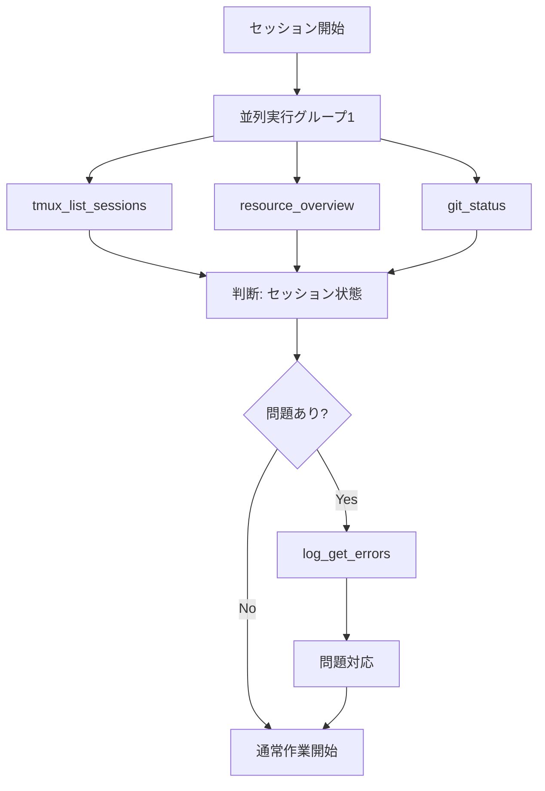

# 🦀 Rust Tool Use Rules - MCP最適化ガイド

**Version**: 1.0.0
**Last Updated**: 2025-11-22
**Priority**: ⭐⭐⭐⭐ (P0 Level)
**Purpose**: MCP Tool使用の最適化とRust開発ワークフローの統合

---

## 📋 概要

このドキュメントは、Miyabi開発環境におけるMCP Tool使用の最適化ルールを定義します。
効率的なtool呼び出し、適切なtoolの選択、そしてRust開発ワークフローとの統合を目的とします。

---

## 🎯 P0: Tool Use 基本原則

### 1. 最小呼び出し原則 (Minimal Invocation)

```
❌ BAD: 同じカテゴリのtoolを複数回個別に呼び出す
✅ GOOD: 1回の呼び出しで最大限の情報を取得
```

**例: システム状態確認**
```
❌ BAD:
1. resource_cpu()
2. resource_memory()
3. resource_disk()
4. resource_processes()

✅ GOOD:
1. resource_overview()  # 全情報を一括取得
```

### 2. 並列実行可能なtool群の識別

以下のtool群は**並列実行可能**（相互依存なし）:

```
[並列グループA: システム状態]
- miyabi-resource-monitor:resource_overview
- miyabi-network-inspector:network_overview
- miyabi-process-inspector:process_top

[並列グループB: 開発状態]
- miyabi-git-inspector:git_status
- miyabi-git-inspector:git_current_branch
- miyabi-file-watcher:file_recent_changes

[並列グループC: セッション状態]
- miyabi-tmux:tmux_list_sessions
- miyabi-tmux:tmux_get_commhub_status
- miyabi-log-aggregator:log_get_errors
```

### 3. 順序依存のtool呼び出し

以下は**順序を守って呼び出す**（前の結果に依存）:

```
[シーケンシャル: Issue実装フロー]
1. miyabi-github:github_get_issue        # Issue詳細取得
2. miyabi-git-inspector:git_status       # 現在の状態確認
3. miyabi-tmux:tmux_send_message         # Agentへ指示
4. miyabi-tmux:tmux_pane_capture         # 結果確認

[シーケンシャル: PR作成フロー]
1. miyabi-git-inspector:git_staged_diff  # 変更確認
2. miyabi-github:github_create_pr        # PR作成
3. miyabi-github:github_add_labels       # ラベル追加
```

---

## 🔧 P1: Tool Category別最適化

### 1. miyabi-tmux Tools

| Tool | 用途 | 最適な使用タイミング |
|------|------|---------------------|
| `tmux_list_sessions` | セッション一覧 | 初回確認時、1回のみ |
| `tmux_list_panes` | ペイン一覧 | セッション指定で絞り込み |
| `tmux_send_message` | メッセージ送信 | P0.2準拠、sleep 0.5必須 |
| `tmux_pane_capture` | 出力取得 | メッセージ送信後の確認 |
| `tmux_pane_tail` | 末尾N行取得 | 最新状態のみ必要な時 |
| `tmux_pane_is_busy` | ビジー判定 | コマンド送信前のチェック |
| `tmux_broadcast` | 全体通知 | システム通知時のみ |

**最適パターン**:
```
# セッション状態確認
1. tmux_list_sessions()               # 全セッション取得
2. tmux_list_panes(session="miyabi")  # 特定セッションのペイン

# Agent指示
1. tmux_pane_is_busy(pane_id="%50")   # ビジー確認
2. tmux_send_message(pane_id="%50", message="...")  # 指示送信
3. [wait 2-5 seconds]
4. tmux_pane_tail(pane_id="%50", lines=50)  # 結果確認
```

### 2. miyabi-git-inspector Tools

| Tool | 用途 | 呼び出し頻度 |
|------|------|-------------|
| `git_status` | 変更状態 | 作業開始/終了時 |
| `git_current_branch` | 現在ブランチ | セッション開始時 |
| `git_diff` | unstaged diff | コミット前 |
| `git_staged_diff` | staged diff | コミット直前 |
| `git_log` | コミット履歴 | 状況把握時 |
| `git_branch_ahead_behind` | push状態 | push前 |
| `git_file_history` | ファイル履歴 | 調査時のみ |

**最適パターン**:
```
# 開発開始時
1. git_current_branch()  # ブランチ確認
2. git_status()          # 未コミット確認

# コミット前
1. git_staged_diff()     # 変更内容確認
2. git_status()          # 漏れチェック

# push前
1. git_branch_ahead_behind()  # ahead/behind確認
```

### 3. miyabi-resource-monitor Tools

| Tool | 用途 | 呼び出し頻度 |
|------|------|-------------|
| `resource_overview` | 全体状態 | 1回で十分（推奨） |
| `resource_cpu` | CPU詳細 | overview後、必要時のみ |
| `resource_memory` | メモリ詳細 | overview後、必要時のみ |
| `resource_disk` | ディスク詳細 | overview後、必要時のみ |
| `resource_processes` | プロセス一覧 | 問題調査時 |
| `resource_uptime` | 稼働時間 | 状態確認時 |

**最適パターン**:
```
# 通常の状態確認
1. resource_overview()  # これ1つで十分

# 問題調査時
1. resource_overview()           # 全体把握
2. resource_processes(limit=20)  # 高負荷プロセス特定
3. resource_memory()             # メモリ詳細（必要時）
```

### 4. miyabi-github Tools

| Tool | 用途 | 注意点 |
|------|------|--------|
| `github_list_issues` | Issue一覧 | state/labelsでフィルタ |
| `github_get_issue` | Issue詳細 | issue_number必須 |
| `github_create_issue` | Issue作成 | title必須 |
| `github_update_issue` | Issue更新 | issue_number必須 |
| `github_list_prs` | PR一覧 | stateでフィルタ |
| `github_get_pr` | PR詳細 | pull_number必須 |
| `github_create_pr` | PR作成 | head, title必須 |
| `github_merge_pr` | PRマージ | pull_number必須 |
| `github_add_comment` | コメント追加 | issue/PR両方対応 |
| `github_add_labels` | ラベル追加 | 配列形式 |

**最適パターン**:
```
# Issue確認
1. github_list_issues(state="open", labels="priority:high")  # フィルタ使用
2. github_get_issue(issue_number=XXX)  # 必要なものだけ詳細取得

# PR作成フロー
1. github_create_pr(head="feature/xxx", title="...")
2. github_add_labels(issue_number=PR_NUMBER, labels=["enhancement"])
```

### 5. miyabi-log-aggregator Tools

| Tool | 用途 | 推奨使用 |
|------|------|---------|
| `log_sources` | ソース一覧 | 初回のみ |
| `log_get_recent` | 最新ログ | source/levelでフィルタ |
| `log_search` | ログ検索 | query必須 |
| `log_get_errors` | エラーのみ | 問題調査時（推奨） |
| `log_get_warnings` | 警告のみ | 予防的チェック |
| `log_tail` | 末尾取得 | 特定ソースのみ |

**最適パターン**:
```
# 問題検出
1. log_get_errors(minutes=30)  # 直近30分のエラー

# 詳細調査
1. log_search(query="error", source="miyabi")  # 特定ソース検索
2. log_tail(source="miyabi", lines=100)        # 詳細確認
```

---

## 🚀 P2: 統合ワークフロー最適化

### Daily Initial Sequence



**Tool呼び出し順序**:
```
[並列] Step 1:
- miyabi-tmux:tmux_list_sessions
- miyabi-resource-monitor:resource_overview
- miyabi-git-inspector:git_status

[条件付き] Step 2 (問題検出時のみ):
- miyabi-log-aggregator:log_get_errors
```

### Issue Implementation Workflow

```
[Phase 1: 情報収集]
1. github_get_issue(issue_number)        # Issue詳細
2. git_current_branch()                  # 現在ブランチ
3. git_status()                          # 作業状態

[Phase 2: Agent指示]
4. tmux_list_panes(session="miyabi-orchestra")  # ペイン確認
5. tmux_pane_is_busy(pane_id)                   # ビジー確認
6. tmux_send_message(pane_id, message)          # 実装指示

[Phase 3: 監視・確認]
7. [wait 5-30 seconds]
8. tmux_pane_tail(pane_id, lines=100)    # 進捗確認
9. log_get_errors(minutes=5)             # エラーチェック

[Phase 4: 完了処理]
10. git_status()                          # 変更確認
11. git_staged_diff()                     # 内容確認
12. github_update_issue(state="closed")   # Issue完了
```

---

## ⚡ P3: パフォーマンス最適化

### Tool呼び出しコスト比較

| カテゴリ | 平均応答時間 | 推奨頻度 |
|---------|-------------|---------|
| tmux tools | <100ms | 高頻度OK |
| git-inspector | <200ms | 中頻度 |
| resource-monitor | <300ms | 低頻度（キャッシュ効果あり） |
| github tools | 500-2000ms | 必要時のみ |
| log-aggregator | 200-500ms | 問題時のみ |

### キャッシュ活用

```
# 変更が少ないもの（10分間有効）
- tmux_list_sessions     # セッション構成は安定
- git_current_branch     # ブランチは頻繁に変わらない
- resource_overview      # システム状態は緩やかに変化

# 毎回取得が必要なもの
- tmux_pane_capture      # 出力は常に変化
- git_status             # 作業中は頻繁に変化
- log_get_errors         # リアルタイム性重要
```

---

## 🛡️ エラーハンドリング

### Tool失敗時のフォールバック

```
# tmux_send_message 失敗時
1. tmux_pane_is_busy() で状態確認
2. tmux_pane_current_command() で実行中コマンド確認
3. 必要に応じて再試行（max 3回）

# github_* 失敗時
1. レート制限確認（X-RateLimit-Remaining）
2. network_ping("github.com") でネットワーク確認
3. 1分後に再試行

# resource_* 失敗時
1. process_search("node") でMCPプロセス確認
2. log_get_errors() でエラー原因調査
```

### 大規模データ対応

```
# git_status が "Tool result is too large" の場合
1. git_diff(file="specific_file.rs")  # ファイル指定
2. file_recent_changes(minutes=30)     # 時間でフィルタ

# log_get_recent が大きすぎる場合
1. log_get_recent(minutes=10, level="error")  # フィルタ追加
2. log_tail(source="specific", lines=50)      # 特定ソースのみ
```

---

## 📊 Rust開発との統合

### Cargo Commands + MCP Tools

```bash
# ビルド前の状態確認
[MCP] git_status()              # 未コミット確認
[MCP] resource_memory()         # メモリ確保確認
[Bash] cargo build --release    # ビルド実行
[MCP] log_get_errors(minutes=5) # ビルドエラー確認

# テスト実行
[MCP] tmux_pane_is_busy()       # ペイン空き確認
[Bash] cargo test --all         # テスト実行
[MCP] tmux_pane_tail(lines=100) # 結果取得
[MCP] log_search("FAILED")      # 失敗テスト検索
```

### Agent実行フロー

```
[Step 1: 準備]
- tmux_list_panes(session="miyabi-orchestra")
- git_current_branch()
- github_get_issue(issue_number)

[Step 2: 実行指示]
- tmux_send_message(pane_id, """
    cd '/path/to/project' && \
    cargo build --release && \
    cargo test --all && \
    cargo clippy -- -D warnings
  """)

[Step 3: 監視]
- [loop every 10s]
  - tmux_pane_is_busy()
  - tmux_pane_tail(lines=20)
  - log_get_errors(minutes=1)

[Step 4: 完了処理]
- git_status()
- github_add_comment(issue_number, result_summary)
```

---

## 🔗 関連ドキュメント

- **rust.md**: Rust開発ガイドライン全般
- **RUST_COMMANDS_OPTIMIZATION.md**: Agent向けCargoコマンド最適化
- **protocols.md**: 通信プロトコル（P0.2準拠）
- **agents.md**: Agent仕様

---

## 📝 バージョン履歴

- **1.0.0** (2025-11-22): 初版作成
  - MCP Tool最適化ルール定義
  - 並列/シーケンシャル実行パターン
  - Rust開発統合ワークフロー

---

**🦀 Rust Tool Use Rules - Optimized MCP Integration**
