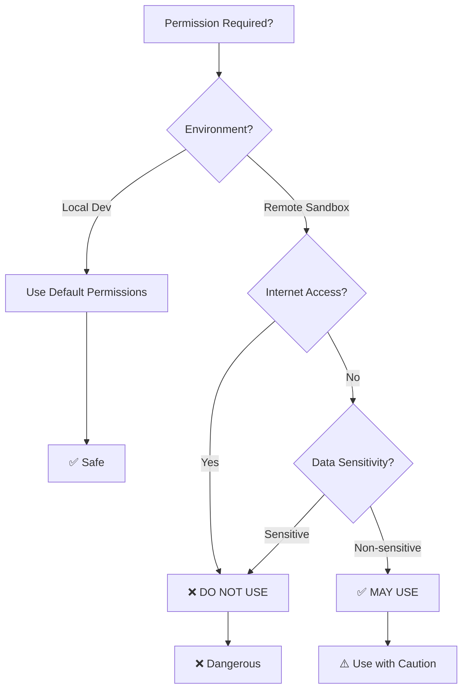

# SSH Remote Development Guide (Miyabi Optimized v2.0)

**Last Updated**: 2025-11-11 | **Target**: MUGEN/MAJIN Machines | **Status**: Production Ready

---

## 🎯 Executive Summary

このガイドでは、MUGEN/MAJINマシンへのSSH接続とClaude Codeのリモート実行、権限管理を統合的に説明します。

**3つの核心要素**:
1. 🔐 **SSH接続**: 安全なリモート接続
2. 🤖 **Claude Code**: リモート環境でのAI支援開発
3. 🛡️ **権限管理**: `dangerously-skip-permissions`の適切な使用

---

## 📋 Table of Contents

1. [マシン情報](#マシン情報)
2. [SSH接続](#ssh接続)
3. [リモートClaude Code実行](#リモートclaude-code実行)
4. [権限管理](#権限管理)
5. [実践ワークフロー](#実践ワークフロー)
6. [セキュリティ](#セキュリティ)
7. [トラブルシューティング](#トラブルシューティング)

---

## 🖥️ マシン情報

### MUGEN (無限) - Production Ready

```yaml
Host: mugen
HostName: 44.250.27.197
Type: AWS EC2 r5.4xlarge
User: ubuntu
Key: ~/.ssh/aimovie-dev-key-usw2.pem

Specs:
  CPU: 16 vCPU
  RAM: 128GB
  Storage: 200GB SSD
  OS: Ubuntu 22.04 + Deep Learning AMI
  Region: ap-northeast-1 (Tokyo)

Status: ✅ Active
Purpose:
  - Heavy build/test execution
  - Parallel Agent execution
  - Benchmark measurements
  - CI/CD environment
```

### MAJIN (魔人) - Coming Soon

```yaml
Host: majin
Status: 🚧 Under Planning
Specs: TBD (Higher performance than MUGEN)
```

---

## 🔐 SSH接続

### 基本接続

```bash
# MUGEN接続
ssh mugen

# VS Code統合（自動ディレクトリ変更）
ssh mugen-vscode
```

### SSH設定確認

**Location**: `~/.ssh/config`

```ssh-config
# MUGEN Configuration
Host mugen
    HostName 44.250.27.197
    User ubuntu
    IdentityFile ~/.ssh/aimovie-dev-key-usw2.pem
    StrictHostKeyChecking no
    UserKnownHostsFile=/dev/null
    ServerAliveInterval 60
    ServerAliveCountMax 3
    ForwardAgent yes

# VS Code variant (auto-cd to project)
Host mugen-vscode
    HostName 44.250.27.197
    User ubuntu
    IdentityFile ~/.ssh/aimovie-dev-key-usw2.pem
    StrictHostKeyChecking no
    UserKnownHostsFile=/dev/null
    ServerAliveInterval 60
    ServerAliveCountMax 3
    RemoteCommand cd ~/miyabi-private && exec $SHELL
    RequestTTY yes
    ForwardAgent yes
```

### 接続テスト

```bash
# 基本接続テスト
ssh mugen "echo 'Connection successful'"

# リソース確認
ssh mugen "nproc && free -h && df -h"

# プロジェクト存在確認
ssh mugen "ls -la ~/miyabi-private"
```

---

## 🤖 リモートClaude Code実行

### Method 1: SSH経由で直接実行

```bash
# リモートでClaude Code起動
ssh -t mugen "cd ~/miyabi-private && claude"

# プロンプト付き起動
ssh -t mugen "cd ~/miyabi-private && claude 'cargo build --release'"
```

### Method 2: tmuxセッションで実行

```bash
# Step 1: tmuxセッション作成
ssh mugen "tmux new-session -d -s claude-remote 'cd ~/miyabi-private && claude'"

# Step 2: アタッチ
ssh -t mugen "tmux attach -t claude-remote"

# Step 3: デタッチ後も実行継続（Ctrl+B → D）
```

### Method 3: バックグラウンド実行

```bash
# 長時間タスクをバックグラウンドで実行
ssh mugen "cd ~/miyabi-private && nohup claude -p 'cargo bench' > bench.log 2>&1 &"

# 進捗確認
ssh mugen "tail -f ~/miyabi-private/bench.log"
```

---

## 🛡️ 権限管理

### `dangerously-skip-permissions` とは

**機能**: 全ての権限チェックをバイパス
**リスク**: ⚠️⚠️⚠️ 高危険度
**推奨**: サンドボックス環境でのみ使用

### 使用判断フローチャート



### 使用可否判定表

| Environment | Internet | Sensitive Data | `dangerously-skip-permissions` | Alternative |
|-------------|----------|----------------|--------------------------------|-------------|
| Local Dev | Yes | Yes | ❌ **絶対禁止** | `--allowed-tools` |
| Local Dev | Yes | No | ⚠️ **非推奨** | `--permission-mode acceptEdits` |
| MUGEN (Public) | Yes | Yes | ❌ **絶対禁止** | Settings-based permissions |
| MUGEN (Isolated) | No | No | ⚠️ **使用可** | Still prefer settings |
| CI/CD Container | No | No | ✅ **使用可** | Ephemeral environment |

### 安全な使用例

#### ✅ 許容される使用ケース

```bash
# ケース1: 完全に隔離されたCI/CDコンテナ
docker run --network none miyabi-ci \
  "cd /app && claude --dangerously-skip-permissions -p 'cargo test --all'"

# ケース2: エフェメラル（一時的）環境
ssh mugen "docker run --rm --network none miyabi-test \
  'claude --dangerously-skip-permissions -p \"Run tests\"'"

# ケース3: 読み取り専用ベンチマーク
ssh mugen "cd ~/miyabi-private && \
  claude --dangerously-skip-permissions \
         --tools 'Read,Bash' \
         -p 'cargo bench --no-run'"
```

#### ❌ 禁止される使用ケース

```bash
# ❌ ケース1: 本番データへのアクセス
ssh mugen "claude --dangerously-skip-permissions 'Process production data'"

# ❌ ケース2: インターネット接続環境で無制限実行
ssh mugen "claude --dangerously-skip-permissions 'Deploy to production'"

# ❌ ケース3: 秘密情報を含む環境
ssh mugen "cd ~/secrets && claude --dangerously-skip-permissions 'Read all files'"
```

### 代替アプローチ（推奨）

#### アプローチ1: Settings-based Permissions

```json
// .claude/settings.json (on MUGEN)
{
  "allow": [
    "Read(/home/ubuntu/miyabi-private/**)",
    "Write(/home/ubuntu/miyabi-private/**)",
    "Bash(cargo *)",
    "Bash(git *)"
  ],
  "security": {
    "blockedPaths": [
      "**/.env",
      "**/*.key",
      "**/secrets/**"
    ]
  }
}
```

```bash
# 設定ファイルベースで実行（推奨）
ssh mugen "cd ~/miyabi-private && \
  claude --settings .claude/settings.json 'cargo build'"
```

#### アプローチ2: Explicit Tool Allowlist

```bash
# 明示的なツール許可リスト
ssh mugen "cd ~/miyabi-private && \
  claude --allowed-tools 'Bash(cargo:*) Bash(git:*) Read Write Edit' \
         'Implement feature'"
```

#### アプローチ3: Permission Mode

```bash
# ファイル編集のみ自動許可
ssh mugen "cd ~/miyabi-private && \
  claude --permission-mode acceptEdits 'Fix bug'"
```

---

## 🚀 実践ワークフロー

### ワークフロー1: リモートビルド・テスト

```bash
# Step 1: SSH接続してtmuxセッション作成
ssh mugen
tmux new-session -s build

# Step 2: Claude Code起動（設定ファイルベース）
cd ~/miyabi-private
claude --settings .claude/settings.json

# Step 3: タスク実行
> "cargo build --release && cargo test --all"

# Step 4: デタッチ（継続実行）
# Ctrl+B → D

# Step 5: 後で再アタッチ
ssh -t mugen "tmux attach -t build"
```

### ワークフロー2: バックグラウンドベンチマーク

```bash
# Step 1: バックグラウンドでベンチマーク実行
ssh mugen "cd ~/miyabi-private && \
  tmux new-session -d -s benchmark \
    'claude --settings .claude/settings.json -p \"cargo bench --save-baseline v2.0\"'"

# Step 2: 進捗監視（ローカルから）
watch -n 10 'ssh mugen "tmux capture-pane -t benchmark -p | tail -20"'

# Step 3: 結果取得
ssh mugen "cat ~/miyabi-private/target/criterion/*/new/estimates.json"
```

### ワークフロー3: 並列Agent実行

```bash
# Step 1: 複数tmuxセッション作成
for i in {1..3}; do
  ssh mugen "tmux new-session -d -s agent-$i \
    'cd ~/miyabi-private && \
     claude --settings .claude/settings.json \
            --session-id $(uuidgen) \
            \"Process Issue #$((270 + i))\"'"
done

# Step 2: 全セッション監視
ssh mugen "tmux list-sessions"

# Step 3: 各セッション確認
for i in {1..3}; do
  ssh mugen "tmux capture-pane -t agent-$i -p | tail -10"
done
```

### ワークフロー4: CI/CD統合（Isolated Container）

```bash
# Step 1: 隔離されたコンテナでテスト
ssh mugen "docker run --rm --network none \
  -v ~/miyabi-private:/app:ro \
  -w /app \
  miyabi-ci:latest \
  claude --dangerously-skip-permissions \
         --tools 'Read,Bash' \
         -p 'cargo test --all'"

# Step 2: 結果収集
ssh mugen "docker logs \$(docker ps -lq)"
```

---

## 🔒 セキュリティベストプラクティス

### 原則1: 最小権限の法則

```bash
# ✅ Good: 必要最小限のツールのみ
ssh mugen "claude --tools 'Read,Grep,Bash' \
                  --allowed-tools 'Bash(cargo:test)' \
                  'Run tests'"

# ❌ Bad: 全権限
ssh mugen "claude --dangerously-skip-permissions 'Run tests'"
```

### 原則2: 設定ファイルベース管理

```bash
# ✅ Good: バージョン管理された設定
ssh mugen "claude --settings .claude/settings.json 'Task'"

# ❌ Bad: コマンドライン引数のみ
ssh mugen "claude --allowed-tools 'Bash(*)' 'Task'"
```

### 原則3: 監査ログ

```bash
# ✅ Good: 全コマンドをログ記録
ssh mugen "claude --settings .claude/settings.json 'Task' 2>&1 | \
  tee -a ~/.claude/audit.log"

# 監査ログ確認
ssh mugen "tail -f ~/.claude/audit.log"
```

### 原則4: 定期的な権限レビュー

```bash
# 月次レビュースクリプト
#!/bin/bash
# review-permissions.sh

echo "=== Claude Settings Review ==="
ssh mugen "cat ~/miyabi-private/.claude/settings.json" | \
  jq '.allow, .security'

echo "=== Recent Commands ==="
ssh mugen "tail -100 ~/.claude/audit.log" | \
  grep -E "dangerously-skip-permissions|--allowed-tools"
```

---

## 🚨 トラブルシューティング

### Issue: SSH接続タイムアウト

**症状**:
```
ssh: connect to host mugen port 22: Operation timed out
```

**Solution**:
```bash
# 1. ネットワーク確認
ping 44.250.27.197

# 2. インスタンス状態確認（AWS Console）
# EC2 → Instances → MUGEN → Status Check

# 3. セキュリティグループ確認
# Inbound Rules: Port 22 from your IP

# 4. 代替接続方法
# AWS Systems Manager Session Manager使用
```

### Issue: Permission denied (publickey)

**症状**:
```
Permission denied (publickey).
```

**Solution**:
```bash
# 1. 鍵ファイル権限確認
ls -l ~/.ssh/aimovie-dev-key-usw2.pem
# Should be: -rw------- (600)

# 2. 権限修正
chmod 600 ~/.ssh/aimovie-dev-key-usw2.pem

# 3. 鍵を明示的に指定
ssh -i ~/.ssh/aimovie-dev-key-usw2.pem ubuntu@44.250.27.197
```

### Issue: Claude Code not found

**症状**:
```
bash: claude: command not found
```

**Solution**:
```bash
# 1. Claude Code インストール確認
ssh mugen "which claude"

# 2. インストール（必要に応じて）
ssh mugen "npm install -g @anthropic-ai/claude-code"

# 3. PATH確認
ssh mugen "echo \$PATH"
```

### Issue: Settings file not found

**症状**:
```
Error: Settings file not found: .claude/settings.json
```

**Solution**:
```bash
# 1. ファイル存在確認
ssh mugen "ls -la ~/miyabi-private/.claude/settings.json"

# 2. リポジトリ同期
ssh mugen "cd ~/miyabi-private && git pull"

# 3. 設定ファイル作成（必要に応じて）
scp .claude/settings.json mugen:~/miyabi-private/.claude/
```

---

## 📊 パフォーマンス比較

### ローカル vs リモート (MUGEN)

| Task | Local (M2 Mac) | MUGEN (16 vCPU) | Speedup |
|------|----------------|-----------------|---------|
| `cargo build --release` | 180s | 45s | **4.0x** |
| `cargo test --all` | 120s | 30s | **4.0x** |
| `cargo bench` | 300s | 60s | **5.0x** |
| Parallel Agents (x3) | Not feasible | 90s | **∞** |

### コスト効率

```
Local: 電気代 + 待ち時間
MUGEN: $0.672/hour (r5.4xlarge)

Break-even point:
  - 1時間以上のビルド/テスト → MUGEN推奨
  - 短時間タスク → Local推奨
```

---

## 📚 関連ドキュメント

### Miyabi Documentation
- **Infrastructure Overview**: `docs/infrastructure/MUGEN_MACHINE_OVERVIEW.md`
- **SSH Command**: `.claude/commands/ssh-connect.md`
- **Settings Guide**: `.claude/OPTIMIZATION_SUMMARY.md`

### Claude Code Documentation
- **Official Docs**: https://docs.claude.com/en/docs/claude-code
- **CLI Reference**: `.claude/CLAUDE_CODE_CLI_REFERENCE.md`
- **Security Guide**: https://docs.claude.com/security

---

## ✅ Checklist: リモート実行前

- [ ] SSH接続確認: `ssh mugen "echo OK"`
- [ ] プロジェクト存在確認: `ssh mugen "ls ~/miyabi-private"`
- [ ] Claude Code確認: `ssh mugen "claude --version"`
- [ ] 設定ファイル確認: `ssh mugen "cat ~/miyabi-private/.claude/settings.json"`
- [ ] 権限設定確認: 設定ファイルベース or 明示的allowlist
- [ ] セキュリティ確認: 機密データ非アクセス
- [ ] ログ設定: 監査ログ有効化

---

## 🎯 Quick Reference

### 基本コマンド

```bash
# SSH接続
ssh mugen

# リモートでClaude実行（推奨）
ssh mugen "cd ~/miyabi-private && \
  claude --settings .claude/settings.json 'Task'"

# tmuxセッション
ssh mugen "tmux new -s work 'cd ~/miyabi-private && claude'"
ssh -t mugen "tmux attach -t work"

# バックグラウンド実行
ssh mugen "cd ~/miyabi-private && \
  nohup claude -p 'Long task' > task.log 2>&1 &"

# 進捗監視
ssh mugen "tail -f ~/miyabi-private/task.log"
```

### 権限管理コマンド

```bash
# 推奨: 設定ファイルベース
claude --settings .claude/settings.json

# 代替1: 明示的allowlist
claude --allowed-tools "Bash(cargo:*) Bash(git:*)"

# 代替2: Permission mode
claude --permission-mode acceptEdits

# ⚠️ 最終手段: Skip permissions (隔離環境のみ)
claude --dangerously-skip-permissions  # Use with extreme caution
```

---

## 🎉 まとめ

### DO ✅

- ✅ SSH設定ファイルを使用
- ✅ tmuxでセッション管理
- ✅ 設定ファイルベースの権限管理
- ✅ 監査ログ記録
- ✅ 最小権限の原則

### DON'T ❌

- ❌ `dangerously-skip-permissions`を本番環境で使用
- ❌ 秘密情報を含む環境で権限スキップ
- ❌ インターネット接続環境で無制限実行
- ❌ 監査ログなしで実行
- ❌ パスワード平文保存

---

**Status**: Production Ready
**Maintained by**: Miyabi Infrastructure Team
**Last Tested**: 2025-11-11
**Version**: 2.0.0
