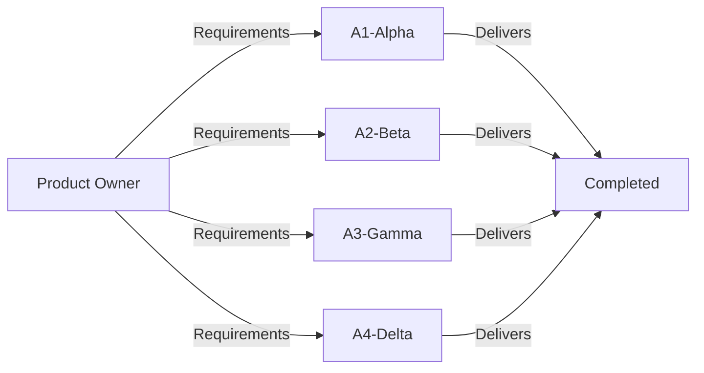
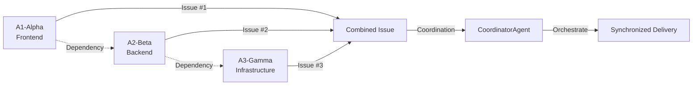
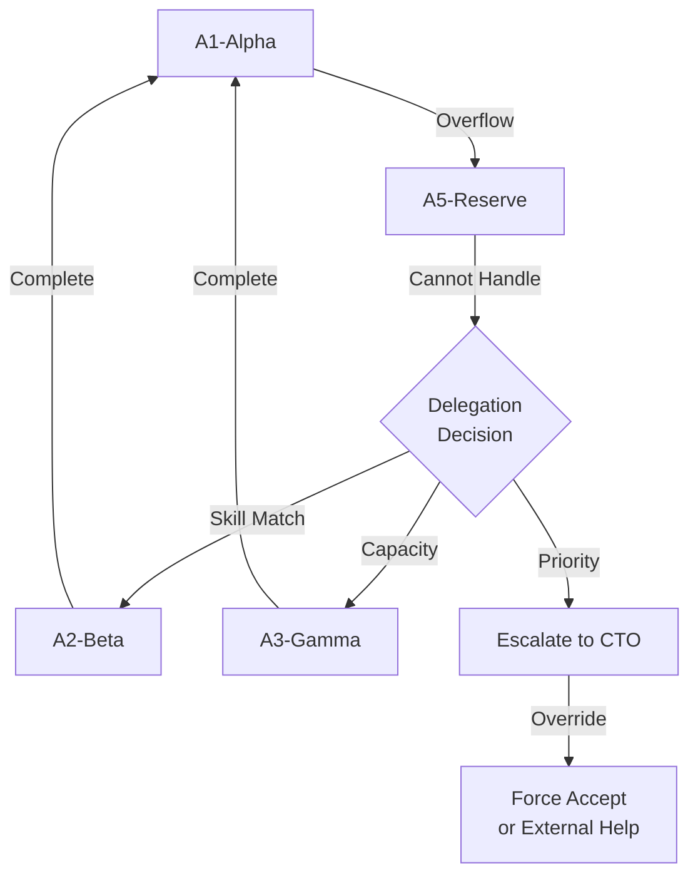

# Inter-Team Collaboration Flow

**Version**: 1.0.0
**Created**: 2025-11-29
**Scope**: A1-Alpha, A2-Beta, A3-Gamma, A4-Delta, A5-Reserve
**Status**: Active

---

## 🎯 Overview

This document defines the standardized collaboration flow between teams in the Miyabi project, with special focus on overflow task management through the A5-Reserve team.

### Team Structure

```
┌─────────────────────────────────────────────────────────────┐
│                    MIYABI PROJECT TEAMS                      │
├─────────────────────────────────────────────────────────────┤
│                                                               │
│  👥 A1-Alpha       Primary Development Team 1                │
│  👥 A2-Beta        Primary Development Team 2                │
│  👥 A3-Gamma       Primary Development Team 3                │
│  👥 A4-Delta       Primary Development Team 4                │
│  👥 A5-Reserve     Overflow & Support Team                   │
│                                                               │
└─────────────────────────────────────────────────────────────┘
```

---

## 🔄 Collaboration Patterns

### Pattern 1: Normal Work Distribution

**When**: Regular sprint planning, standard capacity



**Characteristics**:
- Each team owns their work end-to-end
- No inter-team task transfers
- A5-Reserve is idle or handling planned maintenance

---

### Pattern 2: Overflow to A5-Reserve

**When**: Team exceeds capacity, emergency tasks, specialized overflow

```mermaid
graph TD
    A1[A1-Alpha<br/>At Capacity] -->|Overflow Task| Reserve{A5-Reserve<br/>Triage}
    A2[A2-Beta<br/>Emergency] -->|P0 Task| Reserve
    A3[A3-Gamma<br/>Skill Gap| -->|Specialized| Reserve

    Reserve -->|Accept| Queue[Queue/Execute]
    Reserve -->|Reject| Return[Return to Team]
    Reserve -->|Escalate| CTO[CTO Decision]

    Queue -->|Complete| Handoff[Handoff to Original Team]
    Handoff -->|Verify| Done[Done]
```

**Characteristics**:
- Explicit overflow trigger (capacity/emergency/skills)
- Formal triage process by A5
- Clear handoff back to originating team

---

### Pattern 3: Cross-Team Dependencies

**When**: Task requires collaboration between multiple teams



**Characteristics**:
- Linked issues (GitHub issue linking)
- CoordinatorAgent orchestrates timing
- Synchronized completion and handoff

---

### Pattern 4: Delegation Chain

**When**: A5-Reserve cannot handle, needs re-delegation



**Characteristics**:
- A5 acts as intelligent router
- Suggests best alternative team
- Escalation path for unresolvable cases

---

## 📋 Detailed Flow: Overflow Request

### Step-by-Step Process

#### Phase 1: Request Creation (Originating Team)

**Actor**: Team Lead or designated member from A1-A4

**Actions**:
1. Navigate to GitHub Issues
2. Click "New Issue"
3. Select template: **"📨 Reserve Task Request"**
4. Fill out ALL required fields:
   - Originating team
   - Priority level (with justification)
   - Task type
   - Overflow reason
   - Description
   - Acceptance criteria
   - Deadline
   - Business impact
   - Contact person
5. Submit issue

**Auto-actions**:
- GitHub applies labels: `📨 reserve:incoming`, `👥 team:a[1-4]-*`
- A5-Lead receives notification
- Capacity monitor checks current A5 status

**SLA**: None (request creation)

---

#### Phase 2: Triage (A5-Reserve Team)

**Actor**: A5-Lead or designated triage agent

**Timeline**:
- P0: Within 30 minutes
- P1: Within 2 hours
- P2: Within 4 hours
- P3: Within 1 day

**Actions**:
1. Review incoming task details
2. Check current A5 capacity (see capacity status issue)
3. Evaluate using Decision Matrix:

**Decision Matrix**:

| Criteria | Weight | Evaluation |
|----------|--------|------------|
| **Urgency** | 30% | P0=100, P1=70, P2=40, P3=10 |
| **Capacity** | 25% | Available=100, Limited=50, Full=0 |
| **Competency** | 20% | Perfect=100, Partial=50, None=0 |
| **Business Impact** | 15% | Critical=100, High=70, Medium=40, Low=10 |
| **Dependencies** | 10% | Clear=100, Some=50, Blocked=0 |

**Total Score**: Sum (Criteria * Weight)
- **80-100**: Auto-accept
- **60-79**: Accept with conditions
- **40-59**: Negotiate or queue
- **0-39**: Reject or escalate

4. Post triage comment (see templates below)
5. Update labels accordingly

**Triage Comment Templates**:

**Accept (Immediate)**:
```markdown
✅ **ACCEPTED - Immediate Execution**

**Triage Score**: [XX]/100
- Urgency: [XX]/30
- Capacity: [XX]/25
- Competency: [XX]/20
- Business Impact: [XX]/15
- Dependencies: [XX]/10

**Assignment**:
- Agent: @agent-name
- Engineer: @engineer-name
- Start: [YYYY-MM-DD HH:MM]
- ETA: [YYYY-MM-DD HH:MM]

**SLA**: [Based on priority]

We're starting work immediately. You'll receive updates [frequency based on priority].
```

**Accept (Queued)**:
```markdown
✅ **ACCEPTED - Queued**

**Triage Score**: [XX]/100

**Queue Position**: #[N] in [priority] queue

**Current Queue**:
1. #[issue] - ETA: [date]
2. #[issue] - ETA: [date]
3. **This task** - ETA: [date]

**Estimated Start**: [YYYY-MM-DD HH:MM]
**Estimated Completion**: [YYYY-MM-DD HH:MM]

We'll notify you when we begin work.
```

**Conditional Accept**:
```markdown
⚠️ **CONDITIONAL ACCEPTANCE**

**Triage Score**: [XX]/100

We can accept this task if:
- [ ] [Condition 1 - e.g., reduce scope to X]
- [ ] [Condition 2 - e.g., push deadline to Y]
- [ ] [Condition 3 - e.g., provide Z resource]

Please confirm within [timeframe] or we'll mark as rejected.
```

**Reject**:
```markdown
❌ **REJECTED**

**Triage Score**: [XX]/100

**Primary Reason**: [Select from protocol]
- ⚪ Insufficient capacity (currently at [XX]%)
- ⚪ Skill mismatch (requires [specific skill])
- ⚪ Insufficient information (need [details])
- ⚪ Not true overflow (team capacity available)
- ⚪ Dependencies unresolved (blocked by #[issue])

**Detailed Explanation**:
[Specific reasoning]

**Alternative Options**:
1. **Wait**: Available capacity expected [date]
2. **Reduce Scope**: If focused on [core], can accept
3. **Delegate**: Suggest @team-name due to [reason]
4. **Escalate**: Contact @a5-lead for override

**Next Steps**:
[Specific guidance for requesting team]
```

---

#### Phase 3: Execution (A5-Reserve Team)

**Actor**: Assigned agent or engineer

**Actions**:
1. Create working branch (if applicable)
2. Set up monitoring/tracking
3. Begin implementation
4. Post progress updates per SLA:
   - P0: Every 2 hours
   - P1: Daily
   - P2: Every 2 days
   - P3: Weekly
5. Handle blockers:
   - Minor: Resolve autonomously
   - Major: Escalate to A5-Lead
   - Critical: Escalate to originating team + A5-Lead
6. Run tests and quality checks
7. Create PR (if code changes)
8. Request review

**Progress Update Template**:
```markdown
📊 **Progress Update** - [YYYY-MM-DD HH:MM]

**Status**: [On Track | At Risk | Blocked]
**Completion**: [XX]%

**✅ Completed**:
- [Item 1]
- [Item 2]

**🔄 In Progress**:
- [Item 3] - [XX]% done

**📅 Next**:
- [Item 4] - Starting [date]

**⚠️ Blockers**: [None | List blockers]

**Revised ETA**: [If changed, explain why]
```

---

#### Phase 4: Quality Review (ReviewAgent)

**Actor**: ReviewAgent (automated) + Human reviewer (if needed)

**Actions**:
1. Run automated quality checks:
   - Code quality (linting, complexity)
   - Test coverage (>80% target)
   - Security scan (no high/critical vulns)
   - Documentation (updated)
2. Calculate quality score (0-100)
3. If score >= 80: Approve
4. If score 70-79: Conditional approve (with fixes)
5. If score < 70: Reject, request improvements
6. Post quality report

**Quality Report Template**:
```markdown
⭐ **Quality Review Complete**

**Overall Score**: [XX]/100

| Category | Score | Status |
|----------|-------|--------|
| Code Quality | [X]/10 | [✅/⚠️/❌] |
| Test Coverage | [X]/10 | [✅/⚠️/❌] |
| Security | [X]/10 | [✅/⚠️/❌] |
| Performance | [X]/10 | [✅/⚠️/❌] |
| Documentation | [X]/10 | [✅/⚠️/❌] |

**Decision**: [✅ Approved | ⚠️ Conditional | ❌ Rejected]

**Details**:
[Specific findings and recommendations]
```

---

#### Phase 5: Handoff (A5-Reserve → Originating Team)

**Actor**: A5-Lead or assignee

**Actions**:
1. Verify acceptance criteria met
2. Prepare handoff package:
   - Link to PR(s)
   - Link to deployment (if applicable)
   - Updated documentation
   - Known issues/limitations
   - Maintenance notes
3. Schedule handoff meeting (for complex tasks)
4. Transfer ownership:
   - Remove `👥 team:a5-reserve` label
   - Add `👥 team:a[1-4]-*` label (originating)
   - Update assignee back to originating team
5. Post completion comment
6. Request feedback

**Completion Comment Template**:
```markdown
✅ **TASK COMPLETED - Handoff to @originating-team**

**Completion Date**: [YYYY-MM-DD HH:MM]
**Total Time**: [Xh Ym]
**SLA**: [✅ Met | ⚠️ Missed by [duration]]
**Quality Score**: [XX]/100

**📦 Deliverables**:
- PR: #[number] - [Merged | Ready for review]
- Deployment: [Link or status]
- Documentation: [Links]

**📝 Handoff Notes**:
[Important information for maintaining this work]

**⚠️ Known Issues**:
[Any limitations or future improvements needed]

**🔄 Next Steps for @originating-team**:
1. [Action 1]
2. [Action 2]

**📊 Feedback Request**:
Please rate our work: [1-5 stars] ⭐⭐⭐⭐⭐

---
Transferred to: @originating-team-lead
CC: @stakeholders
```

---

#### Phase 6: Verification (Originating Team)

**Actor**: Original team member who requested

**Actions**:
1. Review deliverables
2. Verify acceptance criteria
3. Test in target environment
4. Provide feedback (mandatory)
5. Close issue if satisfied
6. Create follow-up issues if needed

**Feedback Template**:
```markdown
📊 **Feedback on A5-Reserve Work**

**Overall Rating**: ⭐⭐⭐⭐⭐ ([1-5] stars)

| Aspect | Rating | Comment |
|--------|--------|---------|
| Quality | [1-5]⭐ | [Comment] |
| Communication | [1-5]⭐ | [Comment] |
| Timeliness | [1-5]⭐ | [Comment] |
| Documentation | [1-5]⭐ | [Comment] |

**What went well**:
- [Positive feedback]

**What could improve**:
- [Constructive feedback]

**Would use A5-Reserve again**: [✅ Yes | ❌ No]

Thank you @a5-assignee for your work!
```

---

## 📞 Communication Channels

### Primary Channels

| Purpose | Channel | Response Time |
|---------|---------|---------------|
| **Issue Updates** | GitHub issue comments | Per SLA |
| **Quick Questions** | #a5-reserve Slack | < 1 hour |
| **Escalations** | @a5-lead mention + Slack DM | < 30 min |
| **Emergencies** | #emergency Slack | < 15 min |
| **Weekly Sync** | Monday team standup | Weekly |

### Communication Etiquette

**DO**:
- ✅ Use GitHub issues for all task-related communication
- ✅ @mention specific people when needing action
- ✅ Provide context in every message
- ✅ Update issue when offline discussions happen
- ✅ Thank people for their work

**DON'T**:
- ❌ Use private DMs for task communication
- ❌ Bypass the triage process
- ❌ Change requirements mid-task without discussion
- ❌ Expect instant responses outside business hours
- ❌ Escalate without trying normal channels first

---

## 🚨 Escalation Procedures

### Level 1: A5-Lead

**When**:
- Task complexity higher than expected
- Blocker encountered
- SLA at risk
- Disagreement on accept/reject

**How**:
- @mention A5-Lead in issue
- Post in #a5-reserve Slack
- Explain situation and requested action

**SLA**: 2 hours response

---

### Level 2: CTO / Project Manager

**When**:
- Level 1 escalation unresolved after 4 hours
- Multi-team conflict
- Resource allocation dispute
- Priority override needed

**How**:
- @mention CTO in issue
- Email cto@miyabi.ai
- Post in #leadership Slack

**SLA**: 4 hours response

---

### Level 3: Executive Team

**When**:
- Business-critical blocker
- Legal/compliance issue
- Budget approval needed
- Strategic decision required

**How**:
- Emergency meeting request
- Email exec-team@miyabi.ai
- Phone call for true emergencies

**SLA**: 8 hours response (business hours)

---

## 📊 Metrics & Reporting

### Team Metrics (Tracked Automatically)

**A5-Reserve Metrics**:
- Acceptance rate (%)
- Average triage time
- SLA compliance (%)
- Average quality score
- Customer satisfaction (feedback stars)
- Capacity utilization (%)

**Per-Team Metrics** (A1-A4):
- Overflow request frequency
- Request approval rate
- Feedback quality
- Follow-through on recommendations

### Monthly Report

**Generated by**: A5-Lead
**Published**: First Monday of each month
**Audience**: All teams + leadership

**Contents**:
- Summary statistics
- Top contributors
- Improvement recommendations
- Protocol amendments
- Success stories

---

## 🔄 Continuous Improvement

### Feedback Loop

1. **Weekly Retro** (A5 internal): What went well/poorly?
2. **Monthly Review**: Metrics analysis and protocol updates
3. **Quarterly Planning**: Capacity forecasting and resource planning

### Protocol Amendments

**Proposal Process**:
1. Create issue with label `protocol-amendment`
2. Describe proposed change and rationale
3. 1-week review period (all teams can comment)
4. A5-Lead approval + CTO sign-off
5. Update version and announce

---

## 📚 Related Documents

- [Reserve Task Acceptance Protocol](./reserve-task-acceptance-protocol.md)
- [Label System Guide](../../docs/LABEL_SYSTEM_GUIDE.md)
- [Agent Coordination Protocol](./agent-coordination-protocol.md)
- [SLA Definitions](./sla-definitions.md)

---

**Document Owner**: A5-Reserve Team
**Version**: 1.0.0
**Last Updated**: 2025-11-29
**Next Review**: 2025-12-29
