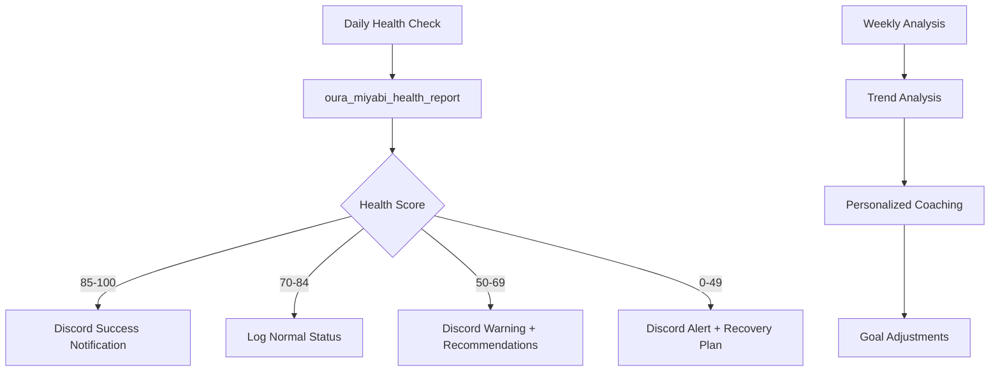

# Oura Health MCP Integration Guide

**Version**: 1.0.0
**Created**: 2025-12-24
**Status**: Complete

This document describes the integration of the Oura Health MCP server into the Miyabi ecosystem.

## Overview

The Oura MCP server (`miyabi-oura`) provides comprehensive health data integration for the Miyabi Multi-Agent System, enabling:

- **OAuth Authentication**: Secure access to Oura API
- **Health Data Retrieval**: Sleep, activity, readiness, heart rate, and session data
- **Intelligent Analysis**: Health scoring and personalized recommendations
- **Miyabi Integration**: Formatted health reports and notifications

## Features Implemented

### ✅ OAuth 2.0 Authentication
- `oura_authenticate` - Start OAuth flow with authorization URL
- `oura_exchange_token` - Exchange authorization code for access tokens
- Secure token storage and automatic expiration handling

### ✅ Health Data Access (5 endpoints)
- `oura_get_sleep_data` - Sleep quality, efficiency, sleep stages
- `oura_get_activity_data` - Steps, calories, movement patterns
- `oura_get_readiness_data` - Recovery indicators, HRV, RHR
- `oura_get_heart_rate_data` - Continuous heart rate monitoring
- `oura_get_session_data` - Workout and exercise sessions

### ✅ Personal Information
- `oura_get_personal_info` - User profile and device information

### ✅ Health Analysis and Insights
- `oura_health_summary` - Comprehensive daily health summary with recommendations
- `oura_miyabi_health_report` - Miyabi-formatted health reports for agent integration

### ✅ Intelligent Recommendations
- Sleep quality improvement suggestions
- Activity level optimization
- Recovery and readiness insights
- Personalized health coaching

## Installation and Setup

### 1. Navigate to the Oura MCP Server
```bash
cd mcp-servers/miyabi-oura
```

### 2. Install Dependencies
```bash
npm install
```

### 3. Build the Server
```bash
npm run build
```

### 4. Configuration

Create a `.env` file based on `.env.example`:

```bash
# OAuth Configuration (already configured for your app)
OURA_CLIENT_ID=JQDX6RDL45TI6OIE
OURA_CLIENT_SECRET=UMAJCZ6OUPJJGCPT4FUZNWNWM3J6DKZQ
OURA_REDIRECT_URI=http://localhost:5173/callback
```

### 5. Authentication Flow

1. **Start Authentication**:
```json
{
  "tool": "oura_authenticate"
}
```

2. **Visit OAuth URL**: Open the provided URL in browser
3. **Authorize with Oura**: Complete OAuth flow
4. **Exchange Code**:
```json
{
  "tool": "oura_exchange_token",
  "arguments": {
    "code": "authorization_code_from_callback"
  }
}
```

## Usage Examples

### Daily Health Summary

```json
{
  "tool": "oura_health_summary",
  "arguments": {
    "date": "2025-12-24"
  }
}
```

**Response includes**:
```json
{
  "date": "2025-12-24",
  "sleep": {
    "score": 85,
    "efficiency": 92,
    "total_sleep": 28800,
    "deep_sleep": 6480,
    "rem_sleep": 5760
  },
  "activity": {
    "score": 78,
    "steps": 8500,
    "calories": 2100,
    "active_calories": 450
  },
  "readiness": {
    "score": 82,
    "resting_heart_rate": 58,
    "hrv_balance": 75,
    "body_temperature": 0.2
  },
  "insights": {
    "overall_score": 82,
    "recommendations": [
      "✅ Great job! All metrics look good - keep up the healthy habits"
    ]
  }
}
```

### Miyabi Health Report

```json
{
  "tool": "oura_miyabi_health_report",
  "arguments": {
    "date": "2025-12-24"
  }
}
```

**Response includes**:
```json
{
  "type": "info",
  "title": "Daily Health Report - 2025-12-24",
  "message": "Good overall health scores 👍",
  "agent": "Oura Health Monitor",
  "task": "daily-health-analysis",
  "details": "Overall Score: 82/100\nSleep: 85/100\nActivity: 78/100\nReadiness: 82/100\n\nRecommendations:\n✅ Great job! All metrics look good - keep up the healthy habits",
  "health_data": { /* full health summary */ },
  "timestamp": "2025-12-24T10:30:00.000Z"
}
```

### Sleep Data Retrieval

```json
{
  "tool": "oura_get_sleep_data",
  "arguments": {
    "start_date": "2025-12-20",
    "end_date": "2025-12-24"
  }
}
```

### Heart Rate Analysis

```json
{
  "tool": "oura_get_heart_rate_data",
  "arguments": {
    "start_datetime": "2025-12-24T00:00:00Z",
    "end_datetime": "2025-12-24T23:59:59Z"
  }
}
```

## Integration with Miyabi Agents

### Daily Health Monitoring Agent

```typescript
// Daily automated health check
async function dailyHealthCheck() {
  const report = await oura_miyabi_health_report({
    date: new Date().toISOString().split('T')[0]
  });

  // Send to Discord if concerning metrics
  if (report.type === "warning" || report.type === "error") {
    await discord_miyabi_notification({
      type: report.type,
      title: report.title,
      message: report.message,
      agent: report.agent,
      task: report.task,
      details: report.details
    });
  }

  return report;
}
```

### Weekly Health Analysis

```typescript
// Generate weekly health trends
async function weeklyHealthAnalysis() {
  const weekData = [];

  for (let i = 0; i < 7; i++) {
    const date = new Date();
    date.setDate(date.getDate() - i);
    const dateStr = date.toISOString().split('T')[0];

    const summary = await oura_health_summary({ date: dateStr });
    weekData.push(JSON.parse(summary.content[0].text));
  }

  // Analyze trends
  const avgSleep = weekData.reduce((sum, day) => sum + (day.sleep?.score || 0), 0) / 7;
  const avgActivity = weekData.reduce((sum, day) => sum + (day.activity?.score || 0), 0) / 7;
  const avgReadiness = weekData.reduce((sum, day) => sum + (day.readiness?.score || 0), 0) / 7;

  return {
    week_summary: {
      avg_sleep: Math.round(avgSleep),
      avg_activity: Math.round(avgActivity),
      avg_readiness: Math.round(avgReadiness),
      overall_trend: Math.round((avgSleep + avgActivity + avgReadiness) / 3)
    },
    daily_data: weekData
  };
}
```

### Workout Performance Tracking

```typescript
// Track workout sessions and recovery
async function workoutAnalysis(startDate: string, endDate: string) {
  const [sessions, readiness] = await Promise.all([
    oura_get_session_data({ start_date: startDate, end_date: endDate }),
    oura_get_readiness_data({ start_date: startDate, end_date: endDate })
  ]);

  // Analyze workout impact on recovery
  const sessionData = JSON.parse(sessions.content[0].text);
  const readinessData = JSON.parse(readiness.content[0].text);

  return {
    workouts: sessionData.data.length,
    recovery_impact: analyzeRecoveryImpact(sessionData, readinessData),
    recommendations: generateWorkoutRecommendations(sessionData, readinessData)
  };
}
```

## Health Insights and Recommendations

### Automated Health Coaching

The server provides intelligent recommendations based on:

#### Sleep Optimization
- **Poor Sleep Score (<70)**: "🛏️ Focus on improving sleep quality - consider earlier bedtime"
- **Low Efficiency (<85)**: "😴 Work on sleep efficiency - reduce time awake in bed"
- **Insufficient Deep Sleep (<50)**: "🌙 Increase deep sleep - avoid screens before bed, cool room"

#### Activity Enhancement
- **Low Activity Score (<70)**: "🏃‍♂️ Increase daily activity level"
- **Poor Hourly Movement (<75)**: "⏰ Take more hourly movement breaks"

#### Recovery Management
- **Low Readiness (<70)**: "🔋 Consider taking a rest day or light activity"
- **High Resting HR (>90)**: "❤️ Monitor stress levels - elevated resting heart rate"
- **Low HRV (<50)**: "🧘‍♀️ Practice stress reduction - low HRV detected"

### Health Alert Levels

| Overall Score | Alert Level | Message | Action |
|--------------|-------------|---------|---------|
| 85-100 | `success` | "Excellent health metrics today! 🌟" | Continue habits |
| 70-84 | `info` | "Good overall health scores 👍" | Maintain routine |
| 50-69 | `warning` | "Below average health metrics today ⚠️" | Review habits |
| 0-49 | `error` | "Concerning health metrics - consider rest 🔴" | Seek recovery |

## Integration with MCP Configuration

Add to your Claude Code MCP configuration:

```json
{
  "servers": {
    "miyabi-oura": {
      "command": "node",
      "args": ["./mcp-servers/miyabi-oura/dist/index.js"],
      "env": {
        "OURA_CLIENT_ID": "JQDX6RDL45TI6OIE",
        "OURA_CLIENT_SECRET": "UMAJCZ6OUPJJGCPT4FUZNWNWM3J6DKZQ",
        "OURA_REDIRECT_URI": "http://localhost:5173/callback"
      }
    }
  }
}
```

## Health Data Pipeline

### Automated Daily Workflow



## Error Handling and Troubleshooting

### Authentication Issues

1. **Token Expired**:
   - Run `oura_authenticate` to restart OAuth flow
   - Check system clock accuracy
   - Verify token file permissions

2. **OAuth Callback Issues**:
   - Ensure redirect URI matches Oura app settings
   - Check callback URL is accessible
   - Verify client ID/secret are correct

### API Issues

1. **Rate Limiting**:
   - Oura API has daily limits
   - Server respects rate limits automatically
   - Implement request queuing for high-volume usage

2. **Data Availability**:
   - Some data may not be available immediately
   - Heart rate data requires continuous monitoring
   - Session data depends on workout detection

### Debug Mode

Enable debug logging:
```bash
DEBUG=oura* npm start
```

## Security and Privacy

### Data Security
1. **Token Storage**: Secure storage in `~/.miyabi/oura_token.json`
2. **OAuth Flow**: Complete OAuth 2.0 implementation with state verification
3. **API Limits**: Respects Oura API rate limits and usage guidelines

### Privacy Considerations
1. **Health Data**: Only accessed when explicitly requested
2. **Local Storage**: Health data not permanently stored by server
3. **Secure Communication**: HTTPS for all API communications

## Available Tools Summary

| Tool | Description | Parameters |
|------|-------------|------------|
| `oura_authenticate` | Start OAuth flow | None |
| `oura_exchange_token` | Exchange auth code for token | `code` |
| `oura_get_personal_info` | Get user information | None |
| `oura_get_sleep_data` | Get sleep data | `start_date`, `end_date` |
| `oura_get_activity_data` | Get activity data | `start_date`, `end_date` |
| `oura_get_readiness_data` | Get readiness data | `start_date`, `end_date` |
| `oura_get_heart_rate_data` | Get heart rate data | `start_datetime`, `end_datetime` |
| `oura_get_session_data` | Get workout data | `start_date`, `end_date` |
| `oura_health_summary` | Daily health summary | `date` |
| `oura_miyabi_health_report` | Miyabi health report | `date`, `notification_type` |

## Future Enhancements

### Planned Features (P2)
- Long-term trend analysis (monthly/yearly)
- Health goal tracking and progress monitoring
- Integration with fitness apps and wearables
- Predictive health insights using ML
- Custom health coaching programs

### Agent Integration Opportunities
- **Sleep Coach Agent**: Personalized sleep optimization
- **Activity Planner Agent**: Workout and movement planning
- **Recovery Manager Agent**: Rest and recovery optimization
- **Health Reporter Agent**: Regular health status reports
- **Wellness Advisor Agent**: Holistic health recommendations

---

**Status**: ✅ Complete and Ready for Production
**Maintainer**: Miyabi Development Team
**Last Updated**: 2025-12-24