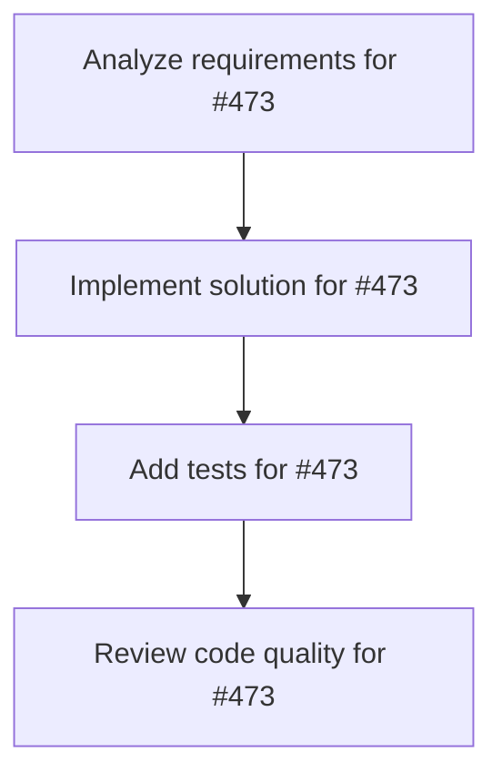

# Plans for Issue #473

**Title**: [P4-004] API Reference自動生成CI

**URL**: https://github.com/customer-cloud/miyabi-private/issues/473

---

## 📋 Summary

- **Total Tasks**: 4
- **Estimated Duration**: 60 minutes
- **Execution Levels**: 4
- **Has Cycles**: ✅ No

## 📝 Task Breakdown

### 1. Analyze requirements for #473

- **ID**: `task-473-analysis`
- **Type**: Docs
- **Assigned Agent**: IssueAgent
- **Priority**: 0
- **Estimated Duration**: 5 min

**Description**: Analyze issue requirements and create detailed specification

### 2. Implement solution for #473

- **ID**: `task-473-impl`
- **Type**: Docs
- **Assigned Agent**: CodeGenAgent
- **Priority**: 1
- **Estimated Duration**: 30 min
- **Dependencies**: task-473-analysis

**Description**: ## 📋 タスク概要

**タスクID**: P4-004
**Phase**: Phase 4 - ドキュメント整備
**優先度**: **P2 - Medium**
**推定工数**: 4h
**担当Agent**: @deployment-agent

## 🎯 目的

API Referenceを自動生成し、GitHub Pagesに公開する。

## 📝 作業内容

\`.github/workflows/docs.yml\`:
\`\`\`yaml
name: Documentation

on:
  push:
    branches: [main]

jobs:
  docs:
    runs-on: ubuntu-latest
    steps:
      - uses: actions/checkout@v4
      - run: cargo doc --no-deps --all-features
      - uses: peaceiris/actions-gh-pages@v3
        with:
          github_token: \${{ secrets.GITHUB_TOKEN }}
          publish_dir: ./target/doc
\`\`\`

## ✅ 完了条件

- [ ] Docs CI作成
- [ ] GitHub Pages公開
- [ ] READMEにリンク追加

**Phase**: 4/5 | **期限**: Week 11

### 3. Add tests for #473

- **ID**: `task-473-test`
- **Type**: Test
- **Assigned Agent**: CodeGenAgent
- **Priority**: 2
- **Estimated Duration**: 15 min
- **Dependencies**: task-473-impl

**Description**: Create comprehensive test coverage

### 4. Review code quality for #473

- **ID**: `task-473-review`
- **Type**: Refactor
- **Assigned Agent**: ReviewAgent
- **Priority**: 3
- **Estimated Duration**: 10 min
- **Dependencies**: task-473-test

**Description**: Run quality checks and code review

## 🔄 Execution Plan (DAG Levels)

Tasks can be executed in parallel within each level:

### Level 0 (Parallel Execution)

- `task-473-analysis` - Analyze requirements for #473

### Level 1 (Parallel Execution)

- `task-473-impl` - Implement solution for #473

### Level 2 (Parallel Execution)

- `task-473-test` - Add tests for #473

### Level 3 (Parallel Execution)

- `task-473-review` - Review code quality for #473

## 📊 Dependency Graph

## ⏱️ Timeline Estimation

- **Sequential Execution**: 60 minutes (1.0 hours)
- **Parallel Execution (Critical Path)**: 10 minutes (0.2 hours)
- **Estimated Speedup**: 6.0x

---

*Generated by CoordinatorAgent on 2025-10-23 14:15:32 UTC*
