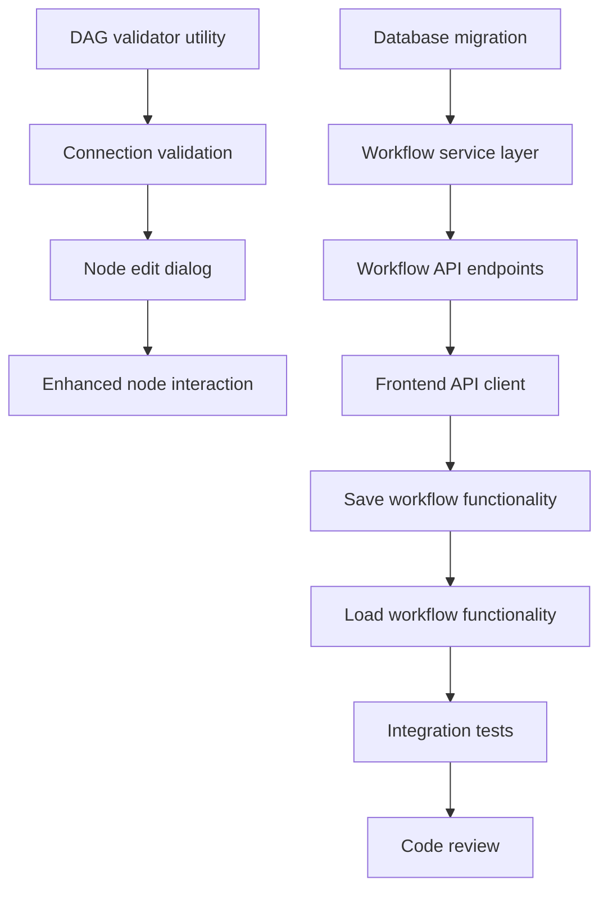

# Plans for Issue #176 (Phase 2 Workflow Editor)

**Title**: 【Phase 2】ワークフローエディタ - React Flowによるビジュアルエディタ実装

**URL**: https://github.com/ShunsukeHayashi/Miyabi/issues/176

---

## 📋 Summary

- **Total Tasks**: 12
- **Estimated Duration**: 17 hours (approximately 2-3 days)
- **Execution Levels**: 5
- **Has Cycles**: ✅ No
- **Milestone**: #34 Super-Aggressive Execution Mode
- **Phase**: Phase 2 (Week 6-9)

## 📊 Current Status

**Phase 2.1** ✅ COMPLETED:
- React Flow integration
- Basic node components (AgentNode, IssueNode, ConditionNode)
- Drag & drop functionality
- Edge connection functionality
- Agent palette sidebar

**Remaining Work**:
- Phase 2.2: DAG validation logic
- Phase 2.3: Enhanced Agent assignment UI
- Phase 2.4: Backend API integration
- Phase 2.5: Save/Load functionality

---

## 📝 Task Breakdown

### 1. DAG validator utility implementation

- **ID**: `task-176-dag-validator`
- **Type**: Feature
- **Assigned Agent**: CodeGenAgent
- **Priority**: 0
- **Estimated Duration**: 90 min

**Description**: Implement DAG validation logic with cycle detection and topological sort

**Files**:
- `miyabi-web/src/lib/dag-validator.ts` (new)

**Requirements**:
- Cycle detection using DFS (Depth-First Search)
- Topological sort using Kahn's algorithm
- Validate React Flow nodes/edges structure
- Return validation result with error details

---

### 2. Connection validation in workflow editor

- **ID**: `task-176-connection-validation`
- **Type**: Feature
- **Assigned Agent**: CodeGenAgent
- **Priority**: 1
- **Estimated Duration**: 60 min
- **Dependencies**: task-176-dag-validator

**Description**: Add real-time connection validation when user creates edges

**Files**:
- `miyabi-web/src/app/dashboard/workflows/create/page.tsx` (enhance)

**Requirements**:
- Validate on edge connection
- Show error toast on cycle detection
- Highlight problematic nodes/edges
- Prevent invalid connections

---

### 3. Node edit dialog component

- **ID**: `task-176-node-edit-dialog`
- **Type**: Feature
- **Assigned Agent**: CodeGenAgent
- **Priority**: 2
- **Estimated Duration**: 120 min
- **Dependencies**: task-176-connection-validation

**Description**: Create dialog for editing node properties

**Files**:
- `miyabi-web/src/components/workflow/NodeEditDialog.tsx` (new)

**Requirements**:
- Agent type selection dropdown
- Issue number input (for Issue nodes)
- Description textarea
- Dependency list input
- Save/Cancel buttons
- Form validation

---

### 4. Enhanced node interaction

- **ID**: `task-176-node-interaction`
- **Type**: Feature
- **Assigned Agent**: CodeGenAgent
- **Priority**: 3
- **Estimated Duration**: 60 min
- **Dependencies**: task-176-node-edit-dialog

**Description**: Add double-click to edit, right-click menu, delete functionality

**Files**:
- `miyabi-web/src/app/dashboard/workflows/create/page.tsx` (enhance)
- `miyabi-web/src/components/workflow/AgentNode.tsx` (enhance)

**Requirements**:
- Double-click to open edit dialog
- Right-click context menu (Edit, Delete, Duplicate)
- Keyboard shortcuts (Delete key)
- Node selection state management

---

### 5. Backend database migration

- **ID**: `task-176-db-migration`
- **Type**: Feature
- **Assigned Agent**: CodeGenAgent
- **Priority**: 4
- **Estimated Duration**: 30 min

**Description**: Create database migration for workflows table

**Files**:
- `crates/miyabi-web-api/migrations/002_workflows_extended.sql` (new)

**Requirements**:
- Extend workflows table if needed
- Add indexes for performance
- Add constraints for data integrity

---

### 6. Workflow service layer

- **ID**: `task-176-workflow-service`
- **Type**: Feature
- **Assigned Agent**: CodeGenAgent
- **Priority**: 5
- **Estimated Duration**: 90 min
- **Dependencies**: task-176-db-migration

**Description**: Implement Rust service layer for workflow CRUD operations

**Files**:
- `crates/miyabi-web-api/src/services/workflow_service.rs` (new)
- `crates/miyabi-web-api/src/models.rs` (enhance)

**Requirements**:
- Create workflow
- Get workflow by ID
- Update workflow
- Delete workflow
- List workflows with pagination
- Validate workflow definition (DAG check in Rust)

---

### 7. Workflow API endpoints

- **ID**: `task-176-api-endpoints`
- **Type**: Feature
- **Assigned Agent**: CodeGenAgent
- **Priority**: 6
- **Estimated Duration**: 90 min
- **Dependencies**: task-176-workflow-service

**Description**: Implement REST API endpoints for workflows

**Files**:
- `crates/miyabi-web-api/src/routes/workflows.rs` (new)
- `crates/miyabi-web-api/src/main.rs` (enhance - add routes)

**Requirements**:
- POST /api/workflows - Create workflow
- GET /api/workflows/:id - Get workflow
- PUT /api/workflows/:id - Update workflow
- DELETE /api/workflows/:id - Delete workflow
- GET /api/workflows - List workflows
- Authentication middleware
- Request/response validation

---

### 8. Frontend API client

- **ID**: `task-176-api-client`
- **Type**: Feature
- **Assigned Agent**: CodeGenAgent
- **Priority**: 7
- **Estimated Duration**: 60 min
- **Dependencies**: task-176-api-endpoints

**Description**: Create TypeScript API client for workflow endpoints

**Files**:
- `miyabi-web/src/lib/api/workflows.ts` (new)
- `miyabi-web/src/types/workflow.ts` (new)

**Requirements**:
- Type-safe API client using axios
- Error handling
- Request/response type definitions
- Authentication token handling

---

### 9. Save workflow functionality

- **ID**: `task-176-save-workflow`
- **Type**: Feature
- **Assigned Agent**: CodeGenAgent
- **Priority**: 8
- **Estimated Duration**: 60 min
- **Dependencies**: task-176-api-client

**Description**: Replace localStorage with API integration for save

**Files**:
- `miyabi-web/src/app/dashboard/workflows/create/page.tsx` (enhance)

**Requirements**:
- Call POST /api/workflows on save
- Show success/error notifications
- Handle validation errors
- Redirect to workflow list on success

---

### 10. Load workflow functionality

- **ID**: `task-176-load-workflow`
- **Type**: Feature
- **Assigned Agent**: CodeGenAgent
- **Priority**: 9
- **Estimated Duration**: 60 min
- **Dependencies**: task-176-save-workflow

**Description**: Implement workflow loading and editing

**Files**:
- `miyabi-web/src/app/dashboard/workflows/[id]/edit/page.tsx` (enhance)

**Requirements**:
- Fetch workflow from API
- Populate React Flow state
- Handle loading states
- Handle not found errors

---

### 11. Integration tests

- **ID**: `task-176-tests`
- **Type**: Test
- **Assigned Agent**: CodeGenAgent
- **Priority**: 10
- **Estimated Duration**: 60 min
- **Dependencies**: task-176-load-workflow

**Description**: Write comprehensive integration tests

**Files**:
- `crates/miyabi-web-api/tests/workflow_api_test.rs` (new)
- `miyabi-web/src/lib/__tests__/dag-validator.test.ts` (new)

**Requirements**:
- Rust: API endpoint tests
- Rust: DAG validation tests
- TypeScript: DAG validator unit tests
- TypeScript: Component tests for NodeEditDialog

---

### 12. Code review and quality check

- **ID**: `task-176-review`
- **Type**: Refactor
- **Assigned Agent**: ReviewAgent
- **Priority**: 11
- **Estimated Duration**: 30 min
- **Dependencies**: task-176-tests

**Description**: Final quality assurance

**Requirements**:
- Code review (100-point scoring)
- Security audit
- Performance check
- Documentation review
- Clippy warnings check
- ESLint check

---

## 🔄 Execution Plan (DAG Levels)

### Level 0 (Parallel Execution - 1 task)

- `task-176-dag-validator` - DAG validator utility implementation (90min)

### Level 1 (Parallel Execution - 1 task)

- `task-176-connection-validation` - Connection validation in workflow editor (60min)

### Level 2 (Parallel Execution - 1 task)

- `task-176-node-edit-dialog` - Node edit dialog component (120min)

### Level 3 (Parallel Execution - 2 tasks)

- `task-176-node-interaction` - Enhanced node interaction (60min)
- `task-176-db-migration` - Backend database migration (30min)

### Level 4 (Sequential Execution - 7 tasks)

- `task-176-workflow-service` - Workflow service layer (90min)
- `task-176-api-endpoints` - Workflow API endpoints (90min)
- `task-176-api-client` - Frontend API client (60min)
- `task-176-save-workflow` - Save workflow functionality (60min)
- `task-176-load-workflow` - Load workflow functionality (60min)
- `task-176-tests` - Integration tests (60min)
- `task-176-review` - Code review and quality check (30min)

---

## 📊 Dependency Graph

---

## ⏱️ Timeline Estimation

- **Sequential Execution**: 1020 minutes (17 hours)
- **With Parallel Execution (Critical Path)**: 930 minutes (15.5 hours)
- **Estimated Speedup**: 1.1x

---

## 🎯 Success Criteria

- ✅ Create workflow with 3+ tasks
- ✅ Cycle detection working correctly
- ✅ Save/Load from PostgreSQL database
- ✅ Agent assignment UI functional
- ✅ All tests passing (Rust + TypeScript)
- ✅ Clippy warnings: 0
- ✅ ESLint errors: 0
- ✅ ReviewAgent score: 85+

---

## 📂 Implementation Files Summary

**Frontend (TypeScript/React)**:
- `miyabi-web/src/lib/dag-validator.ts` (new)
- `miyabi-web/src/lib/api/workflows.ts` (new)
- `miyabi-web/src/types/workflow.ts` (new)
- `miyabi-web/src/components/workflow/NodeEditDialog.tsx` (new)
- `miyabi-web/src/app/dashboard/workflows/create/page.tsx` (enhance)
- `miyabi-web/src/app/dashboard/workflows/[id]/edit/page.tsx` (enhance)
- `miyabi-web/src/components/workflow/AgentNode.tsx` (enhance)
- `miyabi-web/src/lib/__tests__/dag-validator.test.ts` (new)

**Backend (Rust)**:
- `crates/miyabi-web-api/migrations/002_workflows_extended.sql` (new)
- `crates/miyabi-web-api/src/services/workflow_service.rs` (new)
- `crates/miyabi-web-api/src/routes/workflows.rs` (new)
- `crates/miyabi-web-api/src/models.rs` (enhance)
- `crates/miyabi-web-api/src/main.rs` (enhance)
- `crates/miyabi-web-api/tests/workflow_api_test.rs` (new)

---

*Generated by CoordinatorAgent on 2025-10-24*
*Issue: #176 - Phase 2 Workflow Editor*
