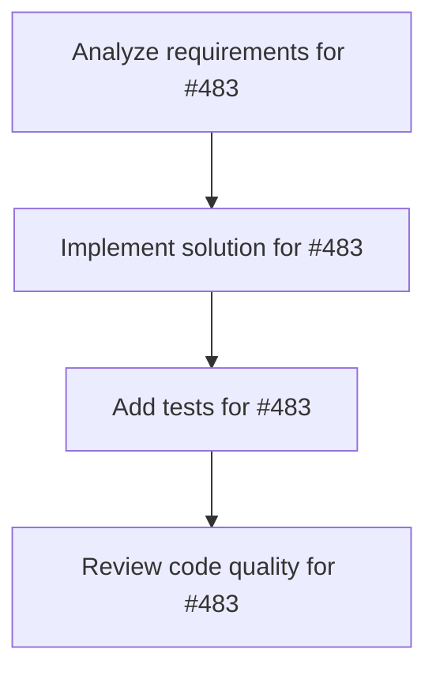

# Plans for Issue #483

**Title**: [P5-006] エラーハンドリング統一

**URL**: https://github.com/customer-cloud/miyabi-private/issues/483

---

## 📋 Summary

- **Total Tasks**: 4
- **Estimated Duration**: 60 minutes
- **Execution Levels**: 4
- **Has Cycles**: ✅ No

## 📝 Task Breakdown

### 1. Analyze requirements for #483

- **ID**: `task-483-analysis`
- **Type**: Docs
- **Assigned Agent**: IssueAgent
- **Priority**: 0
- **Estimated Duration**: 5 min

**Description**: Analyze issue requirements and create detailed specification

### 2. Implement solution for #483

- **ID**: `task-483-impl`
- **Type**: Feature
- **Assigned Agent**: CodeGenAgent
- **Priority**: 1
- **Estimated Duration**: 30 min
- **Dependencies**: task-483-analysis

**Description**: ## 📋 タスク概要

**タスクID**: P5-006
**Phase**: Phase 5 - アーキテクチャ改善
**優先度**: **P2 - Medium**
**推定工数**: 8h
**担当Agent**: @codegen-agent

## 🎯 目的

エラーハンドリングを統一し、一貫性を向上させる。

## 📝 作業内容

```rust
use thiserror::Error;

#[derive(Error, Debug)]
pub enum MiyabiError {
    #[error("Agent error: {0}")]
    Agent(String),

    #[error("IO error: {0}")]
    Io(#[from] std::io::Error),
}
```

## ✅ 完了条件

- [ ] エラー型統一
- [ ] 全エラーハンドリング更新
- [ ] ドキュメント更新

**Phase**: 5/5 | **期限**: Week 16

### 3. Add tests for #483

- **ID**: `task-483-test`
- **Type**: Test
- **Assigned Agent**: CodeGenAgent
- **Priority**: 2
- **Estimated Duration**: 15 min
- **Dependencies**: task-483-impl

**Description**: Create comprehensive test coverage

### 4. Review code quality for #483

- **ID**: `task-483-review`
- **Type**: Refactor
- **Assigned Agent**: ReviewAgent
- **Priority**: 3
- **Estimated Duration**: 10 min
- **Dependencies**: task-483-test

**Description**: Run quality checks and code review

## 🔄 Execution Plan (DAG Levels)

Tasks can be executed in parallel within each level:

### Level 0 (Parallel Execution)

- `task-483-analysis` - Analyze requirements for #483

### Level 1 (Parallel Execution)

- `task-483-impl` - Implement solution for #483

### Level 2 (Parallel Execution)

- `task-483-test` - Add tests for #483

### Level 3 (Parallel Execution)

- `task-483-review` - Review code quality for #483

## 📊 Dependency Graph



## ⏱️ Timeline Estimation

- **Sequential Execution**: 60 minutes (1.0 hours)
- **Parallel Execution (Critical Path)**: 10 minutes (0.2 hours)
- **Estimated Speedup**: 6.0x

---

*Generated by CoordinatorAgent on 2025-10-23 13:42:02 UTC*
