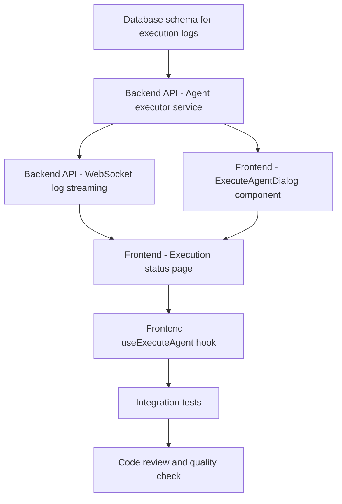

# Plans for Issue #428

**Title**: 【Phase 3】Agent実行UI - 実行ダイアログと進捗表示（MVP完成）

**URL**: https://github.com/customer-cloud/miyabi-private/issues/428

---

## 📋 Summary

- **Total Tasks**: 8
- **Estimated Duration**: 240 minutes (4 hours)
- **Execution Levels**: 4
- **Has Cycles**: ✅ No
- **MVP Completion**: 🎯 Phase 3 Final Milestone

## 📝 Task Breakdown

### 1. Database schema for execution logs

- **ID**: `task-428-db-schema`
- **Type**: Feature
- **Assigned Agent**: CodeGenAgent
- **Priority**: 0
- **Estimated Duration**: 20 min

**Description**: Create database migration for execution logs table to store real-time log output

### 2. Backend API - Agent executor service

- **ID**: `task-428-backend-service`
- **Type**: Feature
- **Assigned Agent**: CodeGenAgent
- **Priority**: 1
- **Estimated Duration**: 60 min
- **Dependencies**: task-428-db-schema

**Description**: Implement agent execution service with miyabi-a2a integration:
- Async execution with Tokio spawn
- Status tracking (pending → running → completed/failed)
- Log streaming to database
- Execution result storage

### 3. Backend API - WebSocket log streaming

- **ID**: `task-428-websocket`
- **Type**: Feature
- **Assigned Agent**: CodeGenAgent
- **Priority**: 2
- **Estimated Duration**: 40 min
- **Dependencies**: task-428-backend-service

**Description**: WebSocket endpoint for real-time log streaming:
- Subscribe to execution logs by execution_id
- Push new log lines as they arrive
- Handle connection lifecycle

### 4. Frontend - ExecuteAgentDialog component

- **ID**: `task-428-dialog`
- **Type**: Feature
- **Assigned Agent**: CodeGenAgent
- **Priority**: 3
- **Estimated Duration**: 40 min
- **Dependencies**: task-428-backend-service

**Description**: React component for agent execution dialog:
- Issue selection dropdown
- Agent type selection
- Options: Worktree, Auto PR, Slack notification
- Form validation
- Execute button with loading state

### 5. Frontend - Execution status page

- **ID**: `task-428-status-page`
- **Type**: Feature
- **Assigned Agent**: CodeGenAgent
- **Priority**: 4
- **Estimated Duration**: 50 min
- **Dependencies**: task-428-websocket, task-428-dialog

**Description**: `/executions/:id` page with:
- Status indicator (pending, running, completed, failed)
- Progress bar
- Elapsed time counter
- Real-time log display with auto-scroll
- Log filter controls

### 6. Frontend - useExecuteAgent hook

- **ID**: `task-428-hook`
- **Type**: Feature
- **Assigned Agent**: CodeGenAgent
- **Priority**: 5
- **Estimated Duration**: 20 min
- **Dependencies**: task-428-status-page

**Description**: Custom React hook for agent execution:
- API call wrapper
- Loading/error state management
- Redirect to execution status page

### 7. Integration tests

- **ID**: `task-428-tests`
- **Type**: Test
- **Assigned Agent**: CodeGenAgent
- **Priority**: 6
- **Estimated Duration**: 30 min
- **Dependencies**: task-428-hook

**Description**: End-to-end integration tests:
- Agent execution flow
- WebSocket connection
- Log streaming
- Status updates

### 8. Code review and quality check

- **ID**: `task-428-review`
- **Type**: Refactor
- **Assigned Agent**: ReviewAgent
- **Priority**: 7
- **Estimated Duration**: 20 min
- **Dependencies**: task-428-tests

**Description**: Final quality assurance:
- Code review (100-point scoring)
- Security audit
- Performance check
- Documentation review

## 🔄 Execution Plan (DAG Levels)

Tasks can be executed in parallel within each level:

### Level 0 (Parallel Execution)

- `task-428-db-schema` - Database schema for execution logs

### Level 1 (Parallel Execution)

- `task-428-backend-service` - Backend API - Agent executor service

### Level 2 (Parallel Execution)

- `task-428-websocket` - Backend API - WebSocket log streaming

### Level 3 (Sequential Execution)

- `task-428-dialog` - Frontend - ExecuteAgentDialog component
- `task-428-status-page` - Frontend - Execution status page (depends on websocket)
- `task-428-hook` - Frontend - useExecuteAgent hook
- `task-428-tests` - Integration tests
- `task-428-review` - Code review

## 📊 Dependency Graph

## ⏱️ Timeline Estimation

- **Sequential Execution**: 280 minutes (4.7 hours)
- **Parallel Execution (Critical Path)**: 280 minutes (4.7 hours)
- **Estimated Speedup**: 1.0x (mostly sequential due to dependencies)

## 🎯 Success Criteria

- ✅ Agent execution dialog functional from dashboard
- ✅ Real-time status updates on execution page
- ✅ WebSocket log streaming working
- ✅ miyabi-a2a integration confirmed
- ✅ All tests passing
- ✅ **MVP COMPLETE - Ready for 9-company demo**

## 📂 Implementation Files

**Backend (Rust)**:
- `crates/miyabi-web-api/migrations/00X_execution_logs.sql`
- `crates/miyabi-web-api/src/services/agent_executor.rs`
- `crates/miyabi-web-api/src/routes/agents.rs` (extend)
- `crates/miyabi-web-api/src/routes/websocket.rs` (extend)
- `crates/miyabi-web-api/src/models.rs` (extend)

**Frontend (TypeScript/React)**:
- `miyabi-web/src/components/agent/ExecuteAgentDialog.tsx`
- `miyabi-web/src/app/dashboard/executions/[id]/page.tsx`
- `miyabi-web/src/hooks/useExecuteAgent.ts`
- `miyabi-web/src/lib/websocket.ts`

**Tests**:
- `crates/miyabi-web-api/tests/agent_execution_test.rs`

---

*Generated by CoordinatorAgent on 2025-10-24*
