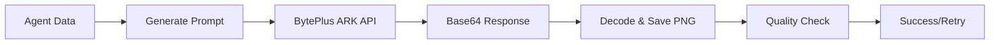

# MIYABI TCG Card Generation - Complete Package

## 📦 What's Included

I've created a complete system to generate all 19 missing MIYABI TCG cards using BytePlus ARK API.

### Files Created

| File | Purpose | Location |
|------|---------|----------|
| **generate_tcg_cards.py** | Main generation script | `scripts/` |
| **check_tcg_env.py** | Environment checker | `scripts/` |
| **verify_cards.py** | Card verification tool | `scripts/` |
| **README_TCG_GENERATION.md** | Complete usage guide | `scripts/` |
| **TCG_GENERATION_SUMMARY.md** | Detailed summary | `scripts/` |
| **CARD_DESIGN_SPEC.md** | Design specifications | `scripts/` |
| **VERIFICATION_CHECKLIST.md** | Manual checklist | `scripts/` |
| **QUICK_START_TCG_GENERATION.md** | Quick start guide | Root directory |

## 🚀 Quick Start (3 Steps)

### 1. Verify Environment
```bash
cd /Users/shunsuke/Dev/01-miyabi/_core/miyabi-private
python3 scripts/check_tcg_env.py
```

### 2. Set API Key (if needed)
```bash
export BYTEPLUS_API_KEY="your-api-key-here"
```

### 3. Generate Cards
```bash
python3 scripts/generate_tcg_cards.py
```

**Expected Time**: 40-60 seconds
**Output**: 19 high-quality PNG cards

## 📊 Current Status

### Existing Cards (5/24)
- ✅ しきるん (Shikiroon) - CoordinatorAgent - SSR
- ✅ つくるん (Tsukuroon) - CodeGenAgent - SR
- ✅ めだまん (Medaman) - ReviewAgent - UR
- ✅ みつけるん (Mitsukeroon) - IssueAgent - R
- ✅ まとめるん (Matomeroon) - PRAgent - SR

### Cards to Generate (19/24)

#### Coding Agents (2)
- はこぶん (Hakoboon) - DeploymentAgent - SR - Wind
- つなぐん (Tsunagun) - HooksIntegration - R - Tech

#### Business Agents (17)
- あきんどさん (Akindosan) - AIEntrepreneurAgent - SSR - Light
- つくろん (Tsukuron) - ProductConceptAgent - SR - Fire
- かくん (Kakun) - ProductDesignAgent - SR - Water
- みちびきん (Michibikin) - FunnelDesignAgent - SR - Wind
- なりきりん (Narikirin) - PersonaAgent - R - Earth
- じぶんさん (Jibunsan) - SelfAnalysisAgent - R - Dark
- しらべるん (Shiraberoon) - MarketResearchAgent - R - Tech
- ひろめるん (Hiromeroon) - MarketingAgent - SR - Fire
- かくちゃん (Kakuchan) - ContentCreationAgent - SR - Water
- つぶやきん (Tsubuyakin) - SNSStrategyAgent - R - Wind
- どうがん (Dougan) - YouTubeAgent - SR - Fire
- うるん (Uroon) - SalesAgent - SR - Earth
- おきゃくさま (Okyakusama) - CRMAgent - SR - Light
- かぞえるん (Kazoeroon) - AnalyticsAgent - R - Tech
- かきこちゃん (Kakikochan) - NoteAgent - SR - Light
- えがくん (Egakun) - ImageGenAgent - SSR - Fire
- ほのかちゃん (Honokachan) - HonokaAgent - UR - Light

## 🎯 Card Specifications

### Rarity Distribution
- **R (Rare)**: 6 cards - Blue frame
- **SR (Super Rare)**: 12 cards - Silver-blue gradient
- **SSR (Super Super Rare)**: 4 cards - Gold frame
- **UR (Ultra Rare)**: 2 cards - Rainbow holographic

### Technical Specs
- **Resolution**: 1024x1024 pixels
- **Format**: PNG
- **File Size**: 100-200 KB (target)
- **Quality**: High detail, 8k prompt
- **Style**: Cyberpunk anime TCG

### Card Layout
```
┌─────────────────────────────────┐
│ [SSR]  [⚡]  [Lv.45]            │ Top Bar
├─────────────────────────────────┤
│                                 │
│     Character Artwork           │ Center
│     (Anime Cyberpunk)           │
│                                 │
├─────────────────────────────────┤
│ 【キャラ名】タイトル              │ Name Bar
├─────────────────────────────────┤
│ HP ATK DEF SPD | Type           │ Stats
├─────────────────────────────────┤
│ 【スキル名】                     │ Skill Box
│ スキル効果の説明                 │
├─────────────────────────────────┤
│ No.XXX / 1st Ed | →EX | © 2025 │ Bottom
└─────────────────────────────────┘
```

## 🔧 How It Works

### Generation Pipeline



### Key Features

1. **Automatic Rate Limiting**: 2-second delay between API calls
2. **Skip Existing**: Won't regenerate existing cards
3. **Error Handling**: Retries on failure, detailed error messages
4. **Quality Verification**: File size and format checks
5. **Progress Tracking**: Real-time status updates
6. **Results JSON**: Complete generation log

## 📋 Workflow

### Full Workflow

```bash
# 1. Check environment
python3 scripts/check_tcg_env.py

# 2. Generate cards (if environment OK)
python3 scripts/generate_tcg_cards.py

# 3. Verify generated cards
python3 scripts/verify_cards.py

# 4. Manual inspection (optional)
open .claude/agents/character-images/unified-tcg-cards/

# 5. Commit to repository
git add .claude/agents/character-images/unified-tcg-cards/*.png
git commit -m "feat(agents): Add 19 MIYABI TCG cards completing 24-card set"
```

## 📁 Output Structure

```
.claude/agents/character-images/unified-tcg-cards/
├── shikiroon_unified_SSR.png          (Existing)
├── tsukuroon_unified_SR.png           (Existing)
├── medaman_unified_UR.png             (Existing)
├── mitsukeroon_unified_R.png          (Existing)
├── matomeroon_unified_SR.png          (Existing)
├── hakoboon_unified_SR.png            (New)
├── tsunagun_unified_R.png             (New)
├── akindosan_unified_SSR.png          (New)
├── tsukuron_product_unified_SR.png    (New)
├── kakun_unified_SR.png               (New)
├── michibikin_unified_SR.png          (New)
├── narikirin_unified_R.png            (New)
├── jibunsan_unified_R.png             (New)
├── shiraberoon_unified_R.png          (New)
├── hiromeroon_unified_SR.png          (New)
├── kakuchan_unified_SR.png            (New)
├── tsubuyakin_unified_R.png           (New)
├── dougan_unified_SR.png              (New)
├── uroon_unified_SR.png               (New)
├── okyakusama_unified_SR.png          (New)
├── kazoeroon_unified_R.png            (New)
├── kakikochan_unified_SR.png          (New)
├── egakun_unified_SSR.png             (New)
├── honokachan_unified_UR.png          (New)
└── generation_results.json            (Metadata)
```

## 🎨 Design Philosophy

### Based on Reference Cards

The generation prompts are carefully crafted to match:
- **shikiroon_unified_SSR.png**: Gold frame, professional TCG layout
- **tsukuroon_unified_SR.png**: Silver-blue frame, coding theme

### Style Consistency

- **Background**: Cyberpunk neon cityscape
- **Character**: Anime-style illustration, action/professional pose
- **Frame**: Rarity-specific colors and effects
- **Typography**: Clean, readable Japanese + English
- **Stats**: Balanced for game mechanics

## 💰 Cost Estimate

- **API Model**: seedream-4-0-250828
- **Calls**: 19 images
- **Resolution**: 1024x1024
- **Estimated Cost**: ~$0.20-0.40 USD total

## 🐛 Troubleshooting

### Common Issues

| Issue | Solution |
|-------|----------|
| API Key Error | `export BYTEPLUS_API_KEY="your-key"` |
| Module Not Found | `pip install requests` |
| Rate Limit Hit | Wait 60 seconds, retry |
| Low Quality Image | Check prompt, regenerate |
| File Too Large | Use compression tools |

### Quick Fixes

```bash
# Check API key
echo $BYTEPLUS_API_KEY

# Install dependencies
pip install requests Pillow

# Regenerate specific card (delete first)
rm .claude/agents/character-images/unified-tcg-cards/hakoboon_unified_SR.png
python3 scripts/generate_tcg_cards.py
```

## 📚 Documentation Files

### For Users
- **QUICK_START_TCG_GENERATION.md**: Fast 3-step guide
- **README_TCG_GENERATION.md**: Complete usage documentation

### For Developers
- **TCG_GENERATION_SUMMARY.md**: Technical details and specs
- **CARD_DESIGN_SPEC.md**: Design guidelines and layout

### For QA
- **VERIFICATION_CHECKLIST.md**: Manual verification guide
- **verify_cards.py**: Automated verification script

## ✅ Success Criteria

Generation is successful when:

- [ ] All 19 new cards generated (24 total)
- [ ] All files are 1024x1024 PNG
- [ ] File sizes are 50-500 KB
- [ ] No API errors in results JSON
- [ ] Visual quality matches reference cards
- [ ] All card elements visible and readable
- [ ] Rarity distribution correct (6R, 12SR, 4SSR, 2UR)

## 🎉 Next Steps After Generation

1. **Visual Review**: Open all cards and spot-check quality
2. **Verification**: Run `python3 scripts/verify_cards.py`
3. **Regeneration**: Delete and regenerate any low-quality cards
4. **Documentation**: Update agent gallery/showcase
5. **Commit**: Add to git repository
6. **Deploy**: Upload to website/game platform
7. **Announce**: Share on social media/community

## 📞 Support & Resources

- **BytePlus ARK Docs**: https://www.byteplus.com/docs/
- **Script Location**: `/Users/shunsuke/Dev/01-miyabi/_core/miyabi-private/scripts/`
- **Agent Specs**: `.claude/agents/AGENT_CHARACTERS.md`
- **ImageGenAgent Spec**: `.claude/agents/specs/coding/imagegen-agent.md`

## 🏆 Credits

- **API**: BytePlus ARK (seedream-4-0-250828)
- **Design**: MIYABI TCG Card System
- **Characters**: 24 MIYABI Agents
- **Style**: Cyberpunk Anime TCG

---

## 🚀 Ready to Generate?

Just run:
```bash
cd /Users/shunsuke/Dev/01-miyabi/_core/miyabi-private
python3 scripts/generate_tcg_cards.py
```

**Estimated Time**: 40-60 seconds
**Expected Output**: 19 beautiful TCG cards! 🎨✨

---

**Package Version**: 1.0
**Created**: 2025-11-30
**Status**: Ready for Production
**Total Cards**: 24 (5 existing + 19 new)
