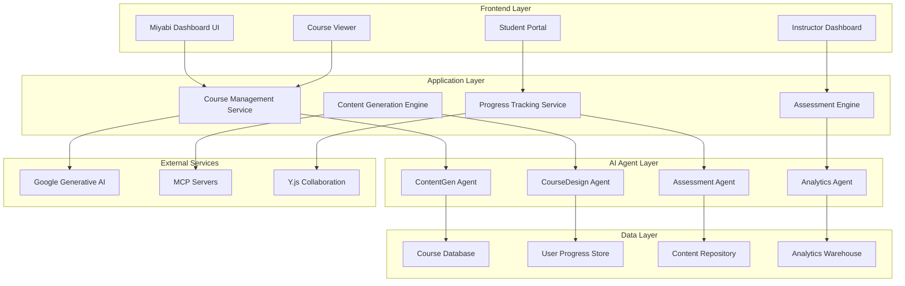
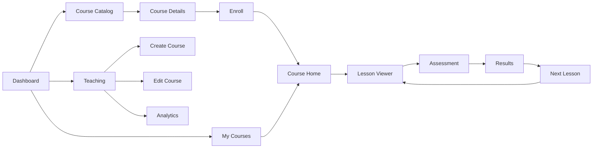

# AI Course Functionality - Comprehensive Planning Specification

**Version**: 1.0.0
**Date**: 2026-01-03
**Project**: Miyabi Dashboard - AI Course Integration
**Author**: Miyabi AI Development Team

---

## 🎯 Executive Summary

This document outlines the comprehensive specification for integrating AI-powered course generation, management, and delivery capabilities into the Miyabi Dashboard platform. The system will leverage the existing 21 AI agents and 28 MCP servers to create a fully autonomous educational content platform.

### Vision Statement
Transform Miyabi Dashboard into a comprehensive AI-powered learning platform that automatically generates, curates, and delivers personalized educational content while maintaining the existing agent orchestration capabilities.

---

## 📋 Table of Contents

1. [Project Overview](#project-overview)
2. [Technical Architecture](#technical-architecture)
3. [Core Features](#core-features)
4. [User Experience Design](#user-experience-design)
5. [AI Integration Strategy](#ai-integration-strategy)
6. [Implementation Phases](#implementation-phases)
7. [Infrastructure Requirements](#infrastructure-requirements)
8. [Security & Compliance](#security--compliance)

---

## 🏗️ Project Overview

### Current System Analysis

**Existing Infrastructure:**
- Next.js 14 + TypeScript + Tailwind CSS
- Google Generative AI integration
- Real-time collaboration (Y.js + WebSocket)
- 21 specialized AI agents
- 28 MCP servers
- Error monitoring (Sentry)
- Cloud deployment (S3/CloudFront)

**Integration Points:**
- Agent orchestration system
- Real-time dashboard
- MCP server ecosystem
- Google Generative AI

### Scope Definition

**In Scope:**
- AI-powered course content generation
- Interactive course delivery system
- Student progress tracking and analytics
- Integration with existing agent ecosystem
- Real-time collaborative learning features
- Automated assessment and feedback

**Out of Scope:**
- Video hosting infrastructure
- Payment processing system
- Mobile native applications (Phase 1)
- Third-party LMS integrations (Phase 1)

---

## 🏛️ Technical Architecture

### System Architecture Overview



### Component Specifications

#### 1. Course Management Service
**Responsibility**: Core course CRUD operations, enrollment management
**Technology**: TypeScript + Next.js API Routes
**Database**: PostgreSQL + Prisma ORM
**Key Features**:
- Course creation and editing
- Student enrollment management
- Content versioning
- Permission management

#### 2. Content Generation Engine
**Responsibility**: AI-powered content creation and curation
**Technology**: Google Generative AI + Custom agents
**Integration**: MCP servers for content enhancement
**Key Features**:
- Automatic lesson generation
- Interactive exercise creation
- Multimedia content suggestion
- Adaptive content modification

#### 3. Progress Tracking Service
**Responsibility**: Real-time student progress monitoring
**Technology**: Y.js + WebSocket + IndexedDB
**Storage**: Time-series database (InfluxDB)
**Key Features**:
- Real-time progress updates
- Learning analytics
- Completion tracking
- Performance insights

#### 4. Assessment Engine
**Responsibility**: Automated testing and feedback
**Technology**: TypeScript + AI assessment agents
**Integration**: Natural language processing
**Key Features**:
- Dynamic quiz generation
- Automated grading
- Personalized feedback
- Adaptive difficulty

---

## 🚀 Core Features

### Phase 1: Foundation (Weeks 1-4)

#### 1.1 Course Creation System
**User Stories:**
- As an instructor, I can create a new course with AI assistance
- As an instructor, I can organize content into modules and lessons
- As an instructor, I can preview generated content before publishing

**Technical Requirements:**
- Course metadata management (title, description, tags, difficulty)
- Hierarchical content structure (Course → Module → Lesson → Section)
- AI-assisted content suggestion and generation
- Version control for course content
- Draft/published state management

**Acceptance Criteria:**
- [ ] Create course with basic metadata
- [ ] AI generates course outline from title/description
- [ ] Instructor can modify AI-generated content
- [ ] Preview mode shows student view
- [ ] Save draft and publish workflow

#### 1.2 AI Content Generation
**User Stories:**
- As an instructor, I can generate lesson content from a topic outline
- As an instructor, I can create interactive exercises automatically
- As an instructor, I can customize AI-generated content

**Technical Requirements:**
- Integration with Google Generative AI
- Prompt engineering for educational content
- Content type generation (text, quizzes, exercises, examples)
- Customizable generation parameters
- Content quality validation

**Acceptance Criteria:**
- [ ] Generate lesson content from topic keywords
- [ ] Create multiple choice questions automatically
- [ ] Generate code examples for programming topics
- [ ] Produce explanatory diagrams and flowcharts
- [ ] Validate content accuracy and appropriateness

#### 1.3 Student Course Interface
**User Stories:**
- As a student, I can browse and enroll in available courses
- As a student, I can navigate through course content sequentially
- As a student, I can track my progress through the course

**Technical Requirements:**
- Course catalog with search and filtering
- Sequential navigation with progress indicators
- Bookmark and note-taking functionality
- Responsive design for various devices
- Offline content caching

**Acceptance Criteria:**
- [ ] Display course catalog with metadata
- [ ] Enroll in courses with progress tracking
- [ ] Navigate lessons with previous/next controls
- [ ] Show progress indicators and completion status
- [ ] Save personal notes and bookmarks

### Phase 2: Intelligence (Weeks 5-8)

#### 2.1 Adaptive Learning System
**User Stories:**
- As a student, I receive personalized content based on my learning pace
- As a student, I get recommended additional resources when struggling
- As an instructor, I can see which students need additional support

**Technical Requirements:**
- Machine learning-based recommendation engine
- Real-time performance analysis
- Adaptive content delivery
- Learning path optimization
- Intervention triggers

**Acceptance Criteria:**
- [ ] Adjust content difficulty based on student performance
- [ ] Recommend supplementary materials for struggling students
- [ ] Identify students at risk of dropping out
- [ ] Optimize learning path based on individual progress
- [ ] Provide personalized study schedules

#### 2.2 Interactive Assessment System
**User Stories:**
- As a student, I can take quizzes with immediate feedback
- As a student, I can practice with interactive coding exercises
- As an instructor, I can create custom assessment rubrics

**Technical Requirements:**
- Dynamic quiz generation with multiple question types
- Code execution environment for programming assessments
- Automated grading with detailed feedback
- Plagiarism detection for written assignments
- Customizable rubrics and grading criteria

**Acceptance Criteria:**
- [ ] Generate quizzes from lesson content automatically
- [ ] Support multiple question types (MC, fill-in, essay, code)
- [ ] Execute and grade programming exercises safely
- [ ] Provide immediate feedback with explanations
- [ ] Allow retakes with different question sets

#### 2.3 Real-time Collaboration Features
**User Stories:**
- As a student, I can participate in group study sessions
- As a student, I can ask questions and get help from peers
- As an instructor, I can moderate discussions and provide guidance

**Technical Requirements:**
- Y.js integration for real-time collaboration
- WebSocket connections for instant messaging
- Voice/video integration for virtual study rooms
- Moderation tools for instructors
- Anonymous participation options

**Acceptance Criteria:**
- [ ] Real-time shared note-taking during lessons
- [ ] Instant messaging for course participants
- [ ] Virtual study rooms with voice/video
- [ ] Q&A forums with voting and best answers
- [ ] Instructor oversight and moderation tools

### Phase 3: Analytics (Weeks 9-12)

#### 3.1 Learning Analytics Dashboard
**User Stories:**
- As an instructor, I can view detailed analytics about student performance
- As a student, I can track my learning progress and identify weak areas
- As an administrator, I can generate reports on course effectiveness

**Technical Requirements:**
- Real-time analytics processing
- Interactive data visualizations
- Predictive analytics for student success
- Comparative performance analysis
- Exportable reports and insights

**Acceptance Criteria:**
- [ ] Real-time dashboard showing student engagement
- [ ] Performance trends and progress tracking
- [ ] Identification of difficult course sections
- [ ] Predictive models for student success
- [ ] Exportable analytics reports

#### 3.2 AI-Powered Insights
**User Stories:**
- As an instructor, I receive AI recommendations for course improvements
- As a student, I get personalized study suggestions
- As a content creator, I can optimize content based on user feedback

**Technical Requirements:**
- Machine learning models for pattern recognition
- Natural language processing for feedback analysis
- Automated A/B testing for content optimization
- Sentiment analysis for student satisfaction
- Performance correlation analysis

**Acceptance Criteria:**
- [ ] AI recommendations for course content improvements
- [ ] Automated identification of confusing concepts
- [ ] Personalized study recommendations
- [ ] Content optimization suggestions
- [ ] Student satisfaction prediction

---

## 🎨 User Experience Design

### Design System Integration

**Current Miyabi Design Tokens:**
- Primary: Miyabi Blue (`#667eea`)
- Secondary: Miyabi Purple (`#9f7aea`)
- Accent: Miyabi Green (`#48bb78`)
- Background: Gray 950 (`#0f0f23`)
- Text: White/Gray scale

**New Course-Specific Components:**

#### Course Card Component
```typescript
interface CourseCardProps {
  course: {
    id: string
    title: string
    description: string
    instructor: string
    difficulty: 'beginner' | 'intermediate' | 'advanced'
    duration: number // minutes
    enrollmentCount: number
    rating: number
    tags: string[]
    thumbnail?: string
    progress?: number // for enrolled students
  }
  variant: 'catalog' | 'enrolled' | 'teaching'
  onEnroll?: () => void
  onContinue?: () => void
}
```

#### Progress Indicator Component
```typescript
interface ProgressIndicatorProps {
  totalLessons: number
  completedLessons: number
  currentLesson?: number
  showDetails?: boolean
  size: 'small' | 'medium' | 'large'
}
```

#### Lesson Viewer Component
```typescript
interface LessonViewerProps {
  lesson: {
    id: string
    title: string
    content: LessonContent[]
    exercises: Exercise[]
    resources: Resource[]
    duration: number
  }
  onComplete: () => void
  onBookmark: () => void
  onNote: (note: string) => void
}
```

### Navigation Flow



### Responsive Design Requirements

**Breakpoints:**
- Mobile: 320px - 768px
- Tablet: 768px - 1024px
- Desktop: 1024px+

**Key Responsive Features:**
- Collapsible sidebar navigation
- Adaptive lesson content layout
- Touch-friendly interactive elements
- Optimized video player controls
- Progressive enhancement for advanced features

---

## 🤖 AI Integration Strategy

### Agent Assignment Strategy

#### New Course-Specific Agents

**1. CourseDesigner Agent (しっくん)**
- **Role**: Curriculum design and course structure optimization
- **Capabilities**:
  - Learning objective analysis
  - Course structure recommendation
  - Content sequencing optimization
  - Prerequisite identification
- **Integration**: Works with existing CoordinatorAgent for task orchestration

**2. ContentGenerator Agent (こんてん)**
- **Role**: AI-powered content creation and adaptation
- **Capabilities**:
  - Lesson content generation
  - Exercise creation
  - Example generation
  - Content adaptation for different learning styles
- **Integration**: Extends existing CodeGenAgent capabilities

**3. AssessmentDesigner Agent (あっせ)**
- **Role**: Automated assessment and quiz generation
- **Capabilities**:
  - Question generation from content
  - Rubric creation
  - Automated grading
  - Feedback generation
- **Integration**: Works with ReviewAgent for quality assurance

**4. LearningAnalytics Agent (あなり)**
- **Role**: Student performance analysis and insights
- **Capabilities**:
  - Progress tracking
  - Performance prediction
  - Learning pattern analysis
  - Intervention recommendations
- **Integration**: Extends existing analytics capabilities

**5. AdaptiveLearning Agent (あだぷ)**
- **Role**: Personalized learning path optimization
- **Capabilities**:
  - Content difficulty adjustment
  - Learning path recommendation
  - Remediation suggestions
  - Pacing optimization
- **Integration**: Coordinates with all course agents

#### Enhanced Existing Agents

**Coordinator Agent**:
- Extended to manage course-related task distribution
- Coordinates between new course agents
- Manages real-time collaboration sessions

**Issue Agent**:
- Enhanced to handle course-related issues
- Tracks student support requests
- Manages content quality issues

**Deployment Agent**:
- Extended to handle course content deployment
- Manages course version releases
- Handles content CDN distribution

### MCP Server Integration

#### New Course-Specific MCP Servers

**1. Course Content MCP Server**
- **Endpoints**:
  - `course_create`, `course_update`, `course_delete`
  - `lesson_generate`, `lesson_modify`, `lesson_publish`
  - `content_validate`, `content_optimize`
- **Integration**: Direct integration with ContentGenerator Agent

**2. Learning Analytics MCP Server**
- **Endpoints**:
  - `progress_track`, `progress_analyze`, `progress_predict`
  - `performance_analyze`, `performance_compare`
  - `engagement_track`, `engagement_optimize`
- **Integration**: Powers LearningAnalytics Agent

**3. Assessment MCP Server**
- **Endpoints**:
  - `quiz_generate`, `quiz_grade`, `quiz_analyze`
  - `feedback_generate`, `feedback_personalize`
  - `rubric_create`, `rubric_apply`
- **Integration**: Core functionality for AssessmentDesigner Agent

#### Enhanced Existing MCP Servers

**GitHub MCP Server**:
- Extended to manage course content versioning
- Tracks changes to course materials
- Manages collaborative content development

**Process MCP Server**:
- Enhanced to handle course content processing
- Manages content generation queues
- Monitors assessment execution

---

## 📅 Implementation Phases

### Phase 1: Foundation (4 weeks)

**Week 1: Project Setup & Core Infrastructure**
- [ ] Database schema design and implementation
- [ ] API endpoint structure
- [ ] Basic UI component library for courses
- [ ] Authentication and authorization system
- [ ] Initial MCP server setup

**Week 2: Course Management Core**
- [ ] Course CRUD operations
- [ ] Basic content editor
- [ ] File upload and management
- [ ] User enrollment system
- [ ] Navigation and routing

**Week 3: Content Generation Integration**
- [ ] Google Generative AI integration
- [ ] Basic content generation workflows
- [ ] Content templates and structures
- [ ] AI prompt optimization
- [ ] Content validation systems

**Week 4: Student Interface & Testing**
- [ ] Course catalog interface
- [ ] Lesson viewer component
- [ ] Progress tracking basic implementation
- [ ] End-to-end testing suite
- [ ] Performance optimization

### Phase 2: Intelligence (4 weeks)

**Week 5: AI Agent Development**
- [ ] CourseDesigner Agent implementation
- [ ] ContentGenerator Agent development
- [ ] Agent orchestration integration
- [ ] MCP server agent connections
- [ ] Agent communication protocols

**Week 6: Assessment System**
- [ ] Quiz generation engine
- [ ] Automated grading system
- [ ] Feedback generation
- [ ] Assessment analytics
- [ ] Security and anti-cheating measures

**Week 7: Adaptive Learning**
- [ ] Learning path algorithms
- [ ] Performance analysis engine
- [ ] Content adaptation system
- [ ] Personalization features
- [ ] Recommendation engine

**Week 8: Real-time Features**
- [ ] Y.js collaboration integration
- [ ] Real-time progress updates
- [ ] Live discussion features
- [ ] Notification system
- [ ] WebSocket optimization

### Phase 3: Analytics & Polish (4 weeks)

**Week 9: Analytics Implementation**
- [ ] Learning analytics dashboard
- [ ] Performance reporting system
- [ ] Data visualization components
- [ ] Export functionality
- [ ] Predictive analytics

**Week 10: Advanced Features**
- [ ] Multi-language support
- [ ] Accessibility improvements
- [ ] Mobile optimization
- [ ] Offline functionality
- [ ] Advanced search

**Week 11: Integration & Testing**
- [ ] Full system integration testing
- [ ] Performance optimization
- [ ] Security auditing
- [ ] User acceptance testing
- [ ] Documentation completion

**Week 12: Deployment & Launch**
- [ ] Production deployment
- [ ] Monitoring and alerting setup
- [ ] User onboarding system
- [ ] Support documentation
- [ ] Launch and feedback collection

---

## 🛠️ Infrastructure Requirements

### Database Schema

**Core Tables:**
```sql
-- Courses
CREATE TABLE courses (
  id UUID PRIMARY KEY DEFAULT gen_random_uuid(),
  title VARCHAR(255) NOT NULL,
  description TEXT,
  instructor_id UUID REFERENCES users(id),
  difficulty difficulty_level NOT NULL,
  estimated_duration INTEGER, -- minutes
  is_published BOOLEAN DEFAULT false,
  created_at TIMESTAMP WITH TIME ZONE DEFAULT NOW(),
  updated_at TIMESTAMP WITH TIME ZONE DEFAULT NOW()
);

-- Course Modules
CREATE TABLE course_modules (
  id UUID PRIMARY KEY DEFAULT gen_random_uuid(),
  course_id UUID REFERENCES courses(id) ON DELETE CASCADE,
  title VARCHAR(255) NOT NULL,
  description TEXT,
  order_index INTEGER NOT NULL,
  created_at TIMESTAMP WITH TIME ZONE DEFAULT NOW()
);

-- Lessons
CREATE TABLE lessons (
  id UUID PRIMARY KEY DEFAULT gen_random_uuid(),
  module_id UUID REFERENCES course_modules(id) ON DELETE CASCADE,
  title VARCHAR(255) NOT NULL,
  content JSONB NOT NULL, -- Rich content structure
  duration INTEGER, -- minutes
  order_index INTEGER NOT NULL,
  is_published BOOLEAN DEFAULT false,
  created_at TIMESTAMP WITH TIME ZONE DEFAULT NOW(),
  updated_at TIMESTAMP WITH TIME ZONE DEFAULT NOW()
);

-- Student Progress
CREATE TABLE student_progress (
  id UUID PRIMARY KEY DEFAULT gen_random_uuid(),
  student_id UUID REFERENCES users(id),
  lesson_id UUID REFERENCES lessons(id),
  started_at TIMESTAMP WITH TIME ZONE,
  completed_at TIMESTAMP WITH TIME ZONE,
  time_spent INTEGER, -- seconds
  score DECIMAL(5,2),
  attempts INTEGER DEFAULT 1,
  UNIQUE(student_id, lesson_id)
);

-- Assessments
CREATE TABLE assessments (
  id UUID PRIMARY KEY DEFAULT gen_random_uuid(),
  lesson_id UUID REFERENCES lessons(id),
  title VARCHAR(255) NOT NULL,
  questions JSONB NOT NULL,
  passing_score DECIMAL(5,2) DEFAULT 70.0,
  max_attempts INTEGER DEFAULT 3,
  time_limit INTEGER, -- minutes
  created_at TIMESTAMP WITH TIME ZONE DEFAULT NOW()
);

-- Assessment Attempts
CREATE TABLE assessment_attempts (
  id UUID PRIMARY KEY DEFAULT gen_random_uuid(),
  assessment_id UUID REFERENCES assessments(id),
  student_id UUID REFERENCES users(id),
  answers JSONB NOT NULL,
  score DECIMAL(5,2),
  started_at TIMESTAMP WITH TIME ZONE DEFAULT NOW(),
  completed_at TIMESTAMP WITH TIME ZONE,
  attempt_number INTEGER NOT NULL
);
```

### File Storage Strategy

**Content Storage:**
- **Static Assets**: AWS S3 + CloudFront CDN
- **User Uploads**: S3 with signed URLs
- **Generated Content**: S3 with versioning
- **Temporary Files**: Local storage + cleanup jobs

**File Organization:**
```
s3://miyabi-course-content/
├── courses/{course_id}/
│   ├── assets/
│   ├── thumbnails/
│   └── exports/
├── users/{user_id}/
│   ├── uploads/
│   └── notes/
└── generated/
    ├── content/
    └── assessments/
```

### Caching Strategy

**Redis Cache Layers:**
- **Session Cache**: User sessions and auth tokens
- **Content Cache**: Frequently accessed course content
- **Analytics Cache**: Pre-computed analytics data
- **AI Response Cache**: Generated content responses

**Cache Invalidation:**
- **Content Updates**: Invalidate on course/lesson updates
- **User Progress**: Real-time updates with TTL
- **Analytics**: Scheduled refresh every hour

### Performance Requirements

**Response Time Targets:**
- Page Load: < 2 seconds (95th percentile)
- Content Generation: < 10 seconds (AI assisted)
- Assessment Grading: < 3 seconds
- Progress Updates: < 500ms (real-time)

**Scalability Targets:**
- Concurrent Users: 1,000+
- Courses: 10,000+
- Students per Course: 500+
- Content Generation: 100 requests/minute

**Monitoring:**
- Application Performance Monitoring (APM)
- Real-time error tracking with Sentry
- Database performance monitoring
- AI service usage tracking

---

## 🔒 Security & Compliance

### Data Protection

**Personal Information Handling:**
- **Student Data**: Encrypted at rest and in transit
- **Progress Data**: Anonymizable for analytics
- **Content**: Version-controlled with audit trails
- **Assessments**: Secure storage with integrity checks

**Privacy Controls:**
- **Data Export**: Student can export all personal data
- **Data Deletion**: Complete removal upon request
- **Consent Management**: Granular privacy settings
- **Anonymization**: Option to anonymize progress data

### Authentication & Authorization

**User Roles:**
- **Student**: Enroll, view content, take assessments
- **Instructor**: Create courses, view analytics, moderate
- **Admin**: Full system access, user management
- **Agent**: Automated system access with specific permissions

**Security Measures:**
- **Multi-Factor Authentication**: Required for instructors
- **Session Management**: Secure JWT with refresh tokens
- **API Rate Limiting**: Per-user and per-IP limits
- **Input Validation**: Comprehensive sanitization

### Content Security

**AI Content Validation:**
- **Appropriateness Filtering**: Automated content screening
- **Accuracy Verification**: Cross-reference with trusted sources
- **Bias Detection**: Algorithmic bias monitoring
- **Quality Assurance**: Human review for critical content

**Academic Integrity:**
- **Plagiarism Detection**: Automated similarity checking
- **Proctoring Options**: Browser-based monitoring
- **Question Pools**: Randomized assessment generation
- **Time-based Restrictions**: Session timeout controls

### Compliance Requirements

**Educational Standards:**
- **FERPA Compliance**: Student record privacy protection
- **GDPR Compliance**: European data protection requirements
- **Accessibility**: WCAG 2.1 AA standards
- **Quality Assurance**: Regular content audits

**Technical Security:**
- **Vulnerability Scanning**: Regular security assessments
- **Penetration Testing**: Quarterly security testing
- **Dependency Updates**: Automated security patching
- **Incident Response**: 24/7 security monitoring

---

## 📊 Success Metrics & KPIs

### User Engagement Metrics

**Student Engagement:**
- Course completion rate: Target 75%
- Lesson completion rate: Target 85%
- Average time spent per lesson: 15-30 minutes
- Return rate within 7 days: Target 60%
- Discussion participation rate: Target 40%

**Instructor Engagement:**
- Course creation rate: 10+ courses/month
- Content generation usage: 80% adoption
- Analytics dashboard usage: Daily access
- Student interaction frequency: Weekly engagement

### Learning Effectiveness

**Performance Indicators:**
- Assessment pass rate: Target 70%
- Knowledge retention (7-day test): Target 60%
- Skill improvement measurement: Pre/post assessments
- Student satisfaction scores: Target 4.5/5.0
- Recommendation likelihood (NPS): Target 70+

**Content Quality:**
- AI-generated content accuracy: 90%+
- Content review and approval rate: 95%+
- Student-reported content issues: <5% of content
- Expert validation scores: 4.0/5.0 average

### Technical Performance

**System Reliability:**
- Uptime: 99.9% availability
- Response time: <2s for 95% of requests
- Error rate: <1% of all requests
- Content generation success rate: 95%+

**AI Performance:**
- Content generation speed: <10s average
- Assessment grading accuracy: 95%+
- Personalization effectiveness: Measured via A/B testing
- Agent response time: <3s for most operations

### Business Impact

**Growth Metrics:**
- Monthly active users (MAU): 20% month-over-month growth
- Course enrollment rate: 15% month-over-month growth
- Revenue per user: Measured post-monetization
- Customer acquisition cost: Tracked via marketing channels

**Operational Efficiency:**
- Content creation time reduction: 70% vs manual
- Grading time reduction: 90% vs manual
- Support ticket volume: <5% of user base
- System maintenance cost: <10% of revenue

---

## 🚀 Next Steps & Implementation Plan

This comprehensive specification will be broken down into actionable GitHub Issues in the accompanying Implementation Plan document. Each feature will be assigned to appropriate AI agents and development cycles will be orchestrated through the existing Miyabi agent system.

**Immediate Actions Required:**
1. **Team Approval**: Stakeholder review and sign-off
2. **Resource Allocation**: Development team assignment
3. **Technical Validation**: Architecture review with technical leads
4. **Timeline Confirmation**: Final milestone scheduling
5. **GitHub Issue Creation**: Detailed task breakdown

**Dependencies:**
- Database infrastructure setup
- AI service provisioning
- CDN configuration
- Analytics platform integration
- Testing environment preparation

---

*This specification document serves as the foundation for the AI Course Functionality implementation. It will be maintained and updated throughout the development process to ensure alignment with evolving requirements and technical discoveries.*

---

**Document Status**: ✅ Ready for Implementation
**Next Document**: [Implementation Plan & GitHub Issues Breakdown](./AI_COURSE_IMPLEMENTATION_PLAN.md)
**Related Documents**: [Miyabi Architecture](./CLAUDE.md) | [Agent Specifications](./docs/society/)