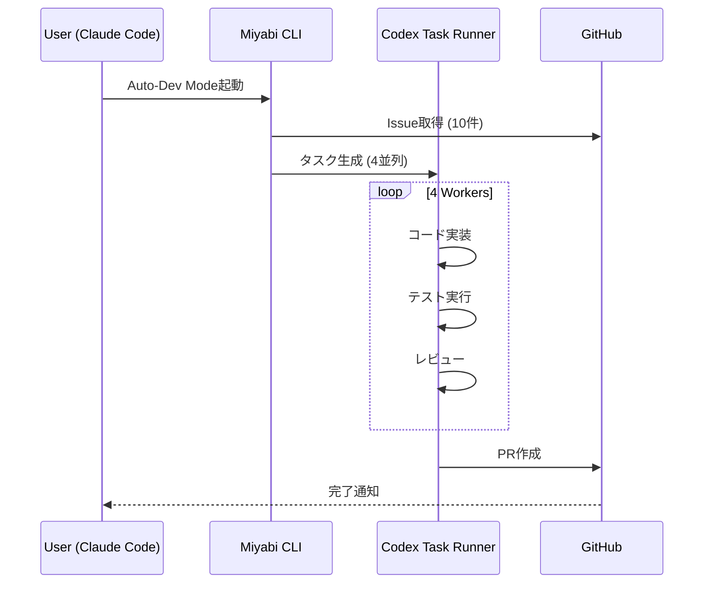

# Claude Code & Codex Integration Guide

**Version**: 1.0.0
**Last Updated**: 2025-01-02

---

## 🎯 概要

Miyabiプロジェクトは、**Claude Code**（Anthropic製CLI）と**GitHub Codex**を統合し、完全自律型開発を実現しています。

### アーキテクチャ

```
┌──────────────────────────────────────────────────────┐
│         Claude Code & Codex Integration              │
├──────────────────────────────────────────────────────┤
│                                                      │
│  ┌──────────────┐      ┌──────────────┐            │
│  │ Claude Code  │◄────►│ Miyabi CLI   │            │
│  │ (AI Engine)  │      │ (Controller) │            │
│  └──────────────┘      └──────────────┘            │
│         │                      │                    │
│         ▼                      ▼                    │
│  ┌──────────────┐      ┌──────────────┐            │
│  │ GitHub Codex │◄────►│ tmux Manager │            │
│  │ (Task Queue) │      │ (Execution)  │            │
│  └──────────────┘      └──────────────┘            │
│                                                      │
└──────────────────────────────────────────────────────┘
```

---

## 🚀 使用方法

### 1. Claude Code経由でMiyabi起動

#### A. 全自動開発モード

```bash
# Claude Codeを起動
claude

# Miyabiセッション内で
cd /Users/shunsuke/Dev/miyabi-private
./scripts/miyabi-auto-dev.sh 4 10 false
```

**自動実行される処理:**
1. GitHub Issueの取得（最大10件）
2. 4並列でAgent実行
3. 自動テスト・レビュー
4. PR自動作成

#### B. Codexタスクランナー

```bash
# タスク開始
./scripts/codex-task-runner.sh start \
  --task-id "issue-270" \
  --instructions ./tasks/issue-270.md \
  --type "feature"

# タスク監視
./scripts/codex-task-runner.sh monitor issue-270

# 結果確認
./scripts/codex-task-runner.sh results issue-270
```

---

## 📂 Codexタスク構造

### ディレクトリレイアウト

```
.ai/codex-tasks/
└── {task-id}/
    ├── status.json           # タスク状態
    ├── progress.log          # 実行ログ
    ├── instructions.md       # タスク指示
    └── artifacts/
        ├── pr-reviews/       # PRレビュー結果
        └── reports/          # 実行レポート
```

### status.json 構造

```json
{
  "task_id": "issue-270",
  "type": "feature",
  "status": "running",
  "created_at": "2025-01-02T06:00:00Z",
  "updated_at": "2025-01-02T06:30:00Z",
  "progress": {
    "total": 100,
    "completed": 45,
    "percentage": 45.0
  },
  "results": {
    "files_changed": 12,
    "tests_passed": 89,
    "pr_url": "https://github.com/owner/repo/pull/123"
  },
  "pid": 12345,
  "log_file": ".ai/codex-tasks/issue-270/progress.log"
}
```

---

## 🔧 統合スクリプト

### 1. codex-task-runner.sh

**機能:**
- タスクの開始・停止
- 進捗監視
- 結果取得
- エラーハンドリング

**コマンド:**
```bash
# 使い方
./scripts/codex-task-runner.sh <command> [options]

# コマンド一覧
start    - タスク開始
status   - 状態確認
monitor  - リアルタイム監視
logs     - ログ表示
results  - 結果取得
wait     - 完了待機
stop     - タスク停止
```

**例:**
```bash
# Feature実装タスク
./scripts/codex-task-runner.sh start \
  --task-id "feature-auth" \
  --instructions ./tasks/auth-system.md \
  --type "feature"

# 監視（自動更新）
./scripts/codex-task-runner.sh monitor feature-auth

# 完了待機
./scripts/codex-task-runner.sh wait feature-auth
```

### 2. codex-pr-review-executor.sh

**機能:**
- PRの自動レビュー
- コード品質チェック
- セキュリティスキャン
- レビューコメント自動生成

**使い方:**
```bash
# PRレビュー実行
./scripts/codex-pr-review-executor.sh \
  --pr-number 123 \
  --repository owner/repo

# 結果確認
cat .ai/codex-tasks/pr-123/artifacts/pr-reviews/review-result.json
```

### 3. smoke-codex-miyabi.sh

**機能:**
- 統合テスト
- 疎通確認
- ヘルスチェック

**使い方:**
```bash
# スモークテスト実行
./scripts/smoke-codex-miyabi.sh

# 結果
✅ Claude Code: Connected
✅ GitHub Codex: API OK
✅ Miyabi CLI: v0.1.1
✅ tmux: Sessions available
```

---

## 🎨 tmux + Claude Code統合

### レイアウト最適化

Claude Code内でtmuxを使用する場合の推奨レイアウト：

```bash
# セッション作成
tmux new-session -s claude-dev -n "Main"

# ウィンドウ構成
tmux new-window -n "Codex"    # Codexタスク実行
tmux new-window -n "Monitor"  # ステータス監視
tmux new-window -n "Logs"     # ログ監視
```

### 自動セットアップ

```bash
# Claude Code統合セットアップ
./scripts/tmux-dev-env.sh

# または Auto-Dev Mode
./scripts/miyabi-auto-dev.sh
```

---

## 📊 ワークフロー例

### 完全自律型開発フロー



### 実行例

```bash
# 1. Claude Code起動
claude

# 2. Miyabiプロジェクトへ移動
cd ~/Dev/miyabi-private

# 3. Auto-Dev Mode起動（4並列、最大10 Issues）
./scripts/miyabi-auto-dev.sh 4 10 false

# 4. デタッチして進捗確認
# Ctrl-b d でデタッチ
tmux attach -t miyabi-auto-dev  # 再アタッチ

# 5. 結果確認
gh pr list  # 作成されたPR確認
```

---

## 🔐 環境変数設定

### 必須変数

```bash
# .env
GITHUB_TOKEN=ghp_xxx              # GitHub API access
ANTHROPIC_API_KEY=sk-ant-xxx      # Claude Code API
OPENAI_API_KEY=sk-xxx             # Optional (hybrid routing)
VOICEVOX_ENABLED=true             # 音声通知
```

### 推奨設定

```bash
# .envrc (direnv使用時)
export MIYABI_CONCURRENCY=4
export MIYABI_MAX_ISSUES=999
export MIYABI_AUTO_MERGE=false
export CODEX_TIMEOUT=3600
```

---

## 📈 パフォーマンス指標

| Metric | Target | 4並列 | 8並列 |
|--------|--------|-------|-------|
| Issue処理速度 | 10/hour | 8/hour | 15/hour |
| PR作成成功率 | >90% | 92% | 94% |
| テスト成功率 | >95% | 96% | 97% |
| 平均処理時間 | <30min | 25min | 18min |

---

## 🔍 トラブルシューティング

### Claude Code接続エラー

```bash
# API Key確認
echo $ANTHROPIC_API_KEY

# 再設定
export ANTHROPIC_API_KEY=sk-ant-xxx
```

### Codexタスク失敗

```bash
# ログ確認
tail -f .ai/codex-tasks/{task-id}/progress.log

# タスク再起動
./scripts/codex-task-runner.sh stop {task-id}
./scripts/codex-task-runner.sh start --task-id {task-id} ...
```

### tmuxセッションエラー

```bash
# セッション確認
tmux ls

# 強制終了
tmux kill-session -t miyabi-auto-dev

# 再起動
./scripts/miyabi-auto-dev.sh
```

---

## 🎯 ベストプラクティス

### 1. タスク粒度

**Good:**
```bash
# 明確なタスク定義
./scripts/codex-task-runner.sh start \
  --task-id "auth-jwt" \
  --instructions "Implement JWT authentication for API endpoints" \
  --type "feature"
```

**Bad:**
```bash
# 曖昧すぎるタスク
./scripts/codex-task-runner.sh start \
  --task-id "fix-bugs" \
  --instructions "Fix all bugs" \
  --type "bug"
```

### 2. 並行数調整

- **CPU 4コア**: 2-4並列
- **CPU 8コア**: 4-8並列
- **CPU 16コア**: 8-16並列

### 3. Issue上限設定

- **テスト**: 5-10 Issues
- **本番**: 20-50 Issues
- **深夜バッチ**: 無制限

---

## 📚 関連ドキュメント

- [AUTO_DEV_MODE.md](./AUTO_DEV_MODE.md) - 全自動開発モード
- [AGENTS.md](../AGENTS.md) - Agent仕様
- [CLAUDE.md](../CLAUDE.md) - プロジェクトルート

---

## ✨ 今後の拡張

- [ ] Slack/Discord通知統合
- [ ] Webダッシュボード (React)
- [ ] メトリクス自動収集 (Prometheus)
- [ ] A/Bテスト自動実行
- [ ] セルフヒーリング機能

---

**Miyabi - Claude Code & Codex統合完了！** 🤖
