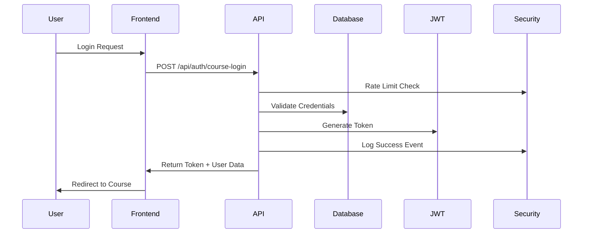

# Course Authentication Integration

**Issue #1300**: Comprehensive authentication integration for AI Course functionality

## Overview

This document describes the comprehensive authentication system implemented for the AI Course platform, which securely integrates with Miyabi's existing user management system while providing course-specific security features.

## Table of Contents

- [Architecture](#architecture)
- [Components](#components)
- [API Endpoints](#api-endpoints)
- [Database Schema](#database-schema)
- [Security Features](#security-features)
- [Usage Examples](#usage-examples)
- [Configuration](#configuration)
- [Testing](#testing)
- [Deployment](#deployment)

## Architecture

### Authentication Flow



### System Components

1. **Authentication Middleware** (`lib/auth/`)
   - JWT token validation
   - Role-based access control
   - Course-specific permissions
   - Security logging

2. **React Components** (`components/auth/`)
   - Login/Registration forms
   - Role guards and permission checks
   - Authentication context provider

3. **API Endpoints** (`app/api/auth/`)
   - Login, registration, logout
   - Token verification
   - Course access validation

4. **Security Features** (`lib/auth/security.ts`)
   - Anti-cheating measures
   - Rate limiting
   - Audit logging
   - Content protection

## Components

### Core Authentication (`lib/auth/course-auth.ts`)

```typescript
// Get comprehensive course authentication context
const context = await getCourseAuthContext(request, courseId, {
  requireEnrollment: true,
  checkPrerequisites: true,
  allowPreview: false
});

// Generate secure JWT tokens
const token = generateJWTToken(user);

// Validate tokens with user verification
const user = await validateJWTToken(token);
```

### Role-Based Access Control (`lib/auth/roles.ts`)

```typescript
// Check permissions
const hasAccess = hasPermission(context, 'course:edit');

// Permission matrices by role
ROLE_PERMISSIONS = {
  STUDENT: ['course:view', 'lesson:view', 'assessment:take'],
  INSTRUCTOR: ['course:edit', 'lesson:create', 'assessment:grade'],
  ADMIN: ['course:delete', 'user:manage', 'admin:settings'],
  SUPER_ADMIN: [...all permissions]
}
```

### React Components

#### CourseLogin Component
```tsx
import { CourseLogin } from '@/components/auth/CourseLogin';

<CourseLogin
  courseId="course-123"
  redirectTo="/dashboard"
  allowRegistration={true}
  onSuccess={(response) => console.log('Logged in:', response)}
/>
```

#### RoleGuard Component
```tsx
import { RoleGuard, useAuth } from '@/components/auth/RoleGuard';

// Protect routes by role
<RoleGuard requiredRoles={['INSTRUCTOR', 'ADMIN']}>
  <InstructorDashboard />
</RoleGuard>

// Protect by permissions
<RoleGuard requiredPermissions={['course:edit']}>
  <CourseEditor />
</RoleGuard>

// Course-specific protection
<CourseRoleGuard
  courseId="course-123"
  requireEnrollment={true}
  requireActiveSubscription={true}
>
  <LessonContent />
</CourseRoleGuard>
```

## API Endpoints

### Authentication Endpoints

| Endpoint | Method | Description | Auth Required |
|----------|--------|-------------|---------------|
| `/api/auth/course-login` | POST | User login with course context | No |
| `/api/auth/course-register` | POST | User registration with auto-enrollment | No |
| `/api/auth/course-logout` | POST | Secure logout with session cleanup | Yes |
| `/api/auth/verify` | GET/POST | Token validation and user verification | Yes |

### Course-Specific Endpoints

| Endpoint | Method | Description | Auth Required |
|----------|--------|-------------|---------------|
| `/api/courses/[courseId]/auth-check` | GET | Comprehensive course access validation | Yes |

### Request/Response Examples

#### Login Request
```json
POST /api/auth/course-login
{
  "email": "student@example.com",
  "password": "securepassword",
  "courseId": "course-123", // Optional
  "rememberMe": true
}
```

#### Login Response
```json
{
  "success": true,
  "user": {
    "id": "user-456",
    "email": "student@example.com",
    "username": "student123",
    "role": "STUDENT",
    "isEnrolled": true,
    "enrollmentDate": "2024-01-01T00:00:00Z"
  },
  "token": "eyJhbGciOiJIUzI1NiIs...",
  "redirectUrl": "/courses/course-123"
}
```

#### Course Auth Check Response
```json
{
  "success": true,
  "context": {
    "id": "user-456",
    "email": "student@example.com",
    "role": "STUDENT",
    "isEnrolled": true,
    "hasActiveSubscription": true,
    "progress": 65,
    "completedPrerequisites": ["prereq-1", "prereq-2"],
    "coursePermissions": ["course:view", "lesson:view", "assessment:take"],
    "course": {
      "id": "course-123",
      "title": "Advanced AI Development",
      "isCreator": false,
      "isInstructor": false
    },
    "permissions": {
      "canViewCourse": true,
      "canEditCourse": false,
      "canTakeAssessments": true,
      "canViewProgress": true
    }
  }
}
```

## Database Schema

### New Tables Added

- **`user_credentials`**: Secure password storage separate from user table
- **`user_login_history`**: Login/logout tracking for security auditing
- **`assessment_security_logs`**: Anti-cheating monitoring during assessments
- **`security_audit_logs`**: Comprehensive security event logging
- **`security_alerts`**: High-priority security events requiring attention
- **`course_access_schedules`**: Time-based access control
- **`content_integrity_logs`**: Content tampering verification
- **`jwt_blacklist`**: Invalidated tokens for secure logout
- **`course_instructors`**: Course-specific instructor assignments
- **`rate_limit_tracking`**: API rate limiting (Redis replacement)

### Key Relationships

```sql
-- User credentials (1:1 with users)
user_credentials.user_id → users.id

-- Course instructors (many:many)
course_instructors.course_id → courses.id
course_instructors.instructor_id → users.id

-- Security logs (many:1 with users)
security_audit_logs.user_id → users.id
assessment_security_logs.user_id → users.id
```

## Security Features

### 1. Anti-Cheating Measures

```typescript
// Track suspicious assessment behavior
await AssessmentSecurity.trackAssessmentAttempt(userId, assessmentId, {
  windowFocusLoss: 5,
  copyPasteAttempts: 3,
  tabSwitches: 8,
  screenshotAttempts: 1
});

// Analyze risk score
const analysis = await AssessmentSecurity.analyzeAttemptSecurity(userId, assessmentId);
// Returns: { riskScore: 45, warnings: [...], recommendations: [...] }
```

### 2. Content Protection

```typescript
// Generate secure content URLs with watermarking
const secureUrl = ContentProtection.generateSecureContentUrl(
  baseUrl,
  userId,
  courseId,
  3600 // 1 hour expiry
);

// Verify content integrity
const isValid = ContentIntegrity.verifyContentSignature(content, signature, secret);
```

### 3. Rate Limiting

```typescript
// Adaptive rate limiting with violation tracking
const rateLimit = AdaptiveRateLimit.checkRateLimit(
  clientId,
  'login',
  5, // base limit
  3600000 // 1 hour window
);
```

### 4. Audit Logging

```typescript
// Log security events
await AuditLogger.logSecurityEvent(
  userId,
  'SUSPICIOUS_ASSESSMENT_BEHAVIOR',
  {
    assessmentId,
    riskScore: 85,
    violations: ['excessive_tab_switches', 'copy_paste_attempts']
  },
  request
);
```

### 5. Time-Based Access Control

```typescript
// Check access schedule
const accessCheck = TimeBasedAccess.isAccessAllowed({
  startDate: new Date('2024-01-01'),
  endDate: new Date('2024-12-31'),
  allowedHours: [9, 10, 11, 12, 13, 14, 15, 16, 17], // 9 AM - 5 PM
  allowedDays: [1, 2, 3, 4, 5] // Monday - Friday
});
```

## Usage Examples

### 1. Protecting API Routes

```typescript
import { withAuth } from '@/lib/auth/middleware';

export const GET = withAuth(async (req, { authContext, params }) => {
  // authContext contains validated user and permissions
  const { courseId } = params;

  // Business logic here
  return NextResponse.json({ data: 'success' });
}, {
  requiredPermissions: ['course:view'],
  courseId: 'from-params',
  auditLog: true,
  rateLimit: { requests: 100, windowMs: 3600000 }
});
```

### 2. Frontend Permission Checks

```tsx
import { useAuth, PermissionCheck } from '@/components/auth/RoleGuard';

function CourseManagement() {
  const auth = useAuth();

  return (
    <div>
      <h1>Course Management</h1>

      <PermissionCheck
        permission="course:edit"
        fallback={<div>You cannot edit this course</div>}
      >
        <EditCourseButton />
      </PermissionCheck>

      {auth.hasPermission('course:view_analytics') && (
        <AnalyticsPanel />
      )}
    </div>
  );
}
```

### 3. Course-Specific Access

```tsx
import { CourseRoleGuard } from '@/components/auth/RoleGuard';

<CourseRoleGuard
  courseId="course-123"
  requireEnrollment={true}
  requireActiveSubscription={true}
  fallback={<EnrollmentPrompt courseId="course-123" />}
>
  <LessonVideo src="protected-content.mp4" />
</CourseRoleGuard>
```

## Configuration

### Environment Variables

```bash
# Required
JWT_SECRET=your-super-secure-secret-key-here
JWT_EXPIRES_IN=7d

# Optional
NODE_ENV=production
CONTENT_WATERMARK_SALT=course-watermark-salt
```

### Security Settings

```typescript
// Rate limiting configuration
const rateLimitConfig = {
  login: { requests: 5, windowMs: 3600000 }, // 5 attempts per hour
  register: { requests: 3, windowMs: 3600000 }, // 3 attempts per hour
  api: { requests: 100, windowMs: 3600000 } // 100 requests per hour
};

// Session configuration
const sessionConfig = {
  maxAge: 7 * 24 * 60 * 60 * 1000, // 7 days
  httpOnly: true,
  secure: process.env.NODE_ENV === 'production',
  sameSite: 'strict'
};
```

## Testing

### Running Tests

```bash
# Install dependencies
npm install

# Run unit tests
npm test

# Run E2E tests
npm run test:e2e

# Test authentication flows
npm run test:auth
```

### Test Examples

```typescript
// Test login flow
describe('Course Authentication', () => {
  it('should login with valid credentials', async () => {
    const response = await fetch('/api/auth/course-login', {
      method: 'POST',
      headers: { 'Content-Type': 'application/json' },
      body: JSON.stringify({
        email: 'test@example.com',
        password: 'password123'
      })
    });

    const data = await response.json();
    expect(data.success).toBe(true);
    expect(data.token).toBeDefined();
  });

  it('should protect course content for non-enrolled users', async () => {
    const response = await fetch('/api/courses/course-123/content', {
      headers: { Authorization: 'Bearer invalid-token' }
    });

    expect(response.status).toBe(401);
  });
});
```

## Deployment

### Database Migration

```bash
# Run the migration
npx prisma migrate deploy

# Verify tables created
npx prisma db pull
```

### Production Checklist

- [ ] JWT_SECRET configured and secure (32+ characters)
- [ ] Database migration applied
- [ ] Rate limiting configured (consider Redis for production)
- [ ] Audit log retention policy set
- [ ] Content delivery network (CDN) configured for protected content
- [ ] Security monitoring alerts configured
- [ ] Backup procedures for auth-related tables
- [ ] SSL/TLS certificates installed and configured

### Monitoring

```typescript
// Security metrics to monitor
const securityMetrics = {
  loginAttempts: 'Count of login attempts per hour',
  failedLogins: 'Failed login attempts (potential attacks)',
  riskAssessments: 'High-risk assessment attempts',
  contentAccess: 'Unauthorized content access attempts',
  rateLimitHits: 'Rate limit violations per endpoint'
};
```

## Security Considerations

### Best Practices Implemented

1. **Password Security**
   - bcrypt with salt rounds 12
   - Separate credentials table
   - Password change tracking

2. **Token Security**
   - JWT with strong secret
   - Token blacklisting on logout
   - Automatic expiration

3. **Session Management**
   - HTTP-only cookies
   - Secure flag in production
   - SameSite strict policy

4. **Content Protection**
   - Time-based access URLs
   - Content watermarking
   - Integrity verification

5. **Monitoring**
   - Comprehensive audit logging
   - Security event alerting
   - Risk score analysis

### Known Limitations

1. **In-Memory Rate Limiting**: Current implementation uses in-memory storage. Use Redis for production scaling.

2. **Assessment Security**: Client-side monitoring can be bypassed. Consider additional server-side verification.

3. **Content Protection**: Watermarking provides deterrence but not absolute protection against determined attackers.

## Support

For issues or questions about the course authentication system:

1. Check the [troubleshooting guide](./TROUBLESHOOTING.md)
2. Review security logs in the admin dashboard
3. Contact the development team with specific error messages and context

## Changelog

### v1.0.0 (2024-01-03)
- Initial implementation of comprehensive course authentication
- JWT-based token system with role-based access control
- Anti-cheating and content protection measures
- Comprehensive security logging and monitoring
- React components for authentication UI
- Database schema with security-focused tables
- API endpoints for login, registration, and verification
- Integration with existing Miyabi user management system