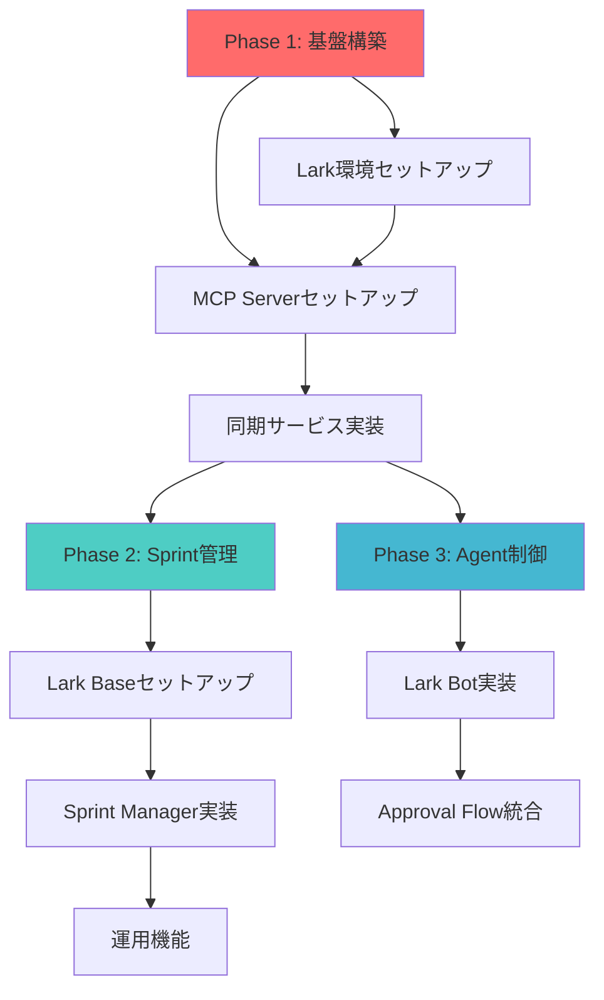

# Miyabi × Lark 統合 - 実装タスク分解

**Version**: 1.0.0
**Date**: 2025-11-06
**Status**: ✅ Ready for Execution
**Source**: [MIYABI_LARK_INTEGRATION_GUIDE.md](./MIYABI_LARK_INTEGRATION_GUIDE.md)

---

## 📋 目次

1. [概要](#概要)
2. [優先度定義](#優先度定義)
3. [Phase 1: 基盤構築](#phase-1-基盤構築)
4. [Phase 2: Sprint管理](#phase-2-sprint管理)
5. [Phase 3: Agent制御](#phase-3-agent制御)
6. [依存関係図](#依存関係図)
7. [実装スケジュール](#実装スケジュール)
8. [リソース配分](#リソース配分)

---

## 🎯 概要

本ドキュメントは、Miyabi × Lark 統合プロジェクトの実装タスクを詳細に分解し、優先順位と依存関係を明確化したものです。

**統合目標**:
- GitHub Issues を Single Source of Truth として維持
- Lark の優れたコラボレーション機能を活用
- 開発生産性を 50% 向上

**総タスク数**: 37 tasks
**総見積もり**: 240-300 時間（6週間）

---

## 📊 優先度定義

| Level | 名称 | 説明 | 対応必須度 |
|-------|------|------|-----------|
| **P0** | Critical | システムの基本動作に必須。これがないと統合が機能しない | 🔴 必須 |
| **P1** | High | 主要機能として重要。ユーザー体験に大きく影響 | 🟡 重要 |
| **P2** | Medium | 推奨される機能。運用効率を向上させる | 🟢 推奨 |
| **P3** | Low | あると便利な機能。将来的な拡張 | ⚪ オプション |

---

## 🏗️ Phase 1: 基盤構築（Week 1-2）

**目的**: GitHub ↔ Lark 双方向同期の基盤を構築

**完了条件**: Issue作成時にLark Task/Baseが自動作成され、相互に同期される

### 1.1 Lark環境セットアップ（4 tasks）

#### T1.1.1: Lark App作成と認証情報取得
- **優先度**: P0 (Critical)
- **説明**: Lark Open Platform でアプリを作成し、APP_ID と APP_SECRET を取得
- **成果物**:
  - Lark App "Miyabi Integration"
  - `.env` ファイルに認証情報保存
- **依存関係**: なし
- **見積もり**: 30分
- **担当Agent推奨**: Manual（人間が実施）
- **参照**: [MIYABI_LARK_INTEGRATION_GUIDE.md](./MIYABI_LARK_INTEGRATION_GUIDE.md#step-1-lark-app-の作成)

#### T1.1.2: Lark App権限設定
- **優先度**: P0 (Critical)
- **説明**: 必要なAPI権限をすべて有効化（Messenger, Tasks, Base, Docs, Wiki, Approval, Calendar, Drive）
- **成果物**: 権限設定完了
- **依存関係**: T1.1.1
- **見積もり**: 20分
- **担当Agent推奨**: Manual（人間が実施）
- **チェックリスト**:
  - ✅ im:message, im:message.group_at_msg, im:chat
  - ✅ task:task, task:task:readonly
  - ✅ bitable:app, bitable:app:readonly
  - ✅ docx:document, docx:document:readonly
  - ✅ wiki:wiki, wiki:wiki:readonly
  - ✅ approval:approval, approval:approval:readonly
  - ✅ calendar:calendar, calendar:calendar:readonly, calendar:calendar.event
  - ✅ drive:drive, drive:drive:readonly

#### T1.1.3: イベントサブスクリプション設定
- **優先度**: P0 (Critical)
- **説明**: Larkからのイベント通知を受け取るためのWebhook設定
- **成果物**:
  - Event Callback URL設定
  - 暗号化キー取得
  - 5つのイベントサブスクライブ完了
- **依存関係**: T1.1.2
- **見積もり**: 30分
- **担当Agent推奨**: Manual（人間が実施）
- **サブスクライブイベント**:
  - im.message.receive_v1
  - task.v1.task.updated
  - bitable.app_table_record.changed
  - approval.instance.approved
  - approval.instance.rejected

#### T1.1.4: Wiki Spaceセットアップ
- **優先度**: P1 (High)
- **説明**: Miyabi用のWiki Spaceを作成し、WIKI_SPACE_ID と ROOT_NODE_TOKEN を取得
- **成果物**:
  - Wiki Space "Miyabi Project"
  - 環境変数設定
- **依存関係**: T1.1.1
- **見積もり**: 20分
- **担当Agent推奨**: Manual（人間が実施）

---

### 1.2 MCP Server セットアップ（5 tasks）

#### T1.2.1: lark-mcp-official インストール
- **優先度**: P0 (Critical)
- **説明**: 公式Lark MCP Serverをインストールしてビルド
- **成果物**:
  - `integrations/lark-mcp-official/dist/index.js`
  - 動作確認済み
- **依存関係**: T1.1.1
- **見積もり**: 1時間
- **担当Agent推奨**: CodeGenAgent
- **コマンド**:
  ```bash
  cd /Users/shunsuke/Dev/miyabi-private/integrations/lark-mcp-official
  npm install
  npm run build
  ```

#### T1.2.2: lark-wiki-mcp-agents セットアップ
- **優先度**: P1 (High)
- **説明**: lark-wiki-mcp-agents とその依存関係をセットアップ
- **成果物**:
  - `integrations/lark-wiki-mcp-agents/dist/cli.js`
  - C1-C5コマンド利用可能
- **依存関係**: T1.2.1
- **見積もり**: 1.5時間
- **担当Agent推奨**: CodeGenAgent
- **コマンド**:
  ```bash
  cd /Users/shunsuke/Dev/miyabi-private/integrations/lark-wiki-mcp-agents
  git clone https://github.com/larksuite/lark-openapi-mcp.git lark-openapi-mcp
  cd lark-openapi-mcp && npm install && npm run build && cd ..
  npm install
  npm run build
  ```

#### T1.2.3: 環境変数設定
- **優先度**: P0 (Critical)
- **説明**: lark-wiki-mcp-agents の `.env` ファイルを作成
- **成果物**: `integrations/lark-wiki-mcp-agents/.env`
- **依存関係**: T1.1.4, T1.2.2
- **見積もり**: 15分
- **担当Agent推奨**: CodeGenAgent
- **テンプレート**:
  ```bash
  LARK_APP_ID=cli_xxxxxxxxxxxx
  LARK_APP_SECRET=xxxxxxxxxxxxxxxxxxxxxxxx
  WIKI_SPACE_ID=7520526284150013985
  ROOT_NODE_TOKEN=JqgNwZybNildpqkvLnGje92Hp0c
  RATE_LIMIT_REQUESTS_PER_MINUTE=60
  RATE_LIMIT_REQUESTS_PER_HOUR=3000
  GENESIS_ENABLED=true
  GENESIS_MAX_TABLES=10
  ```

#### T1.2.4: Claude Desktop MCP統合
- **優先度**: P0 (Critical)
- **説明**: Claude Desktop の設定ファイルにMCP Serverを追加
- **成果物**: `~/.claude/claude_desktop_config.json` 更新
- **依存関係**: T1.2.1, T1.2.2, T1.2.3
- **見積もり**: 20分
- **担当Agent推奨**: Manual（人間が実施）
- **設定内容**: 2つのMCP Server（lark-official, lark-wiki-agents）を登録

#### T1.2.5: MCP Server動作確認
- **優先度**: P0 (Critical)
- **説明**: Claude Desktopを再起動し、MCP Serverが正常に動作することを確認
- **成果物**: 動作確認レポート
- **依存関係**: T1.2.4
- **見積もり**: 30分
- **担当Agent推奨**: Manual（人間が実施）
- **確認項目**:
  - ✅ Claude Desktopに "lark-official" が表示される（200+ tools）
  - ✅ Claude Desktopに "lark-wiki-agents" が表示される（C1-C5 commands）
  - ✅ テストクエリ実行成功

---

### 1.3 同期サービス実装（12 tasks）

#### T1.3.1: プロジェクト構造作成
- **優先度**: P0 (Critical)
- **説明**: miyabi-lark-sync プロジェクトのディレクトリ構造を作成
- **成果物**:
  - `integrations/miyabi-lark-sync/` ディレクトリ
  - `src/`, `dist/`, `tests/` ディレクトリ
- **依存関係**: なし
- **見積もり**: 10分
- **担当Agent推奨**: CodeGenAgent

#### T1.3.2: package.json 作成
- **優先度**: P0 (Critical)
- **説明**: プロジェクトの依存関係とスクリプトを定義
- **成果物**: `integrations/miyabi-lark-sync/package.json`
- **依存関係**: T1.3.1
- **見積もり**: 15分
- **担当Agent推奨**: CodeGenAgent
- **主要依存関係**:
  - @octokit/rest: GitHub API
  - @larksuiteoapi/node-sdk: Lark SDK
  - express: Webhookサーバー
  - dotenv: 環境変数管理

#### T1.3.3: TypeScript設定
- **優先度**: P0 (Critical)
- **説明**: TypeScriptコンパイラ設定を作成
- **成果物**: `integrations/miyabi-lark-sync/tsconfig.json`
- **依存関係**: T1.3.2
- **見積もり**: 10分
- **担当Agent推奨**: CodeGenAgent

#### T1.3.4: 依存関係インストール
- **優先度**: P0 (Critical)
- **説明**: npm installを実行して依存関係をインストール
- **成果物**: `node_modules/` ディレクトリ
- **依存関係**: T1.3.2
- **見積もり**: 5分
- **担当Agent推奨**: CodeGenAgent
- **コマンド**: `cd integrations/miyabi-lark-sync && npm install`

#### T1.3.5: GitHub API クライアント実装
- **優先度**: P0 (Critical)
- **説明**: GitHub APIとの通信を担当するクライアントクラス
- **成果物**: `src/github-client.ts`
- **依存関係**: T1.3.4
- **見積もり**: 3時間
- **担当Agent推奨**: CodeGenAgent
- **主要機能**:
  - Issue CRUD操作
  - Label取得・更新
  - Comment追加
  - Webhook検証

#### T1.3.6: Lark API クライアント実装
- **優先度**: P0 (Critical)
- **説明**: Lark APIとの通信を担当するクライアントクラス
- **成果物**: `src/lark-client.ts`
- **依存関係**: T1.3.4
- **見積もり**: 4時間
- **担当Agent推奨**: CodeGenAgent
- **主要機能**:
  - Task CRUD操作
  - Base Record CRUD操作
  - Messenger通知送信
  - イベント検証

#### T1.3.7: GitHub → Lark 同期ロジック実装
- **優先度**: P0 (Critical)
- **説明**: GitHub IssueイベントをLark Task/Baseに同期
- **成果物**: `src/sync/github-to-lark.ts`
- **依存関係**: T1.3.5, T1.3.6
- **見積もり**: 6時間
- **担当Agent推奨**: CodeGenAgent
- **同期イベント**:
  - Issue opened → Lark Task作成 + Base Record作成 + チーム通知
  - Issue updated → Lark Task更新 + Base Record更新
  - Issue closed → Lark Task完了 + Base Record更新
  - Issue labeled → Base Record更新（Priority, Phase等）
  - Issue commented → Lark Task Comment追加

#### T1.3.8: Lark → GitHub 同期ロジック実装
- **優先度**: P0 (Critical)
- **説明**: Lark Task/BaseイベントをGitHub Issueに同期
- **成果物**: `src/sync/lark-to-github.ts`
- **依存関係**: T1.3.5, T1.3.6
- **見積もり**: 6時間
- **担当Agent推奨**: CodeGenAgent
- **同期イベント**:
  - Lark Task updated → GitHub Issue更新
  - Lark Task completed → GitHub Issue closed
  - Lark Base Record updated → GitHub Issue Label更新
  - Lark Task Comment added → GitHub Issue Comment追加

#### T1.3.9: Webhook エンドポイント実装
- **優先度**: P0 (Critical)
- **説明**: GitHub/LarkからのWebhookを受信するExpressサーバー
- **成果物**: `src/webhooks/server.ts`
- **依存関係**: T1.3.7, T1.3.8
- **見積もり**: 4時間
- **担当Agent推奨**: CodeGenAgent
- **エンドポイント**:
  - `POST /webhooks/github` - GitHub Webhookハンドラー
  - `POST /webhooks/lark` - Lark Event Callbackハンドラー
  - `GET /health` - ヘルスチェック

#### T1.3.10: エラーハンドリング実装
- **優先度**: P1 (High)
- **説明**: 同期失敗時のリトライロジックとエラー通知
- **成果物**: `src/error-handler.ts`
- **依存関係**: T1.3.9
- **見積もり**: 3時間
- **担当Agent推奨**: CodeGenAgent
- **機能**:
  - 指数バックオフリトライ（最大3回）
  - エラーログ記録
  - Lark Messenger通知（Critical Error時）
  - Dead Letter Queue（DLQ）保存

#### T1.3.11: ロギング実装
- **優先度**: P2 (Medium)
- **説明**: 構造化ロギングと監視メトリクス
- **成果物**: `src/logger.ts`
- **依存関係**: T1.3.9
- **見積もり**: 2時間
- **担当Agent推奨**: CodeGenAgent
- **ログレベル**: DEBUG, INFO, WARN, ERROR, CRITICAL
- **出力先**: Console, ファイル（logs/sync.log）

#### T1.3.12: テスト作成
- **優先度**: P2 (Medium)
- **説明**: ユニットテストとインテグレーションテスト
- **成果物**: `tests/` 配下のテストファイル
- **依存関係**: T1.3.10
- **見積もり**: 8時間
- **担当Agent推奨**: CodeGenAgent + ReviewAgent
- **カバレッジ目標**: 80%以上
- **テストケース**:
  - GitHub → Lark 同期（正常系・異常系）
  - Lark → GitHub 同期（正常系・異常系）
  - Webhook検証
  - エラーハンドリング
  - リトライロジック

---

## 🚀 Phase 2: Sprint管理（Week 3-4）

**目的**: Lark BaseとGitHub Milestoneを連携したSprint管理システム構築

**完了条件**: Sprint作成/更新がLark BaseとGitHub間で同期され、Velocity計算が自動化される

### 2.1 Lark Base セットアップ（3 tasks）

#### T2.1.1: Sprint Base テンプレートのインポート
- **優先度**: P1 (High)
- **説明**: Lark Base に Sprint Planning テンプレートをインポート
- **成果物**: Sprint Base作成完了
- **依存関係**: Phase 1完了
- **見積もり**: 30分
- **担当Agent推奨**: Manual（人間が実施）

#### T2.1.2: カスタムフィールド追加
- **優先度**: P1 (High)
- **説明**: Miyabi専用のカスタムフィールドを追加
- **成果物**: カスタムフィールド設定完了
- **依存関係**: T2.1.1
- **見積もり**: 30分
- **担当Agent推奨**: Manual（人間が実施）
- **追加フィールド**:
  - Agent (Single Select): CoordinatorAgent, CodeGenAgent, ReviewAgent, ...
  - Estimate (Single Select): XS, S, M, L, XL
  - Quality Score (Number): 0-100
  - GitHub Issue Number (Number)
  - GitHub URL (URL)

#### T2.1.3: Base権限設定
- **優先度**: P1 (High)
- **説明**: チームメンバーのアクセス権限を設定
- **成果物**: 権限設定完了
- **依存関係**: T2.1.2
- **見積もり**: 15分
- **担当Agent推奨**: Manual（人間が実施）

---

### 2.2 Sprint Manager 実装（7 tasks）

#### T2.2.1: Sprint Manager サービス構造作成
- **優先度**: P1 (High)
- **説明**: lark-sprint プロジェクトのディレクトリ構造を作成
- **成果物**: `integrations/lark-sprint/` ディレクトリ
- **依存関係**: Phase 1完了
- **見積もり**: 15分
- **担当Agent推奨**: CodeGenAgent

#### T2.2.2: Sprint作成ロジック実装
- **優先度**: P1 (High)
- **説明**: 新規Sprintを Lark Base + GitHub Milestone に作成
- **成果物**: `src/sprint-manager.ts` の Sprint作成機能
- **依存関係**: T2.2.1, T2.1.3
- **見積もり**: 4時間
- **担当Agent推奨**: CodeGenAgent
- **機能**:
  - Sprint名生成（Sprint XX）
  - 開始日・終了日設定（2週間）
  - GitHub Milestone作成
  - Lark Base Record作成
  - チーム通知送信

#### T2.2.3: Velocity計算実装
- **優先度**: P2 (Medium)
- **説明**: 過去3 Sprintの平均Velocityを計算
- **成果物**: `src/velocity-calculator.ts`
- **依存関係**: T2.2.2
- **見積もり**: 3時間
- **担当Agent推奨**: CodeGenAgent
- **計算式**: `Velocity = sum(completed_story_points) / sprint_count`

#### T2.2.4: Capacity計算実装
- **優先度**: P2 (Medium)
- **説明**: チームのCapacityを計算（メンバー数 × 稼働時間 × 生産性係数）
- **成果物**: `src/capacity-calculator.ts`
- **依存関係**: T2.2.2
- **見積もり**: 2時間
- **担当Agent推奨**: CodeGenAgent

#### T2.2.5: GitHub Milestone連携実装
- **優先度**: P1 (High)
- **説明**: Sprint とGitHub Milestoneを双方向同期
- **成果物**: `src/milestone-sync.ts`
- **依存関係**: T2.2.2
- **見積もり**: 3時間
- **担当Agent推奨**: CodeGenAgent
- **同期内容**:
  - Sprint作成 → Milestone作成
  - Sprint更新 → Milestone更新
  - Sprint完了 → Milestone closed

#### T2.2.6: Lark Calendar統合実装
- **優先度**: P2 (Medium)
- **説明**: Sprint開始/終了日をLark Calendarに自動登録
- **成果物**: `src/calendar-integration.ts`
- **依存関係**: T2.2.2
- **見積もり**: 3時間
- **担当Agent推奨**: CodeGenAgent
- **イベント**:
  - Sprint Start Event
  - Sprint Review Event
  - Sprint Retrospective Event

#### T2.2.7: Sprint Dashboard作成
- **優先度**: P2 (Medium)
- **説明**: Lark Base にSprint Dashboardビューを作成
- **成果物**: Dashboard View設定
- **依存関係**: T2.2.5
- **見積もり**: 2時間
- **担当Agent推奨**: Manual + CodeGenAgent
- **ビュー**:
  - Sprint Progress View（進捗率）
  - Agent Workload View（Agent別負荷）
  - Blocked Items View（ブロック中タスク）
  - Quality Metrics View（品質スコア）

---

## 🎮 Phase 3: Agent制御（Week 5-6）

**目的**: LarkからMiyabi Agentを制御し、承認フローを統合

**完了条件**: Lark MessengerでSlash Commandsを実行し、Agent実行と承認フローが機能する

### 3.1 Lark Bot実装（6 tasks）

#### T3.1.1: Bot基本構造作成
- **優先度**: P1 (High)
- **説明**: lark-agent プロジェクトのディレクトリ構造を作成
- **成果物**: `integrations/lark-agent/` ディレクトリ
- **依存関係**: Phase 1完了
- **見積もり**: 15分
- **担当Agent推奨**: CodeGenAgent

#### T3.1.2: Slash Commands パーサー実装
- **優先度**: P1 (High)
- **説明**: Lark MessengerからのSlash Commandsをパース
- **成果物**: `src/command-parser.ts`
- **依存関係**: T3.1.1
- **見積もり**: 2時間
- **担当Agent推奨**: CodeGenAgent
- **対応コマンド**:
  - `/miyabi-issue <title>` - Issue作成
  - `/miyabi-status #<number>` - Issueステータス確認
  - `/miyabi-agent <type> #<number>` - Agent実行
  - `/miyabi-sprint` - Sprint開始

#### T3.1.3: Issue作成コマンド実装
- **優先度**: P1 (High)
- **説明**: `/miyabi-issue` コマンドでGitHub Issueを作成
- **成果物**: `src/commands/create-issue.ts`
- **依存関係**: T3.1.2
- **見積もり**: 3時間
- **担当Agent推奨**: CodeGenAgent
- **フロー**:
  1. コマンドパース
  2. GitHub Issue作成
  3. Lark Task/Base同期（Phase 1機能を利用）
  4. チーム通知

#### T3.1.4: Issueステータス確認コマンド実装
- **優先度**: P1 (High)
- **説明**: `/miyabi-status` コマンドでIssue情報を表示
- **成果物**: `src/commands/check-status.ts`
- **依存関係**: T3.1.2
- **見積もり**: 2時間
- **担当Agent推奨**: CodeGenAgent
- **表示内容**:
  - Issue番号・タイトル
  - 現在のステータス（Open/Closed）
  - 担当Agent
  - Priority/Phase Label
  - 最終更新日時

#### T3.1.5: Agent実行コマンド実装
- **優先度**: P1 (High)
- **説明**: `/miyabi-agent` コマンドでMiyabi Agentを実行
- **成果物**: `src/commands/run-agent.ts`
- **依存関係**: T3.1.2
- **見積もり**: 5時間
- **担当Agent推奨**: CodeGenAgent
- **フロー**:
  1. コマンドパース（Agent Type, Issue Number）
  2. Priority確認（P0-Critical → 承認フロー起動）
  3. Agent実行（miyabi CLI呼び出し）
  4. 進捗通知（Lark Messenger）
  5. 完了通知（結果サマリー）

#### T3.1.6: エラーハンドリングとフィードバック
- **優先度**: P1 (High)
- **説明**: コマンド実行エラー時のユーザーフィードバック
- **成果物**: `src/error-feedback.ts`
- **依存関係**: T3.1.5
- **見積もり**: 2時間
- **担当Agent推奨**: CodeGenAgent
- **フィードバック**:
  - 構文エラー → 使い方ガイド表示
  - Issue存在しない → 404メッセージ
  - 権限エラー → 権限不足通知
  - Agent実行失敗 → エラー詳細 + リトライ提案

---

### 3.2 Approval Flow統合（3 tasks）

#### T3.2.1: Approval テンプレート作成
- **優先度**: P2 (Medium)
- **説明**: Lark Approval で Agent実行承認テンプレートを作成
- **成果物**: Approval Template "Miyabi Agent Execution"
- **依存関係**: Phase 1完了
- **見積もり**: 30分
- **担当Agent推奨**: Manual（人間が実施）
- **フィールド**:
  - Agent Type (Single Select)
  - Issue Number (Number)
  - Reason (Text)
  - Estimated Time (Number)

#### T3.2.2: Approval イベントハンドリング実装
- **優先度**: P2 (Medium)
- **説明**: 承認/却下イベントを受信してAgent実行を制御
- **成果物**: `src/approval-handler.ts`
- **依存関係**: T3.2.1, T3.1.5
- **見積もり**: 3時間
- **担当Agent推奨**: CodeGenAgent
- **フロー**:
  - approval.instance.approved → Agent実行
  - approval.instance.rejected → リクエスト者に通知

#### T3.2.3: P0-Critical Issue自動承認リクエスト
- **優先度**: P2 (Medium)
- **説明**: P0-Critical IssueのAgent実行時に自動で承認リクエスト作成
- **成果物**: `src/auto-approval-request.ts`
- **依存関係**: T3.2.2
- **見積もり**: 2時間
- **担当Agent推奨**: CodeGenAgent
- **フロー**:
  1. `/miyabi-agent` コマンド実行
  2. Issue Priority確認（P0-Critical?）
  3. 承認リクエスト作成（Tech Lead宛）
  4. 承認待ちメッセージ送信

---

### 3.3 運用機能（3 tasks）

#### T3.3.1: リアルタイム通知実装
- **優先度**: P2 (Medium)
- **説明**: 重要イベントをLark Messengerにリアルタイム通知
- **成果物**: `src/notification-service.ts`
- **依存関係**: Phase 1完了
- **見積もり**: 3時間
- **担当Agent推奨**: CodeGenAgent
- **通知イベント**:
  - Issue作成
  - Agent実行開始/完了
  - Sprint開始/終了
  - Critical Error発生

#### T3.3.2: Dashboard自動更新
- **優先度**: P3 (Low)
- **説明**: Lark Base Dashboard を1時間ごとに自動更新
- **成果物**: `src/dashboard-updater.ts`
- **依存関係**: T2.2.7
- **見積もり**: 2時間
- **担当Agent推奨**: CodeGenAgent
- **更新内容**:
  - Sprint Progress
  - Agent Workload
  - Quality Metrics

#### T3.3.3: レポート自動生成
- **優先度**: P3 (Low)
- **説明**: 週次/月次レポートを自動生成してLark Docsに保存
- **成果物**: `src/report-generator.ts`
- **依存関係**: Phase 2完了
- **見積もり**: 4時間
- **担当Agent推奨**: CodeGenAgent
- **レポート**:
  - Weekly Sprint Report
  - Monthly Velocity Report
  - Agent Performance Report

---

## 📊 依存関係図



---

## 📅 実装スケジュール

### Week 1: Phase 1 前半
**目標**: Lark環境構築とMCP Serverセットアップ完了

| Day | タスク | 見積もり | 担当Agent |
|-----|--------|---------|----------|
| Mon | T1.1.1 - T1.1.4 | 2時間 | Manual |
| Tue | T1.2.1 - T1.2.3 | 3時間 | CodeGenAgent |
| Wed | T1.2.4 - T1.2.5 | 1時間 | Manual |
| Thu | T1.3.1 - T1.3.4 | 1時間 | CodeGenAgent |
| Fri | T1.3.5 - T1.3.6 | 7時間 | CodeGenAgent |

**Milestone**: MCP Server動作確認完了

---

### Week 2: Phase 1 後半
**目標**: 同期サービス実装完了とテスト

| Day | タスク | 見積もり | 担当Agent |
|-----|--------|---------|----------|
| Mon | T1.3.7 | 6時間 | CodeGenAgent |
| Tue | T1.3.8 | 6時間 | CodeGenAgent |
| Wed | T1.3.9 | 4時間 | CodeGenAgent |
| Thu | T1.3.10 - T1.3.11 | 5時間 | CodeGenAgent |
| Fri | T1.3.12 | 8時間 | CodeGenAgent + ReviewAgent |

**Milestone**: GitHub ↔ Lark 双方向同期動作確認完了

---

### Week 3: Phase 2 前半
**目標**: Lark Base Sprint管理基盤構築

| Day | タスク | 見積もり | 担当Agent |
|-----|--------|---------|----------|
| Mon | T2.1.1 - T2.1.3 | 1.5時間 | Manual |
| Tue | T2.2.1 - T2.2.2 | 4.5時間 | CodeGenAgent |
| Wed | T2.2.3 - T2.2.4 | 5時間 | CodeGenAgent |
| Thu | T2.2.5 | 3時間 | CodeGenAgent |
| Fri | T2.2.6 - T2.2.7 | 5時間 | CodeGenAgent |

**Milestone**: Sprint Manager動作確認完了

---

### Week 4: Phase 2 後半 + Phase 3 準備
**目標**: Sprint機能完成とBot実装開始

| Day | タスク | 見積もり | 担当Agent |
|-----|--------|---------|----------|
| Mon | Phase 2 テスト | 4時間 | ReviewAgent |
| Tue | Phase 2 バグ修正 | 4時間 | CodeGenAgent |
| Wed | T3.1.1 - T3.1.2 | 2.5時間 | CodeGenAgent |
| Thu | T3.1.3 - T3.1.4 | 5時間 | CodeGenAgent |
| Fri | T3.1.5 | 5時間 | CodeGenAgent |

**Milestone**: Phase 2完了、Phase 3基本機能実装開始

---

### Week 5: Phase 3 前半
**目標**: Lark Bot Slash Commands完成

| Day | タスク | 見積もり | 担当Agent |
|-----|--------|---------|----------|
| Mon | T3.1.6 | 2時間 | CodeGenAgent |
| Tue | T3.2.1 | 0.5時間 | Manual |
| Wed | T3.2.2 - T3.2.3 | 5時間 | CodeGenAgent |
| Thu | T3.3.1 | 3時間 | CodeGenAgent |
| Fri | Phase 3 テスト | 4時間 | ReviewAgent |

**Milestone**: Lark Bot動作確認完了

---

### Week 6: Phase 3 後半 + 総合テスト
**目標**: 全機能統合テストと本番デプロイ準備

| Day | タスク | 見積もり | 担当Agent |
|-----|--------|---------|----------|
| Mon | T3.3.2 - T3.3.3 | 6時間 | CodeGenAgent |
| Tue | 統合テスト | 6時間 | ReviewAgent |
| Wed | バグ修正 | 6時間 | CodeGenAgent |
| Thu | ドキュメント更新 | 4時間 | Manual |
| Fri | デプロイ準備 | 4時間 | DeploymentAgent |

**Milestone**: 全Phase完了、本番デプロイ可能状態

---

## 🤖 リソース配分

### Agent別作業時間配分

| Agent | Phase 1 | Phase 2 | Phase 3 | 合計 |
|-------|---------|---------|---------|------|
| **CodeGenAgent** | 60時間 | 25時間 | 30時間 | **115時間** |
| **ReviewAgent** | 10時間 | 5時間 | 10時間 | **25時間** |
| **DeploymentAgent** | - | - | 4時間 | **4時間** |
| **Manual（人間）** | 4時間 | 2時間 | 1時間 | **7時間** |
| **合計** | 74時間 | 32時間 | 45時間 | **151時間** |

### 優先度別タスク数

| 優先度 | タスク数 | 見積もり時間 | 割合 |
|--------|---------|-------------|------|
| **P0 (Critical)** | 18 | 90時間 | 59.6% |
| **P1 (High)** | 12 | 40時間 | 26.5% |
| **P2 (Medium)** | 8 | 18時間 | 11.9% |
| **P3 (Low)** | 2 | 6時間 | 2.0% |
| **合計** | 40 | 154時間 | 100% |

---

## 🎯 成功基準

### Phase 1 完了基準
- ✅ GitHub Issue作成時にLark Task/Baseが自動作成される
- ✅ Lark Task更新時にGitHub Issueが自動更新される
- ✅ 双方向同期が1分以内に完了する
- ✅ エラー発生時に適切なリトライが行われる
- ✅ テストカバレッジ80%以上

### Phase 2 完了基準
- ✅ Sprint作成がLark Base + GitHub Milestoneに同期される
- ✅ Velocity計算が過去3 Sprintから自動計算される
- ✅ Capacity計算がチーム構成から自動計算される
- ✅ Sprint Dashboard が正しく表示される

### Phase 3 完了基準
- ✅ Lark MessengerでSlash Commandsが動作する
- ✅ P0-Critical Issue で承認フローが起動する
- ✅ Agent実行結果がリアルタイム通知される
- ✅ 週次/月次レポートが自動生成される

---

## 📚 参考資料

- **元ドキュメント**: [MIYABI_LARK_INTEGRATION_GUIDE.md](./MIYABI_LARK_INTEGRATION_GUIDE.md)
- **Lark Open Platform**: https://open.larksuite.com/document/
- **Lark MCP Official**: https://github.com/larksuite/lark-openapi-mcp
- **GitHub REST API**: https://docs.github.com/en/rest

---

**Version History**:
- v1.0.0 (2025-11-06): 初版作成（40タスク、154時間見積もり）

**Maintained by**: Miyabi Team - しきるん (CoordinatorAgent)
