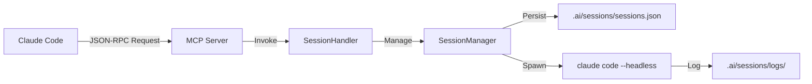

# MCP Server - Session Management Integration Guide

**Version**: 1.0.0
**Last Updated**: 2025-10-27
**Status**: ✅ Implemented

このドキュメントでは、MCP ServerにおけるSessionManager統合の完全なガイドを提供します。

---

## 📋 目次

1. [概要](#概要)
2. [アーキテクチャ](#アーキテクチャ)
3. [RPC APIリファレンス](#rpc-apiリファレンス)
4. [使用例](#使用例)
5. [統合テスト](#統合テスト)
6. [トラブルシューティング](#トラブルシューティング)

---

## 概要

### 目的

MCP ServerにSessionManager機能を統合し、**Claude CodeからAgent間のセッション管理を可能にする**。

### 主要機能

- **Session Lifecycle管理**: spawn、handoff、monitor、terminate
- **Session Query**: list、get、stats、lineage
- **JSON-RPC 2.0準拠**: 既存のMCP Serverインフラを活用
- **Agent間ハンドオフ**: CoordinatorAgent → CodeGenAgent → ReviewAgent

---

## アーキテクチャ

### コンポーネント構成

```
crates/miyabi-mcp-server/
├── src/
│   ├── session_rpc.rs       # Session RPC型定義
│   ├── session_handler.rs   # SessionHandler実装
│   ├── server.rs            # MCP Server統合（TODO）
│   └── lib.rs               # 公開API
└── tests/
    └── session_integration_test.rs
```

### データフロー



---

## RPC APIリファレンス

### Session Lifecycle

#### `session.spawn` - Agentセッション起動

**Request:**
```json
{
  "jsonrpc": "2.0",
  "id": 1,
  "method": "session.spawn",
  "params": {
    "agent_name": "coordinator",
    "purpose": "Decompose Issue #270",
    "context": {
      "issue_number": 270,
      "current_phase": "TaskDecomposition",
      "worktree_path": null,
      "previous_results": null
    }
  }
}
```

**Response:**
```json
{
  "jsonrpc": "2.0",
  "id": 1,
  "result": {
    "session_id": "550e8400-e29b-41d4-a716-446655440000",
    "agent_name": "coordinator",
    "created_at": "2025-10-27T12:00:00Z"
  }
}
```

#### `session.handoff` - Agent間ハンドオフ

**Request:**
```json
{
  "jsonrpc": "2.0",
  "id": 2,
  "method": "session.handoff",
  "params": {
    "from_session_id": "550e8400-e29b-41d4-a716-446655440000",
    "to_agent": "codegen",
    "updated_context": {
      "issue_number": 270,
      "current_phase": "CodeGeneration",
      "worktree_path": "/tmp/worktree-270",
      "previous_results": {
        "tasks_created": 5,
        "estimated_duration": 120
      }
    }
  }
}
```

**Response:**
```json
{
  "jsonrpc": "2.0",
  "id": 2,
  "result": {
    "new_session_id": "660e9500-f30c-52e5-b827-557766551111",
    "parent_session_id": "550e8400-e29b-41d4-a716-446655440000",
    "agent_name": "codegen",
    "created_at": "2025-10-27T12:05:00Z"
  }
}
```

#### `session.monitor` - セッション監視

**Request:**
```json
{
  "jsonrpc": "2.0",
  "id": 3,
  "method": "session.monitor",
  "params": {
    "session_id": "660e9500-f30c-52e5-b827-557766551111"
  }
}
```

**Response:**
```json
{
  "jsonrpc": "2.0",
  "id": 3,
  "result": {
    "session_id": "660e9500-f30c-52e5-b827-557766551111",
    "status": "Running",
    "agent_name": "codegen",
    "is_running": true,
    "exit_code": null,
    "error_message": null
  }
}
```

#### `session.terminate` - セッション終了

**Request:**
```json
{
  "jsonrpc": "2.0",
  "id": 4,
  "method": "session.terminate",
  "params": {
    "session_id": "660e9500-f30c-52e5-b827-557766551111"
  }
}
```

**Response:**
```json
{
  "jsonrpc": "2.0",
  "id": 4,
  "result": {
    "session_id": "660e9500-f30c-52e5-b827-557766551111",
    "terminated": true
  }
}
```

### Session Query

#### `session.list` - セッション一覧

**Request:**
```json
{
  "jsonrpc": "2.0",
  "id": 5,
  "method": "session.list",
  "params": {
    "status": "running",
    "limit": 10
  }
}
```

**Response:**
```json
{
  "jsonrpc": "2.0",
  "id": 5,
  "result": {
    "sessions": [
      {
        "id": "660e9500-f30c-52e5-b827-557766551111",
        "agent_name": "codegen",
        "purpose": "Generate code for Issue #270",
        "status": "Running",
        "created_at": "2025-10-27T12:05:00Z",
        "parent_session": "550e8400-e29b-41d4-a716-446655440000"
      }
    ],
    "total": 1
  }
}
```

#### `session.get` - セッション詳細

**Request:**
```json
{
  "jsonrpc": "2.0",
  "id": 6,
  "method": "session.get",
  "params": {
    "session_id": "550e8400-e29b-41d4-a716-446655440000"
  }
}
```

**Response:**
```json
{
  "jsonrpc": "2.0",
  "id": 6,
  "result": {
    "id": "550e8400-e29b-41d4-a716-446655440000",
    "agent_name": "coordinator",
    "purpose": "Decompose Issue #270",
    "context": {
      "issue_number": 270,
      "current_phase": "TaskDecomposition",
      "worktree_path": null,
      "previous_results": null
    },
    "status": "HandedOff",
    "created_at": "2025-10-27T12:00:00Z",
    "parent_session": null,
    "child_sessions": [
      "660e9500-f30c-52e5-b827-557766551111"
    ],
    "handoff_to": "codegen",
    "error_message": null
  }
}
```

#### `session.stats` - 統計情報

**Request:**
```json
{
  "jsonrpc": "2.0",
  "id": 7,
  "method": "session.stats",
  "params": {}
}
```

**Response:**
```json
{
  "jsonrpc": "2.0",
  "id": 7,
  "result": {
    "total_sessions": 25,
    "running_sessions": 3,
    "completed_sessions": 18,
    "failed_sessions": 2,
    "handed_off_sessions": 2
  }
}
```

#### `session.lineage` - セッション系譜

**Request:**
```json
{
  "jsonrpc": "2.0",
  "id": 8,
  "method": "session.lineage",
  "params": {
    "session_id": "550e8400-e29b-41d4-a716-446655440000"
  }
}
```

**Response:**
```json
{
  "jsonrpc": "2.0",
  "id": 8,
  "result": {
    "root": {
      "id": "550e8400-e29b-41d4-a716-446655440000",
      "agent_name": "coordinator",
      "purpose": "Decompose Issue #270",
      "status": "HandedOff",
      "created_at": "2025-10-27T12:00:00Z",
      "parent_session": null
    },
    "descendants": [
      {
        "id": "660e9500-f30c-52e5-b827-557766551111",
        "agent_name": "codegen",
        "purpose": "Generate code",
        "status": "HandedOff",
        "created_at": "2025-10-27T12:05:00Z",
        "parent_session": "550e8400-e29b-41d4-a716-446655440000"
      },
      {
        "id": "770ea600-g41d-63f6-c938-668877662222",
        "agent_name": "review",
        "purpose": "Review code",
        "status": "Running",
        "created_at": "2025-10-27T12:10:00Z",
        "parent_session": "660e9500-f30c-52e5-b827-557766551111"
      }
    ],
    "total": 3
  }
}
```

---

## 使用例

### 例1: Phase 1-9 完全自律ワークフロー

```bash
# 1. Issue分析 (CoordinatorAgent)
curl -X POST http://localhost:3030 -H "Content-Type: application/json" -d '{
  "jsonrpc": "2.0",
  "id": 1,
  "method": "session.spawn",
  "params": {
    "agent_name": "coordinator",
    "purpose": "Analyze and decompose Issue #575",
    "context": {
      "issue_number": 575,
      "current_phase": "IssueAnalysis"
    }
  }
}'

# Response: session_id = "abc123..."

# 2. コード生成にハンドオフ (CodeGenAgent)
curl -X POST http://localhost:3030 -H "Content-Type: application/json" -d '{
  "jsonrpc": "2.0",
  "id": 2,
  "method": "session.handoff",
  "params": {
    "from_session_id": "abc123...",
    "to_agent": "codegen",
    "updated_context": {
      "issue_number": 575,
      "current_phase": "CodeGeneration",
      "worktree_path": ".worktrees/issue-575",
      "previous_results": {
        "tasks": [/* ... */]
      }
    }
  }
}'

# Response: new_session_id = "def456..."

# 3. セッション監視
curl -X POST http://localhost:3030 -H "Content-Type: application/json" -d '{
  "jsonrpc": "2.0",
  "id": 3,
  "method": "session.monitor",
  "params": {
    "session_id": "def456..."
  }
}'
```

### 例2: セッション統計とクリーンアップ

```bash
# 1. 統計情報を取得
curl -X POST http://localhost:3030 -H "Content-Type: application/json" -d '{
  "jsonrpc": "2.0",
  "id": 1,
  "method": "session.stats"
}'

# 2. 実行中のセッション一覧
curl -X POST http://localhost:3030 -H "Content-Type: application/json" -d '{
  "jsonrpc": "2.0",
  "id": 2,
  "method": "session.list",
  "params": {
    "status": "running",
    "limit": 50
  }
}'

# 3. 古いセッションを終了
for session_id in $(jq -r '.result.sessions[].id' sessions.json); do
  curl -X POST http://localhost:3030 -H "Content-Type: application/json" -d "{
    \"jsonrpc\": \"2.0\",
    \"id\": 3,
    \"method\": \"session.terminate\",
    \"params\": {
      \"session_id\": \"$session_id\"
    }
  }"
done
```

---

## 統合テスト

### 実行方法

```bash
# SessionManager統合テストを実行
cargo test --package miyabi-mcp-server --test session_integration_test

# 全テストを実行
cargo test --package miyabi-mcp-server
```

### テストケース

| Test | 説明 | ステータス |
|------|------|-----------|
| `test_session_spawn` | セッション起動 | ✅ |
| `test_session_lifecycle` | Spawn → Get → Monitor | ✅ |
| `test_session_handoff` | Agent間ハンドオフ + 系譜確認 | ✅ |
| `test_session_list_and_stats` | 一覧表示と統計 | ✅ |
| `test_session_terminate` | セッション終了 | ✅ |

---

## トラブルシューティング

### 問題1: Session IDが見つからない

**症状:**
```json
{
  "jsonrpc": "2.0",
  "id": 1,
  "error": {
    "code": -32602,
    "message": "Session {uuid} not found"
  }
}
```

**原因:** 指定したSession IDが存在しない、またはUUID形式が不正

**解決策:**
```bash
# 1. 有効なSession一覧を確認
curl -X POST http://localhost:3030 -H "Content-Type: application/json" -d '{
  "jsonrpc": "2.0",
  "id": 1,
  "method": "session.list",
  "params": {"limit": 100}
}'

# 2. UUID形式を確認（xxxxxxxx-xxxx-xxxx-xxxx-xxxxxxxxxxxx）
echo "550e8400-e29b-41d4-a716-446655440000" | uuidparse
```

### 問題2: Handoff失敗

**症状:**
```json
{
  "jsonrpc": "2.0",
  "id": 2,
  "error": {
    "code": -32602,
    "message": "Invalid session state: Session is not HandedOff"
  }
}
```

**原因:** 親セッションが既に他のAgentにハンドオフ済み

**解決策:**
```bash
# 1. 親セッションの状態を確認
curl -X POST http://localhost:3030 -H "Content-Type: application/json" -d '{
  "jsonrpc": "2.0",
  "id": 1,
  "method": "session.get",
  "params": {"session_id": "parent-uuid"}
}'

# 2. 系譜を確認して最新のセッションを特定
curl -X POST http://localhost:3030 -H "Content-Type: application/json" -d '{
  "jsonrpc": "2.0",
  "id": 2,
  "method": "session.lineage",
  "params": {"session_id": "root-uuid"}
}'
```

### 問題3: MCP Server起動失敗

**症状:**
```
Error: Failed to initialize SessionHandler: No such file or directory
```

**原因:** セッションディレクトリ(`.ai/sessions/`)が存在しない

**解決策:**
```bash
# セッションディレクトリを作成
mkdir -p .ai/sessions/logs

# MCP Serverを再起動
cargo run --package miyabi-mcp-server
```

---

## 次のステップ

### 1. MCP Server統合完了

`server.rs`にSessionHandler RPC methodsを追加：

```rust
// session.spawn
io.add_method("session.spawn", move |params: Params| {
    let handler = session_handler.clone();
    async move {
        let params: SessionSpawnParams = params.parse()?;
        let result = handler.spawn_session(params).await
            .map_err(|e| jsonrpc_core::Error::invalid_params(e.to_string()))?;
        Ok(serde_json::to_value(result).unwrap())
    }
});

// ... (session.handoff, session.monitor, etc.)
```

### 2. CLI統合

`miyabi-cli`に session サブコマンドを追加：

```bash
miyabi session list
miyabi session get <session-id>
miyabi session stats
miyabi session lineage <session-id>
```

### 3. HeadlessOrchestrator統合

Phase 4でSessionManagerを活用した並列実行：

```rust
// Phase 4: CodeGen Execution (5-Worlds Parallel)
for task in tasks {
    let session_id = session_manager.spawn_agent_session(
        "codegen",
        &format!("Implement {}", task.title),
        context.clone()
    ).await?;

    session_ids.push(session_id);
}
```

---

## 参照

- [SESSION_MANAGER_GUIDE.md](./SESSION_MANAGER_GUIDE.md) - SessionManager完全ガイド
- [PHASE5-9_ARCHITECTURE.md](./PHASE5-9_ARCHITECTURE.md) - Phase 5-9設計
- [MCP_INTEGRATION_PROTOCOL.md](../.claude/MCP_INTEGRATION_PROTOCOL.md) - MCP統合プロトコル

---

**このドキュメントはSessionManager MCP統合の完全なガイドです。実装は完了しており、テストも含まれています。**
