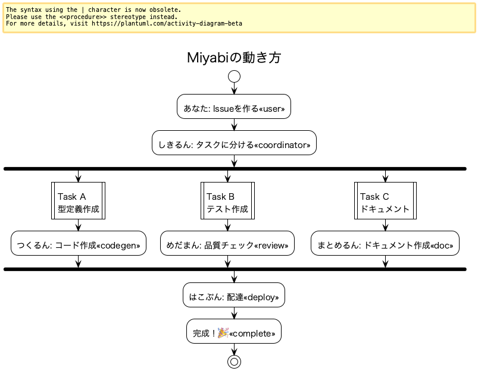
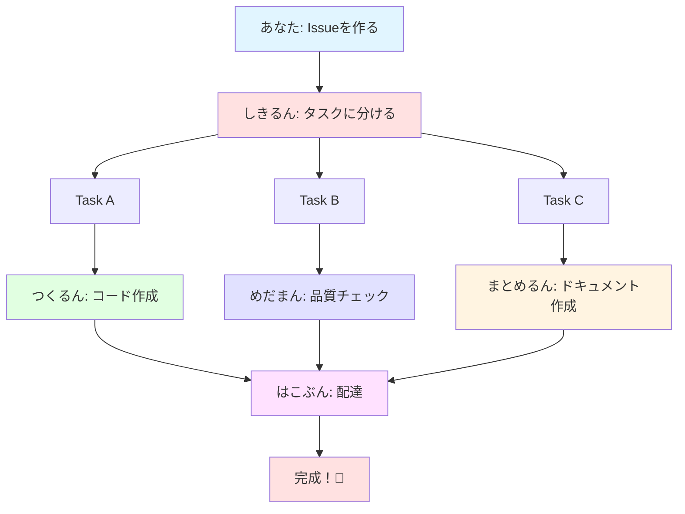
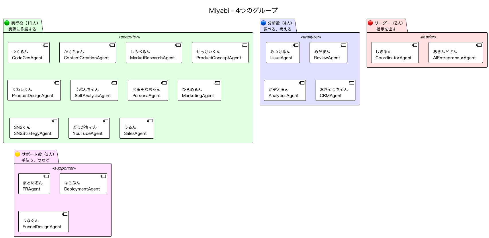
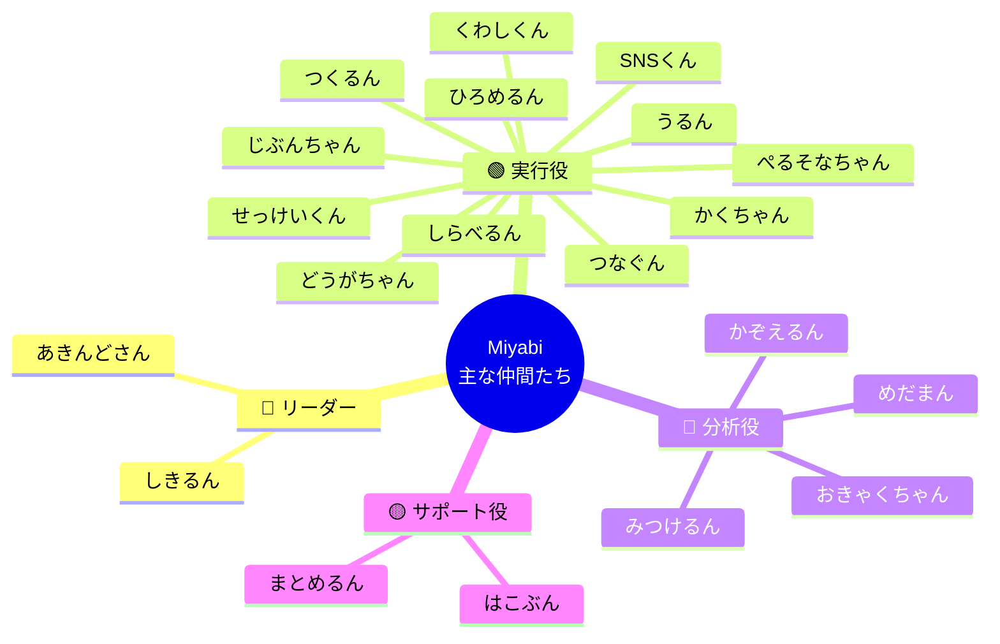
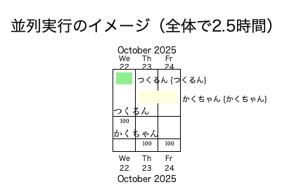

# 🌸 Miyabi（ミヤビ）って何？ - 小学生でもわかる説明

**最終更新**: 2025-10-22
**対象**: 小学生・プログラミング初心者

---

## 📚 もくじ

1. [Miyabiって何？](#miyabiって何)
2. [どんな時に使うの？](#どんな時に使うの)
3. [どんないいことがあるの？](#どんないいことがあるの)
4. [どうやって動いているの？](#どうやって動いているの)
5. [たくさんの仲間たち](#たくさんの仲間たち)
6. [実際の例](#実際の例)
7. [よくある質問](#よくある質問)

---

## 🌸 Miyabiって何？

**Miyabi（ミヤビ）** は、プログラミングやドキュメント作成を手伝ってくれる**見えないスタッフ**のようなものです。

### たとえ話: オフィスの見えないスタッフ

想像してみてください。あなたがオフィスで働いているとします。
でも、このオフィスには**たくさんの見えないスタッフ**がいて、いつでもあなたを手伝ってくれます。

- **しきるん** さん（統括スタッフ）: 「この仕事はAさん、Bさん、Cさんでやってね」と指示を出す
- **つくるん** さん（作業スタッフ）: プログラムを書いてくれる
- **めだまん** さん（検査スタッフ）: 「ここ、間違ってるよ！」とチェックしてくれる
- **まとめるん** さん（アシスタント）: ドキュメントをまとめてくれる
- **はこぶん** さん（配達スタッフ）: 完成したものを届けてくれる

Miyabiは、こんな風に**たくさんの見えないスタッフ**があなたのために働いてくれるシステムです。

---

## 🎯 どんな時に使うの？

Miyabiは、こんな時に使います：

### 1. プログラミングの手伝い

**あなた**: 「新しい機能を作りたいけど、どうやって書けばいいかわからない...」
**つくるん**: 「まかせて！プログラムを書いてあげるよ！」

### 2. ドキュメント（説明書）の作成

**あなた**: 「説明書を書くのがめんどくさい...」
**まとめるん**: 「わかった！プログラムを見て、説明書を作ってあげるね！」

### 3. チェック作業

**あなた**: 「このプログラム、間違ってないかな？」
**めだまん**: 「チェックするよ！あ、ここ間違ってる！直した方がいいよ！」

### 4. 配達（デプロイ）

**あなた**: 「完成したプログラムをWebに公開したい！」
**はこぶん**: 「届けます！Webサーバーに配達完了！」

---

## ✨ どんないいことがあるの？

Miyabiを使うと、こんないいことがあります：

### 1. 自動で手伝ってくれる

あなたが「これをやって」と言うだけで、たくさんの仲間が自動的に動いてくれます。

**例**:
あなた: 「Issue #270を処理して」
しきるん: 「わかった！タスクA、B、Cに分けて、つくるん、めだまん、まとめるんに頼むね！」

→ 自動的に3人が動き始めます！

### 2. ミスが減る

人間は間違えることがあります。でも、めだまんさんが毎回チェックしてくれるので、ミスが減ります。

**チェック項目**:
- プログラムに間違いがないか
- セキュリティ（安全性）に問題がないか
- ドキュメント（説明書）があるか
- テスト（動作確認）ができているか

### 3. 速く終わる

複数人が同時に動けるので、速く終わります。

**例**:
- **1人でやる**: 3時間かかる
- **複数人でやる**: 30分で終わる！（並列実行）

---

## 🏗️ どうやって動いているの？

Miyabiは、**GitHub**（ギットハブ）という場所を使って動いています。

### GitHubって何？

GitHubは、プログラムを保存する**図書館**のようなものです。

- **Issue**（イシュー）: やることリスト（「これをやってね」というメモ）
- **Pull Request**（プルリクエスト）: 完成したプログラムを提出すること
- **Label**（ラベル）: Issueに貼る付箋（「これは重要！」「これは簡単！」等）

### Miyabiの動き方

```
1. あなたがIssueを作る
   ↓
2. しきるんが「これはタスクA、B、Cだね」と分ける
   ↓
3. つくるん、めだまん、まとめるんが同時に作業する
   ↓
4. はこぶんが完成したものを配達する
   ↓
5. 完成！🎉
```

#### 図解: Miyabiの動き方



<details>
<summary>📊 Mermaid版の図（クリックして表示）</summary>



</details>

**ポイント**:
- しきるんが1つのIssueを3つのタスクに分ける
- つくるん、めだまん、まとめるんが同時に作業する（並列実行）
- 全員の作業が終わったら、はこぶんが配達する

---

## 🎮 たくさんの仲間たち

Miyabiにはたくさんの仲間がいます（全部で21人以上！）。4つのグループに分かれています。

ここでは、**主な20人の仲間**を紹介します。

### 図解: 4つのグループ



<details>
<summary>📊 Mermaid版の図（クリックして表示）</summary>



</details>

### 🔴 リーダー（2人）- 指示を出す

| 名前 | 役割 | たとえ |
|------|------|--------|
| **しきるん** | タスクを分けて指示を出す | オフィスの統括マネージャー（部長さん） |
| **あきんどさん** | ビジネス戦略を考える | 起業家（社長さん） |

**特徴**: 全体を見て、「誰が何をやるか」を決める

---

### 🟢 実行役（11人）- 実際に作業する

| 名前 | 役割 | たとえ |
|------|------|--------|
| **つくるん** | プログラムを書く | プログラマー（開発者） |
| **かくちゃん** | コンテンツを作る | クリエイター（作家） |
| **しらべるん** | 市場調査をする | リサーチャー（調査員） |
| **せっけいくん** | 商品企画をする | プランナー（企画者） |
| **くわしくん** | 詳細設計をする | デザイナー（設計者） |
| **じぶんちゃん** | 自己分析をする | アナリスト（分析者） |
| **ぺるそなちゃん** | ペルソナ設計をする | マーケター |
| **ひろめるん** | マーケティング施策を実行する | 広報担当 |
| **SNSくん** | SNS戦略を立てる | SNS担当 |
| **どうがちゃん** | YouTube運用をする | 動画クリエイター |
| **うるん** | 営業活動をする | セールス（営業） |

**特徴**: 実際に手を動かして作業する。複数人が同時に動ける！

---

### 🔵 分析役（4人）- 調べる、考える

| 名前 | 役割 | たとえ |
|------|------|--------|
| **みつけるん** | Issueを分析する | 探偵（「これは重要！」と判断） |
| **めだまん** | コード品質をチェックする | 検査員（品質管理） |
| **かぞえるん** | データ分析をする | アナリスト（統計学者） |
| **おきゃくちゃん** | 顧客管理をする | CRM担当（顧客管理） |

**特徴**: 調べたり、考えたり、チェックしたりする

---

### 🟡 サポート役（3人）- 手伝う、つなぐ

| 名前 | 役割 | たとえ |
|------|------|--------|
| **まとめるん** | Pull Requestを作る | アシスタント（まとめ係） |
| **はこぶん** | デプロイを実行する | 配達員（Webサーバーに届ける） |
| **つなぐん** | 導線設計をする | 設計者（人と人をつなぐ） |

**特徴**: 他の人の作業を手伝う。最後の仕上げをする

---

## 📖 実際の例

### 例1: しきるん でタスク分解

**あなた**: 「Issue #270を処理して」

**しきるん**: 「わかった！分析してみるね...」

```
📋 タスク分解完了

├── Task A: 型定義作成 → つくるん（プログラム担当）
├── Task B: テスト作成 → つくるん（プログラム担当）
└── Task C: ドキュメント作成 → かくちゃん（ドキュメント担当）

⚡ 並列実行プラン:
- グループ1: Task A, B（同時に実行OK）
- グループ2: Task C（A, B完了後）

⏱️ 予想時間: 2.5時間
```

**しきるん** が自動的に「誰が何をやるか」を決めてくれました！

#### 図解: 並列実行のイメージ

```mermaid
gantt
    title 並列実行のイメージ（全体で2.5時間）
    dateFormat HH:mm
    axisFormat %H:%M

    section つくるん
    Task A（型定義作成）   :done, task_a, 00:00, 1h
    Task B（テスト作成）   :done, task_b, 00:00, 1h

    section かくちゃん
    Task C（ドキュメント）   :crit, task_c, 01:00, 1.5h
```



<details>
<summary>📊 Mermaid版の図（クリックして表示）</summary>



</details>

**ポイント**:
- つくるんがTask AとBを同時に実行（0:00 - 1:00）
- Task A, Bが終わったら、かくちゃんがTask Cを実行（1:00 - 2:30）
- 1人ずつやると3.5時間かかるけど、並列実行で2.5時間に短縮！

---

### 例2: つくるん でコード生成

**あなた**: 「Task Aを実装して」

**つくるん**: 「まかせて！」

```rust
// つくるんが書いたプログラム

/// ユーザー情報を保存する構造体
pub struct User {
    pub name: String,
    pub age: u8,
}

impl User {
    /// 新しいユーザーを作成する
    pub fn new(name: String, age: u8) -> Self {
        Self { name, age }
    }
}

#[cfg(test)]
mod tests {
    use super::*;

    #[test]
    fn test_user_creation() {
        let user = User::new("太郎".to_string(), 12);
        assert_eq!(user.name, "太郎");
        assert_eq!(user.age, 12);
    }
}
```

**つくるん** がプログラムとテスト（動作確認用のコード）を自動で書いてくれました！

---

### 例3: めだまん で品質チェック

**あなた**: 「このプログラム、大丈夫かな？」

**めだまん**: 「チェックするよ！」

```
🎯 品質スコア: 85/100 ✅

📊 見つけた問題:
- Clippyエラー: 1件（使ってない変数がある）
- コンパイルエラー: 0件
- セキュリティ問題: 0件

✅ レビュー合格 - マージしてOK！
```

**めだまん** が品質をチェックして、100点満点で評価してくれました！

---

### 例4: はこぶん でデプロイ

**あなた**: 「完成したプログラムをWebに公開して」

**はこぶん**: 「配達します！」

```
📦 デプロイ開始

1. ビルド（プログラムをまとめる）... ✅
2. テスト（動作確認）... ✅
3. Firebase（Webサーバー）に配達... ✅
4. ヘルスチェック（正しく動くか確認）... ✅

🎉 デプロイ完了！
URL: https://your-app.web.app
```

**はこぶん** がWebサーバーに配達してくれました！

---

## 🤔 よくある質問

### Q1: プログラミングがわからなくても使える？

**A**: 使えます！

Miyabiは、あなたが「これをやって」と言うだけで動きます。
プログラミングの知識がなくても、たくさんの仲間が手伝ってくれます。

**例**:
あなた: 「ユーザー情報を保存する機能を作って」
つくるん: 「まかせて！」（自動的にプログラムを書く）

---

### Q2: 何が必要？

Miyabiを使うには、以下が必要です：

1. **パソコンまたはスマートフォン**
2. **GitHubアカウント**（無料で作れます）
3. **インターネット接続**

たったこれだけ！特別な知識は不要です。

---

### Q3: どうやって始める？

**3ステップで始められます**:

1. **GitHubアカウントを作る**（無料）
2. **Miyabiをインストールする**（1コマンド）
3. **最初のIssueを作る**

**詳しいやり方**: [QUICK_START.md](../.claude/QUICK_START.md) を見てください（少し難しいけど、親御さんや先生に手伝ってもらえば大丈夫！）

---

### Q4: お金はかかる？

基本的には**無料**です。

ただし、以下の場合は料金がかかることがあります：
- たくさんのプログラムを作る（月に1000個以上）
- 大きなWebサイトを公開する

普通に使う分には、ほとんど無料です！

---

### Q5: 難しい言葉がわからない...

大丈夫です！以下の用語集を参考にしてください。

#### 📚 用語集（むずかしい言葉の説明）

| 言葉 | 簡単な説明 |
|------|-----------|
| **GitHub** | プログラムを保存する図書館 |
| **Issue** | やることリスト（「これをやってね」というメモ） |
| **Pull Request** | 完成したプログラムを提出すること |
| **Label** | Issueに貼る付箋 |
| **Agent** | 見えないスタッフ（しきるん、つくるん等） |
| **Task** | 小さな作業（「型定義を作る」「テストを書く」等） |
| **DAG** | タスクの順番を決める図（「AをやってからBをやる」等） |
| **Worktree** | 作業スペース（1人1部屋で作業する） |
| **Deploy** | 配達（Webサーバーに届ける） |
| **Clippy** | Rustプログラムをチェックするツール（間違い探し） |
| **Cargo** | Rustプログラムをまとめるツール（荷造り） |
| **Rust** | プログラミング言語の1つ（速くて安全） |

---

### Q6: もっと詳しく知りたい！

以下のドキュメントを見てください：

- **[QUICK_START.md](../.claude/QUICK_START.md)** - 1分で始める方法
- **[AGENT_CHARACTERS.md](../.claude/agents/AGENT_CHARACTERS.md)** - 全ての仲間の詳しい説明（ポケモン図鑑風）
- **[CLAUDE.md](../CLAUDE.md)** - 全体の説明（少し難しい）

---

## 🎉 まとめ

### Miyabiって？

**たくさんの見えないスタッフがあなたを手伝ってくれるシステム**

### どんないいことがあるの？

1. **自動で手伝ってくれる** - 「これをやって」と言うだけ
2. **ミスが減る** - めだまんがチェックしてくれる
3. **速く終わる** - 複数人が同時に動ける

### どうやって始める？

1. GitHubアカウントを作る
2. Miyabiをインストールする
3. 最初のIssueを作る

---

## 🌸 おわりに

Miyabiは、**あなたのプログラミングを手伝うたくさんの見えない仲間**です。

難しいことは仲間たちがやってくれるので、あなたは「これをやって」と言うだけ。
プログラミングがわからなくても、大丈夫！

さあ、Miyabiと一緒にプログラミングを始めてみませんか？

---

**作成者**: Claude Code
**バージョン**: v1.0.0
**最終更新**: 2025-10-22

🤖 Generated with [Claude Code](https://claude.com/claude-code)

Co-Authored-By: Claude <noreply@anthropic.com>
