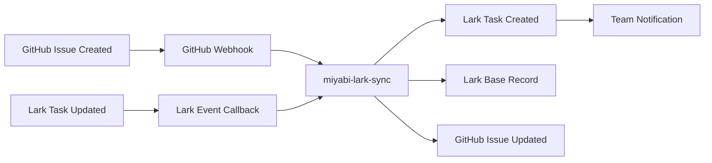

# Miyabi × Lark 完全統合ガイド

**Version**: 1.0.0
**Date**: 2025-11-06
**Status**: ✅ Ready for Implementation

---

## 📋 目次

1. [概要](#概要)
2. [アーキテクチャ](#アーキテクチャ)
3. [環境セットアップ](#環境セットアップ)
4. [実装ステップ](#実装ステップ)
5. [運用ガイド](#運用ガイド)
6. [トラブルシューティング](#トラブルシューティング)

---

## 🎯 概要

### 統合の目的

GitHub Issues を Single Source of Truth として維持しつつ、Lark の優れたコラボレーション機能を活用することで、開発生産性を向上させる。

### 主要機能

| 機能 | GitHub | Lark | 統合後の改善 |
|-----|--------|------|------------|
| **タスク管理** | Issues | Tasks + Base | リアルタイム同期 |
| **メッセージング** | ❌ (Slack別途) | Messenger | 統合コミュニケーション |
| **ドキュメント** | Markdown | Docs | 自動レポート生成 |
| **Sprint管理** | Milestones | Calendar + Base | 自動Velocity計算 |
| **Agent制御** | tmux | Bot + Approval | 承認フロー統合 |

---

## 🏗️ アーキテクチャ

### 3層アーキテクチャ

```
┌─────────────────────────────────────────────────────────────┐
│              Layer 1: Miyabi Core (GitHub as OS)             │
│    GitHub Issues, PRs, Actions, Worktrees, 21 Agents        │
└─────────────────────────────────────────────────────────────┘
                            ↕️ MCP Protocol
┌─────────────────────────────────────────────────────────────┐
│         Layer 2: Lark MCP Integration Layer                  │
│                                                               │
│  ┌──────────────────┬───────────────────┬─────────────────┐ │
│  │ lark-openapi-mcp │ lark-wiki-mcp-    │ miyabi-lark-   │ │
│  │ (公式200+ tools)  │ agents (C1-C5)   │ sync (双方向)   │ │
│  └──────────────────┴───────────────────┴─────────────────┘ │
│                                                               │
│  Features: Genesis AI, Rate Limiting, Security Safeguards   │
└─────────────────────────────────────────────────────────────┘
                            ↕️ Lark Open API
┌─────────────────────────────────────────────────────────────┐
│                   Layer 3: Lark Platform                     │
│  Messenger | Tasks | Base | Docs | Approval | Calendar      │
└─────────────────────────────────────────────────────────────┘
```

### データフロー



---

## 🔧 環境セットアップ

### Step 1: Lark App の作成

#### 1.1 Lark Open Platform にアクセス

```
https://open.larksuite.com/ (International)
または
https://open.feishu.cn/ (中国)
```

#### 1.2 アプリを作成

1. 「Create App」をクリック
2. アプリ名: **Miyabi Integration**
3. アプリ説明: **GitHub Issues と Lark を同期する統合システム**
4. アイコン: Miyabi ロゴ（オプション）

#### 1.3 認証情報を取得

```bash
# .env に保存
LARK_APP_ID=cli_xxxxxxxxxxxx
LARK_APP_SECRET=xxxxxxxxxxxxxxxxxxxxxxxx
```

#### 1.4 権限設定（Permissions & Scopes）

必要な権限をすべて有効化：

```yaml
Messenger:
  - im:message
  - im:message.group_at_msg
  - im:chat

Tasks:
  - task:task
  - task:task:readonly

Base (Bitable):
  - bitable:app
  - bitable:app:readonly

Docs:
  - docx:document
  - docx:document:readonly

Wiki:
  - wiki:wiki
  - wiki:wiki:readonly

Approval:
  - approval:approval
  - approval:approval:readonly

Calendar:
  - calendar:calendar
  - calendar:calendar:readonly
  - calendar:calendar.event

Drive:
  - drive:drive
  - drive:drive:readonly
```

#### 1.5 イベントサブスクリプション設定

```
Event Callback URL: https://your-domain.com/webhooks/lark
Encryption: Enable (生成されたキーを保存)
```

サブスクライブするイベント:
```yaml
- im.message.receive_v1
- task.v1.task.updated
- bitable.app_table_record.changed
- approval.instance.approved
- approval.instance.rejected
```

---

### Step 2: MCP Server のセットアップ

#### 2.1 公式 MCP Server のインストール

```bash
cd /Users/shunsuke/Dev/miyabi-private/integrations/lark-mcp-official

# 依存関係インストール
npm install

# ビルド
npm run build
```

#### 2.2 lark-wiki-mcp-agents のセットアップ

```bash
cd /Users/shunsuke/Dev/miyabi-private/integrations/lark-wiki-mcp-agents

# lark-openapi-mcp-enhanced をクローン（存在しない場合）
git clone https://github.com/larksuite/lark-openapi-mcp.git lark-openapi-mcp
cd lark-openapi-mcp
npm install
npm run build
cd ..

# lark-wiki-mcp-agents をビルド
npm install
npm run build
```

#### 2.3 環境変数の設定

```bash
# integrations/lark-wiki-mcp-agents/.env
cat > .env << 'EOF'
LARK_APP_ID=cli_xxxxxxxxxxxx
LARK_APP_SECRET=xxxxxxxxxxxxxxxxxxxxxxxx

# Wiki設定（ホームページ）
WIKI_SPACE_ID=7520526284150013985
ROOT_NODE_TOKEN=JqgNwZybNildpqkvLnGje92Hp0c

# Rate Limiting
RATE_LIMIT_REQUESTS_PER_MINUTE=60
RATE_LIMIT_REQUESTS_PER_HOUR=3000

# Genesis AI（オプション）
GENESIS_ENABLED=true
GENESIS_MAX_TABLES=10
EOF
```

---

### Step 3: Claude Desktop MCP 統合

#### 3.1 Claude Desktop設定ファイルを編集

```bash
# macOS
nano ~/.claude/claude_desktop_config.json

# Windows
notepad %APPDATA%\Claude\claude_desktop_config.json
```

#### 3.2 MCP Server を追加

```json
{
  "mcpServers": {
    "lark-official": {
      "command": "node",
      "args": [
        "/Users/shunsuke/Dev/miyabi-private/integrations/lark-mcp-official/dist/index.js"
      ],
      "env": {
        "LARK_APP_ID": "cli_xxxxxxxxxxxx",
        "LARK_APP_SECRET": "xxxxxxxxxxxxxxxxxxxxxxxx"
      }
    },
    "lark-wiki-agents": {
      "command": "node",
      "args": [
        "/Users/shunsuke/Dev/miyabi-private/integrations/lark-wiki-mcp-agents/dist/cli.js",
        "mcp-server"
      ],
      "env": {
        "LARK_APP_ID": "cli_xxxxxxxxxxxx",
        "LARK_APP_SECRET": "xxxxxxxxxxxxxxxxxxxxxxxx",
        "WIKI_SPACE_ID": "7520526284150013985",
        "ROOT_NODE_TOKEN": "JqgNwZybNildpqkvLnGje92Hp0c"
      }
    }
  }
}
```

#### 3.3 Claude Desktop を再起動

Claude Desktop を完全に終了して再起動し、MCP Server を読み込む。

#### 3.4 動作確認

Claude Desktop で以下を試す：

```
利用可能な Lark MCP ツールを表示して
```

期待される出力：
```
✅ lark-official: 200+ tools
✅ lark-wiki-agents: C1-C5 commands
```

---

## 📝 実装ステップ

### Phase 1: GitHub ↔ Lark 同期サービス（Week 1-2）

#### 1.1 同期サービスのディレクトリ作成

```bash
mkdir -p integrations/miyabi-lark-sync/src
cd integrations/miyabi-lark-sync
```

#### 1.2 package.json の作成

```bash
cat > package.json << 'EOF'
{
  "name": "miyabi-lark-sync",
  "version": "1.0.0",
  "description": "Bidirectional sync between GitHub Issues and Lark Tasks/Base",
  "main": "dist/index.js",
  "scripts": {
    "build": "tsc",
    "start": "node dist/index.js",
    "dev": "ts-node src/index.ts",
    "test": "jest"
  },
  "dependencies": {
    "@octokit/rest": "^20.0.2",
    "@larksuiteoapi/node-sdk": "^1.28.0",
    "express": "^4.18.2",
    "dotenv": "^16.3.1"
  },
  "devDependencies": {
    "@types/express": "^4.17.21",
    "@types/node": "^20.10.5",
    "typescript": "^5.3.3",
    "ts-node": "^10.9.2"
  }
}
EOF
```

#### 1.3 TypeScript 設定

```bash
cat > tsconfig.json << 'EOF'
{
  "compilerOptions": {
    "target": "ES2020",
    "module": "commonjs",
    "outDir": "./dist",
    "rootDir": "./src",
    "strict": true,
    "esModuleInterop": true,
    "skipLibCheck": true,
    "forceConsistentCasingInFileNames": true
  },
  "include": ["src/**/*"],
  "exclude": ["node_modules", "dist"]
}
EOF
```

#### 1.4 同期サービス実装

実装コードは `integrations/miyabi-lark-sync/src/index.ts` に記述。
詳細は別ファイル `SYNC_SERVICE_IMPLEMENTATION.md` を参照。

---

### Phase 2: Lark Base Sprint 管理（Week 3-4）

#### 2.1 Sprint Base テンプレートのインポート

Lark にログインして:

1. Base アプリを開く
2. 「テンプレートギャラリー」→「Sprint Planning Template」をインポート
3. カスタムフィールド追加:
   ```yaml
   - Agent (Single Select): CoordinatorAgent, CodeGenAgent, ...
   - Estimate (Single Select): XS, S, M, L, XL
   - Quality Score (Number): 0-100
   - GitHub Issue Number (Number)
   - GitHub URL (URL)
   ```

#### 2.2 Sprint Manager 実装

実装コードは `integrations/lark-sprint/src/sprint-manager.ts` に記述。
詳細は別ファイル `SPRINT_MANAGER_IMPLEMENTATION.md` を参照。

---

### Phase 3: Agent 実行制御（Week 5-6）

#### 3.1 Lark Bot Slash Commands 実装

実装コードは `integrations/lark-agent/src/agent-controller.ts` に記述。

サポートするコマンド:
```
/miyabi-issue <title> - Issue作成
/miyabi-status #<number> - Issueステータス確認
/miyabi-agent <type> #<number> - Agent実行
/miyabi-sprint - Sprint開始
```

#### 3.2 Approval Flow 設定

Lark で承認テンプレートを作成:
1. Approval アプリを開く
2. 「新規承認」→「カスタムテンプレート」
3. フィールド設定:
   ```yaml
   - Agent Type (Single Select)
   - Issue Number (Number)
   - Reason (Text)
   - Estimated Time (Number)
   ```

---

## 🚀 運用ガイド

### 日常ワークフロー

#### 1. Issue 作成

**Lark Messenger で:**
```
/miyabi-issue 新機能: ユーザーダッシュボード
```

**結果:**
- ✅ GitHub Issue #XXX 作成
- ✅ Lark Task 作成
- ✅ Lark Base Record 作成
- ✅ チームに通知

#### 2. Agent 実行

**Lark Messenger で:**
```
/miyabi-agent codegen #270
```

**P0-Critical Issue の場合:**
- ⏳ 承認リクエスト作成
- 👤 Tech Lead が承認
- ✅ Agent 自動実行

**それ以外:**
- ✅ 即座に Agent 実行

#### 3. Sprint 開始

**毎週月曜 (自動) または手動:**
```
/miyabi-sprint
```

**結果:**
- ✅ Sprint XX 作成（Lark Base + GitHub Milestone）
- ✅ 過去3 Sprint平均からCapacity計算
- ✅ Lark Calendar にイベント追加
- ✅ チームに通知

#### 4. 進捗確認

**Lark Base Dashboard で:**
- Sprint Progress View
- Agent Workload View
- Blocked Items View
- Quality Metrics View

**リアルタイム更新（1時間ごと）**

---

## 🔍 トラブルシューティング

### よくある問題

#### 1. MCP Server が起動しない

**症状:**
```
Claude Desktop で MCP ツールが表示されない
```

**解決策:**
```bash
# ログ確認
tail -f ~/.claude/logs/mcp.log

# MCP Server を手動起動してエラー確認
cd integrations/lark-mcp-official
node dist/index.js
```

#### 2. GitHub → Lark 同期が動作しない

**症状:**
```
Issue作成しても Lark Task が作成されない
```

**解決策:**
```bash
# Webhook確認
curl -X POST https://your-domain.com/webhooks/github \
  -H "Content-Type: application/json" \
  -d '{"action": "opened", "issue": {"number": 999}}'

# ログ確認
tail -f integrations/miyabi-lark-sync/logs/sync.log
```

#### 3. Rate Limit エラー

**症状:**
```
Error: API rate limit exceeded
```

**解決策:**
```bash
# .env で Rate Limit 設定を調整
RATE_LIMIT_REQUESTS_PER_MINUTE=30  # デフォルト60から減らす
RATE_LIMIT_REQUESTS_PER_HOUR=1500  # デフォルト3000から減らす
```

#### 4. Wiki-Bitable 統合エラー

**症状:**
```
Error: NOTEXIST - app_token not found
```

**解決策:**
```typescript
// 正しいパターン:
// 1. Wiki node情報取得
const nodeInfo = await lark.wiki.v2.space.getNode({
  token: wiki_node_token
});

// 2. obj_token を app_token として使用
const app_token = nodeInfo.data.obj_token;

// 3. Bitable 操作
const tables = await lark.bitable.v1.appTable.list({
  app_token: app_token  // ✅ obj_token を使用
});
```

---

## 📊 成功指標

### KPI

| 指標 | 現在（GitHub Only） | 目標（Lark統合後） | 改善率 |
|-----|------------------|-----------------|-------|
| **Issue作成時間** | 5分 | 1分 | 80%短縮 |
| **Agent実行待ち時間** | 10分 | 2分 | 80%短縮 |
| **Sprint Velocity** | 30 pts/Sprint | 45 pts/Sprint | 50%向上 |
| **平均Cycle Time** | 5日 | 2.5日 | 50%短縮 |
| **コミュニケーション時間** | 2時間/日 | 1時間/日 | 50%削減 |

---

## 📚 参考資料

### 公式ドキュメント

- [Lark Open Platform](https://open.larksuite.com/document/)
- [Lark MCP Official](https://github.com/larksuite/lark-openapi-mcp)
- [GitHub REST API](https://docs.github.com/en/rest)

### Miyabi 内部ドキュメント

- [ENTITY_RELATION_MODEL.md](./ENTITY_RELATION_MODEL.md)
- [LABEL_SYSTEM_GUIDE.md](./LABEL_SYSTEM_GUIDE.md)
- [AGENTS.md](../AGENTS.md)

### 実装ガイド（別ファイル）

- `SYNC_SERVICE_IMPLEMENTATION.md` - 同期サービス詳細
- `SPRINT_MANAGER_IMPLEMENTATION.md` - Sprint管理詳細
- `AGENT_CONTROLLER_IMPLEMENTATION.md` - Agent制御詳細

---

**Version History:**
- v1.0.0 (2025-11-06): 初版作成

**Maintained by**: Miyabi Team
