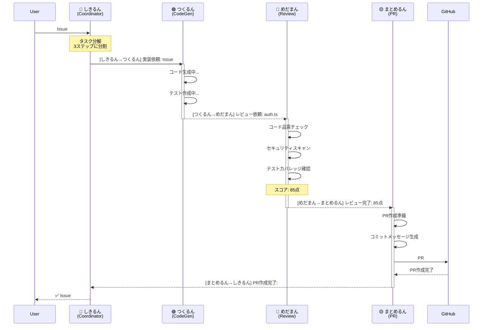
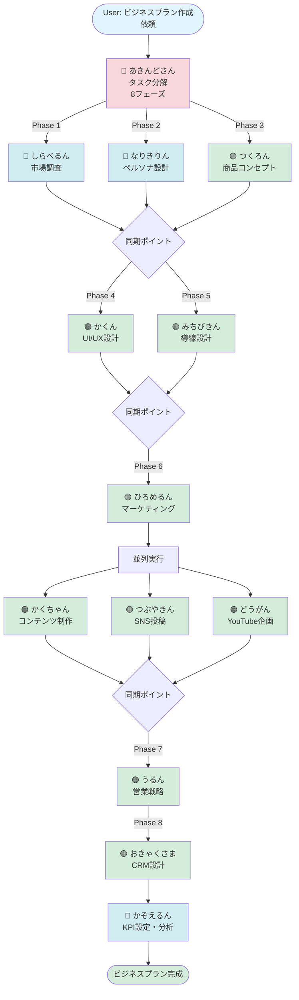
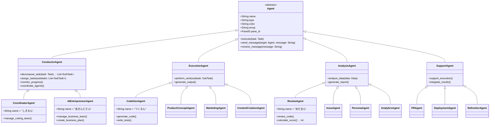

# 🎭 Miyabi Orchestra Architecture - UML & Diagrams

## 1. System Overview - Component Diagram

```mermaid
graph TB
    subgraph "User Interface"
        USER[👤 User]
        TMUX[🖥️ tmux Session]
    end

    subgraph "Miyabi Orchestra Controller"
        SCRIPT[🎼 miyabi-orchestra.sh]
        FULL[🚀 miyabi-orchestra-full.sh]
    end

    subgraph "Agent Layer - 21 Agents"
        subgraph "Coding Team (7)"
            C1[🔴 しきるん<br/>Coordinator]
            C2[🟢 つくるん<br/>CodeGen]
            C3[🔵 めだまん<br/>Review]
            C4[🔵 みつけるん<br/>Issue]
            C5[🟡 まとめるん<br/>PR]
            C6[🟡 はこぶん<br/>Deploy]
            C7[🟡 つなぐん<br/>Refresher]
        end

        subgraph "Business Team Part 1 (7)"
            B1[🔴 あきんどさん<br/>Entrepreneur]
            B2[🟢 つくろん<br/>ProductConcept]
            B3[🟢 かくん<br/>ProductDesign]
            B4[🟢 みちびきん<br/>FunnelDesign]
            B5[🔵 なりきりん<br/>Persona]
            B6[🔵 じぶんさん<br/>SelfAnalysis]
            B7[🔵 しらべるん<br/>MarketResearch]
        end

        subgraph "Business Team Part 2 (7)"
            B8[🟢 ひろめるん<br/>Marketing]
            B9[🟢 かくちゃん<br/>ContentCreation]
            B10[🟢 つぶやきん<br/>SNSStrategy]
            B11[🟢 どうがん<br/>YouTube]
            B12[🟢 うるん<br/>Sales]
            B13[🟢 おきゃくさま<br/>CRM]
            B14[🔵 かぞえるん<br/>Analytics]
        end
    end

    subgraph "Execution Environment"
        CC1[Claude Code Instance 1]
        CC2[Claude Code Instance 2]
        CC21[Claude Code Instance 21]
    end

    subgraph "Backend Services"
        GITHUB[GitHub API]
        QDRANT[Qdrant Vector DB]
        VOICEVOX[VOICEVOX TTS]
        LLM[LLM Providers]
    end

    USER --> TMUX
    TMUX --> SCRIPT
    SCRIPT --> FULL
    FULL --> C1 & C2 & C3 & C4 & C5 & C6 & C7
    FULL --> B1 & B2 & B3 & B4 & B5 & B6 & B7
    FULL --> B8 & B9 & B10 & B11 & B12 & B13 & B14

    C1 -.-> CC1
    C2 -.-> CC2
    B14 -.-> CC21

    C1 & C2 & C3 & C4 & C5 & C6 & C7 --> GITHUB
    C1 & C2 & C3 --> QDRANT
    C1 --> VOICEVOX
    C1 & C2 & B1 & B2 --> LLM
```



## 2. tmux Layout Architecture - Deployment Diagram

### Full Orchestra Layout (3x7 Grid - 21 Panes)

```
┌────────────────────────────────────────────────────────────────────────┐
│ tmux Session: miyabi-orchestra                                         │
│ Window 0: Full Orchestra Stage                                         │
├────────────────────────────────────────────────────────────────────────┤
│                                                                        │
│  ┌──────┬──────┬──────┬──────┬──────┬──────┬──────┐                  │
│  │ %0   │ %1   │ %2   │ %3   │ %4   │ %5   │ %6   │  Row 1: Coding   │
│  │ し   │ つ   │ め   │ み   │ ま   │ は   │ つ   │                  │
│  │ き   │ く   │ だ   │ つ   │ と   │ こ   │ な   │  7 Agents        │
│  │ るん │ るん │ まん │ けるん│ めるん│ ぶん │ ぐん │                  │
│  ├──────┼──────┼──────┼──────┼──────┼──────┼──────┤                  │
│  │ %7   │ %8   │ %9   │ %10  │ %11  │ %12  │ %13  │  Row 2: Business │
│  │ あ   │ つ   │ か   │ み   │ な   │ じ   │ し   │                  │
│  │ きんど│ く   │ く   │ ち   │ り   │ ぶん │ ら   │  Part 1          │
│  │ さん │ ろん │ ん   │ びきん│ きりん│ さん │ べるん│                  │
│  ├──────┼──────┼──────┼──────┼──────┼──────┼──────┤  7 Agents        │
│  │ %14  │ %15  │ %16  │ %17  │ %18  │ %19  │ %20  │                  │
│  │ ひ   │ か   │ つ   │ ど   │ う   │ お   │ か   │  Row 3: Business │
│  │ ろ   │ く   │ ぶ   │ う   │ る   │ きゃく│ ぞ   │                  │
│  │ めるん│ ちゃん│ やきん│ がん │ ん   │ さま │ えるん│  Part 2          │
│  └──────┴──────┴──────┴──────┴──────┴──────┴──────┘                  │
│                                                      7 Agents        │
│                                                                        │
└────────────────────────────────────────────────────────────────────────┘
```

### Coding Ensemble Layout (5 Panes)

```
┌─────────────────────────────────────────────┐
│ tmux Session: miyabi-coding                 │
│ Window 0: Coding Ensemble                   │
├─────────────────────────────────────────────┤
│                                             │
│  ┌──────────────┬──────────────┐            │
│  │     %0       │     %1       │            │
│  │  しきるん    │  つくるん    │            │
│  │ Coordinator  │  CodeGen     │            │
│  ├──────────────┼──────────────┤            │
│  │     %2       │     %3       │            │
│  │  めだまん    │  みつけるん  │            │
│  │  Review      │  Issue       │            │
│  ├──────────────┴──────────────┤            │
│  │           %4                │            │
│  │       まとめるん            │            │
│  │          PR                 │            │
│  └─────────────────────────────┘            │
│                                             │
└─────────────────────────────────────────────┘
```

### Hybrid Ensemble Layout (7 Panes)

```
┌─────────────────────────────────────────────┐
│ tmux Session: miyabi-hybrid                 │
│ Window 0: Hybrid Ensemble                   │
├─────────────────────────────────────────────┤
│                                             │
│  ┌──────┬──────┬──────┐                    │
│  │  %0  │  %1  │  %2  │  Coding (3)        │
│  │ しき │ つく │ めだ │                    │
│  │ るん │ るん │ まん │                    │
│  ├──────┼──────┼──────┤                    │
│  │  %3  │  %4  │  %5  │  Business (3)      │
│  │ あきん│ つく │ ひろ │                    │
│  │ どさん│ ろん │ めるん│                    │
│  ├──────┴──────┴──────┤                    │
│  │        %6           │  Monitor           │
│  │    かぞえるん       │                    │
│  │    Analytics        │                    │
│  └─────────────────────┘                    │
│                                             │
└─────────────────────────────────────────────┘
```

## 3. Agent Communication Flow - Sequence Diagram



## 4. Business Agent Workflow - Activity Diagram



## 5. Agent Class Hierarchy - Class Diagram



## 6. Data Flow - Data Flow Diagram

```
┌─────────────────────────────────────────────────────────────────┐
│                      Miyabi Orchestra Data Flow                 │
└─────────────────────────────────────────────────────────────────┘

  ┌──────────┐
  │  User    │
  │  Input   │
  └────┬─────┘
       │
       │ Task Description
       ▼
  ┌─────────────────┐
  │  Coordinator    │
  │  Agent          │
  │  (しきるん)     │
  └────┬────────────┘
       │
       │ Task Decomposition
       ├─────────────────┬─────────────────┬──────────────────┐
       ▼                 ▼                 ▼                  ▼
  ┌─────────┐      ┌─────────┐      ┌─────────┐       ┌─────────┐
  │ CodeGen │      │ Review  │      │  Issue  │       │   PR    │
  │ Agent   │      │ Agent   │      │ Agent   │       │ Agent   │
  │(つくるん)│      │(めだまん)│      │(みつける)│       │(まとめる)│
  └────┬────┘      └────┬────┘      └────┬────┘       └────┬────┘
       │                │                │                 │
       │ Code           │ Review         │ Labels          │ PR
       │ Generated      │ Score          │ Applied         │ Created
       ▼                ▼                ▼                 ▼
  ┌──────────────────────────────────────────────────────────────┐
  │                    GitHub Repository                          │
  │  ┌──────────┐  ┌──────────┐  ┌──────────┐  ┌──────────┐    │
  │  │  Issues  │  │  Code    │  │  Tests   │  │  PRs     │    │
  │  └──────────┘  └──────────┘  └──────────┘  └──────────┘    │
  └───────────────────────────────┬──────────────────────────────┘
                                  │
                                  │ Deployment Trigger
                                  ▼
                            ┌─────────────┐
                            │ Deployment  │
                            │   Agent     │
                            │  (はこぶん) │
                            └──────┬──────┘
                                   │
                                   │ Deploy
                                   ▼
                            ┌─────────────┐
                            │ Production  │
                            │ Environment │
                            └─────────────┘
```

## 7. Parallel Execution Model - Deployment Diagram

```
┌──────────────────────────────────────────────────────────────────┐
│            Parallel Execution - 21 Agents Simultaneous           │
└──────────────────────────────────────────────────────────────────┘

Time: T0 ────────────────────────────────────────────────────────▶

┌─ Coding Team (7 Agents) ─────────────────────────────────────────┐
│                                                                  │
│  [しきるん] ████████████████████████████████                    │
│  [つくるん] ░░░░████████████████████████████                    │
│  [めだまん] ░░░░░░░░░░████████████████████                      │
│  [みつける] ░░░░░░░░░░████████████████████                      │
│  [まとめる] ░░░░░░░░░░░░░░░░░░░░████████                        │
│  [はこぶん] ░░░░░░░░░░░░░░░░░░░░░░░░████                        │
│  [つなぐん] ████████████████████████████████                    │
│                                                                  │
└──────────────────────────────────────────────────────────────────┘

┌─ Business Team (14 Agents) ──────────────────────────────────────┐
│                                                                  │
│  [あきんど] ████████████████████████████████                    │
│  [つくろん] ░░░░████████████████████████████                    │
│  [かくん]   ░░░░░░░░████████████████████████                    │
│  [みちびき] ░░░░░░░░░░░░████████████████████                    │
│  [なりきり] ░░░░████████████████████████████                    │
│  [じぶんさ] ░░░░████████████████████████████                    │
│  [しらべる] ░░░░████████████████████████████                    │
│  [ひろめる] ░░░░░░░░░░░░░░░░████████████████                    │
│  [かくちゃ] ░░░░░░░░░░░░░░░░░░░░████████████                    │
│  [つぶやき] ░░░░░░░░░░░░░░░░░░░░████████████                    │
│  [どうがん] ░░░░░░░░░░░░░░░░░░░░████████████                    │
│  [うるん]   ░░░░░░░░░░░░░░░░░░░░░░░░████████                    │
│  [おきゃく] ░░░░░░░░░░░░░░░░░░░░░░░░░░░░████                    │
│  [かぞえる] ░░░░░░░░░░░░░░░░░░░░░░░░░░░░░░░░████                │
│                                                                  │
└──────────────────────────────────────────────────────────────────┘

Legend:
  ████ Active Execution
  ░░░░ Waiting / Idle
```

## 8. System Deployment - Physical Architecture

```
┌─────────────────────────────────────────────────────────────────┐
│                    Physical Deployment Model                    │
└─────────────────────────────────────────────────────────────────┘

  ┌───────────────────────────────────────────────────────────────┐
  │  Local Machine (Client)                                       │
  │  ┌─────────────────────────────────────────────────────────┐  │
  │  │  Terminal Emulator (iTerm2 / Alacritty)                 │  │
  │  │  ┌────────────────────────────────────────────────────┐ │  │
  │  │  │  tmux Session: miyabi-orchestra                    │ │  │
  │  │  │  ┌──────────────────────────────────────────────┐  │ │  │
  │  │  │  │  21 Panes × Claude Code Instances            │  │ │  │
  │  │  │  │  (Each consuming ~2GB RAM)                   │  │ │  │
  │  │  │  │  Total: ~42GB RAM required                   │  │ │  │
  │  │  │  └──────────────────────────────────────────────┘  │ │  │
  │  │  └────────────────────────────────────────────────────┘ │  │
  │  └─────────────────────────────────────────────────────────┘  │
  └────────────────────────────┬────────────────────────────────────┘
                               │
                               │ HTTPS (API Calls)
                               │
  ┌────────────────────────────┴────────────────────────────────────┐
  │  Cloud Services                                                 │
  │  ┌──────────────┐  ┌──────────────┐  ┌──────────────┐         │
  │  │ Anthropic    │  │ OpenAI       │  │ Google       │         │
  │  │ Claude API   │  │ GPT API      │  │ Gemini API   │         │
  │  │ (Primary)    │  │ (Fallback)   │  │ (Fallback)   │         │
  │  └──────────────┘  └──────────────┘  └──────────────┘         │
  │                                                                 │
  │  ┌──────────────┐  ┌──────────────┐  ┌──────────────┐         │
  │  │ GitHub API   │  │ Qdrant       │  │ Firebase     │         │
  │  │ (Issues/PRs) │  │ (Vector DB)  │  │ (Hosting)    │         │
  │  └──────────────┘  └──────────────┘  └──────────────┘         │
  └─────────────────────────────────────────────────────────────────┘
```

---

## Summary

この図は、Miyabi Orchestra の以下を示しています：

1. **Component Diagram**: システム全体の構成要素
2. **Deployment Diagram**: tmux レイアウト（3種類）
3. **Sequence Diagram**: Agent間の通信フロー
4. **Activity Diagram**: Business Workflow
5. **Class Diagram**: Agent のクラス階層
6. **Data Flow Diagram**: データの流れ
7. **Parallel Execution**: 21 Agents の並列実行タイムライン
8. **Physical Architecture**: 物理的なデプロイメント構成

これらの図により、Miyabi Orchestra の全体像が理解できます。
