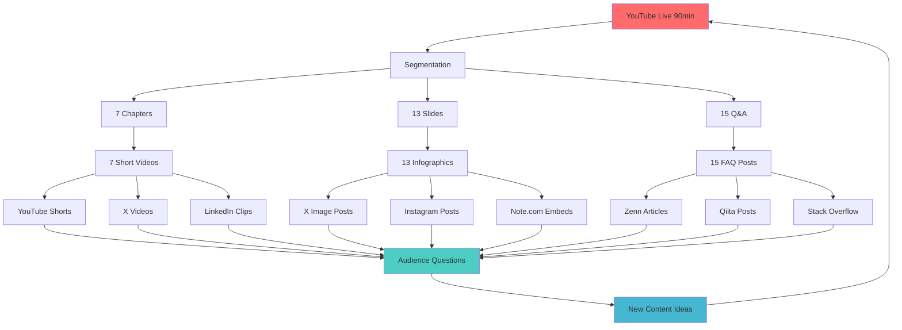

# 🌀 Perpetual Content Momentum System
## Infinite Content Recycling & Amplification Engine

**Version**: 1.0.0
**Last Updated**: 2025-12-07
**Purpose**: Transform single YouTube Live into perpetual content generation cycle

---

## 🎯 SYSTEM OVERVIEW

### Core Principle
```
1本のYouTube Live → 100+のコンテンツアセット → 永続的なエンゲージメント
```

### Philosophy
```yaml
traditional_approach:
  effort: "100%"
  output: "1 video"
  lifespan: "1 week"
  ROI: "Low"

perpetual_momentum:
  effort: "100% (initial)"
  output: "50+ content pieces"
  lifespan: "Infinite (self-sustaining)"
  ROI: "Exponential"
```

---

## 🔄 CONTENT FLYWHEEL ARCHITECTURE



---

## 📊 CONTENT MATRIX

### Primary Content (Phase 1: Day 0-1)

#### From Live Stream
| Asset Type | Quantity | Platform | Timeline |
|-----------|----------|----------|----------|
| Full Archive | 1 | YouTube | Day 0 (Immediate) |
| Chapters | 7 | YouTube Timestamps | Day 0 |
| Transcript | 1 | GitHub Gist | Day 1 |
| Key Slides | 13 | Slide Deck | Day 1 |

#### Immediate Derivatives
| Content Type | Quantity | Effort | Timeline |
|-------------|----------|--------|----------|
| Highlight Clips (60s) | 7 | Low | Day 1 |
| Quote Graphics | 10 | Low | Day 1 |
| Code Snippets | 15 | Low | Day 1 |
| X Thread | 1 | Medium | Day 1 |

### Secondary Content (Phase 2: Day 2-7)

#### Long-Form Articles
```yaml
note_com:
  articles:
    - title: "Rust × Claude AI開発で学んだ10の教訓"
      length: "3,000-5,000文字"
      images: 5
      code_blocks: 10
      timeline: "Day 2"

    - title: "tmux永続ペインIDでマルチエージェント開発を実現する"
      length: "2,500-4,000文字"
      images: 3
      code_blocks: 8
      timeline: "Day 3"

zenn:
  articles:
    - title: "Claude Codeで58クレートを管理する設定ファイル完全ガイド"
      type: "tech"
      length: "2,000-3,000文字"
      timeline: "Day 4"

    - title: "overview.md戦略：AIにプロジェクト全体を理解させる方法"
      type: "idea"
      length: "1,500-2,500文字"
      timeline: "Day 5"

qiita:
  articles:
    - title: "[Rust] .cargo/config.tomlで開発効率を3倍にする設定集"
      tags: ["Rust", "cargo", "開発環境"]
      timeline: "Day 6"

    - title: "AIペアプログラミングのエラーハンドリングパターン集"
      tags: ["Rust", "AI", "Claude"]
      timeline: "Day 7"
```

#### English Content
```yaml
dev_to:
  articles:
    - title: "Building a 58-Crate Rust Project with Claude AI: Lessons Learned"
      timeline: "Day 3"
      tags: ["rust", "ai", "claude", "productivity"]

    - title: "Multi-Agent Development with tmux Permanent Pane IDs"
      timeline: "Day 5"
      tags: ["tmux", "automation", "devtools"]

medium:
  articles:
    - title: "How We Built a vSphere Clone in 6 Hours Using AI (and You Can Too)"
      timeline: "Day 4"
      distribution: "Rust Publication"
```

### Tertiary Content (Phase 3: Day 8-30)

#### Social Media Series
```yaml
x_twitter:
  threads:
    - topic: "Rust Error Handling with AI"
      tweets: 7
      frequency: "Week 2 Mon"

    - topic: "tmux Orchestration Patterns"
      tweets: 5
      frequency: "Week 2 Wed"

    - topic: "OSS Growth Strategies"
      tweets: 6
      frequency: "Week 2 Fri"

  daily_tips:
    format: "1 tip/day from RUST_CHEATSHEET.md"
    duration: "30 days"
    hashtags: ["#RustLang", "#ClaudeAI"]

linkedin:
  posts:
    - type: "Case Study"
      title: "Enterprise AI-Assisted Development: A Rust Project Case Study"
      frequency: "Week 2"

    - type: "Thought Leadership"
      title: "The Future of AI-Human Collaboration in Software Development"
      frequency: "Week 3"
```

#### Video Derivatives
```yaml
youtube_shorts:
  clips:
    - title: "tmux永続ペインIDの魔法 #Shorts"
      duration: "45s"
      source: "Part 4 (00:45-01:00)"

    - title: "overview.md戦略で開発速度3倍 #Shorts"
      duration: "50s"
      source: "Part 5 (01:00-01:15)"

    - title: "Rustエラーハンドリングの秘訣 #Shorts"
      duration: "40s"
      source: "Part 2 (00:10-00:25)"

  frequency: "3/week for 4 weeks"
  total: 12

x_videos:
  clips: "Same as YouTube Shorts"
  optimization: "Square aspect ratio (1:1)"
  captions: "Burnt-in Japanese subtitles"
```

#### Interactive Content
```yaml
github_discussions:
  topics:
    - "Share Your Miyabi Setup"
    - "Best Practices You Discovered"
    - "Feature Requests Voting"
    - "Troubleshooting Help"

  frequency: "1 new topic/week"
  moderation: "Daily responses"

reddit:
  posts:
    - subreddit: "r/rust"
      title: "I built a 58-crate Rust project with Claude AI - AMA"
      type: "AMA"
      timing: "Week 2"

    - subreddit: "r/programming"
      title: "Multi-Agent Development: Orchestrating AI with tmux"
      type: "Discussion"
      timing: "Week 3"

stack_overflow:
  answers:
    - tag: "rust"
      approach: "Link to specific sections of RUST_CHEATSHEET.md"
      target: "5+ answers/week"
```

---

## 🎬 CONTENT PRODUCTION WORKFLOWS

### Automated Extraction

#### Transcript Processing
```bash
# YouTube自動字幕 → テキスト抽出
youtube-dl --write-auto-sub --skip-download [VIDEO_URL]

# タイムスタンプ付きチャプター生成
./scripts/generate-chapters.sh transcript.srt

# Q&A部分の自動抽出
grep -E "質問|Question|Q:" transcript.txt > qa_sections.txt
```

#### Clip Generation
```bash
# FFmpegで自動クリッピング
./scripts/create-clips.sh \
  --input miyabi-live.mp4 \
  --chapters chapters.json \
  --output clips/

# YouTube Shorts用 (9:16)
ffmpeg -i clip.mp4 -vf "crop=ih*9/16:ih" -c:a copy clip_short.mp4

# X Video用 (1:1)
ffmpeg -i clip.mp4 -vf "crop=ih:ih" -c:a copy clip_square.mp4
```

#### Image Extraction
```bash
# キーフレーム抽出
ffmpeg -i miyabi-live.mp4 -vf "select=eq(pict_type\,I)" \
  -vsync vfr frames/%04d.png

# スライド部分の自動検出・抽出
./scripts/extract-slides.sh miyabi-live.mp4
```

### Semi-Automated Generation

#### Quote Graphics
```typescript
// 自動引用画像生成
import { generateQuoteGraphic } from '@miyabi/content-tools';

const quotes = [
  {
    text: "overview.mdでコンテキストを集約すれば、AIは一貫したコードを生成できる",
    speaker: "Miyabi Live",
    timestamp: "00:15:30",
    background: "slides/03-solution.png"
  },
  // ... more quotes
];

quotes.forEach(quote => {
  generateQuoteGraphic(quote, {
    template: 'miyabi-brand',
    output: `quotes/${quote.timestamp}.png`
  });
});
```

#### Blog Post Templates
```markdown
# [タイトル] - Miyabi Live より

> この記事は、YouTube Live「Rust × Claude AI開発ベストプラクティス」
> の内容を深掘りしたものです。
>
> 📺 [配信アーカイブを見る](LINK)

## 背景

[YouTube Live Part 2の内容を要約]

## 詳細解説

[該当部分のスクリーンショット + コードブロック]

## 実践例

[GitHub repoから実例を引用]

## まとめ

[Key Takeaways 3-5点]

---

🔗 **関連リンク**
- GitHub: [miyabi-rust-claude-guide](LINK)
- YouTube: [チャンネル登録](LINK)
- X: [@miyabi_labs](LINK)

💬 **質問・フィードバック**
GitHub Discussionsでお待ちしています！
```

---

## 📈 CONTENT DISTRIBUTION STRATEGY

### Platform-Specific Optimization

#### YouTube
```yaml
seo:
  title_variations:
    - "【完全解説】Rust × Claude AI開発の全て｜58クレート実証"
    - "Miyabi OSS公開！マルチエージェント開発システムの裏側"
    - "6時間でvSphereクローンを作った戦略｜Rust + AI"

  description_sections:
    - "Hook (2行)"
    - "タイムスタンプ"
    - "関連リンク"
    - "SEOテキスト (200-300文字)"
    - "ハッシュタグ"

  tags: ["15 tags optimized for discovery"]

  thumbnails:
    - "A_rust_crab_claude.png"
    - "B_tmux_terminal.png"
    - "C_oss_community.png"

  ab_test: "48時間ごとにローテーション"

chapters:
  auto_generate: true
  tool: "./scripts/youtube-chapters.sh"
```

#### X (Twitter)
```yaml
thread_structure:
  opening_hook:
    - "🚨 大発表"
    - "数字でインパクト"
    - "質問形式"

  body (7-10 tweets):
    - "各パート1ツイート"
    - "スクショ/GIF添付"
    - "コードブロック（画像化）"

  closing:
    - "CTA (リンク)"
    - "リプ募集"
    - "RT依頼"

  hashtags: "最後のツイートのみ"

  timing:
    - "Day 1: 配信直後"
    - "Day 3: 記事公開時"
    - "Day 7: ハイライトまとめ"
```

#### Note.com
```yaml
article_structure:
  header_image: "アイキャッチ（1280x670）"

  sections:
    - "導入（300文字）"
    - "背景説明（500文字）"
    - "本編（2000-3000文字）"
    - "実践例（500文字）"
    - "まとめ（300文字）"

  media:
    - "画像 5-7枚"
    - "コードブロック 3-5個"
    - "引用 2-3箇所"

  monetization:
    - "無料公開（PV最大化）"
    - "サポート機能ON"
    - "関連有料コンテンツへの導線"

  cross_promotion:
    - "YouTube埋め込み"
    - "GitHub badge"
    - "X Timeline埋め込み"
```

#### LinkedIn
```yaml
professional_angle:
  topics:
    - "Enterprise AI adoption"
    - "Developer productivity metrics"
    - "OSS community building"
    - "Technical leadership"

  format:
    - "Hook (1-2行、改行後が重要)"
    - "Context（業界トレンド）"
    - "Case study（Miyabi実績）"
    - "Insights（学び）"
    - "CTA（意見募集）"

  tone: "Professional but approachable"

  hashtags: "3-5個（業界標準）"
```

#### Zenn/Qiita
```yaml
technical_depth:
  zenn:
    audience: "中級-上級エンジニア"
    focus: "設計思想、アーキテクチャ"
    length: "2000-4000文字"

  qiita:
    audience: "初級-中級エンジニア"
    focus: "実装Tips、ハウツー"
    length: "1500-3000文字"

cross_reference:
  strategy: "Zennで概念、Qiitaで実装"
  example:
    - zenn: "マルチエージェント設計パターン"
    - qiita: "tmux send-keysコマンド完全ガイド"
```

---

## 🔁 FEEDBACK LOOP MECHANISMS

### Audience Intelligence Gathering

#### Questions as Content Seeds
```yaml
process:
  step_1: "全質問を集約（YouTube, X, GitHub）"
  step_2: "カテゴリ分類"
  step_3: "優先度付け"
  step_4: "コンテンツ化"

categories:
  technical_deep_dive:
    - "個別記事で詳細解説"
    - "次回配信のテーマ"

  quick_tips:
    - "X Thread"
    - "YouTube Short"

  community_discussion:
    - "GitHub Discussion"
    - "Poll作成"

  feature_request:
    - "Issue作成"
    - "ロードマップ反映"
```

#### Analytics-Driven Iteration
```yaml
metrics_to_content:
  high_retention_parts:
    action: "そのトピックで深掘り記事"
    example: "Part 4の視聴維持率80% → tmux専用記事"

  high_drop_off_parts:
    action: "別アプローチで説明し直し"
    example: "Part 5で離脱20% → 図解多めのNote記事"

  popular_slides:
    action: "単体インフォグラフィックとして再配布"
    example: "Slide 5がXで20RTsされた → 高解像度版公開"

  most_replayed_segments:
    action: "Shorts化優先"
    example: "00:47-00:52 を20人がリプレイ → Short化"
```

### Community Co-Creation

#### User-Generated Content Incentives
```yaml
showcase_program:
  call_to_action: "Miyabiであなたのプロジェクトを構築し、成果を共有"

  incentives:
    - "公式X/YouTubeで紹介"
    - "GitHub Featured Projects"
    - "次回配信でデモ"
    - "特製ステッカー送付"

  submission_format:
    - "GitHub repo"
    - "3分デモ動画"
    - "ブログ記事"

contribution_content:
  type: "Community members write guest posts"
  topics:
    - "使ってみた系"
    - "カスタマイズ事例"
    - "他言語への応用"

  publication:
    - "Note.com (著者名明記)"
    - "YouTube Community tab"
    - "GitHub Wiki"
```

---

## 📅 CONTENT CALENDAR (90日サイクル)

### Week 1-2: Launch Phase
```yaml
day_0: "YouTube Live配信"
day_1:
  - "アーカイブSEO最適化"
  - "GitHub公開"
  - "X告知スレッド"

day_2:
  - "Note.com 第1弾"
  - "Shorts 1-3公開"

day_3:
  - "Zenn記事"
  - "X Thread (Technical)"

day_4:
  - "Qiita記事"
  - "Shorts 4-6公開"

day_5:
  - "Dev.to (English)"
  - "LinkedIn Post"

day_6:
  - "Reddit r/rust"
  - "X Thread (OSS Strategy)"

day_7:
  - "週次まとめ記事"
  - "次週予告"

day_8-14:
  - "Daily: X Tips (1/day)"
  - "Shorts継続（3/week）"
  - "Community engagement"
```

### Week 3-4: Amplification Phase
```yaml
activities:
  content_creation:
    - "Long-form articles (2/week)"
    - "Technical deep-dives"
    - "Case studies"

  community:
    - "GitHub Discussions活性化"
    - "Q&A sessions"
    - "Contributor onboarding"

  cross_promotion:
    - "Guest posts on partner blogs"
    - "Podcast appearances"
    - "Community spotlights"
```

### Week 5-12: Sustain & Iterate Phase
```yaml
content_rhythm:
  weekly:
    - "1 long-form article"
    - "3 YouTube Shorts"
    - "5 X posts"
    - "1 GitHub Discussion topic"

  biweekly:
    - "Community showcase"
    - "Changelog/updates"

  monthly:
    - "Next live stream (新テーマ)"
    - "Monthly recap"
    - "Roadmap update"

feedback_integration:
  - "Collect: Analytics, comments, issues"
  - "Analyze: Patterns, requests, pain points"
  - "Plan: Next content/features"
  - "Execute: Improved iteration"
```

---

## 🚀 ACCELERATION MECHANISMS

### Automation Tools

#### Content Generation Scripts
```bash
# 自動記事テンプレート生成
./scripts/content-from-transcript.sh \
  --input transcript.txt \
  --type blog \
  --platform note.com \
  --output drafts/

# コードスニペット抽出
./scripts/extract-code-blocks.sh \
  --repo-path ~/miyabi \
  --referenced-in transcript.txt \
  --output snippets/

# Quote画像一括生成
./scripts/generate-quotes.sh \
  --quotes quotes.json \
  --template miyabi-brand \
  --output quote-images/
```

#### Distribution Automation
```bash
# X Thread自動投稿（下書きから）
./scripts/post-x-thread.sh thread-draft.md

# Note.com予約投稿
./scripts/schedule-note.sh article.md --date "2025-12-10 08:00"

# YouTube Shorts一括アップロード
./scripts/upload-shorts.sh clips/*.mp4 --schedule-spread 2days
```

### Batch Processing

#### Content Assembly Line
```yaml
stage_1_raw_extraction:
  inputs: ["Live video", "Transcript", "Slides"]
  outputs: ["Clips", "Screenshots", "Text segments"]
  tools: ["FFmpeg", "ImageMagick", "NLP scripts"]

stage_2_content_creation:
  inputs: ["Raw assets from Stage 1"]
  outputs: ["Draft articles", "Social posts", "Graphics"]
  tools: ["Templates", "Claude API", "Design tools"]

stage_3_optimization:
  inputs: ["Drafts from Stage 2"]
  outputs: ["SEO-optimized", "Platform-tailored"]
  tools: ["SEO tools", "Grammarly", "Preview tools"]

stage_4_scheduling:
  inputs: ["Finalized content"]
  outputs: ["Scheduled posts across platforms"]
  tools: ["Buffer", "Hootsuite", "Custom scripts"]

stage_5_monitoring:
  inputs: ["Published content"]
  outputs: ["Performance data", "Engagement metrics"]
  tools: ["Analytics APIs", "Dashboards"]
```

---

## 📊 ROI TRACKING

### Effort vs Output Matrix

```yaml
initial_investment:
  live_preparation: "16 hours"
  live_execution: "2 hours"
  post_production: "4 hours"
  total: "22 hours"

content_output:
  week_1: "25 pieces"
  week_2: "20 pieces"
  week_3: "15 pieces"
  week_4: "10 pieces"
  total_90_days: "100+ pieces"

effort_multiplier:
  formula: "Total Output / Initial Investment"
  result: "100 pieces / 22 hours = 4.5x"

reach_multiplier:
  youtube_live_views: "500"
  total_content_views: "5,000+"
  multiplier: "10x"
```

### Success Indicators

```yaml
quantitative:
  github_stars: "Target: 100+"
  total_content_views: "Target: 5,000+"
  community_size: "Target: 200+"
  returning_engagement: "Target: 30%+"

qualitative:
  brand_recognition: "Miyabi = Rust + AI Best Practices"
  community_health: "Active discussions, PRs, showcases"
  thought_leadership: "Referenced by others"
  ecosystem_impact: "Derivatives, forks, integrations"
```

---

## 🎓 OPTIMIZATION STRATEGIES

### Content Performance Analysis

#### A/B Testing
```yaml
titles:
  test: "Technical vs Benefit-driven"
  example_a: "tmux永続ペインIDの実装方法"
  example_b: "tmux設定で開発効率3倍になった話"
  metric: "CTR"

thumbnails:
  test: "Face vs Code vs Diagram"
  duration: "48 hours per variant"
  metric: "Impressions to views"

posting_times:
  test: "Morning vs Lunch vs Evening"
  platforms: "X, LinkedIn"
  metric: "Engagement rate"
```

#### Content Refresh
```yaml
evergreen_content:
  frequency: "Every 3 months"
  updates:
    - "Latest best practices"
    - "New examples"
    - "Updated screenshots"
    - "Reader feedback integration"

  republish:
    - "X: Quote new sections"
    - "Note.com: Mark as 'Updated'"
    - "YouTube: Community post with link"
```

### Cross-Pollination

#### Content Remixing
```yaml
formats:
  text_to_video:
    - "Blog post → YouTube explainer"
    - "GitHub README → Tutorial video"

  video_to_text:
    - "Live stream → Blog series"
    - "Shorts → X Thread"

  interactive:
    - "Article → GitHub Discussion"
    - "Video → Quiz/Poll"

  visual:
    - "Code → Infographic"
    - "Stats → Data visualization"
```

---

## 🌐 ECOSYSTEM INTEGRATION

### Strategic Partnerships

#### Cross-Promotion
```yaml
rust_community:
  targets:
    - "This Week in Rust"
    - "Rust Blog"
    - "Awesome Rust"

  contribution:
    - "Submit to newsletters"
    - "Propose guest posts"
    - "Share community events"

ai_community:
  targets:
    - "Anthropic Discord"
    - "Claude Developers"
    - "AI Engineering communities"

  contribution:
    - "Share use cases"
    - "Contribute to discussions"
    - "Showcase advanced usage"
```

#### Syndication Network
```yaml
automatic_syndication:
  - "Dev.to → Medium (canonical link)"
  - "Note.com → Hatena Blog (excerpt)"
  - "X Thread → Threader App (archive)"

manual_syndication:
  - "Best articles → Company blog"
  - "Case studies → Partner sites"
  - "Tutorials → Educational platforms"
```

---

## 📝 EXECUTION CHECKLIST

### Pre-Launch (Before Live)
- [ ] Content extraction scripts tested
- [ ] Distribution accounts configured
- [ ] Template库 created (blog, social, video)
- [ ] Automation workflows tested
- [ ] Analytics tracking setup

### Launch Week
- [ ] Day 0: Live + immediate distribution
- [ ] Day 1-2: Raw content extraction
- [ ] Day 3-5: Primary content creation
- [ ] Day 6-7: Secondary distribution

### Sustain Phase (Week 2+)
- [ ] Daily: X engagement
- [ ] 2x/week: Long-form content
- [ ] 3x/week: Short-form video
- [ ] Weekly: Community update
- [ ] Biweekly: Analytics review

---

*Generated by Miyabi Marketing Agent - Perpetual Content System*
*Version: 1.0.0*
