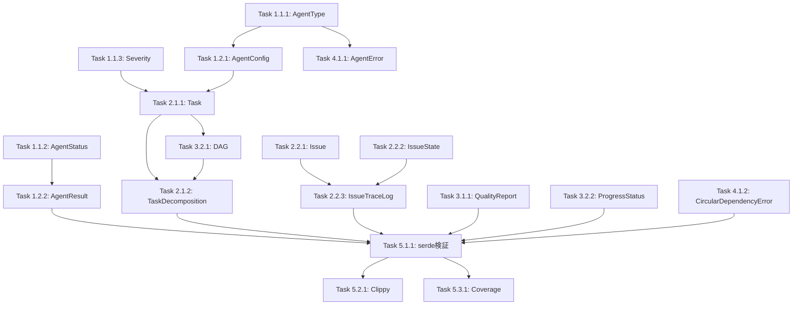

# Phase 3: コア型定義移植 - 完全階層的タスク分解

**しきるん（CoordinatorAgent）による4階層分解**

```
Phase（大フェーズ）
  └─ サブ1周（サブイテレーション）
      └─ タスク（実装単位）
          └─ ツール（実行コマンド）
```

---

## 📊 Phase 3 全体構造

```
Phase 3: コア型定義移植（推定: 3時間）
├─ サブ1周1: 基本型テスト実装（45分）
│  ├─ 1.1: Agent関連型（30分）
│  └─ 1.2: 構造体型（15分）
├─ サブ1周2: ドメイン型テスト実装（50分）
│  ├─ 2.1: Task関連型（25分）
│  └─ 2.2: Issue関連型（25分）
├─ サブ1周3: 補助型テスト実装（40分）
│  ├─ 3.1: Quality関連型（20分）
│  └─ 3.2: Workflow関連型（20分）
├─ サブ1周4: エラー型テスト実装（20分）
│  └─ 4.1: Error関連型（20分）
└─ サブ1周5: 統合検証（25分）
   ├─ 5.1: serde検証（10分）
   ├─ 5.2: Clippy警告解決（10分）
   └─ 5.3: カバレッジ測定（5分）
```

---

## 🔴 サブ1周1: 基本型テスト実装（45分）

### サブ1周1.1: Agent関連型（30分）

#### タスク1.1.1: AgentType enum テスト
**推定時間**: 10分
**依存関係**: なし
**担当Agent**: つくるん（CodeGenAgent）

**実装内容**:
```rust
#[cfg(test)]
mod tests {
    use super::*;

    #[test]
    fn test_agent_type_as_str() {
        assert_eq!(AgentType::CoordinatorAgent.as_str(), "coordinator");
        assert_eq!(AgentType::CodeGenAgent.as_str(), "codegen");
        assert_eq!(AgentType::ReviewAgent.as_str(), "review");
    }

    #[test]
    fn test_agent_type_serialization() {
        let agent = AgentType::CoordinatorAgent;
        let json = serde_json::to_string(&agent).unwrap();
        assert_eq!(json, "\"CoordinatorAgent\"");

        let deserialized: AgentType = serde_json::from_str(&json).unwrap();
        assert_eq!(deserialized, AgentType::CoordinatorAgent);
    }

    #[test]
    fn test_all_agent_types() {
        let agents = vec![
            AgentType::CoordinatorAgent,
            AgentType::CodeGenAgent,
            AgentType::ReviewAgent,
            AgentType::IssueAgent,
            AgentType::PRAgent,
            AgentType::DeploymentAgent,
            AgentType::AutoFixAgent,
            AgentType::WaterSpiderAgent,
        ];

        for agent in agents {
            assert!(!agent.as_str().is_empty());
        }
    }
}
```

**ツール**:
1. `cargo test -p miyabi-types agent::tests::test_agent_type_as_str`
2. `cargo test -p miyabi-types agent::tests::test_agent_type_serialization`
3. `cargo test -p miyabi-types agent::tests::test_all_agent_types`

**成功基準**:
- [ ] すべてのテストが通る
- [ ] カバレッジ: AgentType 100%

---

#### タスク1.1.2: AgentStatus enum テスト
**推定時間**: 10分
**依存関係**: なし
**担当Agent**: つくるん（CodeGenAgent）

**実装内容**:
```rust
#[test]
fn test_agent_status_serialization() {
    let status = AgentStatus::Completed;
    let json = serde_json::to_string(&status).unwrap();
    assert_eq!(json, "\"completed\"");

    let deserialized: AgentStatus = serde_json::from_str(&json).unwrap();
    assert_eq!(deserialized, AgentStatus::Completed);
}

#[test]
fn test_agent_status_all_states() {
    let states = vec![
        AgentStatus::Idle,
        AgentStatus::Running,
        AgentStatus::Completed,
        AgentStatus::Failed,
        AgentStatus::Escalated,
    ];

    for state in states {
        let json = serde_json::to_string(&state).unwrap();
        let _: AgentStatus = serde_json::from_str(&json).unwrap();
    }
}
```

**ツール**:
1. `cargo test -p miyabi-types agent::tests::test_agent_status_serialization`
2. `cargo test -p miyabi-types agent::tests::test_agent_status_all_states`

**成功基準**:
- [ ] すべてのテストが通る
- [ ] カバレッジ: AgentStatus 100%

---

#### タスク1.1.3: Severity enum テスト
**推定時間**: 10分
**依存関係**: なし
**担当Agent**: つくるん（CodeGenAgent）

**実装内容**:
```rust
#[test]
fn test_severity_ordering() {
    assert!(Severity::Critical > Severity::High);
    assert!(Severity::High > Severity::Medium);
    assert!(Severity::Medium > Severity::Low);
    assert!(Severity::Low > Severity::Trivial);
}

#[test]
fn test_severity_serialization() {
    let sev = Severity::Critical;
    let json = serde_json::to_string(&sev).unwrap();
    assert_eq!(json, "\"Sev.1-Critical\"");
}

#[test]
fn test_severity_comparison() {
    let critical = Severity::Critical;
    let high = Severity::High;

    assert_eq!(critical.cmp(&high), std::cmp::Ordering::Greater);
}
```

**ツール**:
1. `cargo test -p miyabi-types agent::tests::test_severity_ordering`
2. `cargo test -p miyabi-types agent::tests::test_severity_serialization`

**成功基準**:
- [ ] すべてのテストが通る
- [ ] Ord/PartialOrd実装の検証完了

---

### サブ1周1.2: 構造体型（15分）

#### タスク1.2.1: AgentConfig struct テスト
**推定時間**: 10分
**依存関係**: タスク1.1.1完了（AgentType使用のため）
**担当Agent**: つくるん（CodeGenAgent）

**実装内容**:
```rust
#[test]
fn test_agent_config_creation() {
    let config = AgentConfig {
        device_identifier: "test-device".to_string(),
        github_token: "ghp_test".to_string(),
        use_task_tool: true,
        use_worktree: true,
        worktree_base_path: Some("/tmp/worktrees".to_string()),
        log_directory: "/tmp/logs".to_string(),
        report_directory: "/tmp/reports".to_string(),
        tech_lead_github_username: Some("tech-lead".to_string()),
        ciso_github_username: None,
        po_github_username: None,
        firebase_production_project: None,
        firebase_staging_project: None,
        production_url: None,
        staging_url: None,
    };

    assert_eq!(config.device_identifier, "test-device");
    assert!(config.use_task_tool);
}

#[test]
fn test_agent_config_serialization() {
    let config = AgentConfig {
        device_identifier: "test".to_string(),
        github_token: "token".to_string(),
        use_task_tool: true,
        use_worktree: false,
        worktree_base_path: None,
        log_directory: "/logs".to_string(),
        report_directory: "/reports".to_string(),
        tech_lead_github_username: None,
        ciso_github_username: None,
        po_github_username: None,
        firebase_production_project: None,
        firebase_staging_project: None,
        production_url: None,
        staging_url: None,
    };

    let json = serde_json::to_string(&config).unwrap();
    let deserialized: AgentConfig = serde_json::from_str(&json).unwrap();

    assert_eq!(deserialized.device_identifier, config.device_identifier);
}
```

**ツール**:
1. `cargo test -p miyabi-types agent::tests::test_agent_config_creation`
2. `cargo test -p miyabi-types agent::tests::test_agent_config_serialization`

**成功基準**:
- [ ] 構造体生成テスト通過
- [ ] JSON往復テスト通過

---

#### タスク1.2.2: AgentResult struct テスト
**推定時間**: 5分
**依存関係**: タスク1.1.2完了（ResultStatus使用のため）
**担当Agent**: つくるん（CodeGenAgent）

**実装内容**:
```rust
#[test]
fn test_agent_result_success() {
    let result = AgentResult {
        status: ResultStatus::Success,
        data: None,
        error: None,
        metrics: None,
        escalation: None,
    };

    assert_eq!(result.status, ResultStatus::Success);
    assert!(result.error.is_none());
}

#[test]
fn test_agent_result_with_error() {
    let result = AgentResult {
        status: ResultStatus::Failed,
        data: None,
        error: Some("Test error".to_string()),
        metrics: None,
        escalation: None,
    };

    assert_eq!(result.status, ResultStatus::Failed);
    assert_eq!(result.error.as_deref(), Some("Test error"));
}
```

**ツール**:
1. `cargo test -p miyabi-types agent::tests::test_agent_result_success`
2. `cargo test -p miyabi-types agent::tests::test_agent_result_with_error`

**成功基準**:
- [ ] 成功パターンテスト通過
- [ ] エラーパターンテスト通過

---

## 🟢 サブ1周2: ドメイン型テスト実装（50分）

### サブ1周2.1: Task関連型（25分）

#### タスク2.1.1: Task struct テスト
**推定時間**: 15分
**依存関係**: タスク1.1.1完了（AgentType使用）, タスク1.1.3完了（Severity使用）
**担当Agent**: つくるん（CodeGenAgent）

**実装内容**:
```rust
#[test]
fn test_task_creation() {
    let task = Task {
        id: "task-001".to_string(),
        title: "Test Task".to_string(),
        description: "Test description".to_string(),
        task_type: TaskType::Feature,
        priority: 1,
        severity: Some(Severity::High),
        impact: Some(ImpactLevel::High),
        assigned_agent: Some(AgentType::CodeGenAgent),
        dependencies: vec!["task-000".to_string()],
        estimated_duration: Some(30),
        status: Some(AgentStatus::Running),
        start_time: Some(1234567890),
        end_time: None,
        metadata: None,
    };

    assert_eq!(task.id, "task-001");
    assert_eq!(task.priority, 1);
    assert_eq!(task.dependencies.len(), 1);
}

#[test]
fn test_task_serialization() {
    let task = Task {
        id: "t1".to_string(),
        title: "Title".to_string(),
        description: "Desc".to_string(),
        task_type: TaskType::Bug,
        priority: 2,
        severity: None,
        impact: None,
        assigned_agent: None,
        dependencies: vec![],
        estimated_duration: None,
        status: None,
        start_time: None,
        end_time: None,
        metadata: None,
    };

    let json = serde_json::to_string(&task).unwrap();
    let deserialized: Task = serde_json::from_str(&json).unwrap();

    assert_eq!(deserialized.id, task.id);
    assert_eq!(deserialized.task_type, task.task_type);
}
```

**ツール**:
1. `cargo test -p miyabi-types task::tests::test_task_creation`
2. `cargo test -p miyabi-types task::tests::test_task_serialization`

**成功基準**:
- [ ] 完全なTaskオブジェクト生成テスト通過
- [ ] 最小限Taskオブジェクトテスト通過

---

#### タスク2.1.2: TaskDecomposition struct テスト
**推定時間**: 10分
**依存関係**: タスク2.1.1完了, タスク3.2.1完了（DAG使用）
**担当Agent**: つくるん（CodeGenAgent）

**実装内容**:
```rust
#[test]
fn test_task_decomposition_basic() {
    use crate::workflow::DAG;
    use crate::issue::Issue;

    let issue = create_test_issue();
    let tasks = vec![create_test_task("t1")];
    let dag = DAG {
        nodes: tasks.clone(),
        edges: vec![],
        levels: vec![vec!["t1".to_string()]],
    };

    let decomposition = TaskDecomposition {
        original_issue: issue,
        tasks,
        dag,
        estimated_total_duration: 60,
        has_cycles: false,
        recommendations: vec!["Test recommendation".to_string()],
    };

    assert!(!decomposition.has_cycles);
    assert_eq!(decomposition.estimated_total_duration, 60);
}
```

**ツール**:
1. `cargo test -p miyabi-types task::tests::test_task_decomposition_basic`

**成功基準**:
- [ ] TaskDecomposition生成テスト通過
- [ ] DAG統合テスト通過

---

### サブ1周2.2: Issue関連型（25分）

#### タスク2.2.1: Issue struct テスト
**推定時間**: 10分
**依存関係**: なし
**担当Agent**: つくるん（CodeGenAgent）

**実装内容**:
```rust
#[test]
fn test_issue_creation() {
    use chrono::Utc;

    let issue = Issue {
        number: 123,
        title: "Test Issue".to_string(),
        body: "Test body".to_string(),
        state: IssueStateGithub::Open,
        labels: vec!["bug".to_string(), "priority:high".to_string()],
        assignee: Some("user1".to_string()),
        created_at: Utc::now(),
        updated_at: Utc::now(),
        url: "https://github.com/test/repo/issues/123".to_string(),
    };

    assert_eq!(issue.number, 123);
    assert_eq!(issue.labels.len(), 2);
}

#[test]
fn test_issue_serialization() {
    use chrono::Utc;

    let issue = Issue {
        number: 1,
        title: "Title".to_string(),
        body: "Body".to_string(),
        state: IssueStateGithub::Closed,
        labels: vec![],
        assignee: None,
        created_at: Utc::now(),
        updated_at: Utc::now(),
        url: "https://example.com".to_string(),
    };

    let json = serde_json::to_string(&issue).unwrap();
    let _: Issue = serde_json::from_str(&json).unwrap();
}
```

**ツール**:
1. `cargo test -p miyabi-types issue::tests::test_issue_creation`
2. `cargo test -p miyabi-types issue::tests::test_issue_serialization`

**成功基準**:
- [ ] Issue生成テスト通過
- [ ] chronoとの統合テスト通過

---

#### タスク2.2.2: IssueState enum テスト
**推定時間**: 10分
**依存関係**: なし
**担当Agent**: つくるん（CodeGenAgent）

**実装内容**:
```rust
#[test]
fn test_issue_state_to_label() {
    assert_eq!(IssueState::Pending.to_label(), "📥 state:pending");
    assert_eq!(IssueState::Analyzing.to_label(), "🔍 state:analyzing");
    assert_eq!(IssueState::Implementing.to_label(), "🏗️ state:implementing");
    assert_eq!(IssueState::Reviewing.to_label(), "👀 state:reviewing");
    assert_eq!(IssueState::Deploying.to_label(), "🚀 state:deploying");
    assert_eq!(IssueState::Done.to_label(), "✅ state:done");
    assert_eq!(IssueState::Blocked.to_label(), "🚫 state:blocked");
    assert_eq!(IssueState::Failed.to_label(), "❌ state:failed");
}

#[test]
fn test_issue_state_serialization() {
    let state = IssueState::Implementing;
    let json = serde_json::to_string(&state).unwrap();
    assert_eq!(json, "\"implementing\"");
}

#[test]
fn test_all_issue_states() {
    let states = vec![
        IssueState::Pending,
        IssueState::Analyzing,
        IssueState::Implementing,
        IssueState::Reviewing,
        IssueState::Deploying,
        IssueState::Done,
        IssueState::Blocked,
        IssueState::Failed,
    ];

    for state in states {
        assert!(!state.to_label().is_empty());
    }
}
```

**ツール**:
1. `cargo test -p miyabi-types issue::tests::test_issue_state_to_label`
2. `cargo test -p miyabi-types issue::tests::test_issue_state_serialization`

**成功基準**:
- [ ] 8つの状態すべてのラベル生成テスト通過
- [ ] シリアライゼーションテスト通過

---

#### タスク2.2.3: IssueTraceLog struct テスト
**推定時間**: 5分
**依存関係**: タスク2.2.1, 2.2.2完了
**担当Agent**: つくるん（CodeGenAgent）

**実装内容**:
```rust
#[test]
fn test_issue_trace_log_creation() {
    use chrono::Utc;

    let log = IssueTraceLog {
        issue_number: 123,
        issue_title: "Test Issue".to_string(),
        issue_url: "https://example.com/123".to_string(),
        created_at: Utc::now(),
        closed_at: None,
        current_state: IssueState::Implementing,
        state_transitions: vec![],
        agent_executions: vec![],
        total_tasks: 5,
        completed_tasks: 2,
        failed_tasks: 0,
        label_changes: vec![],
        current_labels: vec!["bug".to_string()],
        quality_reports: vec![],
        final_quality_score: None,
        pull_requests: vec![],
        deployments: vec![],
        escalations: vec![],
        notes: vec![],
        metadata: IssueMetadata {
            device_identifier: "device-1".to_string(),
            session_ids: vec!["session-1".to_string()],
            total_duration_ms: None,
            last_updated: Utc::now(),
        },
    };

    assert_eq!(log.issue_number, 123);
    assert_eq!(log.total_tasks, 5);
    assert_eq!(log.completed_tasks, 2);
}
```

**ツール**:
1. `cargo test -p miyabi-types issue::tests::test_issue_trace_log_creation`

**成功基準**:
- [ ] 完全なIssueTraceLog生成テスト通過

---

## 🔵 サブ1周3: 補助型テスト実装（40分）

### サブ1周3.1: Quality関連型（20分）

#### タスク3.1.1: QualityReport struct テスト
**推定時間**: 15分
**依存関係**: なし
**担当Agent**: つくるん（CodeGenAgent）

**実装内容**:
```rust
#[test]
fn test_quality_report_threshold() {
    let report = QualityReport {
        score: 85,
        passed: true,
        issues: vec![],
        recommendations: vec![],
        breakdown: QualityBreakdown {
            eslint_score: 90,
            typescript_score: 85,
            security_score: 80,
            test_coverage_score: 85,
        },
    };

    assert!(report.meets_threshold());
    assert_eq!(report.to_label(), "✅ quality:good");
}

#[test]
fn test_quality_report_labels() {
    let excellent = QualityReport {
        score: 95,
        passed: true,
        issues: vec![],
        recommendations: vec![],
        breakdown: QualityBreakdown {
            eslint_score: 95,
            typescript_score: 95,
            security_score: 95,
            test_coverage_score: 95,
        },
    };
    assert_eq!(excellent.to_label(), "⭐ quality:excellent");

    let good = QualityReport { score: 85, ..excellent.clone() };
    assert_eq!(good.to_label(), "✅ quality:good");

    let needs_improvement = QualityReport { score: 70, passed: false, ..excellent.clone() };
    assert_eq!(needs_improvement.to_label(), "⚠️ quality:needs-improvement");

    let poor = QualityReport { score: 50, passed: false, ..excellent.clone() };
    assert_eq!(poor.to_label(), "❌ quality:poor");
}
```

**ツール**:
1. `cargo test -p miyabi-types quality::tests::test_quality_report_threshold`
2. `cargo test -p miyabi-types quality::tests::test_quality_report_labels`

**成功基準**:
- [ ] 80点閾値テスト通過
- [ ] 4段階ラベル生成テスト通過

---

#### タスク3.1.2: QualityIssue struct テスト
**推定時間**: 5分
**依存関係**: なし
**担当Agent**: つくるん（CodeGenAgent）

**実装内容**:
```rust
#[test]
fn test_quality_issue_creation() {
    let issue = QualityIssue {
        issue_type: QualityIssueType::Eslint,
        severity: QualitySeverity::High,
        message: "Missing semicolon".to_string(),
        file: Some("src/main.rs".to_string()),
        line: Some(42),
        column: Some(10),
        score_impact: 5,
    };

    assert_eq!(issue.score_impact, 5);
    assert_eq!(issue.line, Some(42));
}
```

**ツール**:
1. `cargo test -p miyabi-types quality::tests::test_quality_issue_creation`

**成功基準**:
- [ ] QualityIssue生成テスト通過

---

### サブ1周3.2: Workflow関連型（20分）

#### タスク3.2.1: DAG struct テスト
**推定時間**: 10分
**依存関係**: タスク2.1.1完了（Task使用）
**担当Agent**: つくるん（CodeGenAgent）

**実装内容**:
```rust
#[test]
fn test_dag_creation() {
    let task1 = create_test_task("t1");
    let task2 = create_test_task("t2");

    let dag = DAG {
        nodes: vec![task1.clone(), task2.clone()],
        edges: vec![
            Edge { from: "t1".to_string(), to: "t2".to_string() }
        ],
        levels: vec![
            vec!["t1".to_string()],
            vec!["t2".to_string()],
        ],
    };

    assert_eq!(dag.nodes.len(), 2);
    assert_eq!(dag.edges.len(), 1);
    assert_eq!(dag.levels.len(), 2);
}

#[test]
fn test_dag_has_cycles() {
    let dag_no_cycle = DAG {
        nodes: vec![create_test_task("t1"), create_test_task("t2")],
        edges: vec![],
        levels: vec![vec!["t1".to_string()], vec!["t2".to_string()]],
    };
    assert!(!dag_no_cycle.has_cycles());

    let dag_with_cycle = DAG {
        nodes: vec![create_test_task("t1"), create_test_task("t2"), create_test_task("t3")],
        edges: vec![],
        levels: vec![vec!["t1".to_string()]], // Missing t2, t3
    };
    assert!(dag_with_cycle.has_cycles());
}
```

**ツール**:
1. `cargo test -p miyabi-types workflow::tests::test_dag_creation`
2. `cargo test -p miyabi-types workflow::tests::test_dag_has_cycles`

**成功基準**:
- [ ] DAG構築テスト通過
- [ ] 循環検出ロジックテスト通過

---

#### タスク3.2.2: ProgressStatus struct テスト
**推定時間**: 10分
**依存関係**: なし
**担当Agent**: つくるん（CodeGenAgent）

**実装内容**:
```rust
#[test]
fn test_progress_status_calculation() {
    let progress = ProgressStatus::from_counts(5, 2, 3, 0);

    assert_eq!(progress.total, 10);
    assert_eq!(progress.completed, 5);
    assert_eq!(progress.running, 2);
    assert_eq!(progress.waiting, 3);
    assert_eq!(progress.failed, 0);
    assert_eq!(progress.percentage, 50.0);
}

#[test]
fn test_progress_status_zero_total() {
    let progress = ProgressStatus::from_counts(0, 0, 0, 0);

    assert_eq!(progress.total, 0);
    assert_eq!(progress.percentage, 0.0);
}

#[test]
fn test_progress_status_all_completed() {
    let progress = ProgressStatus::from_counts(10, 0, 0, 0);

    assert_eq!(progress.percentage, 100.0);
}
```

**ツール**:
1. `cargo test -p miyabi-types workflow::tests::test_progress_status_calculation`
2. `cargo test -p miyabi-types workflow::tests::test_progress_status_zero_total`

**成功基準**:
- [ ] パーセンテージ計算テスト通過
- [ ] エッジケース（0/0）テスト通過

---

## 🟡 サブ1周4: エラー型テスト実装（20分）

### サブ1周4.1: Error関連型（20分）

#### タスク4.1.1: AgentError テスト
**推定時間**: 10分
**依存関係**: タスク1.1.1完了（AgentType使用）
**担当Agent**: つくるん（CodeGenAgent）

**実装内容**:
```rust
#[test]
fn test_agent_error_creation() {
    let error = AgentError::new(
        "Failed to generate code",
        AgentType::CodeGenAgent,
        Some("task-123".to_string()),
    );

    assert_eq!(error.message, "Failed to generate code");
    assert_eq!(error.agent_type, AgentType::CodeGenAgent);
    assert_eq!(error.task_id, Some("task-123".to_string()));
    assert!(error.cause.is_none());
}

#[test]
fn test_agent_error_display() {
    let error = AgentError::new(
        "Test error",
        AgentType::ReviewAgent,
        None,
    );

    let display = format!("{}", error);
    assert!(display.contains("ReviewAgent"));
    assert!(display.contains("Test error"));
}
```

**ツール**:
1. `cargo test -p miyabi-types error::tests::test_agent_error_creation`
2. `cargo test -p miyabi-types error::tests::test_agent_error_display`

**成功基準**:
- [ ] エラー生成テスト通過
- [ ] Display trait実装テスト通過

---

#### タスク4.1.2: CircularDependencyError テスト
**推定時間**: 10分
**依存関係**: なし
**担当Agent**: つくるん（CodeGenAgent）

**実装内容**:
```rust
#[test]
fn test_circular_dependency_error() {
    let cycle = vec![
        "task-1".to_string(),
        "task-2".to_string(),
        "task-3".to_string(),
        "task-1".to_string(),
    ];

    let error = CircularDependencyError::new(cycle.clone());

    assert_eq!(error.cycle, cycle);
}

#[test]
fn test_circular_dependency_error_display() {
    let cycle = vec!["A".to_string(), "B".to_string(), "A".to_string()];
    let error = CircularDependencyError::new(cycle);

    let display = format!("{}", error);
    assert!(display.contains("A -> B -> A"));
}
```

**ツール**:
1. `cargo test -p miyabi-types error::tests::test_circular_dependency_error`
2. `cargo test -p miyabi-types error::tests::test_circular_dependency_error_display`

**成功基準**:
- [ ] 循環依存エラー生成テスト通過
- [ ] 循環パス表示テスト通過

---

## ⭐ サブ1周5: 統合検証（25分）

### サブ1周5.1: serde検証（10分）

#### タスク5.1.1: JSON往復テスト
**推定時間**: 10分
**依存関係**: サブ1周1-4すべて完了
**担当Agent**: つくるん（CodeGenAgent）

**実装ファイル**: `crates/miyabi-types/tests/serde_integration.rs`

**実装内容**:
```rust
use miyabi_types::*;
use serde_json;

#[test]
fn test_agent_types_roundtrip() {
    let agent_type = AgentType::CoordinatorAgent;
    let json = serde_json::to_string(&agent_type).unwrap();
    let deserialized: AgentType = serde_json::from_str(&json).unwrap();
    assert_eq!(agent_type, deserialized);
}

#[test]
fn test_task_roundtrip() {
    let task = Task {
        id: "t1".to_string(),
        title: "Test".to_string(),
        description: "Desc".to_string(),
        task_type: TaskType::Feature,
        priority: 1,
        severity: None,
        impact: None,
        assigned_agent: None,
        dependencies: vec![],
        estimated_duration: None,
        status: None,
        start_time: None,
        end_time: None,
        metadata: None,
    };

    let json = serde_json::to_string(&task).unwrap();
    let deserialized: Task = serde_json::from_str(&json).unwrap();
    assert_eq!(task.id, deserialized.id);
}

// ... (全型の往復テスト)
```

**ツール**:
1. `cargo test --test serde_integration`

**成功基準**:
- [ ] すべての型のJSON往復テスト通過
- [ ] エラーなく完了

---

### サブ1周5.2: Clippy警告解決（10分）

#### タスク5.2.1: dead_code警告修正
**推定時間**: 10分
**依存関係**: なし
**担当Agent**: めだまん（ReviewAgent）

**修正内容**:
```rust
// crates/miyabi-agents/src/coordinator.rs
pub struct CoordinatorAgent {
    #[allow(dead_code)] // TODO: Remove when implemented
    config: AgentConfig,
}

// または、config使用箇所を追加
impl CoordinatorAgent {
    pub fn config(&self) -> &AgentConfig {
        &self.config
    }
}
```

**ツール**:
1. `cargo clippy -p miyabi-types -- -D warnings`
2. `cargo clippy -p miyabi-agents -- -D warnings`
3. `cargo clippy --workspace -- -D warnings`

**成功基準**:
- [ ] Clippy警告0件
- [ ] すべてのクレートでクリーン

---

### サブ1周5.3: カバレッジ測定（5分）

#### タスク5.3.1: tarpaulin実行
**推定時間**: 5分
**依存関係**: サブ1周1-4すべて完了
**担当Agent**: かぞえるん（AnalyticsAgent）

**ツール**:
```bash
# インストール（初回のみ）
cargo install cargo-tarpaulin

# カバレッジ測定
cargo tarpaulin -p miyabi-types --out Html --output-dir coverage

# 結果確認
open coverage/index.html
```

**成功基準**:
- [ ] カバレッジ80%以上
- [ ] HTMLレポート生成成功

---

## 📊 依存関係グラフ（全体）



---

## 🎯 実行順序推奨

### フェーズ1: 基本型（並列実行可）
```bash
# 同時実行（6並列）
cargo test -p miyabi-types agent::tests::test_agent_type &
cargo test -p miyabi-types agent::tests::test_agent_status &
cargo test -p miyabi-types agent::tests::test_severity &
# ...
wait
```

### フェーズ2: 依存型（逐次実行）
```bash
cargo test -p miyabi-types task::tests::test_task_creation
cargo test -p miyabi-types workflow::tests::test_dag_creation
cargo test -p miyabi-types task::tests::test_task_decomposition
```

### フェーズ3: 統合検証（並列実行可）
```bash
cargo test --test serde_integration &
cargo clippy --workspace -- -D warnings &
cargo tarpaulin -p miyabi-types --out Html &
wait
```

---

**しきるん**: 完全な階層的タスク分解完了！合計27タスク、推定3時間 👔✨
