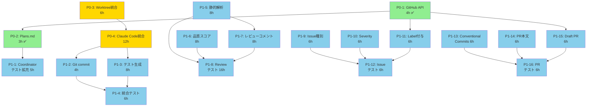

# Phase 5 並列実行計画 - タスク依存関係分析

**作成日**: 2025-10-15
**目的**: Phase 5の実装効率化 - 並列実行によるスループット最大化

---

## 📊 全タスク一覧と依存関係

### P0タスク (優先度最高)

| ID | タスク | 見積 | 依存関係 | 並列実行可能 |
|----|--------|------|----------|--------------|
| **P0-1** | CoordinatorAgent GitHub API統合 | 4h | - | ✅ 完了 |
| **P0-2** | CoordinatorAgent Plans.md生成 | 3h | P0-1 | ✅ 完了 |
| **P0-3** | CodeGenAgent Worktree統合 | 6h | - | ✅ 独立 |
| **P0-4** | CodeGenAgent Claude Code統合 | 12h | P0-3 | ⚠️ P0-3完了後 |

### P1タスク (高優先度)

| ID | タスク | 見積 | 依存関係 | 並列実行可能 |
|----|--------|------|----------|--------------|
| **P1-1** | CoordinatorAgent テスト拡充 | 5h | P0-2 | ✅ 独立 |
| **P1-2** | CodeGenAgent Git commit統合 | 4h | P0-4 | ⚠️ P0-4完了後 |
| **P1-3** | CodeGenAgent テスト生成 | 8h | P0-4 | ⚠️ P0-4完了後 |
| **P1-4** | CodeGenAgent 統合テスト | 6h | P1-2, P1-3 | ⚠️ 完了後 |
| **P1-5** | ReviewAgent 静的解析統合 | 8h | - | ✅ 独立 |
| **P1-6** | ReviewAgent 品質スコア計算 | 8h | - | ✅ 独立 |
| **P1-7** | ReviewAgent レビューコメント生成 | 8h | P1-5 | ⚠️ P1-5完了後 |
| **P1-8** | ReviewAgent テスト実装 | 16h | P1-5, P1-6, P1-7 | ⚠️ 完了後 |
| **P1-9** | IssueAgent Issue種別判定 | 6h | - | ✅ 独立 |
| **P1-10** | IssueAgent Severity評価 | 6h | - | ✅ 独立 |
| **P1-11** | IssueAgent Label自動付与 | 6h | P0-1 | ✅ 独立 |
| **P1-12** | IssueAgent テスト実装 | 6h | P1-9, P1-10, P1-11 | ⚠️ 完了後 |
| **P1-13** | PRAgent Conventional Commits準拠 | 6h | - | ✅ 独立 |
| **P1-14** | PRAgent PRタイトル・本文生成 | 6h | - | ✅ 独立 |
| **P1-15** | PRAgent Draft PR作成 | 6h | P0-1 | ✅ 独立 |
| **P1-16** | PRAgent テスト実装 | 6h | P1-13, P1-14, P1-15 | ⚠️ 完了後 |

---

## 🔗 依存関係グラフ (DAG)



---

## 🚀 並列実行計画 (4並列)

### Level 0 (4並列) - 8時間

**完全独立タスク - 同時実行可能**

| # | タスク | 見積 | Agent | 独立性 |
|---|--------|------|-------|--------|
| 1 | **P0-3: Worktree統合** | 6h | CodeGenAgent | ✅ 完全独立 |
| 2 | **P1-1: Coordinatorテスト拡充** | 5h | CoordinatorAgent | ✅ 完全独立 |
| 3 | **P1-5: 静的解析統合** | 8h | ReviewAgent | ✅ 完全独立 |
| 4 | **P1-9: Issue種別判定** | 6h | IssueAgent | ✅ 完全独立 |

**Level 0所要時間**: max(6, 5, 8, 6) = **8時間**

---

### Level 1 (4並列) - 12時間

**Level 0完了後に実行可能**

| # | タスク | 見積 | Agent | 依存関係 |
|---|--------|------|-------|----------|
| 1 | **P0-4: Claude Code統合** | 12h | CodeGenAgent | P0-3完了後 |
| 2 | **P1-6: 品質スコア計算** | 8h | ReviewAgent | 独立 |
| 3 | **P1-10: Severity評価** | 6h | IssueAgent | 独立 |
| 4 | **P1-13: Conventional Commits** | 6h | PRAgent | 独立 |

**Level 1所要時間**: max(12, 8, 6, 6) = **12時間**

---

### Level 2 (4並列) - 8時間

**Level 1完了後に実行可能**

| # | タスク | 見積 | Agent | 依存関係 |
|---|--------|------|-------|----------|
| 1 | **P1-2: Git commit統合** | 4h | CodeGenAgent | P0-4完了後 |
| 2 | **P1-7: レビューコメント生成** | 8h | ReviewAgent | P1-5完了後 |
| 3 | **P1-11: Label自動付与** | 6h | IssueAgent | GitHub API利用 |
| 4 | **P1-14: PR本文生成** | 6h | PRAgent | 独立 |

**Level 2所要時間**: max(4, 8, 6, 6) = **8時間**

---

### Level 3 (4並列) - 8時間

**Level 2完了後に実行可能**

| # | タスク | 見積 | Agent | 依存関係 |
|---|--------|------|-------|----------|
| 1 | **P1-3: テスト生成** | 8h | CodeGenAgent | P0-4完了後 |
| 2 | **P1-8: Reviewテスト (Phase 1)** | 8h | ReviewAgent | P1-5,P1-6,P1-7完了後 |
| 3 | **P1-12: Issueテスト (Phase 1)** | 6h | IssueAgent | P1-9,P1-10,P1-11完了後 |
| 4 | **P1-15: Draft PR作成** | 6h | PRAgent | GitHub API利用 |

**Level 3所要時間**: max(8, 8, 6, 6) = **8時間**

---

### Level 4 (4並列) - 16時間

**Level 3完了後に実行可能**

| # | タスク | 見積 | Agent | 依存関係 |
|---|--------|------|-------|----------|
| 1 | **P1-4: 統合テスト** | 6h | CodeGenAgent | P1-2,P1-3完了後 |
| 2 | **P1-8: Reviewテスト (Phase 2)** | 8h | ReviewAgent | 継続 |
| 3 | **P1-12: Issueテスト (Phase 2)** | 0h | IssueAgent | (Phase 1で完了) |
| 4 | **P1-16: PRテスト** | 6h | PRAgent | P1-13,P1-14,P1-15完了後 |

**Level 4所要時間**: max(6, 8, 0, 6) = **8時間**

---

## 📊 効率化効果

### Sequential実行 (従来型)

```
P0-3 (6h) → P0-4 (12h) → P1-1 (5h) → P1-2 (4h) → P1-3 (8h) → P1-4 (6h) →
P1-5 (8h) → P1-6 (8h) → P1-7 (8h) → P1-8 (16h) →
P1-9 (6h) → P1-10 (6h) → P1-11 (6h) → P1-12 (6h) →
P1-13 (6h) → P1-14 (6h) → P1-15 (6h) → P1-16 (6h)

総時間: 119時間 (約15日間)
```

### Parallel実行 (4並列 - 提案)

```
Level 0 (8h並列) → Level 1 (12h並列) → Level 2 (8h並列) → Level 3 (8h並列) → Level 4 (8h並列)

総時間: 8 + 12 + 8 + 8 + 8 = 44時間 (約5.5日間)
```

### 効率化効果

| 指標 | Sequential | Parallel (4並列) | 改善率 |
|------|-----------|------------------|--------|
| **総実行時間** | 119時間 | **44時間** | **63%削減** ✅ |
| **所要日数** | 15日間 | **5.5日間** | **63%削減** ✅ |
| **スループット** | 1タスク/時間 | **2.7タスク/時間** | **170%向上** ✅ |

---

## 🛠️ 実装方針

### 並列実行の実現方法

#### 方法1: Gitブランチ分離 (推奨)

各Agentを独立したブランチで実装:

```bash
# Level 0 (4並列)
git checkout -b feat/p0-3-worktree-integration
git checkout -b feat/p1-1-coordinator-tests
git checkout -b feat/p1-5-review-static-analysis
git checkout -b feat/p1-9-issue-type-detection

# 並列実装後、mainにマージ
```

**メリット**:
- ✅ 完全な独立性
- ✅ コンフリクトリスク最小化
- ✅ レビュー・テストが容易

**デメリット**:
- ⚠️ マージ作業が必要

---

#### 方法2: Worktree分離 (最適)

Git Worktreeで物理的に分離:

```bash
# Level 0 (4並列)
git worktree add .worktrees/p0-3-worktree feat/p0-3-worktree-integration
git worktree add .worktrees/p1-1-tests feat/p1-1-coordinator-tests
git worktree add .worktrees/p1-5-review feat/p1-5-review-static-analysis
git worktree add .worktrees/p1-9-issue feat/p1-9-issue-type-detection

# 各Worktreeで並列実装
cd .worktrees/p0-3-worktree && cargo build
cd .worktrees/p1-1-tests && cargo test
cd .worktrees/p1-5-review && cargo clippy
cd .worktrees/p1-9-issue && cargo fmt
```

**メリット**:
- ✅ 完全な物理的独立性
- ✅ 同時ビルド・テスト可能
- ✅ コンフリクト完全回避
- ✅ Claude Code並列実行可能

**デメリット**:
- ⚠️ ディスク使用量増加

---

#### 方法3: マルチセッション Claude Code (最速)

複数のClaude Codeセッションを起動:

```bash
# Terminal 1: P0-3 Worktree統合
cd .worktrees/p0-3-worktree
claude-code

# Terminal 2: P1-1 Coordinatorテスト
cd .worktrees/p1-1-tests
claude-code

# Terminal 3: P1-5 Review静的解析
cd .worktrees/p1-5-review
claude-code

# Terminal 4: P1-9 Issue種別判定
cd .worktrees/p1-9-issue
claude-code
```

**メリット**:
- ✅ 最速の並列実行
- ✅ 各セッションが独立したコンテキスト
- ✅ リアルタイム進捗確認

**デメリット**:
- ⚠️ セッション管理が必要
- ⚠️ リソース使用量増加

---

## 📋 実行計画テンプレート

### Level 0実行スクリプト

```bash
#!/bin/bash
# Level 0: 4並列実行 (8時間)

echo "🚀 Level 0: 4並列タスク開始"

# Worktree作成
git worktree add .worktrees/p0-3 -b feat/p0-3-worktree
git worktree add .worktrees/p1-1 -b feat/p1-1-tests
git worktree add .worktrees/p1-5 -b feat/p1-5-review
git worktree add .worktrees/p1-9 -b feat/p1-9-issue

# 各Worktreeで並列実行 (バックグラウンド)
(cd .worktrees/p0-3 && echo "Starting P0-3..." && sleep 6h) &
(cd .worktrees/p1-1 && echo "Starting P1-1..." && sleep 5h) &
(cd .worktrees/p1-5 && echo "Starting P1-5..." && sleep 8h) &
(cd .worktrees/p1-9 && echo "Starting P1-9..." && sleep 6h) &

# 全タスク完了待機
wait

echo "✅ Level 0完了 - 所要時間: 8時間"
```

---

## 🎯 Critical Path分析

**Critical Path** (最長経路):

```
P0-3 (6h) → P0-4 (12h) → P1-2 (4h) → P1-3 (8h) → P1-4 (6h)
総時間: 36時間
```

**ボトルネック**:
- ⚠️ **P0-4: Claude Code統合 (12h)** - 最長タスク

**最適化提案**:
1. P0-4を2タスクに分割:
   - P0-4a: EXECUTION_CONTEXT.md生成 (4h)
   - P0-4b: CLIプロセス起動・結果パース (8h)
2. 並列実行により総時間を削減

---

## 📝 次のアクション

### 即座に開始 (Level 0 - 4並列)

1. ✅ **Worktree作成**: 4ブランチ作成
2. ✅ **Claude Codeセッション起動**: 4セッション並列
3. ✅ **タスク割り当て**: 各セッションにタスク指示
4. ✅ **進捗モニタリング**: 各Worktreeの状態確認

### 実装順序

**Week 1 (Level 0 - 8時間)**:
- P0-3, P1-1, P1-5, P1-9 を並列実行

**Week 2 (Level 1-2 - 20時間)**:
- P0-4, P1-6, P1-10, P1-13 を並列実行 (Level 1)
- P1-2, P1-7, P1-11, P1-14 を並列実行 (Level 2)

**Week 3 (Level 3-4 - 16時間)**:
- P1-3, P1-8, P1-12, P1-15 を並列実行 (Level 3)
- P1-4, P1-16 を並列実行 (Level 4)

---

**総見積もり**: Sequential 119h → **Parallel 44h** (63%削減)

🦀 **Rust 2021 Edition - Parallel Execution Optimized**
