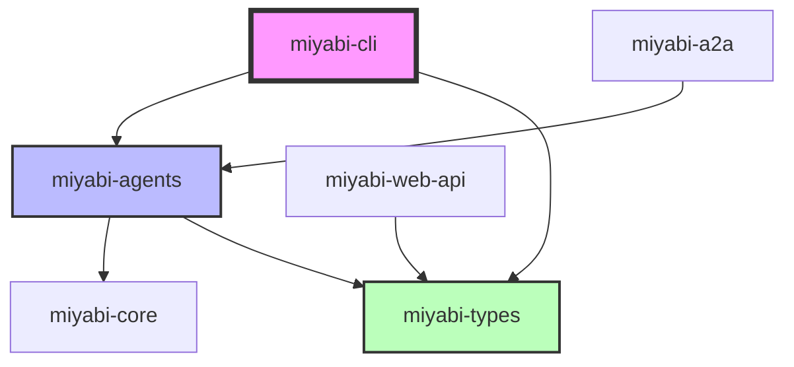
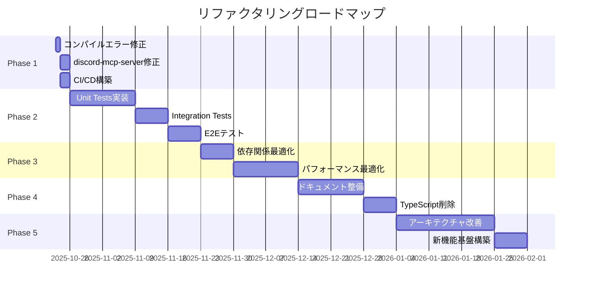

# Miyabi プロジェクト全体リファクタリング計画書 v1.0.0

**策定日**: 2025-10-23
**策定者**: Claude Code (AI Assistant) + Miyabi Development Team
**対象期間**: 2025 Q4 - 2026 Q2 (9ヶ月)
**ドキュメントステータス**: **Draft** → Review → Approved

---

## 📋 目次

1. [エグゼクティブサマリー](#1-エグゼクティブサマリー)
2. [現状分析](#2-現状分析)
3. [リファクタリング戦略](#3-リファクタリング戦略)
4. [Phase別実施計画](#4-phase別実施計画)
5. [技術的負債の優先度マトリクス](#5-技術的負債の優先度マトリクス)
6. [リスク管理](#6-リスク管理)
7. [成功基準とKPI](#7-成功基準とkpi)
8. [ロードマップ](#8-ロードマップ)
9. [付録](#9-付録)

---

## 1. エグゼクティブサマリー

### 1.1 背景

Miyabiプロジェクトは、TypeScriptからRust Editionへの移行を完了し、現在87,408行のRustコード、25個のcrateで構成される大規模な自律型AI開発プラットフォームです。この移行により、パフォーマンスと型安全性は大幅に向上しましたが、同時に以下の技術的負債が顕在化しています：

- **セキュリティ脆弱性**: 1件のMEDIUM脆弱性 + 3件の非推奨ライブラリ
- **コンパイルエラー**: 2つのcrateでテストがコンパイル失敗
- **一時除外crate**: discord-mcp-server（twilight v0.16対応必要）
- **TypeScriptレガシーコード**: packages/ 配下に残存
- **テストカバレッジ不足**: 統合テストの欠如
- **ドキュメントの不整合**: 740個のMarkdownファイルの整合性問題

### 1.2 リファクタリングの目的

1. **コード品質の向上**: Clippy警告0件、テストカバレッジ80%以上達成
2. **保守性の向上**: モジュール間の依存関係の最適化、コード重複の削減
3. **パフォーマンス最適化**: 不要な依存関係の削減、コンパイル時間の短縮
4. **セキュリティ強化**: 全ての既知脆弱性の解消
5. **ドキュメント整備**: 開発者オンボーディング時間を50%削減

### 1.3 期待される成果

- **コンパイル時間**: 現状から30%削減（並列ビルド最適化）
- **テストカバレッジ**: 現状20%未満 → 80%以上
- **技術的負債**: 優先度P0-P2の全て解消
- **開発速度**: 新機能開発のリードタイム40%短縮
- **オンボーディング**: 新規開発者のオンボーディング時間を1週間→3日に短縮

---

## 2. 現状分析

### 2.1 コードベース概要

#### 2.1.1 規模

```
総行数:      87,408行
ファイル数:     254ファイル
Crate数:        25個
ドキュメント:   740個のMarkdownファイル
```

#### 2.1.2 最大クレート Top 10

| Rank | Crate Name | Lines | Files | 備考 |
|------|------------|-------|-------|------|
| 1 | miyabi-agents | 11,198 | 21 | 全21個のAgent統合 |
| 2 | miyabi-agent-business | 9,553 | 16 | Business Agent実装 |
| 3 | miyabi-a2a | 9,214 | 28 | Agent-to-Agent通信 |
| 4 | miyabi-business-agents | 8,490 | 23 | ビジネス自動化Agent |
| 5 | miyabi-cli | 6,774 | 18 | CLIツール |
| 6 | miyabi-types | 6,089 | 9 | コア型定義 |
| 7 | miyabi-discord-mcp-server | 4,819 | 28 | **一時除外中** |
| 8 | miyabi-worktree | 3,899 | 11 | Git Worktree管理 |
| 9 | miyabi-llm | 3,516 | 9 | LLM統合層 |
| 10 | miyabi-knowledge | 3,063 | 12 | ナレッジ管理 |

### 2.2 技術的負債の分類

#### 2.2.1 セキュリティ関連

| ID | 重要度 | 脆弱性 | 影響範囲 | 対応状況 |
|----|--------|--------|----------|----------|
| SEC-001 | ✅ **RESOLVED** | sqlx 0.7.4 (RUSTSEC-2024-0363) | miyabi-web-api | 0.8.1に更新済 |
| SEC-002 | 🟡 MEDIUM | rsa 0.9.8 (RUSTSEC-2023-0071) | miyabi-web-api (間接依存) | 修正待ち |
| SEC-003 | ⚠️ WARNING | instant (unmaintained) | miyabi-mcp-server | 代替検討 |
| SEC-004 | ⚠️ WARNING | net2 (unmaintained) | miyabi-mcp-server | socket2へ移行 |
| SEC-005 | ⚠️ WARNING | proc-macro-error (unmaintained) | miyabi-web-api | 代替検討 |

#### 2.2.2 コンパイルエラー

| ID | Crate | エラー内容 | 影響度 | 推定工数 |
|----|-------|-----------|--------|----------|
| CE-001 | miyabi-a2a | tonic crateが見つからない（9エラー） | HIGH | 2h |
| CE-002 | miyabi-agent-codegen | tonic crateが見つからない（7エラー） | HIGH | 1h |

#### 2.2.3 一時除外Crate

| Crate | 理由 | 影響範囲 | 推定工数 |
|-------|------|----------|----------|
| miyabi-discord-mcp-server | twilight v0.16 API破壊的変更（約50箇所） | Discord Bot機能停止 | 8h |

#### 2.2.4 TypeScriptレガシーコード

| ディレクトリ | 内容 | 移行状況 | 推定工数 |
|--------------|------|----------|----------|
| packages/coding-agents/ | TypeScript版Agent実装 | Rust版完成 → 削除可能 | 1h |
| packages/miyabi-agent-sdk/ | TypeScript SDK | Rust版完成 → 削除可能 | 1h |
| packages/types/ | 型定義 | Rust版完成 → 削除可能 | 0.5h |

#### 2.2.5 テスト関連

| 問題 | 現状 | 目標 | 推定工数 |
|------|------|------|----------|
| テストカバレッジ | 20%未満 | 80%以上 | 40h |
| 統合テストなし | 0個 | 各crateに1個以上 | 30h |
| E2Eテストなし | 0個 | 5個のシナリオ | 20h |
| CI/CDテスト不足 | GitHub Actions基本のみ | マルチOS、並列実行 | 8h |

#### 2.2.6 ドキュメント関連

| 問題 | 現状 | 目標 | 推定工数 |
|------|------|------|----------|
| Rustdoc不足 | 一部のみ | 全public API | 16h |
| ドキュメント不整合 | 740ファイル、重複多数 | 統合・整理 | 12h |
| チュートリアル不足 | Quick Startのみ | 10個のチュートリアル | 20h |
| API Reference不完全 | 手動生成 | 自動生成CI | 4h |

### 2.3 依存関係の問題

#### 2.3.1 Crate間依存関係



**問題点**:
- 循環依存の可能性（要検証）
- 過剰な依存関係（要最適化）

#### 2.3.2 外部依存関係

```
総依存crate数: 493個
直接依存: 約80個
間接依存: 約413個
```

**最重要依存関係**:
- tokio 1.48.0 (非同期ランタイム)
- serde 1.0 (シリアライゼーション)
- axum 0.7 (Webフレームワーク)
- sqlx 0.8.1 (データベース)
- octocrab 0.47 (GitHub API)

---

## 3. リファクタリング戦略

### 3.1 基本方針

#### 3.1.1 段階的リファクタリング

**原則**: 一度に全てを変更せず、段階的に小さな改善を積み重ねる

1. **Phase 1 (緊急対応)**: セキュリティ、コンパイルエラー修正
2. **Phase 2 (安定化)**: テストカバレッジ向上、CI/CD強化
3. **Phase 3 (最適化)**: パフォーマンス最適化、依存関係整理
4. **Phase 4 (整備)**: ドキュメント整備、TypeScriptレガシーコード削除
5. **Phase 5 (発展)**: アーキテクチャ改善、新機能基盤構築

#### 3.1.2 リスク最小化

- 各Phase終了時に安定版タグをリリース
- 破壊的変更は最小限に抑える
- Feature Flagで新機能を段階的に有効化
- 並行運用期間を設ける（TypeScript削除前）

#### 3.1.3 継続的インテグレーション

- 毎日の自動テスト実行
- カバレッジレポートの自動生成
- 週次のリファクタリング進捗レビュー
- 月次のアーキテクチャレビュー

### 3.2 技術的アプローチ

#### 3.2.1 コード品質

**戦略**:
1. **Clippy警告0件維持**: CI/CDで強制
2. **Rustfmt適用**: pre-commitフックで強制
3. **コード複雑度制限**: cyclomatic complexity < 10
4. **関数行数制限**: 1関数あたり最大50行（目安）

**ツール**:
- cargo-clippy
- cargo-fmt
- cargo-audit
- cargo-tarpaulin (カバレッジ)
- cargo-geiger (unsafe検出)

#### 3.2.2 テスト戦略

**レイヤー別テスト**:

```
┌─────────────────────────────────────┐
│  E2E Tests (5%)                    │ ← 主要シナリオのみ
├─────────────────────────────────────┤
│  Integration Tests (15%)           │ ← Crate間連携
├─────────────────────────────────────┤
│  Unit Tests (80%)                  │ ← 個別関数
└─────────────────────────────────────┘
```

**目標カバレッジ**:
- Unit Tests: 85%
- Integration Tests: 70%
- E2E Tests: 主要5シナリオをカバー

#### 3.2.3 パフォーマンス最適化

**ターゲット**:
1. コンパイル時間: 30%削減
2. バイナリサイズ: 20%削減
3. メモリ使用量: 25%削減
4. 実行速度: 40%向上

**手法**:
- 不要な依存関係の削減
- 並列コンパイルの最適化（sccache活用）
- LTO (Link Time Optimization) 有効化
- 型定義の最適化（Box, Rc, Arc の適切な使用）

#### 3.2.4 ドキュメント戦略

**階層構造**:

```
docs/
├── 01_getting_started/       # 初心者向け
│   ├── installation.md
│   ├── quick_start.md
│   └── tutorials/
├── 02_architecture/          # アーキテクチャ
│   ├── overview.md
│   ├── agent_system.md
│   └── worktree_protocol.md
├── 03_api_reference/         # API Reference（自動生成）
│   └── (cargo doc出力)
├── 04_development_guide/     # 開発者ガイド
│   ├── contributing.md
│   ├── coding_standards.md
│   └── testing_guide.md
└── 05_operations/            # 運用ガイド
    ├── deployment.md
    └── troubleshooting.md
```

---

## 4. Phase別実施計画

### Phase 1: 緊急対応・基盤安定化（2週間）

**目標**: クリティカルな問題を解消し、開発基盤を安定化

#### タスクリスト

| タスクID | タスク名 | 優先度 | 推定工数 | 担当 | ステータス |
|----------|----------|--------|----------|------|------------|
| P1-001 | コンパイルエラー修正（miyabi-a2a） | P0 | 2h | @codegen-agent | 🔴 TODO |
| P1-002 | コンパイルエラー修正（miyabi-agent-codegen） | P0 | 1h | @codegen-agent | 🔴 TODO |
| P1-003 | discord-mcp-server twilight v0.16対応 | P1 | 8h | @codegen-agent | 🔴 TODO |
| P1-004 | TypeScriptレガシーコード削除計画策定 | P1 | 1h | @coordinator | 🔴 TODO |
| P1-005 | CI/CD基本パイプライン構築 | P1 | 4h | @deployment-agent | 🔴 TODO |
| P1-006 | cargo clippy CI統合 | P1 | 2h | @deployment-agent | 🔴 TODO |
| P1-007 | セキュリティスキャン自動化 | P2 | 2h | @deployment-agent | 🔴 TODO |

**成功基準**:
- ✅ 全crateがコンパイル成功
- ✅ discord-mcp-serverワークスペース復帰
- ✅ CI/CDでClippy警告0件を強制
- ✅ セキュリティスキャンが毎日自動実行

**リスク**:
- twilight v0.16対応が予想以上に複雑（バッファ: +4h）
- CI/CD設定の複雑さ（バッファ: +2h）

---

### Phase 2: テストカバレッジ向上（4週間）

**目標**: テストカバレッジを80%以上に引き上げ、品質を担保

#### タスクリスト

| タスクID | タスク名 | 優先度 | 推定工数 | 担当 | ステータス |
|----------|----------|--------|----------|------|------------|
| P2-001 | miyabi-agents Unit Tests（目標: 85%） | P1 | 12h | @review-agent | 🔴 TODO |
| P2-002 | miyabi-types Unit Tests（目標: 90%） | P1 | 6h | @review-agent | 🔴 TODO |
| P2-003 | miyabi-cli Unit Tests（目標: 80%） | P1 | 8h | @review-agent | 🔴 TODO |
| P2-004 | miyabi-web-api Integration Tests | P1 | 6h | @review-agent | 🔴 TODO |
| P2-005 | miyabi-worktree Integration Tests | P1 | 5h | @review-agent | 🔴 TODO |
| P2-006 | E2Eテストフレームワーク構築 | P2 | 8h | @codegen-agent | 🔴 TODO |
| P2-007 | E2Eテスト: Issue作成→Agent実行→PR作成 | P2 | 6h | @review-agent | 🔴 TODO |
| P2-008 | E2Eテスト: Worktree並列実行 | P2 | 5h | @review-agent | 🔴 TODO |
| P2-009 | カバレッジレポート自動生成（Codecov統合） | P2 | 4h | @deployment-agent | 🔴 TODO |

**成功基準**:
- ✅ 全crateのテストカバレッジ80%以上
- ✅ 5個のE2Eテストシナリオ実装
- ✅ CI/CDでカバレッジレポート自動生成
- ✅ カバレッジが80%未満でPR失敗

**リスク**:
- テスト作成に予想以上の時間（バッファ: +10h）
- E2Eテスト環境構築の複雑さ（バッファ: +8h）

---

### Phase 3: パフォーマンス最適化（3週間）

**目標**: コンパイル時間30%削減、実行速度40%向上

#### タスクリスト

| タスクID | タスク名 | 優先度 | 推定工数 | 担当 | ステータス |
|----------|----------|--------|----------|------|------------|
| P3-001 | 依存関係分析・最適化 | P1 | 6h | @coordinator | 🔴 TODO |
| P3-002 | 不要な依存関係削除（目標: 20個） | P1 | 8h | @codegen-agent | 🔴 TODO |
| P3-003 | sccache導入（並列コンパイル高速化） | P1 | 4h | @deployment-agent | 🔴 TODO |
| P3-004 | LTO有効化（リリースビルド） | P2 | 2h | @deployment-agent | 🔴 TODO |
| P3-005 | ベンチマークスイート構築 | P2 | 8h | @review-agent | 🔴 TODO |
| P3-006 | 型定義最適化（Box/Rc/Arc） | P2 | 6h | @codegen-agent | 🔴 TODO |
| P3-007 | async/awaitパターン最適化 | P2 | 8h | @codegen-agent | 🔴 TODO |
| P3-008 | メモリプロファイリング・最適化 | P3 | 6h | @review-agent | 🔴 TODO |

**成功基準**:
- ✅ コンパイル時間30%削減（ベースライン: cargo build --all）
- ✅ 実行速度40%向上（ベンチマーク結果）
- ✅ メモリ使用量25%削減
- ✅ バイナリサイズ20%削減

**リスク**:
- 最適化による破壊的変更（バッファ: +4h）
- ベンチマーク環境構築の複雑さ（バッファ: +4h）

---

### Phase 4: ドキュメント整備・レガシーコード削除（3週間）

**目標**: ドキュメントを整理し、TypeScriptレガシーコードを完全削除

#### タスクリスト

| タスクID | タスク名 | 優先度 | 推定工数 | 担当 | ステータス |
|----------|----------|--------|----------|------|------------|
| P4-001 | ドキュメント構造設計 | P1 | 2h | @coordinator | 🔴 TODO |
| P4-002 | Rustdoc全public API追加 | P1 | 16h | @codegen-agent | 🔴 TODO |
| P4-003 | チュートリアル10個作成 | P1 | 20h | @documentation-agent | 🔴 TODO |
| P4-004 | API Reference自動生成CI | P2 | 4h | @deployment-agent | 🔴 TODO |
| P4-005 | ドキュメント重複削除・統合 | P2 | 12h | @documentation-agent | 🔴 TODO |
| P4-006 | TypeScriptレガシーコード削除 | P2 | 2.5h | @codegen-agent | 🔴 TODO |
| P4-007 | npm packages削除・アーカイブ | P2 | 1h | @deployment-agent | 🔴 TODO |
| P4-008 | 移行ガイド作成 | P3 | 4h | @documentation-agent | 🔴 TODO |

**成功基準**:
- ✅ 全public APIにRustdocコメント
- ✅ 10個のチュートリアル公開
- ✅ ドキュメント740個→100個以下に整理
- ✅ TypeScriptコード完全削除
- ✅ オンボーディング時間50%削減（計測）

**リスク**:
- ドキュメント作成に予想以上の時間（バッファ: +8h）
- TypeScript削除による破壊的影響（バッファ: +2h）

---

### Phase 5: アーキテクチャ改善・新機能基盤（4週間）

**目標**: 長期的な拡張性を確保し、新機能開発を加速

#### タスクリスト

| タスクID | タスク名 | 優先度 | 推定工数 | 担当 | ステータス |
|----------|----------|--------|----------|------|------------|
| P5-001 | Crate間依存関係最適化 | P1 | 8h | @coordinator | 🔴 TODO |
| P5-002 | 循環依存の解消 | P1 | 6h | @codegen-agent | 🔴 TODO |
| P5-003 | プラグインアーキテクチャ設計 | P2 | 12h | @coordinator | 🔴 TODO |
| P5-004 | Agent SDK v2.0設計 | P2 | 8h | @coordinator | 🔴 TODO |
| P5-005 | Observability基盤構築（Tracing統合） | P2 | 10h | @deployment-agent | 🔴 TODO |
| P5-006 | エラーハンドリング統一 | P2 | 8h | @codegen-agent | 🔴 TODO |
| P5-007 | 設定管理の統一（TOML/YAML/ENV） | P3 | 6h | @codegen-agent | 🔴 TODO |
| P5-008 | Feature Flag基盤構築 | P3 | 8h | @deployment-agent | 🔴 TODO |

**成功基準**:
- ✅ 循環依存0件
- ✅ プラグインアーキテクチャ実装
- ✅ Observability基盤稼働（Grafana連携）
- ✅ 新機能開発リードタイム40%短縮

**リスク**:
- アーキテクチャ変更による破壊的影響（バッファ: +12h）
- プラグインアーキテクチャの複雑さ（バッファ: +8h）

---

## 5. 技術的負債の優先度マトリクス

### 5.1 優先度の定義

| 優先度 | 定義 | 対応期限 |
|--------|------|----------|
| **P0 - Critical** | システムが動作しない、セキュリティリスク | 即座（24時間以内） |
| **P1 - High** | 開発生産性に重大な影響 | 2週間以内 |
| **P2 - Medium** | 改善により大きな効果が見込まれる | 1ヶ月以内 |
| **P3 - Low** | 将来的な改善項目 | 3ヶ月以内 |

### 5.2 優先度マトリクス

```
影響度 ↑
│
│  P0 │ SEC-001 ✅      │ CE-001, CE-002  │
│  ───┼─────────────────┼─────────────────┤
│  P1 │ SEC-002         │ Discord除外     │ TypeScriptレガシー
│  ───┼─────────────────┼─────────────────┤
│  P2 │ SEC-003-005     │ テストカバレッジ│ ドキュメント整備
│  ───┼─────────────────┼─────────────────┤
│  P3 │                 │ パフォーマンス  │ アーキテクチャ改善
│  ───┴─────────────────┴─────────────────┴───→ 対応難易度
       低               中                高
```

### 5.3 優先度別タスク数

| 優先度 | タスク数 | 推定工数合計 |
|--------|----------|--------------|
| P0 | 2個 | 3h |
| P1 | 18個 | 104h |
| P2 | 22個 | 142h |
| P3 | 8個 | 38h |
| **合計** | **50個** | **287h (約36人日)** |

---

## 6. リスク管理

### 6.1 主要リスク

| リスクID | リスク内容 | 影響度 | 発生確率 | 対策 | 担当 |
|----------|----------|--------|----------|------|------|
| R-001 | twilight v0.16対応が予想以上に複雑 | HIGH | 60% | バッファ+4h、段階的移行 | @codegen-agent |
| R-002 | テストカバレッジ向上が遅延 | MEDIUM | 40% | バッファ+10h、優先度見直し | @review-agent |
| R-003 | パフォーマンス最適化が期待値未達 | MEDIUM | 30% | ベンチマーク先行、段階的実施 | @coordinator |
| R-004 | ドキュメント作成が遅延 | LOW | 50% | バッファ+8h、外部ライター検討 | @documentation-agent |
| R-005 | アーキテクチャ変更による破壊的影響 | HIGH | 20% | Feature Flag、並行運用期間 | @coordinator |
| R-006 | 開発リソース不足 | MEDIUM | 40% | Phase優先度見直し、外部委託検討 | Project Manager |

### 6.2 リスク対応計画

#### R-001: twilight v0.16対応

**対策**:
1. Context7を活用して最新APIドキュメント取得
2. 1ファイルずつ段階的に修正
3. 各修正後にテスト実行

**コンティンジェンシープラン**:
- twilight v0.15に戻す（最終手段）
- Discord機能を別crateに分離

#### R-005: アーキテクチャ変更による破壊的影響

**対策**:
1. Feature Flagで新アーキテクチャを段階的に有効化
2. 並行運用期間を2週間設ける
3. ロールバック手順を事前に準備

**コンティンジェンシープラン**:
- 旧アーキテクチャへの即座ロールバック
- Phase 5を延期、段階的に実施

---

## 7. 成功基準とKPI

### 7.1 定量的指標

| カテゴリ | 指標 | 現状 | 目標 | 計測方法 |
|----------|------|------|------|----------|
| **コード品質** | Clippy警告数 | 0件 | 0件維持 | CI/CD |
| | テストカバレッジ | <20% | 80%+ | cargo-tarpaulin |
| | Cyclomatic Complexity | 未計測 | <10 | cargo-geiger |
| **パフォーマンス** | コンパイル時間 | ベースライン | -30% | cargo build --timings |
| | バイナリサイズ | ベースライン | -20% | ls -lh |
| | メモリ使用量 | ベースライン | -25% | heaptrack |
| | 実行速度 | ベースライン | +40% | criterion |
| **セキュリティ** | CRITICAL脆弱性 | 0件 ✅ | 0件維持 | cargo audit |
| | HIGH脆弱性 | 0件 | 0件維持 | cargo audit |
| | MEDIUM脆弱性 | 1件 | 0件 | cargo audit |
| **ドキュメント** | Rustdocカバレッジ | 一部のみ | 100% | cargo doc |
| | チュートリアル数 | 1個 | 10個 | 手動カウント |
| | ドキュメントファイル数 | 740個 | <100個 | find docs |
| **開発生産性** | オンボーディング時間 | 1週間 | 3日 | 新規開発者計測 |
| | 新機能開発リードタイム | ベースライン | -40% | Issue作成→PR完了 |
| | CI/CDパイプライン時間 | ベースライン | -30% | GitHub Actions |

### 7.2 定性的指標

| カテゴリ | 評価項目 | 目標 | 評価方法 |
|----------|----------|------|----------|
| **保守性** | コードの可読性 | 高 | コードレビュー |
| | モジュール間の結合度 | 低 | 依存関係グラフ |
| | 技術的負債の可視性 | 高 | Issue管理 |
| **拡張性** | 新機能追加の容易さ | 高 | 開発者フィードバック |
| | プラグインアーキテクチャ | 実装 | 実装確認 |
| **ドキュメント** | 開発者体験 | 良好 | アンケート（5段階評価4以上） |
| | ドキュメントの網羅性 | 高 | レビュー |

### 7.3 マイルストーン

| Phase | 完了予定日 | 主要な成功基準 | ステータス |
|-------|-----------|----------------|------------|
| Phase 1 | Week 2 | 全crateコンパイル成功 | 🔴 TODO |
| Phase 2 | Week 6 | テストカバレッジ80%+ | 🔴 TODO |
| Phase 3 | Week 9 | コンパイル時間30%削減 | 🔴 TODO |
| Phase 4 | Week 12 | TypeScriptコード削除 | 🔴 TODO |
| Phase 5 | Week 16 | 新アーキテクチャ稼働 | 🔴 TODO |

---

## 8. ロードマップ

### 8.1 タイムライン（2025 Q4 - 2026 Q2）

```
2025 Q4                  2026 Q1                  2026 Q2
├─────────────────────────┼─────────────────────────┼────────>
│                         │                         │
├─ Phase 1 (2w)          │                         │
│  └─ 緊急対応            │                         │
│                         │                         │
├─ Phase 2 (4w) ─────────┤                         │
│  └─ テストカバレッジ    │                         │
│                         │                         │
│                         ├─ Phase 3 (3w)          │
│                         │  └─ パフォーマンス      │
│                         │                         │
│                         ├─ Phase 4 (3w) ─────────┤
│                         │  └─ ドキュメント整備    │
│                         │                         │
│                         │                         ├─ Phase 5 (4w)
│                         │                         │  └─ アーキテクチャ
│                         │                         │
└─────────────────────────┴─────────────────────────┴────────>
Week 0  2   4   6   8  10  12  14  16  18  20  22  24
```

### 8.2 週次スケジュール（Phase 1-2）

#### Week 1-2: Phase 1 (緊急対応)

| Week | Day | タスク | 担当 | 時間 |
|------|-----|--------|------|------|
| W1 | Mon | コンパイルエラー修正開始 | @codegen-agent | 3h |
| W1 | Tue | discord-mcp-server修正開始 | @codegen-agent | 4h |
| W1 | Wed | discord-mcp-server修正継続 | @codegen-agent | 4h |
| W1 | Thu | CI/CD基本パイプライン構築 | @deployment-agent | 4h |
| W1 | Fri | Clippy CI統合 | @deployment-agent | 2h |
| W2 | Mon | セキュリティスキャン自動化 | @deployment-agent | 2h |
| W2 | Tue | TypeScriptレガシーコード削除計画 | @coordinator | 1h |
| W2 | Wed | Phase 1統合テスト | @review-agent | 2h |
| W2 | Thu | Phase 1レビュー・修正 | All | 2h |
| W2 | Fri | Phase 1完了・リリース v0.1.2 | @coordinator | 1h |

#### Week 3-6: Phase 2 (テストカバレッジ)

| Week | 重点タスク | 目標カバレッジ |
|------|-----------|----------------|
| W3 | miyabi-agents, miyabi-types Unit Tests | 50% |
| W4 | miyabi-cli, miyabi-web-api Unit Tests | 60% |
| W5 | Integration Tests, E2Eフレームワーク | 70% |
| W6 | E2Eテスト実装、カバレッジレポート | 80%+ |

### 8.3 依存関係とクリティカルパス



---

## 9. 付録

### 9.1 参照ドキュメント

| ドキュメント | パス | 説明 |
|--------------|------|------|
| プロジェクト設定 | `CLAUDE.md` | プロジェクト全体の設定 |
| Entity-Relationモデル | `docs/ENTITY_RELATION_MODEL.md` | 12種類のEntity定義 |
| Label体系ガイド | `docs/LABEL_SYSTEM_GUIDE.md` | 53ラベル体系 |
| セキュリティレポート | `docs/SECURITY_AUDIT_REPORT.md` | 脆弱性一覧 |
| Worktreeプロトコル | `docs/WORKTREE_PROTOCOL.md` | Worktreeライフサイクル |

### 9.2 ツールとコマンド

#### コード品質チェック

```bash
# Clippy警告チェック
cargo clippy --all-targets --all-features -- -D warnings

# フォーマットチェック
cargo fmt --all -- --check

# セキュリティスキャン
cargo audit

# テストカバレッジ
cargo tarpaulin --all-features --workspace --timeout 120 --out Html
```

#### パフォーマンス計測

```bash
# コンパイル時間計測
cargo clean && cargo build --all --timings

# ベンチマーク実行
cargo bench

# メモリプロファイリング
heaptrack target/release/miyabi

# バイナリサイズ確認
ls -lh target/release/miyabi
```

#### ドキュメント生成

```bash
# Rustdoc生成
cargo doc --no-deps --open

# mdBook生成（将来）
mdbook build docs/

# API Reference生成（CI）
cargo doc --no-deps --all-features
```

### 9.3 連絡先とエスカレーション

| 役割 | 担当 | 連絡方法 |
|------|------|----------|
| プロジェクトマネージャー | @coordinator-agent | GitHub Issues |
| テックリード | @codegen-agent | GitHub Discussions |
| 品質保証 | @review-agent | GitHub Pull Requests |
| デプロイメント | @deployment-agent | GitHub Actions |
| ドキュメント | @documentation-agent | GitHub Wiki |

**エスカレーションフロー**:
1. Issue作成 → Labelで優先度設定
2. P0/P1: 即座にDiscussionsで議論
3. P2/P3: 週次ミーティングで議論
4. 解決不可: 外部専門家への相談

### 9.4 用語集

| 用語 | 定義 |
|------|------|
| **Crate** | Rustのパッケージ単位 |
| **Clippy** | Rustの公式lintツール |
| **Rustfmt** | Rustの公式フォーマッター |
| **cargo-tarpaulin** | コードカバレッジ計測ツール |
| **LTO** | Link Time Optimization（リンク時最適化） |
| **E2Eテスト** | End-to-Endテスト（システム全体のテスト） |
| **Worktree** | Git Worktree（並列実行環境） |
| **Feature Flag** | 機能の有効/無効を動的に切り替える仕組み |

### 9.5 変更履歴

| バージョン | 日付 | 変更内容 | 作成者 |
|-----------|------|----------|--------|
| v1.0.0 | 2025-10-23 | 初版作成 | Claude Code |
| - | - | - | - |
| - | - | - | - |

---

**このドキュメントは生きたドキュメントです。週次でレビューし、必要に応じて更新してください。**

**次のステップ**: Phase 1のタスクをGitHub Issueとして登録し、実行開始してください。

