# Miyabi Webhook Setup Guide

**Version**: 1.0.0
**Last Updated**: 2025-11-06
**Status**: ✅ Production Ready

---

## 📋 Table of Contents

1. [Overview](#overview)
2. [Architecture](#architecture)
3. [GitHub Webhook Setup](#github-webhook-setup)
4. [Lark Event Callback Setup](#lark-event-callback-setup)
5. [Webhook Payload Structures](#webhook-payload-structures)
6. [Security Considerations](#security-considerations)
7. [Testing](#testing)
8. [Monitoring & Logging](#monitoring--logging)
9. [Troubleshooting](#troubleshooting)

---

## 🎯 Overview

### Purpose

This guide provides comprehensive instructions for setting up webhooks to enable event-driven communication between:
- **GitHub** → Miyabi (Issues, PRs, Comments, Pushes)
- **Lark** → Miyabi (Messages, Tasks, Approvals, Base updates)

### Integration Points

```
┌─────────────────────────────────────────────────────────────┐
│                      GitHub Platform                         │
│  Issues | PRs | Comments | Pushes | Workflow Runs           │
└────────────────────────┬────────────────────────────────────┘
                         │ GitHub Webhooks
                         ▼
        ┌────────────────────────────────────┐
        │   Miyabi Webhook Event Router      │
        │   - Priority-based routing         │
        │   - Exponential backoff retry      │
        │   - Signature verification         │
        └────────────┬───────────────────────┘
                     │
        ┌────────────┴────────────┐
        │                         │
        ▼                         ▼
┌───────────────┐         ┌──────────────┐
│ GitHub Actions│         │ 21 Miyabi    │
│ Workflows     │         │ Agents       │
└───────────────┘         └──────────────┘
                                 │
                                 ▼
                     ┌───────────────────┐
                     │  Lark Platform    │
                     │  Tasks | Base     │
                     │  Messages | Docs  │
                     └───────────────────┘
                                 ▲
                                 │ Lark Event Callbacks
        ┌────────────────────────┘
        │
┌───────┴─────────────────────────────────┐
│     Lark Event Subscription             │
│  Message | Task | Approval | Base       │
└─────────────────────────────────────────┘
```

---

## 🏗️ Architecture

### Event Flow

**GitHub → Miyabi Flow:**


**Lark → Miyabi Flow:**

```mermaid
sequenceDiagram
    participant Lark as Lark Platform
    participant Endpoint as Webhook Endpoint
    participant Sync as miyabi-lark-sync
    participant GitHub as GitHub

    Lark->>Endpoint: Event Callback (Task/Message)
    Endpoint->>Endpoint: Verify Signature
    Endpoint->>Sync: Parse Event
    Sync->>Sync: Map Lark → GitHub
    Sync->>GitHub: Update Issue/PR
    Sync->>Lark: Confirm Sync
```


---

## 🔧 GitHub Webhook Setup

### Prerequisites

- ✅ GitHub repository with admin access
- ✅ GitHub Actions enabled
- ✅ Webhook endpoint URL (TBD - will be provided after deployment)
- ✅ GitHub token with `repo`, `issues`, `pull-requests` permissions

### Step 1: Navigate to Repository Settings

1. Go to your GitHub repository: `https://github.com/{owner}/{repo}`
2. Click **Settings** (top right)
3. In the left sidebar, click **Webhooks**
4. Click **Add webhook** button

### Step 2: Configure Webhook URL

**Webhook URL Format:**
```
https://{your-domain}/webhooks/github
```

**Example URLs (deployment-dependent):**
```bash
# Option 1: Vercel deployment
https://miyabi-webhook.vercel.app/webhooks/github

# Option 2: Cloudflare Workers
https://miyabi-webhook.workers.dev/webhooks/github

# Option 3: Self-hosted (Cloud Run)
https://miyabi-webhook-xyz.run.app/webhooks/github
```

> ⚠️ **Important**: The actual URL will be provided after deploying the webhook server. Leave this as **TBD** for now.

### Step 3: Configure Content Type

Select:
```
Content type: application/json
```

### Step 4: Set Webhook Secret

Generate a secure secret:

```bash
# macOS/Linux
openssl rand -hex 32

# Or use online generator
# https://www.random.org/strings/?num=1&len=64&digits=on&upperalpha=on&loweralpha=on
```

**Example output:**
```
a1b2c3d4e5f6g7h8i9j0k1l2m3n4o5p6q7r8s9t0u1v2w3x4y5z6
```

**Save this secret:**
```bash
# Add to .env file
echo "GITHUB_WEBHOOK_SECRET=a1b2c3d4e5f6g7h8i9j0k1l2m3n4o5p6q7r8s9t0u1v2w3x4y5z6" >> .env

# Add to GitHub Secrets (for Actions)
gh secret set GITHUB_WEBHOOK_SECRET --body "a1b2c3d4e5f6g7h8i9j0k1l2m3n4o5p6q7r8s9t0u1v2w3x4y5z6"
```

### Step 5: Select Events to Trigger

**Choose individual events:**

✅ **Issues:**
- [x] Issues (opened, edited, closed, reopened, assigned, labeled, milestoned)

✅ **Pull Requests:**
- [x] Pull requests (opened, closed, reopened, synchronize, review_requested, ready_for_review)

✅ **Comments:**
- [x] Issue comments (created, edited, deleted)

✅ **Pushes:**
- [x] Pushes

✅ **Workflow Runs:**
- [x] Workflow runs (completed, requested, in_progress)

**Uncheck "Just the push event"** and select the events above.

### Step 6: Active Webhook

Ensure:
- [x] **Active** checkbox is checked

### Step 7: Save Webhook

Click **Add webhook** button at the bottom.

### Step 8: Verify Webhook Creation

After saving, GitHub will send a `ping` event to test the webhook.

**Check the Recent Deliveries tab:**
1. Click on the webhook you just created
2. Click **Recent Deliveries** tab
3. You should see a `ping` event with:
   - ✅ **Status**: 200 OK (if endpoint is live)
   - ⚠️ **Status**: Failed (if endpoint not yet deployed - this is expected)

---

## 🔧 Lark Event Callback Setup

### Prerequisites

- ✅ Lark App created on [Lark Open Platform](https://open.larksuite.com/)
- ✅ App ID and App Secret obtained
- ✅ Webhook endpoint URL (TBD - will be provided after deployment)
- ✅ Required permissions enabled (see below)

### Step 1: Access Lark Open Platform

1. Go to [Lark Open Platform](https://open.larksuite.com/) (International)
   - Or [飞书开放平台](https://open.feishu.cn/) (China)
2. Sign in with your Lark account
3. Navigate to **Console** → **My Apps**

### Step 2: Create or Select Your App

**If creating a new app:**
1. Click **Create custom app**
2. App Name: `Miyabi Integration`
3. Description: `GitHub-Lark bidirectional sync system`
4. Upload app icon (optional)
5. Click **Create**

**If using existing app:**
1. Click on your app name from the list
2. Proceed to next steps

### Step 3: Obtain App Credentials

1. In the app dashboard, go to **Credentials & Basic Info**
2. Copy the following:
   ```
   App ID: cli_xxxxxxxxxxxx
   App Secret: xxxxxxxxxxxxxxxxxxxxxxxx
   ```
3. Save to `.env`:
   ```bash
   echo "LARK_APP_ID=cli_xxxxxxxxxxxx" >> .env
   echo "LARK_APP_SECRET=xxxxxxxxxxxxxxxxxxxxxxxx" >> .env
   ```

### Step 4: Configure Permissions & Scopes

1. Go to **Permissions & Scopes** in the left sidebar
2. Enable the following scopes:

**Messenger:**
```
im:message
im:message.group_at_msg
im:message:readonly
im:chat
im:chat:readonly
```

**Tasks:**
```
task:task
task:task:readonly
```

**Base (Bitable):**
```
bitable:app
bitable:app:readonly
```

**Docs:**
```
docx:document
docx:document:readonly
```

**Wiki:**
```
wiki:wiki
wiki:wiki:readonly
```

**Approval:**
```
approval:approval
approval:approval:readonly
```

**Calendar:**
```
calendar:calendar
calendar:calendar:readonly
calendar:calendar.event
calendar:calendar.event:readonly
```

**Drive:**
```
drive:drive
drive:drive:readonly
```

3. Click **Save** after selecting all scopes

### Step 5: Configure Event Subscriptions

1. Go to **Event Subscriptions** in the left sidebar
2. Click **Add Event Subscription**

**Request URL Configuration:**
```
Event Request URL: https://{your-domain}/webhooks/lark
```

**Example URLs (deployment-dependent):**
```bash
# Option 1: Vercel
https://miyabi-webhook.vercel.app/webhooks/lark

# Option 2: Cloudflare Workers
https://miyabi-webhook.workers.dev/webhooks/lark

# Option 3: Cloud Run
https://miyabi-webhook-xyz.run.app/webhooks/lark
```

> ⚠️ **Important**: The actual URL will be provided after deployment. Leave as **TBD** for now.

**Encryption Configuration:**
1. Enable **Encrypt Key**
2. Copy the generated **Verification Token** and **Encrypt Key**
3. Save to `.env`:
   ```bash
   echo "LARK_VERIFICATION_TOKEN=xxxxxxxxxxxxxxxx" >> .env
   echo "LARK_ENCRYPT_KEY=xxxxxxxxxxxxxxxx" >> .env
   ```

### Step 6: Subscribe to Events

Add the following events:

**Messaging Events:**
- `im.message.receive_v1` - Receive messages (for slash commands)

**Task Events:**
- `task.v1.task.updated` - Task updated
- `task.v1.task.created` - Task created

**Base (Bitable) Events:**
- `bitable.app_table_record.changed` - Record changed in Base

**Approval Events:**
- `approval.instance.approved` - Approval approved
- `approval.instance.rejected` - Approval rejected

**Calendar Events (optional):**
- `calendar.calendar.event.changed` - Calendar event changed

### Step 7: Challenge Verification

When you save the Event Request URL, Lark will send a challenge request:

**Challenge Request Format:**
```json
{
  "challenge": "xxxxxxxxxxxxxxxx",
  "type": "url_verification"
}
```

**Expected Response:**
```json
{
  "challenge": "xxxxxxxxxxxxxxxx"
}
```

Your webhook endpoint must respond with the challenge value to verify ownership.

### Step 8: Publish App (if applicable)

**For internal use (recommended):**
1. Go to **Version Management & Release**
2. Click **Create Version**
3. Version name: `v1.0.0`
4. Click **Publish to specific departments/users**
5. Select your team/department
6. Click **Publish**

**For public use (advanced):**
- Follow Lark's app review process
- Requires detailed documentation and security audit

### Step 9: Verify Event Subscription

After publishing:
1. Go back to **Event Subscriptions**
2. Check that status shows: ✅ **Active**
3. Test by triggering an event in Lark (e.g., create a task)
4. Check webhook endpoint logs for incoming events

---

## 📦 Webhook Payload Structures

### GitHub Webhook Payloads

#### Issue Opened Event

```json
{
  "action": "opened",
  "issue": {
    "number": 270,
    "title": "Add authentication feature",
    "body": "## Description\n\nImplement JWT authentication...",
    "labels": [
      { "name": "type:feature" },
      { "name": "priority:P2-Medium" }
    ],
    "state": "open",
    "user": {
      "login": "ShunsukeHayashi"
    },
    "created_at": "2025-11-06T12:00:00Z"
  },
  "repository": {
    "name": "miyabi-private",
    "owner": {
      "login": "ShunsukeHayashi"
    }
  }
}
```

#### Pull Request Opened Event

```json
{
  "action": "opened",
  "pull_request": {
    "number": 45,
    "title": "[feat] Add user authentication",
    "body": "Closes #270\n\n## Changes\n- JWT implementation...",
    "state": "open",
    "user": {
      "login": "ShunsukeHayashi"
    },
    "head": {
      "ref": "feat/authentication"
    },
    "base": {
      "ref": "main"
    }
  }
}
```

#### Issue Comment Event

```json
{
  "action": "created",
  "issue": {
    "number": 270
  },
  "comment": {
    "body": "/agent execute",
    "user": {
      "login": "ShunsukeHayashi"
    },
    "created_at": "2025-11-06T12:30:00Z"
  }
}
```

#### Push Event

```json
{
  "ref": "refs/heads/main",
  "commits": [
    {
      "id": "abc123def456",
      "message": "feat: add JWT authentication",
      "author": {
        "name": "Shunsuke Hayashi",
        "email": "shunsuke@example.com"
      }
    }
  ],
  "repository": {
    "name": "miyabi-private"
  }
}
```

### Lark Event Callback Payloads

#### Message Received Event

```json
{
  "schema": "2.0",
  "header": {
    "event_id": "evt_xxxxxxxxxxxx",
    "event_type": "im.message.receive_v1",
    "create_time": "1699200000000",
    "token": "verification_token_here",
    "app_id": "cli_xxxxxxxxxxxx"
  },
  "event": {
    "sender": {
      "sender_id": {
        "open_id": "ou_xxxxxxxxxxxx",
        "user_id": "12345678"
      }
    },
    "message": {
      "message_id": "om_xxxxxxxxxxxx",
      "chat_id": "oc_xxxxxxxxxxxx",
      "chat_type": "group",
      "message_type": "text",
      "content": "{\"text\":\"/miyabi-status #270\"}"
    }
  }
}
```

#### Task Updated Event

```json
{
  "schema": "2.0",
  "header": {
    "event_id": "evt_xxxxxxxxxxxx",
    "event_type": "task.v1.task.updated",
    "create_time": "1699200000000",
    "app_id": "cli_xxxxxxxxxxxx"
  },
  "event": {
    "task": {
      "id": "task_xxxxxxxxxxxx",
      "summary": "Implement authentication",
      "status": "done",
      "assignees": [
        {
          "id": "ou_xxxxxxxxxxxx"
        }
      ],
      "due": {
        "timestamp": "1699286400"
      }
    }
  }
}
```

#### Base Record Changed Event

```json
{
  "schema": "2.0",
  "header": {
    "event_id": "evt_xxxxxxxxxxxx",
    "event_type": "bitable.app_table_record.changed",
    "create_time": "1699200000000",
    "app_id": "cli_xxxxxxxxxxxx"
  },
  "event": {
    "app_token": "bascnxxxxxxxxxxxxxx",
    "table_id": "tblxxxxxxxxxxxxxx",
    "record_id": "recxxxxxxxxxxxxxx",
    "action": "update",
    "operator_id": {
      "open_id": "ou_xxxxxxxxxxxx"
    }
  }
}
```

#### Approval Approved Event

```json
{
  "schema": "2.0",
  "header": {
    "event_id": "evt_xxxxxxxxxxxx",
    "event_type": "approval.instance.approved",
    "create_time": "1699200000000",
    "app_id": "cli_xxxxxxxxxxxx"
  },
  "event": {
    "instance_code": "12345678",
    "definition_code": "agent_execution_approval",
    "form": [
      {
        "name": "agent_type",
        "value": "CodeGenAgent"
      },
      {
        "name": "issue_number",
        "value": "270"
      }
    ]
  }
}
```

---

## 🔒 Security Considerations

### 1. Webhook Signature Verification

#### GitHub Signature Verification

GitHub signs all webhook payloads with HMAC SHA-256.

**Implementation (TypeScript):**

```typescript
import crypto from 'crypto';

function verifyGitHubSignature(
  payload: string,
  signature: string,
  secret: string
): boolean {
  const hmac = crypto.createHmac('sha256', secret);
  const digest = 'sha256=' + hmac.update(payload).digest('hex');

  return crypto.timingSafeEqual(
    Buffer.from(signature),
    Buffer.from(digest)
  );
}

// Usage in Express middleware
app.post('/webhooks/github', (req, res) => {
  const signature = req.headers['x-hub-signature-256'] as string;
  const payload = JSON.stringify(req.body);

  if (!verifyGitHubSignature(payload, signature, process.env.GITHUB_WEBHOOK_SECRET!)) {
    return res.status(403).json({ error: 'Invalid signature' });
  }

  // Process webhook...
});
```

**Reference:**
- [GitHub Webhook Signature Verification](https://docs.github.com/en/webhooks/using-webhooks/validating-webhook-deliveries)

#### Lark Event Verification

Lark uses a verification token for event callbacks.

**Implementation (TypeScript):**

```typescript
function verifyLarkEvent(
  token: string,
  expectedToken: string
): boolean {
  return token === expectedToken;
}

// Usage
app.post('/webhooks/lark', (req, res) => {
  const { header } = req.body;

  if (!verifyLarkEvent(header.token, process.env.LARK_VERIFICATION_TOKEN!)) {
    return res.status(403).json({ error: 'Invalid token' });
  }

  // Handle challenge
  if (req.body.type === 'url_verification') {
    return res.json({ challenge: req.body.challenge });
  }

  // Process event...
});
```

**Lark Event Decryption (if encryption enabled):**

```typescript
import crypto from 'crypto';

function decryptLarkEvent(
  encryptedData: string,
  encryptKey: string
): string {
  const decipher = crypto.createDecipheriv(
    'aes-256-cbc',
    Buffer.from(encryptKey, 'base64'),
    Buffer.alloc(16, 0) // IV is 16 zero bytes
  );

  let decrypted = decipher.update(encryptedData, 'base64', 'utf8');
  decrypted += decipher.final('utf8');

  return decrypted;
}
```

### 2. IP Whitelisting (Optional)

#### GitHub Webhook IPs

GitHub publishes webhook IP ranges via API:

```bash
# Fetch current IP ranges
curl https://api.github.com/meta | jq -r '.hooks[]'
```

**Example IPs (as of 2025):**
```
192.30.252.0/22
185.199.108.0/22
140.82.112.0/20
143.55.64.0/20
```

**Implementation (nginx):**
```nginx
location /webhooks/github {
  allow 192.30.252.0/22;
  allow 185.199.108.0/22;
  allow 140.82.112.0/20;
  allow 143.55.64.0/20;
  deny all;

  proxy_pass http://localhost:3000;
}
```

#### Lark Webhook IPs

Lark does not publish static IP ranges. Use **signature verification** instead.

### 3. Rate Limiting

**Recommended limits:**

| Source | Requests/Minute | Requests/Hour | Implementation |
|--------|----------------|---------------|----------------|
| GitHub | 60 | 5000 | Express Rate Limit |
| Lark | 60 | 3000 | Express Rate Limit |

**Implementation (Express):**

```typescript
import rateLimit from 'express-rate-limit';

const githubLimiter = rateLimit({
  windowMs: 60 * 1000, // 1 minute
  max: 60, // 60 requests per minute
  message: 'Too many webhook requests from GitHub',
  standardHeaders: true,
  legacyHeaders: false,
});

const larkLimiter = rateLimit({
  windowMs: 60 * 1000,
  max: 60,
  message: 'Too many webhook requests from Lark',
});

app.post('/webhooks/github', githubLimiter, handleGitHubWebhook);
app.post('/webhooks/lark', larkLimiter, handleLarkWebhook);
```

### 4. HTTPS Only

**Always use HTTPS for webhook endpoints.**

❌ **Insecure:**
```
http://miyabi-webhook.example.com/webhooks/github
```

✅ **Secure:**
```
https://miyabi-webhook.example.com/webhooks/github
```

**Enforcement (Express):**
```typescript
app.use((req, res, next) => {
  if (req.headers['x-forwarded-proto'] !== 'https' && process.env.NODE_ENV === 'production') {
    return res.status(403).json({ error: 'HTTPS required' });
  }
  next();
});
```

### 5. Secrets Management

**Store secrets securely:**

```bash
# ❌ Bad: Hardcoded secrets
const WEBHOOK_SECRET = 'my-secret-123';

# ✅ Good: Environment variables
const WEBHOOK_SECRET = process.env.GITHUB_WEBHOOK_SECRET;

# ✅ Better: Secrets manager (GCP Secret Manager, AWS Secrets Manager, etc.)
import { SecretManagerServiceClient } from '@google-cloud/secret-manager';
const client = new SecretManagerServiceClient();
const [version] = await client.accessSecretVersion({
  name: 'projects/my-project/secrets/github-webhook-secret/versions/latest',
});
const WEBHOOK_SECRET = version.payload?.data?.toString();
```

---

## 🧪 Testing

### Testing GitHub Webhooks

#### Method 1: GitHub UI (Manual)

1. Go to repository **Settings** → **Webhooks**
2. Click on your webhook
3. Scroll to **Recent Deliveries**
4. Click on a delivery
5. Click **Redeliver** button

#### Method 2: Local Testing with ngrok

```bash
# Install ngrok
brew install ngrok  # macOS
# or download from https://ngrok.com/

# Start local webhook server
npm run dev  # Port 3000

# Expose local server
ngrok http 3000

# Copy ngrok URL (e.g., https://abc123.ngrok.io)
# Update GitHub webhook URL to: https://abc123.ngrok.io/webhooks/github
```

#### Method 3: curl (Manual Simulation)

```bash
# Simulate issue opened event
curl -X POST http://localhost:3000/webhooks/github \
  -H "Content-Type: application/json" \
  -H "X-GitHub-Event: issues" \
  -H "X-Hub-Signature-256: sha256=$(echo -n '{"action":"opened"}' | openssl dgst -sha256 -hmac "$GITHUB_WEBHOOK_SECRET" | awk '{print $2}')" \
  -d '{
    "action": "opened",
    "issue": {
      "number": 999,
      "title": "Test Issue",
      "labels": [{"name": "bug"}]
    }
  }'
```

#### Method 4: GitHub CLI Workflow Trigger

```bash
# Trigger webhook-handler workflow manually
gh workflow run webhook-handler.yml \
  -f EVENT_TYPE=issues \
  -f EVENT_ACTION=opened \
  -f ISSUE_NUMBER=270
```

### Testing Lark Event Callbacks

#### Method 1: Lark Event Console

1. Go to [Lark Open Platform](https://open.larksuite.com/)
2. Select your app
3. Go to **Event Subscriptions** → **Event Management**
4. Click **Debug** next to an event
5. Click **Send Test Event**

#### Method 2: curl (Manual Simulation)

```bash
# Simulate challenge verification
curl -X POST http://localhost:3000/webhooks/lark \
  -H "Content-Type: application/json" \
  -d '{
    "challenge": "test_challenge_123",
    "type": "url_verification"
  }'

# Expected response: {"challenge":"test_challenge_123"}
```

```bash
# Simulate task updated event
curl -X POST http://localhost:3000/webhooks/lark \
  -H "Content-Type: application/json" \
  -d '{
    "schema": "2.0",
    "header": {
      "event_id": "evt_test123",
      "event_type": "task.v1.task.updated",
      "token": "'$LARK_VERIFICATION_TOKEN'",
      "app_id": "'$LARK_APP_ID'"
    },
    "event": {
      "task": {
        "id": "task_12345",
        "summary": "Test Task",
        "status": "done"
      }
    }
  }'
```

### Automated Testing (Jest)

**Test Suite: `tests/webhook-handlers.test.ts`**

```typescript
import request from 'supertest';
import { app } from '../src/server';
import crypto from 'crypto';

describe('GitHub Webhook Handler', () => {
  const secret = 'test-secret';

  function signPayload(payload: object): string {
    const body = JSON.stringify(payload);
    const hmac = crypto.createHmac('sha256', secret);
    return 'sha256=' + hmac.update(body).digest('hex');
  }

  it('should accept valid GitHub webhook', async () => {
    const payload = { action: 'opened', issue: { number: 123 } };
    const signature = signPayload(payload);

    const response = await request(app)
      .post('/webhooks/github')
      .set('X-Hub-Signature-256', signature)
      .set('X-GitHub-Event', 'issues')
      .send(payload);

    expect(response.status).toBe(200);
  });

  it('should reject invalid signature', async () => {
    const response = await request(app)
      .post('/webhooks/github')
      .set('X-Hub-Signature-256', 'sha256=invalid')
      .send({ action: 'opened' });

    expect(response.status).toBe(403);
  });
});

describe('Lark Event Callback Handler', () => {
  it('should respond to challenge verification', async () => {
    const response = await request(app)
      .post('/webhooks/lark')
      .send({
        challenge: 'test123',
        type: 'url_verification'
      });

    expect(response.status).toBe(200);
    expect(response.body).toEqual({ challenge: 'test123' });
  });

  it('should process task updated event', async () => {
    const response = await request(app)
      .post('/webhooks/lark')
      .send({
        schema: '2.0',
        header: {
          event_type: 'task.v1.task.updated',
          token: process.env.LARK_VERIFICATION_TOKEN
        },
        event: {
          task: { id: 'task_123', status: 'done' }
        }
      });

    expect(response.status).toBe(200);
  });
});
```

---

## 📊 Monitoring & Logging

### Logging Strategy

**Log Levels:**
```typescript
enum LogLevel {
  DEBUG = 'debug',   // Detailed debugging info
  INFO = 'info',     // General informational messages
  WARN = 'warn',     // Warning messages
  ERROR = 'error',   // Error messages
  FATAL = 'fatal'    // Critical failures
}
```

**What to Log:**

1. **All webhook requests:**
   ```typescript
   logger.info('Webhook received', {
     source: 'github',
     event_type: 'issues',
     action: 'opened',
     issue_number: 270,
     timestamp: new Date().toISOString()
   });
   ```

2. **Signature verification results:**
   ```typescript
   logger.info('Signature verified', {
     source: 'github',
     verified: true
   });

   logger.warn('Signature verification failed', {
     source: 'github',
     signature_header: req.headers['x-hub-signature-256'],
     ip: req.ip
   });
   ```

3. **Routing decisions:**
   ```typescript
   logger.info('Event routed to agent', {
     event_type: 'issue.opened',
     agent: 'IssueAgent',
     priority: 'high',
     issue_number: 270
   });
   ```

4. **Errors and failures:**
   ```typescript
   logger.error('Failed to trigger agent', {
     agent: 'CoordinatorAgent',
     error: error.message,
     stack: error.stack,
     payload: sanitizePayload(payload)
   });
   ```

### Log Storage

**Recommended: Structured logging with JSON**

```typescript
import winston from 'winston';

const logger = winston.createLogger({
  level: 'info',
  format: winston.format.combine(
    winston.format.timestamp(),
    winston.format.json()
  ),
  transports: [
    // Console output
    new winston.transports.Console({
      format: winston.format.combine(
        winston.format.colorize(),
        winston.format.simple()
      )
    }),
    // File output
    new winston.transports.File({
      filename: 'logs/webhooks-error.log',
      level: 'error'
    }),
    new winston.transports.File({
      filename: 'logs/webhooks-combined.log'
    })
  ]
});
```

### Metrics to Track

| Metric | Description | Target | Alert Threshold |
|--------|-------------|--------|-----------------|
| **Webhook Delivery Success Rate** | % of webhooks successfully received | > 99% | < 95% |
| **Signature Verification Success Rate** | % of signatures verified | > 99% | < 98% |
| **Average Response Time** | Time to acknowledge webhook | < 500ms | > 2s |
| **Agent Trigger Success Rate** | % of agents triggered successfully | > 95% | < 90% |
| **Event Processing Time** | End-to-end processing time | < 5s | > 30s |
| **Failed Deliveries Count** | Number of failed webhook deliveries | 0 | > 10/hour |
| **Rate Limit Exceeded Count** | Number of rate limit violations | 0 | > 5/hour |

### Monitoring Dashboard (Recommended Tools)

**Option 1: Grafana + Prometheus**
```yaml
# docker-compose.yml
services:
  prometheus:
    image: prom/prometheus
    volumes:
      - ./prometheus.yml:/etc/prometheus/prometheus.yml
    ports:
      - "9090:9090"

  grafana:
    image: grafana/grafana
    ports:
      - "3001:3000"
    environment:
      - GF_SECURITY_ADMIN_PASSWORD=admin
```

**Option 2: DataDog / New Relic**
```typescript
// DataDog APM integration
import tracer from 'dd-trace';
tracer.init();

app.post('/webhooks/github', (req, res) => {
  const span = tracer.startSpan('webhook.github');
  // Handle webhook...
  span.finish();
});
```

**Option 3: Google Cloud Monitoring (for Cloud Run deployments)**
```typescript
import { Logging } from '@google-cloud/logging';
const logging = new Logging();
const log = logging.log('webhook-events');

app.post('/webhooks/github', async (req, res) => {
  const metadata = { resource: { type: 'cloud_run_revision' } };
  const entry = log.entry(metadata, {
    event_type: 'github.webhook',
    action: req.body.action,
    timestamp: new Date()
  });
  await log.write(entry);
  // Handle webhook...
});
```

### Alerting Rules

**Critical Alerts (Immediate notification):**
- Webhook delivery success rate < 95%
- Signature verification failures > 10/hour
- Agent trigger failures > 5/hour
- Service downtime > 1 minute

**Warning Alerts (Review within 1 hour):**
- Average response time > 2s
- Rate limit exceeded > 5/hour
- Retry rate > 10%

**Example: PagerDuty Integration**
```typescript
import { event } from '@pagerduty/pdjs';

async function sendAlert(severity: string, message: string) {
  await event({
    data: {
      routing_key: process.env.PAGERDUTY_KEY,
      event_action: 'trigger',
      payload: {
        summary: message,
        severity: severity,
        source: 'miyabi-webhook-server'
      }
    }
  });
}

// Usage
if (signatureVerificationFailures > 10) {
  await sendAlert('critical', 'High rate of webhook signature failures');
}
```

---

## 🔍 Troubleshooting

### Common Issues

#### Issue 1: GitHub Webhook Returns 404

**Symptom:**
```
Recent Deliveries shows: 404 Not Found
```

**Cause:**
- Webhook endpoint not deployed yet
- Incorrect URL path
- Server not running

**Solution:**
```bash
# Verify endpoint is accessible
curl -X POST https://your-domain.com/webhooks/github

# Check server logs
tail -f logs/webhooks-combined.log

# Verify deployment
vercel logs  # If using Vercel
gcloud run logs read  # If using Cloud Run
```

#### Issue 2: GitHub Webhook Returns 403

**Symptom:**
```
Recent Deliveries shows: 403 Forbidden
```

**Cause:**
- Signature verification failed
- Incorrect webhook secret

**Solution:**
```bash
# Verify secret is set correctly
echo $GITHUB_WEBHOOK_SECRET

# Check signature verification code
# Ensure you're using raw body, not parsed JSON
app.use(express.raw({ type: 'application/json' }));

# Debug signature
console.log('Expected:', expectedSignature);
console.log('Received:', receivedSignature);
```

#### Issue 3: Lark Event Callback Challenge Fails

**Symptom:**
```
Lark Open Platform shows: Challenge verification failed
```

**Cause:**
- Not responding with correct challenge format
- Response timeout
- Incorrect response structure

**Solution:**
```typescript
// Correct challenge response
app.post('/webhooks/lark', (req, res) => {
  if (req.body.type === 'url_verification') {
    return res.json({
      challenge: req.body.challenge  // Must echo exact challenge
    });
  }
  // Handle other events...
});

// ❌ Wrong: Don't wrap in additional fields
return res.json({
  status: 'ok',
  challenge: req.body.challenge  // ❌ Wrong format
});
```

#### Issue 4: Events Not Triggering Agents

**Symptom:**
```
Webhook received but agent not executed
```

**Cause:**
- Routing rules not matching
- Agent trigger conditions not met
- Agent execution failure

**Solution:**
```bash
# Check routing logs
grep "Event routed" logs/webhooks-combined.log

# Verify routing rules
cat scripts/cicd/webhook-router.ts | grep "ROUTING_RULES"

# Test routing locally
npm run test:routing

# Check agent logs
tail -f .ai/logs/agent-execution.log
```

#### Issue 5: High Latency / Timeout

**Symptom:**
```
Webhook processing takes > 5 seconds
Response timeout errors
```

**Cause:**
- Synchronous processing of heavy tasks
- Database queries blocking
- External API calls taking too long

**Solution:**
```typescript
// ❌ Bad: Synchronous processing
app.post('/webhooks/github', async (req, res) => {
  await processIssue(req.body);  // Takes 10 seconds
  await triggerAgent(req.body);  // Takes 5 seconds
  res.json({ status: 'ok' });
});

// ✅ Good: Async processing with immediate response
app.post('/webhooks/github', async (req, res) => {
  // Acknowledge webhook immediately
  res.json({ status: 'accepted' });

  // Process asynchronously
  setImmediate(async () => {
    try {
      await processIssue(req.body);
      await triggerAgent(req.body);
    } catch (error) {
      logger.error('Async processing failed', error);
    }
  });
});
```

#### Issue 6: Duplicate Events

**Symptom:**
```
Same event processed multiple times
Agent triggered twice for same issue
```

**Cause:**
- GitHub webhook retries
- No idempotency handling
- Race conditions

**Solution:**
```typescript
// Implement idempotency with event ID tracking
const processedEvents = new Set<string>();

app.post('/webhooks/github', async (req, res) => {
  const eventId = req.headers['x-github-delivery'] as string;

  // Check if already processed
  if (processedEvents.has(eventId)) {
    logger.info('Duplicate event ignored', { eventId });
    return res.json({ status: 'duplicate' });
  }

  // Mark as processed
  processedEvents.add(eventId);

  // Process event...

  // Clean up old events (keep last 1000)
  if (processedEvents.size > 1000) {
    const firstItem = processedEvents.values().next().value;
    processedEvents.delete(firstItem);
  }
});
```

### Debugging Checklist

Before creating an issue, verify:

- [ ] Webhook URL is correct and accessible
- [ ] Webhook secret is set correctly in environment
- [ ] Server is running and healthy (`/health` endpoint returns 200)
- [ ] HTTPS is enabled (not HTTP)
- [ ] Firewall / security groups allow incoming traffic
- [ ] Rate limiting is not blocking requests
- [ ] Logs show webhook was received
- [ ] Signature verification passes
- [ ] Routing rules match the event
- [ ] Agent execution completes without errors

### Getting Help

**Log Collection:**
```bash
# Collect all relevant logs
mkdir -p debug-logs
cp logs/webhooks-combined.log debug-logs/
cp logs/webhooks-error.log debug-logs/
cp .ai/logs/agent-execution.log debug-logs/
tar -czf webhook-debug-logs.tar.gz debug-logs/
```

**Create GitHub Issue:**
```markdown
## Bug Report: Webhook Not Working

**Environment:**
- Deployment: [Vercel / Cloud Run / Self-hosted]
- Node.js version: [v20.x.x]
- Webhook source: [GitHub / Lark]

**Issue Description:**
[Describe what's not working]

**Steps to Reproduce:**
1. ...
2. ...

**Expected Behavior:**
[What should happen]

**Actual Behavior:**
[What actually happens]

**Logs:**
[Attach debug-logs.tar.gz or paste relevant logs]

**Webhook Payload:**
```json
[Paste sanitized webhook payload]
```
```

---

## 📚 References

### Official Documentation

- [GitHub Webhooks](https://docs.github.com/en/webhooks)
- [GitHub Webhook Events](https://docs.github.com/en/webhooks/webhook-events-and-payloads)
- [Lark Open Platform](https://open.larksuite.com/document/)
- [Lark Event Subscriptions](https://open.larksuite.com/document/uAjLw4CM/ukTMukTMukTM/event-subscription-guide)

### Miyabi Internal Documentation

- [WEBHOOKS_PHASE_B_COMPLETE.md](./github/WEBHOOKS_PHASE_B_COMPLETE.md) - Phase B implementation details
- [WEBHOOK_EVENT_BUS.md](./reference/WEBHOOK_EVENT_BUS.md) - Event bus architecture
- [MIYABI_LARK_INTEGRATION_GUIDE.md](./MIYABI_LARK_INTEGRATION_GUIDE.md) - Lark integration guide
- [ENTITY_RELATION_MODEL.md](./ENTITY_RELATION_MODEL.md) - System architecture
- [LABEL_SYSTEM_GUIDE.md](./LABEL_SYSTEM_GUIDE.md) - Label taxonomy

### Implementation Files

**GitHub Webhook Implementation:**
- `.github/workflows/webhook-handler.yml` - Webhook handler workflow
- `scripts/cicd/webhook-router.ts` - Event routing logic (402 lines)
- `.claude/agents/triggers.json` - Agent trigger configuration (621 lines)

**Lark Integration Implementation:**
- `integrations/miyabi-lark-sync/` - Bidirectional sync service
- `integrations/lark-mcp-official/` - Official Lark MCP server
- `integrations/lark-wiki-mcp-agents/` - Custom Lark agents

**Webhook Server:**
- `scripts/webhook/webhook-server.ts` - Express.js webhook server

---

## 📝 Changelog

### v1.0.0 (2025-11-06)
- Initial release
- GitHub webhook setup guide
- Lark event callback setup guide
- Comprehensive payload structures
- Security best practices
- Testing methodologies
- Monitoring & logging strategies
- Troubleshooting guide

---

## 🤝 Contributing

To improve this guide:

1. Fork the repository
2. Edit `docs/WEBHOOK_SETUP_GUIDE.md`
3. Test your changes
4. Create a pull request

---

## 📄 License

Copyright (c) 2025 Miyabi Team. All rights reserved.

---

**Questions?**

Create an issue: [GitHub Issues](https://github.com/ShunsukeHayashi/Miyabi/issues)

**Maintained by**: Miyabi Team
**Last Updated**: 2025-11-06
**Status**: ✅ Production Ready
