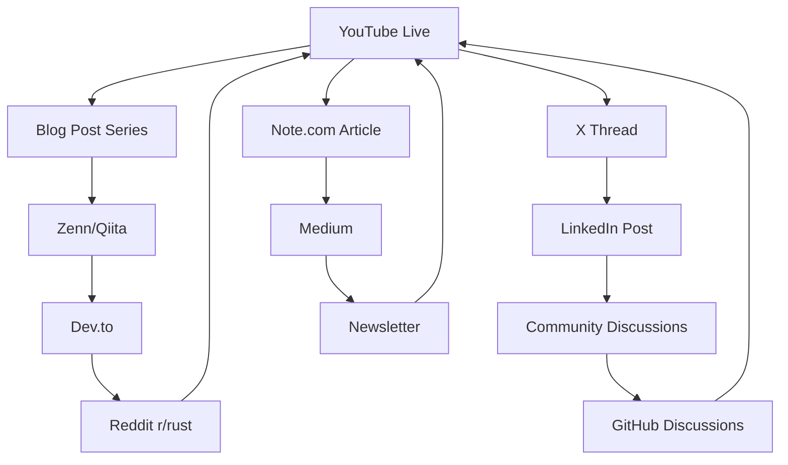

# 🎬 YouTube Live 完全実行戦略
## Miyabi OSS Launch - Perpetual Content Acceleration System

**Generated**: 2025-12-07
**Target Date**: 2025-12-08 (予定)
**Duration**: 60-90分

---

## 📋 EXECUTIVE SUMMARY

### Mission
Rust + Claude AI開発ベストプラクティスの完全公開を通じて、
技術コミュニティとの永続的なエンゲージメントサイクルを構築する。

### Success Metrics
| Metric | Target | Stretch Goal |
|--------|--------|--------------|
| Live Viewers (Peak) | 50+ | 100+ |
| Total Views (30日) | 500+ | 1,000+ |
| GitHub Stars | 100+ | 300+ |
| Comments/Questions | 20+ | 50+ |
| Subscriber Conversion | 10% | 20% |

---

## 🎯 PHASE 1: PRE-LIVE PREPARATION (48時間前)

### A. Technical Setup

#### OBS Configuration
```yaml
scenes:
  - name: "Opening"
    sources:
      - type: "Image"
        file: "docs/youtube-live-slides/01-title.png"
      - type: "Webcam"
        position: "bottom-right"
        size: "20%"

  - name: "Terminal Demo"
    sources:
      - type: "Window Capture"
        window: "tmux - miyabi-oss"
        size: "80%"
      - type: "Webcam"
        position: "bottom-right"
        size: "20%"

  - name: "Slide Presentation"
    sources:
      - type: "Image Slideshow"
        folder: "docs/youtube-live-slides/"
      - type: "Webcam"
        position: "bottom-left"
        size: "15%"

settings:
  resolution: "1920x1080"
  fps: 30
  bitrate: "4500-6000 kbps"
  encoder: "x264"
```

#### Audio Setup
```yaml
microphone:
  - device: "Primary Mic"
    filters:
      - "Noise Suppression"
      - "Noise Gate"
      - "Compressor"
      - "Limiter"

desktop_audio:
  - source: "System Audio"
    volume: "20%" # 低めに設定
```

#### Terminal Setup
```bash
# フォントサイズ拡大（視認性）
echo 'font_size: 24' >> ~/.config/alacritty/alacritty.yml

# tmuxセッションクリーンアップ
./scripts/tmux-cleanup.sh

# OSS用セッション準備
./scripts/init-miyabi-oss.sh

# ペインID確認
cat ~/.miyabi/pane_map.txt
```

### B. Content Preparation

#### チェックリスト
- [ ] スライド全17枚の動作確認
- [ ] デモスクリプトのドライラン（2回以上）
- [ ] トラブルシューティングスクリプト準備
- [ ] GitHub リポジトリ下書き作成
- [ ] YouTube概要欄テンプレート作成
- [ ] サムネイル3バージョン作成（A/Bテスト用）

#### Dry Run Script
```bash
# ドライラン実行（タイマー付き）
time {
  # Part 1-2: 背景説明 (25分想定)
  cat docs/youtube-live-script.md | head -90

  # Part 3-4: ライブデモ (35分想定)
  ./scripts/init-miyabi-oss.sh
  tmux list-panes -a

  # Part 5: ドキュメント (15分想定)
  cat MIYABI_OVERVIEW.md
  cat .claude/RUST_CHEATSHEET.md
}
```

---

## 🎬 PHASE 2: LIVE EXECUTION (配信当日)

### Timeline (90分想定)

```
00:00-00:10 | Opening & Introduction
            | - 自己紹介
            | - Miyabiプロジェクト概要
            | - 今日のアジェンダ説明
            | SLIDE: 01-title.png

00:10-00:25 | Background Story
            | - Dioxus Labs事例紹介
            | - なぜRust × Claude？
            | - OSS化の動機
            | SLIDES: 02-problem.png → 03-solution.png

00:25-00:45 | Live Demo 1: Environment Setup
            | - tmuxクリーンアップ実演
            | - init-miyabi-oss.sh実行
            | - ペインIDマッピング確認
            | - エージェント構成説明
            | SLIDES: 04-agents.png

00:45-01:00 | Live Demo 2: Communication Protocol
            | - P0.2プロトコル解説
            | - PUSH通信ルール実演
            | - 実際にメッセージ送信
            | SLIDES: 05-protocol.png

01:00-01:15 | Document Deep Dive
            | - MIYABI_OVERVIEW.md解説
            | - RUST_CHEATSHEET.md紹介
            | - .cargo/config.toml Tips
            | TERMINAL: Cat commands

01:15-01:25 | OSS Strategy & Future Plans
            | - リポジトリ構成説明
            | - コミュニティへの期待
            | - ロードマップ
            | SLIDES: 06-oss-strategy.png → 13-roadmap.png

01:25-01:30 | Q&A + Closing
            | - チャット質問対応
            | - チャンネル登録CTA
            | - 次回予告
```

### Key Talking Points

#### Opening Hook (最初の30秒が勝負)
```
「Claude AIを使って、たった6時間でVMware vSphereのクローンを
作った開発者がいるのをご存知ですか？

今日は、その戦略を58クレートのRustプロジェクトで実証した
ベストプラクティスを、完全にOSS公開します。」
```

#### Dioxus Labs事例
```
「Dioxus LabsのJonathan Kelleyさんは、Claude Opusを使って
わずか6時間でvSphereクローンを構築しました。

鍵は3つ：
1. overview.mdによるコンテキスト注入
2. ファイル集約戦略
3. コンパイラエラーを活用した高速イテレーション

これをMiyabiでさらに進化させました。」
```

#### OSS化の動機
```
「調べた結果、GitHubに『Rust + Claude特化』の
包括的ガイドはほとんど存在しませんでした。

58クレート、3ヶ月の実績をコミュニティに還元し、
一緒にRust×AI開発を進化させたいと思います。」
```

---

## 🔥 PHASE 3: POST-LIVE AMPLIFICATION (配信後24時間)

### Immediate Actions (配信終了後30分以内)

#### 1. アーカイブ確認
```bash
# YouTube Studio確認項目
- [ ] アーカイブ処理完了
- [ ] 自動字幕生成確認
- [ ] チャプターマーカー追加
```

#### 2. GitHub リポジトリ公開
```bash
cd ~/Dev/01-miyabi/_core/miyabi-rust-claude-guide

# 最終確認
cargo test --all
cargo clippy --all-targets

# 公開
git tag v1.0.0
git push origin main --tags

# GitHub Release作成
gh release create v1.0.0 \
  --title "Miyabi Rust × Claude Guide v1.0.0" \
  --notes "See README.md for details"
```

#### 3. SEO最適化

**タイトル候補（60文字以内）**:
```
1. 【ライブ解説】58クレートのRustプロジェクトをClaude AIで開発する方法
2. Miyabi OSS公開！Rust × Claude × マルチエージェント開発の全貌
3. 6時間でvSphereクローンを作った戦略をOSS化【Rust + AI】
```

**説明文（先頭2行が重要）**:
```
🦀 Rust × 🤖 Claude AI開発のベストプラクティスを完全公開！
58クレートの実績から生まれた、マルチエージェント開発の秘密を解説。

📌 この動画の内容
0:00 イントロ - なぜRust × Claude？
10:25 Dioxus Labs事例 - 6時間でvSphereクローン
25:45 ライブデモ - tmuxオーケストレーション環境構築
45:00 通信プロトコル - P0.2 PUSH戦略
1:00:15 ドキュメント解説 - MIYABI_OVERVIEW.md活用法
1:15:25 OSS公開計画 - コミュニティと創る未来
1:25:00 Q&A

🔗 関連リンク
GitHub (OSS公開): https://github.com/miyabi-labs/rust-claude-guide
Dioxus Labs Reference: https://x.com/jkelleyrtp/status/1868067086705037395
Anthropic Claude Code: https://www.anthropic.com/engineering

📚 Resources
- MIYABI_OVERVIEW.md: コンテキスト集約戦略
- RUST_CHEATSHEET.md: エラーハンドリングパターン
- tmuxオーケストレーション: マルチエージェント通信

🏷️ Tags
#Rust #Claude #AI開発 #OSS #tmux #マルチエージェント #Dioxus
#プログラミング #開発効率化 #ベストプラクティス

---

Rust開発にClaude AIを活用する包括的ガイドをOSS公開。
Dioxus Labsの6時間vSphereクローン戦略を58クレートで実証。
tmux永続ペインID、P0.2通信プロトコル、overview.md戦略など、
実戦で磨かれたテクニックを完全解説します。
```

**タグ（15個推奨）**:
```
Exact Match (2):
- Rust Claude
- AI開発

Phrase Match (5):
- Rust AI開発
- Claude Code
- マルチエージェント開発
- tmux オーケストレーション
- OSS 公開

Broad Match (6):
- Rust
- AI
- プログラミング
- 開発効率化
- オープンソース
- ベストプラクティス

Channel (2):
- Miyabi
- 技術解説
```

---

## 🌀 PHASE 4: PERPETUAL CONTENT AMPLIFICATION CYCLE

### Content Recycling Strategy



### Multi-Platform Distribution Plan

#### Day 1 (配信当日)
```yaml
platforms:
  YouTube:
    - action: "Live配信"
    - timing: "20:00-21:30"

  X (Twitter):
    - action: "開始告知"
    - timing: "19:00"
    - content: "🎬 20時からYouTube Live！Rust×Claude開発の全てを公開 #Rust #AI"

    - action: "リアルタイム実況"
    - timing: "配信中"
    - content: "ハイライトをスクショで連投"

    - action: "終了報告"
    - timing: "配信終了後"
    - content: "アーカイブリンク + GitHub公開告知"

  GitHub:
    - action: "リポジトリ公開"
    - timing: "配信終了後30分"
```

#### Day 2-7 (配信後1週間)
```yaml
Note.com:
  - title: "Rust × Claude AI開発で学んだ10の教訓"
  - timing: "Day 2"
  - length: "3,000-5,000文字"
  - CTA: "YouTube詳細解説へ"

Zenn:
  - title: "tmux永続ペインIDでマルチエージェント開発を実現する"
  - timing: "Day 3"
  - type: "技術記事"

Qiita:
  - title: "Claude Codeで58クレートを管理する.cargo/config.toml設定"
  - timing: "Day 4"
  - type: "Tips集"

Dev.to:
  - title: "How to Build Multi-Agent Rust Development with Claude AI"
  - timing: "Day 5"
  - language: "English"

Reddit r/rust:
  - title: "I built a 58-crate Rust project with Claude AI - Lessons learned"
  - timing: "Day 6"
  - approach: "Community discussion"

LinkedIn:
  - title: "Enterprise AI-Assisted Development: Rust Case Study"
  - timing: "Day 7"
  - target: "Professional audience"
```

#### Day 8-30 (配信後1ヶ月)
```yaml
Content Series:
  - "Rust Error Handling Patterns with AI Assistance"
  - "Building a Multi-Agent Development System"
  - "tmux Orchestration for Parallel AI Workflows"
  - "Context Injection Strategies: overview.md Best Practices"
  - "Scaling Rust Projects: From 1 to 58 Crates"

Engagement Activities:
  - GitHub Issues対応（週3回）
  - コミュニティQ&A（週1回）
  - コントリビューター募集
  - Showcase投稿の収集
```

---

## 📊 AUDIENCE ENGAGEMENT PROTOCOLS

### Real-Time Interaction

#### Chat Monitoring
```yaml
tools:
  - name: "YouTube Studio Live Dashboard"
    monitor:
      - "Comment stream"
      - "Super Chat"
      - "Live viewer count"

response_priority:
  high:
    - "Technical questions"
    - "Bug reports"
    - "Feature requests"
  medium:
    - "General questions"
    - "Feedback"
  low:
    - "Greetings"
    - "Spam"

response_templates:
  question_noted: "素晴らしい質問ですね！後で詳しく解説します。"
  technical_answer: "それは{topic}の話ですね。{brief_answer}。詳細はドキュメントで。"
  follow_up: "その話題、別の動画で深掘りしたいです！"
```

### Q&A Strategy

#### 準備する想定質問
```yaml
technical:
  - Q: "なぜtmuxのインデックスではなくペインIDを使うのか？"
    A: "tmuxウィンドウを追加/削除すると、インデックス（0.0, 0.1）が変わるため。永続ID（%N）なら安定。"

  - Q: "Claude以外のLLMでも使えるか？"
    A: "基本的なコンセプトは応用可能。ただしClaude特有のエラーハンドリング最適化も含まれる。"

  - Q: "本番環境での使用は推奨？"
    A: "開発・プロトタイピングには最適。本番デプロイは人間のレビュー必須。"

strategic:
  - Q: "なぜOSS化したのか？"
    A: "コミュニティからの学びを還元したい。Rust×AI開発を一緒に進化させたい。"

  - Q: "商用利用は可能？"
    A: "MIT/Apacheデュアルライセンス予定。自由に使ってください。"

general:
  - Q: "初心者でも使える？"
    A: "Rust基礎とtmux基本操作があれば大丈夫。ドキュメント充実させます。"
```

---

## 🎯 SUCCESS METRICS & ANALYTICS

### KPI Tracking

#### Real-Time (配信中)
```yaml
primary_metrics:
  - concurrent_viewers:
      target: 50
      alert_threshold: 20 # 20未満なら改善必要

  - chat_engagement_rate:
      target: "10 messages/minute"
      calculation: "total_messages / duration_minutes"

  - average_view_duration:
      target: "40+ minutes"
      measurement: "YouTube Analytics"
```

#### Post-Live (24時間後)
```yaml
video_performance:
  - total_views:
      target: 200
      stretch: 500

  - click_through_rate:
      target: "5%+"
      improvement: "A/Bテストサムネイル"

  - average_view_duration:
      target: "50%+"
      action: "50%未満ならパート分割検討"

  - likes_ratio:
      target: "95%+"
      calculation: "likes / (likes + dislikes)"
```

#### Community Impact (7日後)
```yaml
github_metrics:
  - stars:
      target: 100
      stretch: 300

  - forks:
      target: 20
      stretch: 50

  - issues_opened:
      target: 10
      note: "質の高いフィードバック"

  - pull_requests:
      target: 3
      note: "コミュニティコントリビューション"

social_metrics:
  - x_impressions:
      target: 10000

  - note_views:
      target: 1000

  - zenn_likes:
      target: 100
```

---

## 🚨 CONTINGENCY PLANNING

### Technical Issues

#### 音声トラブル
```yaml
symptoms: "マイク音声が聞こえない"
immediate_action:
  - "OBS音声メーター確認"
  - "マイクデバイス再選択"
  - "代替マイクに切り替え（用意しておく）"
fallback: "チャットで指示を出しながら修復"
```

#### 画面共有エラー
```yaml
symptoms: "ターミナル画面が映らない"
immediate_action:
  - "ウィンドウキャプチャ再設定"
  - "代替シーンに切り替え"
  - "スライド解説に変更"
fallback: "スクリーンショットを事前に用意"
```

#### tmuxセッション起動失敗
```yaml
symptoms: "init-miyabi-oss.shがエラー"
immediate_action:
  - "tmux kill-server で全クリア"
  - "再実行"
  - "エラーログを画面共有して説明"
fallback: "事前録画デモ動画を再生"
```

### Content Issues

#### 時間超過
```yaml
at_60_minutes:
  if: "まだPart 4"
  action: "Part 5をスキップして直接Part 6へ"

at_75_minutes:
  if: "Part 6未到達"
  action: "概要のみ説明してQ&Aへ"

at_90_minutes:
  action: "強制終了、続きは次回予告"
```

#### 質問殺到
```yaml
strategy:
  - "代表的な質問3つに絞る"
  - "他の質問はGitHub Issueで受付"
  - "後日フォローアップ動画を約束"
```

---

## 📝 DELIVERABLES CHECKLIST

### Pre-Live
- [ ] OBS設定完了（3シーン）
- [ ] 音声テスト完了（録音確認）
- [ ] スライド全17枚動作確認
- [ ] ドライラン実施（2回）
- [ ] GitHub下書きリポジトリ作成
- [ ] YouTube概要欄テンプレート作成
- [ ] サムネイル3バージョン作成
- [ ] トラブルシューティングスクリプト準備
- [ ] 代替シナリオ準備（3パターン）

### Live Day
- [ ] 配信30分前: OBS起動・最終確認
- [ ] 配信15分前: tmuxセッションクリア
- [ ] 配信10分前: ウォームアップ（声出し）
- [ ] 配信中: チャット監視（専用モニター）
- [ ] 配信中: タイムライン遵守
- [ ] 配信終了: アーカイブ処理確認

### Post-Live (24時間以内)
- [ ] GitHub リポジトリ公開
- [ ] YouTube SEO最適化（タイトル・説明・タグ）
- [ ] チャプターマーカー追加
- [ ] X告知投稿（3-5ツイート）
- [ ] Note.com記事執筆開始
- [ ] Zenn記事執筆開始
- [ ] Community Issues対応開始

### Week 1
- [ ] Note.com記事公開
- [ ] Zenn記事公開
- [ ] Qiita記事公開
- [ ] Dev.to記事公開（英語）
- [ ] Reddit r/rust投稿
- [ ] LinkedIn記事公開
- [ ] GitHub Issues対応（10件以上想定）

---

## 🎓 LESSONS LEARNED (事後レビュー用)

### 配信後に記録する項目

```yaml
what_worked:
  - "最も反応が良かったパート"
  - "効果的だったデモ"
  - "エンゲージメント高かった質問"

what_didnt:
  - "説明が長すぎた部分"
  - "技術的トラブル"
  - "視聴者が離脱したタイミング"

surprises:
  - "予想外の質問"
  - "意外と好評だった要素"
  - "改善提案"

next_time:
  - "改善点"
  - "追加したいコンテンツ"
  - "削減すべき内容"
```

---

## 🌟 PERPETUAL MOMENTUM SYSTEM

### Content Flywheel

```
Live → Archive → Blog → Social → Community → Questions → Next Live
  ↑                                                              ↓
  └──────────────────────────────────────────────────────────────┘
```

### Monthly Cycle

```yaml
week_1:
  - "Live配信実施"
  - "コンテンツ分解（5-7記事）"

week_2:
  - "記事公開ラッシュ"
  - "Community engagement"

week_3:
  - "フィードバック収集"
  - "次回テーマ決定"

week_4:
  - "次回準備開始"
  - "改善実装"
```

---

## 🔗 RELATED DOCUMENTS

- [YouTube Live Script](./youtube-live-script.md)
- [Infographics Definition](./youtube-live-infographics.yaml)
- [YouTube Optimization Skill](../.claude/Skills/youtube-optimization/skill.md)
- [Slides Collection](./youtube-live-slides/)
- [A2A Demo Slides](../A2A/demo/slides/)

---

*Generated by Miyabi Marketing Agent - Perpetual Content Acceleration System*
*Version: 1.0.0*
