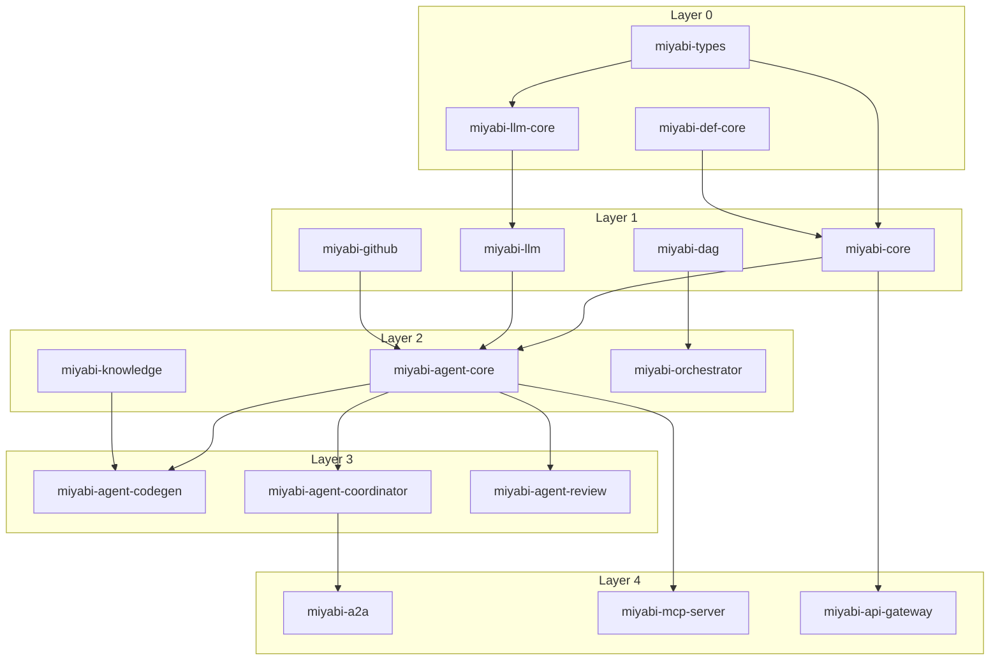

# Miyabi Dependency Graph

**Generated**: 2025-12-05
**Total Crates**: 58
**Issue**: #971

---

## 📦 Crate Layer Structure

```
┌─────────────────────────────────────────────────────────────────┐
│                    Layer 4: Gateway/API                         │
│  miyabi-a2a, miyabi-a2a-gateway, miyabi-api-gateway,           │
│  miyabi-mcp-server, miyabi-web-api, miyabi-web-ui-api          │
└─────────────────────────────────────────────────────────────────┘
                              ▲
┌─────────────────────────────────────────────────────────────────┐
│                 Layer 3: Specialized Agents                     │
│  miyabi-agent-codegen, miyabi-agent-coordinator,               │
│  miyabi-agent-review, miyabi-agent-issue,                      │
│  miyabi-agent-business, miyabi-agent-workflow                  │
└─────────────────────────────────────────────────────────────────┘
                              ▲
┌─────────────────────────────────────────────────────────────────┐
│               Layer 2: Agent Infrastructure                     │
│  miyabi-agent-core, miyabi-knowledge, miyabi-claudable,        │
│  miyabi-orchestrator, miyabi-agent-integrations                │
└─────────────────────────────────────────────────────────────────┘
                              ▲
┌─────────────────────────────────────────────────────────────────┐
│                     Layer 1: Core                               │
│  miyabi-core, miyabi-llm, miyabi-github, miyabi-dag,           │
│  miyabi-persistence, miyabi-prompt-engine                      │
└─────────────────────────────────────────────────────────────────┘
                              ▲
┌─────────────────────────────────────────────────────────────────┐
│                   Layer 0: Foundation                           │
│  miyabi-types, miyabi-def-core, miyabi-llm-core                │
└─────────────────────────────────────────────────────────────────┘
```

---

## 📊 Complete Crate List (58 crates)

### Layer 0: Foundation (3 crates)
| Crate | Description |
|-------|-------------|
| `miyabi-types` | 基本型定義 |
| `miyabi-def-core` | コア定義 |
| `miyabi-llm-core` | LLMコア抽象化 |

### Layer 1: Core (10 crates)
| Crate | Description |
|-------|-------------|
| `miyabi-core` | メインコア |
| `miyabi-llm` | LLM統合 |
| `miyabi-llm-anthropic` | Anthropic統合 |
| `miyabi-llm-openai` | OpenAI統合 |
| `miyabi-llm-google` | Google統合 |
| `miyabi-github` | GitHub API統合 |
| `miyabi-dag` | DAGエンジン |
| `miyabi-persistence` | データ永続化 |
| `miyabi-prompt-engine` | プロンプトエンジン |
| `miyabi-auth` | 認証 |

### Layer 2: Agent Infrastructure (8 crates)
| Crate | Description |
|-------|-------------|
| `miyabi-agent-core` | Agent基盤 |
| `miyabi-agent-integrations` | Agent統合 |
| `miyabi-knowledge` | 知識ベース |
| `miyabi-claudable` | Claude統合 |
| `miyabi-orchestrator` | オーケストレーション |
| `miyabi-workflow` | ワークフロー |
| `miyabi-composite-state` | 状態管理 |
| `miyabi-modes` | モード管理 |

### Layer 3: Specialized Agents (10 crates)
| Crate | Description |
|-------|-------------|
| `miyabi-agent-codegen` | CodeGen Agent |
| `miyabi-agent-coordinator` | Coordinator Agent |
| `miyabi-agent-review` | Review Agent |
| `miyabi-agent-issue` | Issue Agent |
| `miyabi-agent-business` | Business Agents |
| `miyabi-agent-workflow` | Workflow Agent |
| `miyabi-agent-swml` | SWML Agent |
| `miyabi-agents` | Agent統合 |
| `miyabi-aws-agent` | AWS Agent |
| `codex-miyabi` | Codex統合 |

### Layer 4: Gateway/API (12 crates)
| Crate | Description |
|-------|-------------|
| `miyabi-a2a` | A2A Protocol |
| `miyabi-a2a-gateway` | A2A Gateway |
| `miyabi-api-gateway` | API Gateway |
| `miyabi-mcp-server` | MCP Server |
| `miyabi-mcp-template` | MCP Template |
| `miyabi-web-api` | Web API |
| `miyabi-web-ui-api` | Web UI API |
| `miyabi-business-api` | Business API |
| `miyabi-seedance-api` | Seedance API |
| `miyabi-webhook` | Webhook |
| `miyabi-line` | LINE統合 |
| `miyabi-telegram` | Telegram統合 |

### Infrastructure/Tools (15 crates)
| Crate | Description |
|-------|-------------|
| `miyabi-cli` | CLI |
| `miyabi-tui` | TUI |
| `miyabi-viz` | 可視化 |
| `miyabi-benchmark` | ベンチマーク |
| `miyabi-e2e-tests` | E2Eテスト |
| `miyabi-logging-monitor` | ログ監視 |
| `miyabi-session-manager` | セッション管理 |
| `miyabi-session-sync` | セッション同期 |
| `miyabi-tmux-orchestrator` | tmuxオーケストレーション |
| `miyabi-pty-manager` | PTY管理 |
| `miyabi-worktree` | Git Worktree |
| `miyabi-historical` | 履歴管理 |
| `miyabi-approval` | 承認フロー |
| `miyabi-voice-guide` | 音声ガイド |
| `miyabi-discord-mcp-server` | Discord MCP |

---

## 🔗 Key Dependencies



---

## 📈 Critical Path

```
miyabi-types
    └── miyabi-core
        └── miyabi-agent-core
            └── miyabi-agent-coordinator
                └── miyabi-a2a-gateway
                    └── Production Deployment
```

---

## 📊 Statistics

| Metric | Value |
|--------|-------|
| Total Crates | 58 |
| Foundation Layer | 3 |
| Core Layer | 10 |
| Agent Infra Layer | 8 |
| Agent Layer | 10 |
| Gateway Layer | 12 |
| Tools/Infra | 15 |

---

*Generated by CoordinatorAgent (しきるん) - #971*
