# Miyabi Complete Flow Diagrams - Mermaid Edition

Created: 2025-10-26
Version: 1.0.0
Total: 8 comprehensive Mermaid diagrams

---

## Diagram 1: D1-D20 Complete Decision Tree Flow

```mermaid
%%{init: {'theme':'base', 'themeVariables': { 'primaryColor':'#90EE90','primaryTextColor':'#000','primaryBorderColor':'#000','lineColor':'#666','secondaryColor':'#87CEEB','tertiaryColor':'#FFB6C1'}}}%%
flowchart TD
    Start([Issue Created/Selected]) --> PreFlight[Phase 0: Safety Pre-flight]

    subgraph PreFlight[" "]
        GitSafe{Git Safe?}
        GitCheck[Git Safety Check<br/>SCRIPT]
        APICheck[API Key Validation<br/>SCRIPT]
        AuthCheck[GitHub Auth Check<br/>SCRIPT]

        GitCheck --> GitSafe
        GitSafe -->|yes| APICheck
        GitSafe -->|no| EscDevOps1[Escalate: DevOps<br/>ERROR]
        APICheck --> AuthCheck
        EscDevOps1 --> Stop1[END]
    end

    PreFlight --> D1[D1: Label Validation]

    subgraph D1[" "]
        CheckLabels[Check Miyabi Labels<br/>SCRIPT]
        LabelsValid{Labels Valid?}

        CheckLabels --> LabelsValid
        LabelsValid -->|yes| D1Pass[✅ Continue]
        LabelsValid -->|no| EscPO[❌ Escalate to PO<br/>ERROR]
        EscPO --> Stop2[END]
    end

    D1 --> D2[D2: Complexity Check]

    subgraph D2[" "]
        FetchIssue[Fetch Issue Data<br/>SCRIPT]
        ClaudeAnalysis[Claude Headless Analysis<br/>AI HEADLESS]
        ComplexityLevel{Complexity?}

        FetchIssue --> ClaudeAnalysis
        ClaudeAnalysis --> ComplexityLevel
        ComplexityLevel -->|Low| D2Low[✅ Auto-approve<br/>< 30 min, 1-3 files]
        ComplexityLevel -->|Medium| D2Med[⚠️ AI-assisted mode<br/>30-90 min, 4-10 files]
        ComplexityLevel -->|High| D2High[🚨 Escalate to TechLead<br/>ERROR]
        D2High --> Stop3[END]
    end

    D2 --> D3[D3: Task Decomposition]

    subgraph D3[" "]
        Decompose[Decompose into Subtasks<br/>AI HEADLESS]
        TaskCount{Task Count?}

        Decompose --> TaskCount
        TaskCount -->|1-5 tasks| SingleWT[Single worktree]
        TaskCount -->|6+ tasks| ParallelWT[Parallel worktrees]
    end

    D3 --> D4[D4: Implementation Planning]

    subgraph D4[" "]
        GenPlan[Generate Implementation Plan<br/>AI HEADLESS]
        BreakingChanges{Breaking Changes?}

        GenPlan --> BreakingChanges
        BreakingChanges -->|yes| HumanApproval[Human approval required<br/>INTERACTIVE]
        BreakingChanges -->|no| AutoProceed[Auto-proceed]
        HumanApproval --> Approved{Approved?}
        Approved -->|no| Stop4[END]
        Approved -->|yes| D4Continue[Continue]
    end

    D4 --> D5[D5: Code Generation]

    subgraph D5[" "]
        GenCode[Generate Code<br/>AI HEADLESS]
        SyntaxValid{Syntax Valid?}

        GenCode --> SyntaxValid
        SyntaxValid -->|yes| SyntaxPass[✅ Syntax check passed]
        SyntaxValid -->|no| AutoFix1[Auto-fix attempt<br/>SCRIPT]
        AutoFix1 --> Fixed1{Fixed?}
        Fixed1 -->|no| EscTech1[Escalate to TechLead<br/>ERROR]
        Fixed1 -->|yes| D5Continue[Continue]
        EscTech1 --> Stop5[END]
    end

    D5 --> D6[D6: Build Validation]

    subgraph D6[" "]
        CargoBuild[cargo build<br/>SCRIPT]
        BuildSuccess{Build Success?}

        CargoBuild --> BuildSuccess
        BuildSuccess -->|yes| BuildPass[✅ Build passed]
        BuildSuccess -->|no| ParseErrors[Parse build errors<br/>SCRIPT]
    end

    D6 --> D7[D7: Auto-fix Decision]

    subgraph D7[" "]
        AnalyzeError[Analyze Error Type<br/>AI HEADLESS]
        AutoFixable{Auto-fixable?}

        AnalyzeError --> AutoFixable
        AutoFixable -->|yes| CargoFix[cargo fix<br/>SCRIPT]
        AutoFixable -->|no| EscTech2[Escalate to TechLead<br/>ERROR]
        CargoFix --> Rebuild[Rebuild<br/>SCRIPT]
        Rebuild --> RebuildSuccess{Build Success?}
        RebuildSuccess -->|yes| D7Pass[✅ Auto-fix succeeded]
        RebuildSuccess -->|no| EscTech3[Escalate to TechLead<br/>ERROR]
        EscTech2 --> Stop6[END]
        EscTech3 --> Stop7[END]
    end

    D7 --> D8[D8: Test Execution]

    subgraph D8[" "]
        CargoTest[cargo test --all<br/>SCRIPT<br/>Timeout: 10 minutes]
        TestsPass{Tests Pass?}

        CargoTest --> TestsPass
        TestsPass -->|yes| TestPass[✅ All tests passed]
    end

    D8 --> D9[D9: Test Failure Analysis]

    subgraph D9[" "]
        AnalyzeFailures[Analyze Test Failures<br/>AI HEADLESS]
        FailureType{Failure Type?}

        AnalyzeFailures --> FailureType
        FailureType -->|Flaky| RetryTests[Retry tests max 3<br/>SCRIPT]
        FailureType -->|Related to changes| EscTech4[Escalate to TechLead<br/>ERROR]
        FailureType -->|Unrelated| EscDevOps2[Escalate to DevOps<br/>ERROR]
        EscTech4 --> Stop8[END]
        EscDevOps2 --> Stop9[END]
    end

    D9 --> D10[D10: Clippy Lint]

    subgraph D10[" "]
        CargoClippy[cargo clippy<br/>SCRIPT]
        ClippyPass{Clippy Pass?}

        CargoClippy --> ClippyPass
        ClippyPass -->|yes| LintPass[✅ Lint passed]
        ClippyPass -->|no| AutoFixClippy[Auto-fix clippy suggestions<br/>SCRIPT]
        AutoFixClippy --> ClippyFixed{Fixed?}
        ClippyFixed -->|yes| ClippyFixPass[✅ Clippy fixed]
        ClippyFixed -->|no| ManualReview[⚠️ Manual review required]
    end

    D10 --> D11[D11: Security Scan]

    subgraph D11[" "]
        CargoAudit[cargo audit<br/>SCRIPT]
        Vulnerabilities{Vulnerabilities?}

        CargoAudit --> Vulnerabilities
        Vulnerabilities -->|Critical| EscCISO[Escalate to CISO<br/>ERROR]
        Vulnerabilities -->|High/Medium| LogReview[Log for review]
        Vulnerabilities -->|None| SecurityPass[✅ Security passed]
        EscCISO --> Stop10[END]
    end

    D11 --> D12[D12: Git Commit]

    subgraph D12[" "]
        GitAdd[git add modified files<br/>SCRIPT]
        GenCommitMsg[Generate commit message<br/>AI HEADLESS]
        GitCommit[git commit -m ...<br/>SCRIPT]
        CommitSuccess{Commit Success?}

        GitAdd --> GenCommitMsg
        GenCommitMsg --> GitCommit
        GitCommit --> CommitSuccess
        CommitSuccess -->|yes| CommitPass[✅ Changes committed]
        CommitSuccess -->|no| EscDevOps3[Escalate to DevOps<br/>ERROR]
        EscDevOps3 --> Stop11[END]
    end

    D12 --> D13[D13: PR Creation]

    subgraph D13[" "]
        AnalyzeScope[Analyze change scope<br/>AI HEADLESS]
        AutoCreatePR{Auto-create PR?}

        AnalyzeScope --> AutoCreatePR
        AutoCreatePR -->|yes| GenPRDesc[Generate PR description<br/>AI HEADLESS]
        AutoCreatePR -->|no| HumanCreatesPR[Human creates PR<br/>INTERACTIVE]
        GenPRDesc --> GhPrCreate[gh pr create<br/>SCRIPT]
    end

    D13 --> D14[D14: CI/CD Validation]

    subgraph D14[" "]
        WaitCI[Wait for GitHub Actions<br/>SCRIPT]
        AllChecks{All Checks Pass?}

        WaitCI --> AllChecks
        AllChecks -->|yes| CIPass[✅ CI/CD passed]
        AllChecks -->|no| EscDevOps4[Escalate to DevOps<br/>ERROR]
        EscDevOps4 --> Stop12[END]
    end

    D14 --> D15[D15: Code Review]

    subgraph D15[" "]
        ReviewRequired{Review Required?}
        RequestReview[Request human review<br/>INTERACTIVE]
        WaitApproval[Wait for approval]
        ReviewApproved{Approved?}

        ReviewRequired -->|yes| RequestReview
        ReviewRequired -->|no| AutoApproved[✅ Auto-approved Low risk]
        RequestReview --> WaitApproval
        WaitApproval --> ReviewApproved
        ReviewApproved -->|yes| ReviewPass[✅ Review approved]
        ReviewApproved -->|no| AddressFeedback[Address feedback]
    end

    D15 --> D16[D16: Merge Strategy]

    subgraph D16[" "]
        DetermineMerge[Determine merge strategy<br/>SCRIPT]
        Conflicts{Conflicts?}

        DetermineMerge --> Conflicts
        Conflicts -->|yes| EscTech5[Escalate to TechLead<br/>ERROR]
        Conflicts -->|no| AutoMerge[Auto-merge<br/>SCRIPT]
        AutoMerge --> GhPrMerge[gh pr merge<br/>SCRIPT]
        EscTech5 --> Stop13[END]
    end

    D16 --> D17[D17: Deploy Decision]

    subgraph D17[" "]
        AnalyzeRisk[Analyze deployment risk<br/>AI HEADLESS]
        RiskLevel{Risk Level?}

        AnalyzeRisk --> RiskLevel
        RiskLevel -->|Low| AutoDeployStaging[Auto-deploy to staging<br/>SCRIPT]
        RiskLevel -->|Medium| RequestDeployApproval[Request deploy approval<br/>INTERACTIVE]
        RiskLevel -->|High| EscCTO[Escalate to CTO<br/>ERROR]
        RequestDeployApproval --> DeployApproved{Approved?}
        DeployApproved -->|yes| DeployStaging[Deploy to staging<br/>SCRIPT]
        DeployApproved -->|no| Stop14[END]
        EscCTO --> Stop15[END]
    end

    D17 --> D18[D18: Staging Validation]

    subgraph D18[" "]
        RunIntegrationTests[Run integration tests<br/>SCRIPT]
        HealthCheck[Health check<br/>SCRIPT]
        PerfTest[Performance test<br/>SCRIPT]
        AllTestsPass{All Tests Pass?}

        RunIntegrationTests --> HealthCheck
        HealthCheck --> PerfTest
        PerfTest --> AllTestsPass
        AllTestsPass -->|yes| StagingPass[✅ Staging validated]
        AllTestsPass -->|no| RollbackStaging[Rollback staging<br/>SCRIPT]
        RollbackStaging --> EscDevOps5[Escalate to DevOps<br/>ERROR]
        EscDevOps5 --> Stop16[END]
    end

    D18 --> D19[D19: Production Deploy]

    subgraph D19[" "]
        AutoDeployProd{Auto-deploy Prod?}
        RequestProdApproval[Request prod deploy approval<br/>INTERACTIVE]

        AutoDeployProd -->|yes| DeployProduction[Deploy to production<br/>SCRIPT]
        AutoDeployProd -->|no| RequestProdApproval
        RequestProdApproval --> ProdApproved{Approved?}
        ProdApproved -->|yes| DeployProduction
        ProdApproved -->|no| ScheduleDeploy[Schedule deploy<br/>INTERACTIVE]
        ScheduleDeploy --> Stop17[END]
    end

    D19 --> D20[D20: Production Validation]

    subgraph D20[" "]
        ProdHealthCheck[Health check<br/>SCRIPT]
        MonitorMetrics[Monitor metrics<br/>SCRIPT<br/>Duration: 5 minutes]
        Healthy{Healthy?}

        ProdHealthCheck --> MonitorMetrics
        MonitorMetrics --> Healthy
        Healthy -->|yes| DeploySuccess[✅ Deploy successful]
        Healthy -->|no| AutoRollback[🚨 Auto-rollback<br/>SCRIPT]
        AutoRollback --> EscDevOps6[Escalate to DevOps<br/>ERROR]
        EscDevOps6 --> Stop18[END]
    end

    D20 --> Complete[✅ Complete Success]
    Complete --> CloseIssue[Close Issue<br/>SCRIPT]
    CloseIssue --> GenReport[Generate report<br/>AI HEADLESS]
    GenReport --> End([END])

    style PreFlight fill:#FFA500
    style D1 fill:#90EE90
    style D2 fill:#87CEEB
    style D3 fill:#87CEEB
    style D4 fill:#87CEEB
    style D5 fill:#87CEEB
    style D6 fill:#90EE90
    style D7 fill:#87CEEB
    style D8 fill:#90EE90
    style D9 fill:#87CEEB
    style D10 fill:#90EE90
    style D11 fill:#90EE90
    style D12 fill:#90EE90
    style D13 fill:#87CEEB
    style D14 fill:#90EE90
    style D15 fill:#FFB6C1
    style D16 fill:#90EE90
    style D17 fill:#FFB6C1
    style D18 fill:#90EE90
    style D19 fill:#FFB6C1
    style D20 fill:#90EE90
```



---

## Diagram 2: Human Intervention Mode Switching Matrix


---

## Diagram 3: Error Handling & Escalation Flow

```mermaid
flowchart TD
    Start([Error Detected]) --> Classify

    subgraph Classify[Layer 1: Error Classification]
        Severity{Error<br/>Severity?}
        Severity -->|🔴 Critical| P0[Set Priority: P0<br/>Immediate escalation]
        Severity -->|🟠 High| P1[Set Priority: P1<br/>Alert within 5 min]
        Severity -->|🟡 Medium| P2[Set Priority: P2<br/>Notify within 1 hour]
        Severity -->|🟢 Low| P3[Set Priority: P3<br/>Log only]
    end

    Classify --> RollbackDecision

    subgraph RollbackDecision[Layer 2: Rollback Decision]
        NeedRollback{Rollback<br/>Required?}
        ExecuteRollback[Execute rollback stack<br/>LIFO order]
        RollbackSuccess{Rollback<br/>Success?}

        NeedRollback -->|yes| ExecuteRollback
        NeedRollback -->|no| ToEscalation
        ExecuteRollback --> RollbackSuccess
        RollbackSuccess -->|yes| StateRestored[✅ State restored]
        RollbackSuccess -->|no| ManualIntervention[🚨 Manual intervention]
        ManualIntervention --> EscDevOps[Escalate to DevOps]
        StateRestored --> ToEscalation
    end

    ToEscalation --> Routing

    subgraph Routing[Layer 3: Escalation Routing]
        ErrorType{Error Type?}

        ErrorType -->|Build/Test| ToTechLead[Escalate to TechLead]
        ErrorType -->|Security| ToCISO[Escalate to CISO]
        ErrorType -->|Product/Requirements| ToPO[Escalate to ProductOwner]
        ErrorType -->|Deploy/Infra| ToDevOps2[Escalate to DevOps]
        ErrorType -->|Strategic| ToCTO[Escalate to CTO]
    end

    Routing --> Notify

    subgraph Notify[Layer 4: Notification Dispatch]
        MultiChannel[Send multi-channel notification]

        MultiChannel -->|Channel 1| MacOS[macOS Notification]
        MultiChannel -->|Channel 2| VOICEVOX[VOICEVOX Alert]
        MultiChannel -->|Channel 3| StreamDeck[Stream Deck Flag]
        MultiChannel -->|Channel 4| GitHub[GitHub Comment]
        MultiChannel -->|Channel 5| LogFile[Log to file]
    end

    Notify --> Response

    subgraph Response[Layer 5: Human Response]
        InterventionMode{Human<br/>Intervention<br/>Mode?}

        InterventionMode -->|Phase 1| ImmediateConv[Immediate conversation<br/>Real-time resolution]
        InterventionMode -->|Phase 2| Respond5min[Respond within 5 min<br/>Switch to Interactive]
        InterventionMode -->|Phase 3| AsyncResponse[Async response<br/>Review & plan]
    end

    Response --> Tracking

    subgraph Tracking[Layer 6: Resolution Tracking]
        LogResolution[Log resolution]
        UpdateMetrics[Update metrics]
        GenIncidentReport[Generate incident report]

        LogResolution --> UpdateMetrics
        UpdateMetrics --> GenIncidentReport
    end

    Tracking --> End([Error Resolved])

    style Classify fill:#FFA500
    style RollbackDecision fill:#FFA500
    style Routing fill:#FFA500
    style Notify fill:#FFA500
    style Response fill:#FFB6C1
    style Tracking fill:#FFA500
```



---

## Diagram 4: Parallel Execution with Git Worktrees

```mermaid
flowchart TD
    Start([Issue with Multiple Tasks]) --> Parse[Parse task dependencies]
    Parse --> Identify[Identify parallel tasks]

    Identify --> CreateWT

    subgraph CreateWT[Worktree Initialization]
        WT1[Create worktree-task1<br/>git worktree add<br/>../worktrees/issue-270-task1]
        WT3[Create worktree-task3<br/>Independent task]
    end

    CreateWT --> Execute

    subgraph Execute[Parallel Execution]
        direction TB

        subgraph WT1Exec[Worktree 1: Task 1]
            ExecWT1[Execute in worktree-task1]
            UpdateLogger[Update logger.rs]
            RunTests1[Run tests local]
            Commit1[Commit changes]

            ExecWT1 --> UpdateLogger
            UpdateLogger --> RunTests1
            RunTests1 --> Commit1
        end

        subgraph WT3Exec[Worktree 3: Task 3]
            ExecWT3[Execute in worktree-task3]
            UpdateREADME[Update README.md]
            NoTests[No tests needed]
            Commit3[Commit changes]

            ExecWT3 --> UpdateREADME
            UpdateREADME --> NoTests
            NoTests --> Commit3
        end
    end

    Execute --> Complete[Task 1 & 3 complete]

    Complete --> Sequential

    subgraph Sequential[Worktree 2: Task 2 Sequential]
        CreateWT2[Create worktree-task2<br/>Depends on Task 1]
        CherryPick[Cherry-pick Task 1 changes]
        AddTests[Add new tests]
        RunFullTests[Run full test suite]
        Commit2[Commit changes]

        CreateWT2 --> CherryPick
        CherryPick --> AddTests
        AddTests --> RunFullTests
        RunFullTests --> Commit2
    end

    Sequential --> Integration

    subgraph Integration[Integration & Merge]
        SwitchMain[Switch to main worktree]
        MergeT1[Merge task1 → main]
        MergeT2[Merge task2 → main]
        MergeT3[Merge task3 → main]
        ResolveConflicts[Resolve conflicts if any]
        RunIntegrationTests[Run full integration tests]

        SwitchMain --> MergeT1
        MergeT1 --> MergeT2
        MergeT2 --> MergeT3
        MergeT3 --> ResolveConflicts
        ResolveConflicts --> RunIntegrationTests
    end

    Integration --> Cleanup

    subgraph Cleanup[Cleanup]
        RemoveWT1[Remove worktree-task1]
        RemoveWT2[Remove worktree-task2]
        RemoveWT3[Remove worktree-task3]
        DeleteBranches[Delete remote branches]

        RemoveWT1 --> RemoveWT2
        RemoveWT2 --> RemoveWT3
        RemoveWT3 --> DeleteBranches
    end

    Cleanup --> End([Parallel execution complete])

    style CreateWT fill:#87CEEB
    style Execute fill:#87CEEB
    style Sequential fill:#87CEEB
    style Integration fill:#90EE90
    style Cleanup fill:#90EE90
```



---

## Diagram 5: Cost & Performance Tracking


---

## Diagram 6: 6-Layer Safety Architecture


---

## Diagram 7: Complete System Architecture

```mermaid
flowchart TD
    subgraph External[External Systems]
        GitHubIssues[GitHub Issues]
        GitHubActions[GitHub Actions CI/CD]
        GitHubAPI[GitHub API]
        ClaudeAPI[Claude API]

        subgraph GitRepo[GitHub Repository]
            MainBranch[main branch]
            FeatureBranches[feature branches]
            Worktrees[worktrees]
        end
    end

    subgraph MiyabiCore[Miyabi Core]
        subgraph Scripts[scripts/]
            subgraph Primitives[primitives/]
                CheckLabel[check-label.sh]
                RunTests[run-tests.sh]
                Escalate[escalate.sh]
                GitSafetyCheck[git-safety-check.sh]
            end

            subgraph DecisionTrees[decision-trees/]
                D1[D1-label-check.sh]
                D2[D2-complexity-check.sh]
                D3to20[D3-D20.sh planned]
            end

            subgraph Orchestrators[orchestrators/]
                AutonomousProcessor[autonomous-issue-processor.sh]
            end
        end

        subgraph Crates[crates/]
            MiyabiCore[miyabi-core]
            MiyabiCLI[miyabi-cli]
            MiyabiAgents[miyabi-agents]
            MiyabiWorktree[miyabi-worktree]
        end

        subgraph Logs[Logs]
            TmpLogs[/tmp/miyabi-automation/]
            EscalationsLog[logs/escalations.log]
            MetricsLog[logs/metrics.json]
        end
    end

    subgraph ClaudeIntegration[Claude Code Integration]
        InteractiveMode[Interactive Mode]
        HeadlessMode[Headless Mode<br/>claude -p]
        AgentSDK[Agent SDK planned]
    end

    subgraph Notifications[Notification Channels]
        MacOS[macOS Notification Center]
        VOICEVOX[VOICEVOX Engine]
        StreamDeck[Stream Deck]
        Discord[Discord/Slack planned]
    end

    subgraph Operators[Human Operators]
        TechLead[TechLead]
        CISO[CISO]
        PO[ProductOwner]
        CTO[CTO]
        DevOps[DevOps]
    end

    GitHubIssues -->|Issue #XXX| AutonomousProcessor
    AutonomousProcessor --> DecisionTrees
    DecisionTrees --> Primitives
    DecisionTrees --> HeadlessMode
    HeadlessMode --> ClaudeAPI

    AutonomousProcessor --> MiyabiWorktree
    MiyabiWorktree --> GitRepo

    Primitives --> Notifications
    Notifications --> Operators

    Operators --> InteractiveMode
    InteractiveMode --> ClaudeAPI

    DecisionTrees --> Logs
    Logs --> GitHubActions

    style External fill:#E6F3FF
    style MiyabiCore fill:#FFE6F0
    style ClaudeIntegration fill:#E6FFE6
    style Notifications fill:#FFF8DC
    style Operators fill:#FFB6C1
```

---

## Diagram 8: Issue Lifecycle State Machine


---

## How to Use These Mermaid Diagrams

### In GitHub/GitLab
Mermaid diagrams render automatically in Markdown files.

### In VS Code
Install extension: "Markdown Preview Mermaid Support"

### Online
- https://mermaid.live/ - Official Mermaid Live Editor
- Paste diagram code and preview instantly

### Export
- PNG/SVG export available from mermaid.live
- GitHub can render directly in README.md

---

## Color Legend

- 🟢 **Green** (#90EE90): Script Mode (Confirmed Process)
- 🔵 **Blue** (#87CEEB): Headless AI Mode (AI Judgment)
- 🌸 **Pink** (#FFB6C1): Interactive Mode (Human Interaction)
- 🟠 **Orange** (#FFA500): Safety Layer
- 🔴 **Red** (#FF6B6B): Error State

---

**Total**: 8 comprehensive Mermaid diagrams covering all Miyabi autonomous operation flows.

**Created**: 2025-10-26
**Version**: 1.0.0
