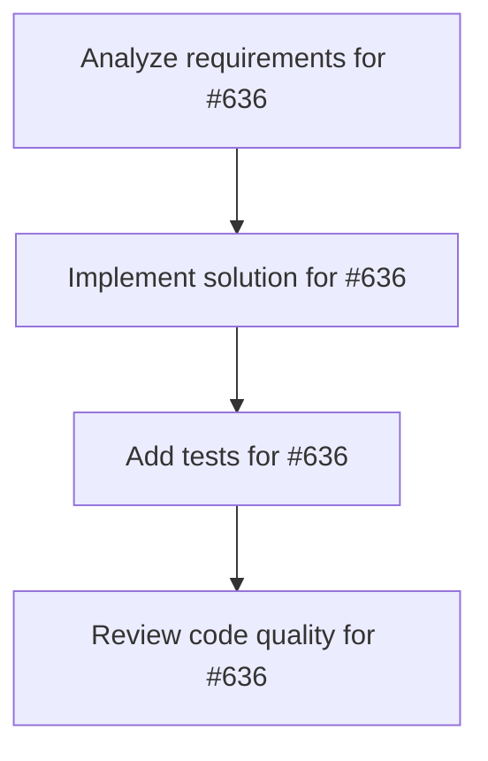

# Plans for Issue #636

**Title**: [Phase 1.1] リアルタイムログストリーミング - 手動テスト実行

**URL**: https://github.com/customer-cloud/miyabi-private/issues/636

---

## 📋 Summary

- **Total Tasks**: 4
- **Estimated Duration**: 60 minutes
- **Execution Levels**: 4
- **Has Cycles**: ✅ No

## 📝 Task Breakdown

### 1. Analyze requirements for #636

- **ID**: `task-636-analysis`
- **Type**: Docs
- **Assigned Agent**: IssueAgent
- **Priority**: 0
- **Estimated Duration**: 5 min

**Description**: Analyze issue requirements and create detailed specification

### 2. Implement solution for #636

- **ID**: `task-636-impl`
- **Type**: Test
- **Assigned Agent**: CodeGenAgent
- **Priority**: 1
- **Estimated Duration**: 30 min
- **Dependencies**: task-636-analysis

**Description**: ## 📋 タスク概要

Phase 1の最優先タスク: リアルタイムログストリーミング機能の手動テスト実行

## 🎯 目的

エージェント実行中のログがリアルタイムでUIに表示されることを検証する。

## 📝 テスト手順

詳細なテスト手順は以下を参照:
- **テストガイド**: `docs/TEST_RESULTS_PHASE1.md`

### 主要テストシナリオ

#### シナリオ 1: 基本的なリアルタイムログ表示
1. Miyabi Desktop起動 (http://localhost:1420)
2. Chrome DevToolsを開く (Cmd+Option+I)
3. CoordinatorAgentを選択
4. Issue #270を選択
5. Execute Agentをクリック
6. **リアルタイムログ表示を確認**:
   - ログが1行ずつ表示される
   - Chrome Consoleに `[DEBUG] Received agent output:` が表示される
   - 自動スクロールが機能する

#### シナリオ 2: パフォーマンステスト
- 1000行以上のログでもUIがフリーズしないことを確認

#### シナリオ 3: エラーケース
- エージェント実行失敗時のログ表示を確認

## ✅ 成功基準

- [ ] ログが1行ずつリアルタイム表示される
- [ ] 自動スクロールが機能する
- [ ] Chrome Consoleにデバッグログが表示される
- [ ] ログ表示遅延が100ms以内
- [ ] 実行完了後にステータスが正しく更新される

## 📊 成果物

- `docs/TEST_RESULTS_PHASE1.md` にテスト結果を記録
- 発見されたバグは新しいIssueとして登録

## 🔗 関連ドキュメント

- 実装計画: `docs/IMPLEMENTATION_PLAN.md` (Phase 1)
- UXストーリー: `docs/UX_STORY_AND_USER_JOURNEY.md`

## ⏱️ 見積もり時間

**1日**

---

🤖 Generated with Claude Code

### 3. Add tests for #636

- **ID**: `task-636-test`
- **Type**: Test
- **Assigned Agent**: CodeGenAgent
- **Priority**: 2
- **Estimated Duration**: 15 min
- **Dependencies**: task-636-impl

**Description**: Create comprehensive test coverage

### 4. Review code quality for #636

- **ID**: `task-636-review`
- **Type**: Refactor
- **Assigned Agent**: ReviewAgent
- **Priority**: 3
- **Estimated Duration**: 10 min
- **Dependencies**: task-636-test

**Description**: Run quality checks and code review

## 🔄 Execution Plan (DAG Levels)

Tasks can be executed in parallel within each level:

### Level 0 (Parallel Execution)

- `task-636-analysis` - Analyze requirements for #636

### Level 1 (Parallel Execution)

- `task-636-impl` - Implement solution for #636

### Level 2 (Parallel Execution)

- `task-636-test` - Add tests for #636

### Level 3 (Parallel Execution)

- `task-636-review` - Review code quality for #636

## 📊 Dependency Graph

## ⏱️ Timeline Estimation

- **Sequential Execution**: 60 minutes (1.0 hours)
- **Parallel Execution (Critical Path)**: 10 minutes (0.2 hours)
- **Estimated Speedup**: 6.0x

---

*Generated by CoordinatorAgent on 2025-11-01 00:09:31 UTC*
