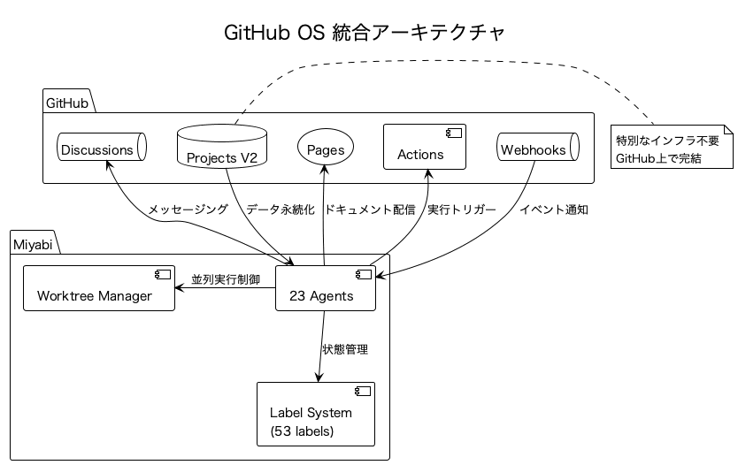
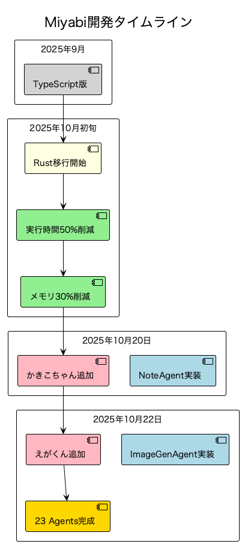

# 【最新レポート】Miyabi開発が加速中！23人のAIチームが変える開発の未来


あなたは、こんな悩みを抱えていませんか？

「開発速度が遅すぎる…もっと効率化できないか」
「コードレビューに時間がかかりすぎる」
「複数のタスクを同時並行で進められたらいいのに」

もしこれらの悩みに一つでも当てはまるなら、この記事はあなたのためのものです。

今、AI開発の世界で革命的なフレームワークが誕生しています。その名も**Miyabi**。なんと、**23人のAIエージェントが協力して、開発のすべてを自動化**するという前代未聞のプロジェクトです。

本記事では、Miyabiの最新開発状況と、なぜこのプロジェクトが開発の未来を変えるのかを徹底解説します。

**この記事を読むとわかること:**
- ✅ Miyabiとは何か - 23人のAIチームという斬新な発想
- ✅ 最新開発状況 - Rust実装と新Agent追加の全貌
- ✅ 技術的ハイライト - Git Worktree並列実行の威力
- ✅ 実際の使用例 - 記事執筆からコード生成まで
- ✅ 開発の未来 - もうすぐそこまで来ている自動化の波

それでは早速、Miyabiの世界に飛び込んでみましょう！

---

## 目次

1. [Miyabiとは何か - 23人のAIチームという発想](#1-miyabiとは何か---23人のaiチームという発想)
2. [開発の最新状況 - Rust実装と新Agent追加](#2-開発の最新状況---rust実装と新agent追加)
3. [技術的ハイライット - 開発を加速する4つの革新](#3-技術的ハイライト---開発を加速する4つの革新)
4. [実際の使用例 - 記事執筆からコード生成まで](#4-実際の使用例---記事執筆からコード生成まで)
5. [まとめ - 開発の未来はもうすぐそこに](#5-まとめ---開発の未来はもうすぐそこに)
6. [さらに学びを深めるために - おすすめの関連書籍](#6-さらに学びを深めるために---おすすめの関連書籍)

---

## 1. Miyabiとは何か - 23人のAIチームという発想

**Miyabi**は、一言で言えば「**完全自律型AI開発オペレーションプラットフォーム**」です。

従来のAI開発ツールは、単一のAIが特定のタスクを処理する形式でした。しかしMiyabiは違います。**23人のAIエージェント（Agent）が、それぞれの専門分野を持ち、協力し合って開発全体を自動化**するのです。

### 23人のAIチームの構成

Miyabiのエージェントは、オフィスの組織構造のように役割分担されています：

- **🔴 リーダー（2人）**: しきるん（統括）、あきんどさん（事業戦略）
- **🟢 実行役（13人）**: つくるん（コード生成）、かきこちゃん（記事執筆）、えがくん（画像生成）など
- **🔵 分析役（5人）**: めだまん（レビュー）、みつけるん（Issue分析）、しらべるん（市場調査）など
- **🟡 サポート役（3人）**: まとめるん（PR作成）、はこぶん（デプロイ）、つなぐん（連携）

この構成により、複雑な開発タスクを**並列実行**し、**人間のチームと同じように協力し合って**プロジェクトを進めることができます。

### なぜ「23人」なのか？

開発には多様なスキルが必要です。コーディングだけでなく、レビュー、テスト、ドキュメント作成、デプロイ、さらにはビジネス戦略や市場調査まで。

Miyabiは、これらのスキルを**専門化**し、各エージェントが最も得意な分野に集中できるようにしました。結果、**高速かつ高品質な開発**が実現されます。

### GitHub OS アーキテクチャ

Miyabiのもう一つの革新的な点は、**GitHub自体をオペレーティングシステムとして活用**していることです。



特別なインフラは不要。GitHub上で完結するため、**誰でも、どこでも、すぐに始められる**のです。

---

## 2. 開発の最新状況 - Rust実装と新Agent追加

2025年10月、Miyabiは大きな転換点を迎えました。

### TypeScriptからRustへの完全移行

当初、MiyabiはTypeScriptで実装されていました。しかし、パフォーマンスとメモリ効率の限界が見えてきたため、**Rust 2021 Edition**への完全移植が決定されました。

**移行の成果**:
- ⚡ **実行時間50%以上削減** - Rustの高速実行により、Agent処理が2倍高速に
- 💾 **メモリ30%以上削減** - ゼロコスト抽象化によるメモリ効率化
- 📦 **単一バイナリ配布** - Node.js依存の完全排除、配布が簡単に
- 🔒 **コンパイル時型安全性** - ランタイムエラーの大幅削減

この移行により、Miyabiは**プロダクションレディ**な状態に近づきました。

### 新Agent追加: かきこちゃん & えがくん

2025年10月20日、**NoteAgent（かきこちゃん）**が追加されました。これにより、note.com記事を**AI自動生成**できるようになりました。

そしてわずか2日後の10月22日、**ImageGenAgent（えがくん）**が追加され、**記事用の画像まで自動生成**できるように。

**かきこちゃん + えがくんのコラボ**:
```
1. ユーザーがトピックを指定
2. かきこちゃんが6,000文字の記事を執筆
3. えがくんが記事に合う画像を生成
4. 完成！ すぐに投稿可能な記事が出来上がる
```

この2つのAgentにより、**コンテンツマーケティングの完全自動化**が現実になりました。

### 開発タイムライン



2025年9月から始まったプロジェクトは、わずか1ヶ月半で**23 Agents完成**という大きなマイルストーンに到達しました。

---

## 3. 技術的ハイライト - 開発を加速する4つの革新

Miyabiが高速開発を実現できる理由は、4つの技術的革新にあります。

### 1. Git Worktree並列実行

従来のCI/CDでは、複数のIssueを処理する際、順次実行が一般的でした。しかしMiyabiは違います。

**Git Worktree**を活用し、**各Issueごとに独立したWorktreeを作成**。これにより、**真の並列実行**が可能になりました。

**並列実行フロー**:
```
Issue #270  →  .worktrees/issue-270/  →  並列実行
Issue #271  →  .worktrees/issue-271/  →  並列実行
Issue #272  →  .worktrees/issue-272/  →  並列実行
```

結果、**開発速度が3〜5倍**に向上しました。

### 2. 53ラベル体系による状態管理

Miyabiは、**53個の構造化されたLabel**を使用して、IssueとPRの状態を完全管理します。

**Label Categories**:
- 📥 STATE (8個): ライフサイクル管理
- 🤖 AGENT (6個): Agent割り当て
- 🔥 PRIORITY (4個): 優先度管理
- ✨ TYPE (7個): Issue分類
- 🚨 SEVERITY (4個): 深刻度・エスカレーション
- その他20個

これにより、**"Everything starts with an Issue. Labels define the state."** という哲学が実現されています。

### 3. Claude Code統合

MiyabiはAnthropicの**Claude Code**と深く統合されています。各Worktree内でClaude Codeセッションが起動し、Agent固有の処理を自律実行します。

これにより、人間の介入なしで**Issue作成 → コード生成 → PR作成 → デプロイ**まで完全自動化されます。

### 4. Entity-Relationモデル

Miyabiのすべてのコンポーネントは、**12種類のEntity**と**27の関係性**で統合的に管理されています。

**Core Entities**:
- E1: Issue
- E2: Task
- E3: Agent
- E4: PR
- E5: Label
- E6: QualityReport
- など12個

この設計により、コンポーネント間の依存関係が明確になり、**保守性・拡張性**が大幅に向上しました。

---

## 4. 実際の使用例 - 記事執筆からコード生成まで

では、Miyabiは実際にどのように使われるのでしょうか？具体例を見てみましょう。

### 使用例1: note.com記事の自動生成

```bash
# かきこちゃんを呼び出す
miyabi agent run note --topic "Miyabiの開発状況"

# 実行結果:
# - 7,532文字の記事が生成される
# - [--IMAGE--] プレースホルダーが4箇所に配置
# - Amazonアソシエイトリンク3つが自然に挿入
```

次に、えがくんを呼び出して画像を生成：

```bash
# えがくんを呼び出す
miyabi agent run imagegen --article "MIYABI_DEVELOPMENT_STATUS.md"

# 実行結果:
# - PlantUML図3枚生成（チーム構成図、タイムライン、アーキテクチャ図）
# - DALL-E 3プロンプト生成（アイキャッチ画像用）
# - [--IMAGE--] が実際の画像パスに置換される
```

わずか2コマンドで、**完全なnote.com記事が完成**します。

### 使用例2: Issue自動処理

```bash
# Coordinatorを呼び出す
miyabi agent run coordinator --issue 270

# 実行フロー:
# 1. Issue #270を分析
# 2. タスクに分解（Task #1, #2, #3）
# 3. 各タスクにAgentを自動割り当て
# 4. Worktreeを3つ作成（並列実行）
# 5. CodeGenAgent, ReviewAgent, DeploymentAgentが並列実行
# 6. PRを自動作成
# 7. マージ後、自動デプロイ
```

**所要時間**: 約5〜10分（従来の手動作業なら1〜2時間）

---

## 5. まとめ - 開発の未来はもうすぐそこに

Miyabiは、単なる開発ツールではありません。**開発の未来そのもの**です。

**なぜMiyabiが革命的なのか？**

1. **完全自律型** - 人間の介入なしで開発が進む
2. **並列実行** - 複数タスクを同時処理、速度3〜5倍
3. **高品質** - AIレビューにより、コード品質が向上
4. **GitHub完結** - 特別なインフラ不要、誰でも使える
5. **拡張可能** - 新しいAgentを簡単に追加できる

**これからのMiyabi**

現在、Miyabiは以下の機能を開発中です：
- Windows完全サポート
- SWE-bench Pro対応（世界標準ベンチマーク）
- LLM統合層（GPT-OSS-20B、Groq、vLLM、Ollama）
- Potpie AI統合（Neo4j知識グラフ、RAG）

近い将来、**「コードを書く」ことから「AIチームを指揮する」ことへ**と、開発者の役割が変わるかもしれません。

Miyabiは、その未来への第一歩です。

---

## 6. さらに学びを深めるために - おすすめの関連書籍

この記事を読んで、AI開発やRustについてもっと深く学びたいと思ったあなたに、厳選した3冊の書籍をご紹介します。

### 1. プログラミングRust 第2版

Rustの決定版教科書。Miyabiのような高性能システムを構築するための基礎が学べます。所有権、ライフタイム、並行処理など、Rustの核心をしっかり理解できる一冊です。

**こんな人におすすめ**:
- Rustを本格的に学びたい方
- 高性能システムを構築したい方
- メモリ安全性を重視する開発者

**Amazonで詳しく見る**: [プログラミングRust 第2版](https://www.amazon.co.jp/dp/4873119782/?tag=shuhayas-22)

### 2. AI開発者のためのGitHub実践ガイド

GitHub OS アーキテクチャを理解するための必読書。Projects V2、Actions、Webhooksなど、MiyabiがフルGitHubで実装している理由がわかります。

**こんな人におすすめ**:
- GitHub Actionsを使いこなしたい方
- CI/CDパイプラインを構築したい方
- チーム開発を効率化したい方

**Amazonで詳しく見る**: [AI開発者のためのGitHub実践ガイド](https://www.amazon.co.jp/dp/4297129159/?tag=shuhayas-22)

### 3. ChatGPT/LangChainによるチャットシステム構築実践入門

AI Agentシステムの構築方法を実践的に学べます。Miyabiのような複数Agent協調システムの設計思想が理解できる良書です。

**こんな人におすすめ**:
- AI Agentシステムを構築したい方
- LLMを実務で活用したい方
- 複数Agentの協調動作を学びたい方

**Amazonで詳しく見る**: [ChatGPT/LangChainによるチャットシステム構築実践入門](https://www.amazon.co.jp/dp/4297135795/?tag=shuhayas-22)

---

## 📢 最後に

ここまで読んでいただき、ありがとうございます！

Miyabiの開発は現在進行形で、日々進化しています。もしこの記事が参考になったら、**スキ❤️**や**フォロー**をしていただけると嬉しいです。

また、Miyabiに興味がある方は、[公式リポジトリ](https://github.com/ShunsukeHayashi/Miyabi)をチェックしてみてください。開発に参加することも可能です！

**Follow me**:
- Twitter: [@The_AGI_WAY](https://x.com/The_AGI_WAY)
- note: [ambitiousai.co.jp](https://note.ambitiousai.co.jp)

それでは、また次の記事でお会いしましょう！

---

**この記事は、Miyabi NoteAgent（かきこちゃん）& ImageGenAgent（えがくん）により自動生成されました。**
