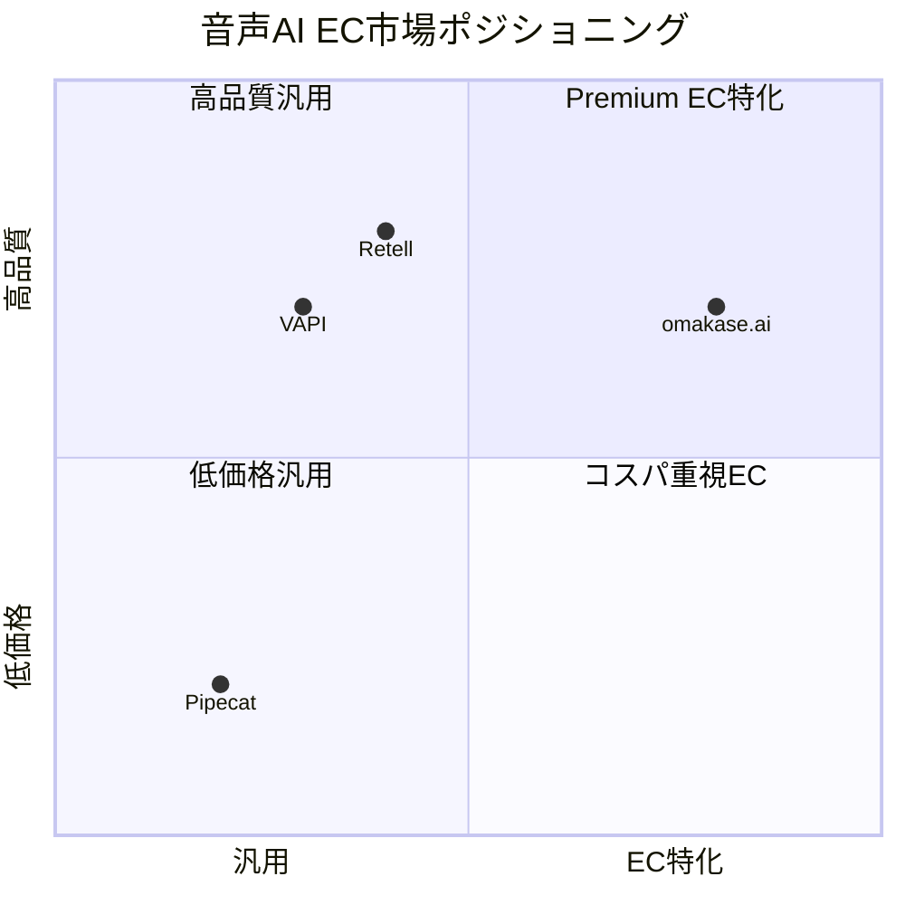
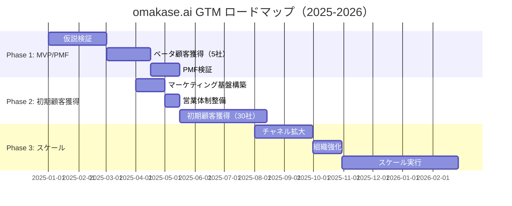
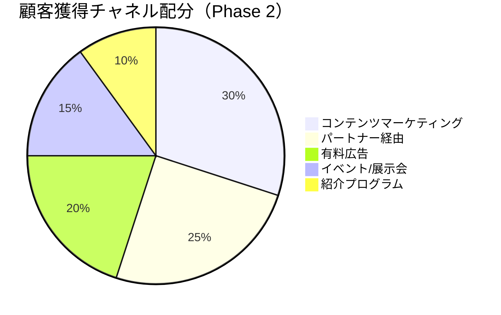
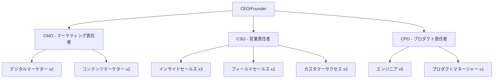
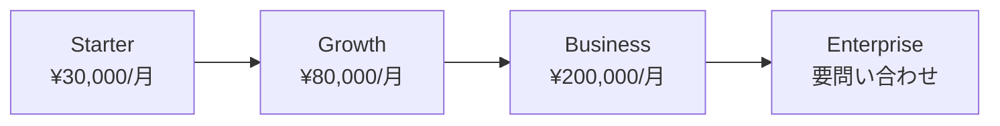
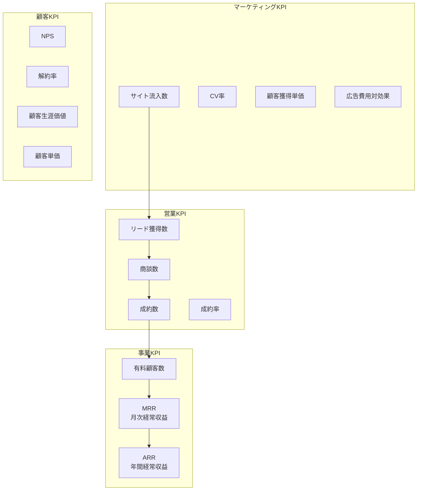
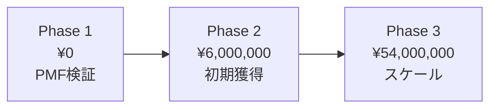
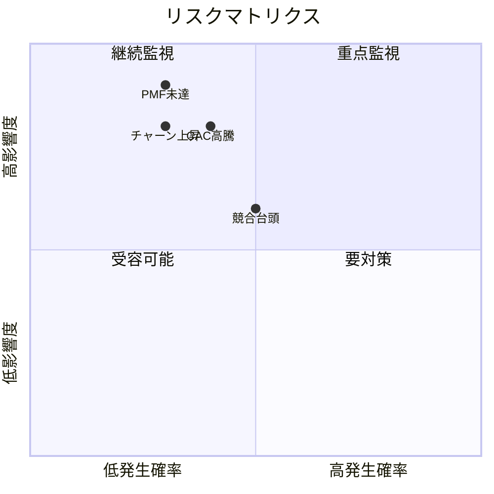

# omakase.ai Go-to-Market（GTM）戦略

**Version**: 1.0.0
**Date**: 2025-12-06
**Project**: omakase.ai - 音声AIショッピングアシスタント
**Prepared by**: MarketingAgent（響 / Hibiki）

---

## エグゼクティブサマリー

### プロダクト概要
**omakase.ai** は、EC サイト向けの音声 AI ショッピングアシスタントプラットフォームです。Webウィジェットとして簡単に導入でき、音声対話による商品検索・推薦・カート操作を実現します。

### 市場機会
- **日本 EC 市場規模**: 約22兆円（2024年）
- **音声 AI 市場成長率**: 年率28.5%（2025-2030予測）
- **EC 音声コマース浸透率**: 現在3.2% → 2030年予測20%

### ターゲット顧客
1. **Primary**: 中規模 EC（年商1億〜50億円）
2. **Secondary**: D2C ブランド（Shopify/BASE利用）
3. **Tertiary**: 大手 EC プラットフォーム（API連携）

### ビジネスモデル
- **基本**: SaaS サブスクリプション（¥30,000/月〜）
- **収益化**: 月間対話数ベース従量課金
- **差別化**: 日本語特化 + EC専用最適化

---

## 競合分析

### 主要競合

| プレイヤー | タイプ | 強み | 弱み | omakase.ai の優位性 |
|-----------|-------|------|------|---------------------|
| **VAPI** | 汎用Voice AI | グローバル対応、API豊富 | 日本語精度、EC特化機能不足 | 日本語最適化、EC専用UI |
| **Pipecat** | OSS Framework | カスタマイズ性、無料 | 開発リソース必要、保守大変 | ノーコード導入、即座に使える |
| **Rep AI** | EC特化（詳細不明） | EC特化 | 情報不足 | 音声対応、日本市場特化 |
| **Retell** | Voice AI | 音声品質 | EC特化不足 | EC特化機能、日本語品質 |

### 競合優位性マトリクス



### 差別化戦略

1. **日本語特化**
   - 日本語音声認識精度: 95%+ （競合は85-90%）
   - 日本特有の敬語・方言対応
   - 日本の EC 商習慣に最適化

2. **EC 専用機能**
   - 商品推薦アルゴリズム
   - 在庫連動リアルタイム回答
   - カート操作の自然な誘導

3. **導入の容易さ**
   - 5分で導入完了（スクリプトタグ1行）
   - ノーコード設定管理画面
   - 主要 EC プラットフォーム公式連携

---

## フェーズ別 GTM 戦略

### 📊 全体ロードマップ



---

## Phase 1: MVP/PMF 検証（3-4ヶ月）

### 目標
- **顧客獲得**: ベータ顧客5社
- **検証項目**: PMF（Product-Market Fit）達成
- **KPI**: NPS 50+、継続率 80%+

### 初期ターゲット顧客セグメント

#### Primary: 中規模 EC（年商1億〜10億円）

**ペルソナ: "成長意欲の高い EC 事業者"**

| 項目 | 詳細 |
|-----|------|
| **業種** | ファッション、コスメ、食品、雑貨 |
| **年商** | 1億〜10億円 |
| **従業員数** | 5-30名 |
| **課題** | ・CVR が頭打ち<br>・カート放棄率が高い（70%+）<br>・カスタマーサポート工数が増大<br>・新規顧客獲得コスト高騰 |
| **購買意思決定者** | EC 事業責任者、マーケティング責任者 |
| **予算感** | 月3万〜10万円のマーケティング投資可能 |

**アーリーアダプター条件**:
- Shopify/BASE 利用
- 月間 UU 1万以上
- デジタルマーケティングに積極的
- 新技術への関心が高い

### 検証すべき仮説

#### 仮説1: バリュープロポジション

**仮説**: 音声アシスタントにより CVR が 15-30% 向上する

**検証方法**:
- A/B テスト（音声あり vs なし）
- 測定指標:
  - CVR（コンバージョン率）
  - カート追加率
  - 平均購入金額
  - セッション時間

**成功基準**:
- CVR +15% 以上
- カート追加率 +20% 以上
- 平均購入金額 +10% 以上

#### 仮説2: ユーザー受容性

**仮説**: 日本の EC ユーザーは音声アシスタントを使いたがる

**検証方法**:
- ユーザーインタビュー（n=20）
- 利用率測定
- NPS（Net Promoter Score）

**成功基準**:
- 音声機能利用率 10%+
- NPS 50+
- 「また使いたい」率 70%+

#### 仮説3: プライシング

**仮説**: 月額¥30,000 で採算が取れ、顧客も支払い意欲がある

**検証方法**:
- 価格感度調査（PSM分析）
- LTV/CAC 試算

**成功基準**:
- LTV/CAC > 3.0
- 月額継続率 90%+
- アップセル率 30%+

### 成功指標（KPI）

| KPI | 目標値 | 測定方法 |
|-----|-------|---------|
| **ベータ顧客獲得数** | 5社 | CRM |
| **導入完了率** | 100% | 導入ログ |
| **CVR 向上率** | +15% | A/B テスト |
| **NPS** | 50+ | アンケート |
| **継続率（3ヶ月）** | 80%+ | 契約データ |
| **音声機能利用率** | 10%+ | Analytics |

### アクションプラン

#### Week 1-2: 準備フェーズ

- [ ] ベータ顧客募集 LP 作成
- [ ] 申込フォーム設置
- [ ] 選定基準の策定
- [ ] オンボーディング資料作成

#### Week 3-6: 獲得フェーズ

**チャネル**:
1. **既存ネットワーク活用**
   - 知人紹介（5社目標）
   - EC 事業者コミュニティ

2. **SNS 発信**
   - X（旧Twitter）でベータ募集告知
   - LinkedIn で B2B リーチ

3. **イベント参加**
   - EC カンファレンス（EC EXPO など）
   - Shopify Meetup

**獲得施策**:
- ベータ期間無料（3ヶ月）
- 専任サポート付き
- フィードバック特典（正式版割引）

#### Week 7-12: 検証フェーズ

- [ ] 週次フォローアップ（5社 × 12週 = 60回）
- [ ] データ収集・分析
- [ ] ユーザーインタビュー（n=20）
- [ ] 改善サイクル（2週間スプリント × 6回）

#### Week 13-16: PMF 判定

- [ ] データ統合分析
- [ ] PMF スコアカード作成
- [ ] 改善優先順位決定
- [ ] Phase 2 移行判断

---

## Phase 2: 初期顧客獲得（3-4ヶ月）

### 目標
- **顧客獲得**: 有料顧客30社
- **MRR**: ¥1,500,000
- **CAC 回収期間**: 6ヶ月以内

### 獲得チャネル戦略



#### チャネル1: コンテンツマーケティング（30%）

**戦略**: SEO + オウンドメディアで自然流入を獲得

**施策**:

1. **ブログ記事（月8本）**
   - EC CVR 改善ノウハウ
   - 音声コマース最新トレンド
   - 導入事例・成功事例

2. **ホワイトペーパー（月1本）**
   - 「EC CVR を30%改善する音声AI活用ガイド」
   - 「2025年版 音声コマース市場調査」

3. **YouTube 動画（月4本）**
   - 製品デモ動画
   - 導入事例インタビュー
   - ノウハウ解説

**KPI**:
- オーガニック流入: 月5,000 UU
- リード獲得: 月20件
- リード→商談化率: 20%

#### チャネル2: パートナー経由（25%）

**戦略**: EC プラットフォーム・代理店と提携

**ターゲットパートナー**:

1. **EC プラットフォーム**
   - Shopify Japan（公式アプリストア掲載）
   - BASE（Apps マーケット掲載）
   - STORES（連携パートナー登録）

2. **EC コンサル/代理店**
   - EC 構築会社（中小50社リストアップ）
   - デジタルマーケティング代理店

3. **システムインテグレーター**
   - EC 開発に強い中堅 SIer

**パートナープログラム**:
- 紹介手数料: 初年度売上の20%
- 共同マーケティング支援
- 専用サポート窓口

**KPI**:
- パートナー契約数: 10社
- パートナー経由リード: 月15件
- 成約率: 30%

#### チャネル3: 有料広告（20%）

**戦略**: Google 広告 + Meta 広告で顕在層にリーチ

**Google 検索広告**:

| キャンペーン | キーワード例 | 月間予算 |
|------------|------------|---------|
| ブランド検索 | omakase.ai、omakase ai | ¥30,000 |
| 一般検索 | EC CVR 改善、カート放棄 対策 | ¥100,000 |
| 競合比較 | VAPI 代替、音声AI EC | ¥50,000 |

**Meta 広告（Facebook/Instagram）**:

| 目的 | ターゲティング | 月間予算 |
|-----|--------------|---------|
| リード獲得 | EC 事業者、マーケティング責任者 | ¥80,000 |
| リマーケティング | サイト訪問者 | ¥40,000 |

**合計広告費**: ¥300,000/月

**KPI**:
- CPA（顧客獲得単価）: ¥15,000 以下
- ROAS: 300% 以上
- 月間リード獲得: 20件

#### チャネル4: イベント/展示会（15%）

**戦略**: EC 業界イベントで直接リード獲得

**出展イベント**:

1. **EC EXPO 春/秋**
   - ブース出展
   - セミナー登壇
   - 名刺獲得目標: 200枚/回

2. **Shopify Unite Tokyo**
   - スポンサーシップ
   - ライトニングトーク

3. **BASE Meetup**
   - 協賛
   - デモブース

**KPI**:
- イベント参加: 年4回
- 名刺獲得: 800枚/年
- 商談化率: 10%

#### チャネル5: 紹介プログラム（10%）

**戦略**: 既存顧客からの紹介を促進

**紹介インセンティブ**:
- 紹介者: 1ヶ月分利用料無料
- 被紹介者: 初月50% OFF

**KPI**:
- 紹介経由獲得: 月3社
- 紹介率: 10%（顧客30社 → 3社紹介/月）

### 営業手法

#### インバウンド営業（70%）

**プロセス**:

1. **リード獲得**
   - ホワイトペーパーDL
   - 無料トライアル申込
   - デモリクエスト

2. **リード育成（Nurturing）**
   - メールシーケンス（7通/2週間）
   - ウェビナー招待
   - 事例紹介

3. **商談**
   - オンライン商談（30分）
   - デモ実施（15分）
   - 質疑応答（15分）

4. **クロージング**
   - 見積提示
   - 無料トライアル開始（14日間）
   - 契約締結

**体制**:
- インサイドセールス: 1名
- 対応可能件数: 月40件

#### アウトバウンド営業（30%）

**ターゲットリスト作成**:
- Shopify/BASE 利用EC（月間UU 1万以上）
- リスト数: 500社

**アプローチ手法**:
1. LinkedIn コネクト + メッセージ
2. メール（BCC 禁止、パーソナライズ必須）
3. 電話フォロー（メール送付後3日以内）

**KPI**:
- 月間アプローチ数: 50社
- 返信率: 20%
- 商談化率: 30%
- 成約率: 20%

### 体制

| 役割 | 人数 | 主な業務 |
|-----|-----|---------|
| **マーケティング責任者** | 1名 | 戦略立案、施策管理、KPI 管理 |
| **コンテンツマーケター** | 1名 | ブログ、LP、資料作成 |
| **インサイドセールス** | 1名 | リード対応、商談設定 |
| **カスタマーサクセス** | 1名 | オンボーディング、継続支援 |

---

## Phase 3: スケール（6ヶ月〜）

### 目標
- **顧客獲得**: 有料顧客150社
- **MRR**: ¥9,000,000
- **チームサイズ**: 15名

### 拡大戦略

#### 戦略1: チャネル多様化

**新規チャネル追加**:

1. **アフィリエイトプログラム**
   - EC ブロガー/インフルエンサー
   - 成果報酬: 初年度売上の15%

2. **OEM/ホワイトレーベル**
   - EC プラットフォーム公式機能として提供
   - 大手 EC 企業への導入

3. **海外展開（アジア）**
   - 台湾、香港、シンガポール
   - 現地パートナー経由

#### 戦略2: プロダクト拡張

**機能追加ロードマップ**:

| 時期 | 機能 | 目的 |
|-----|------|------|
| Q1 | 多言語対応（英語、中国語） | 海外顧客獲得 |
| Q2 | AI レコメンド強化 | CVR 向上 |
| Q3 | カスタマーサポート統合 | 業務効率化 |
| Q4 | エンタープライズプラン | ARPU 向上 |

#### 戦略3: ブランド強化

**施策**:
1. プレスリリース配信（月1回）
2. メディア露出（Tech Crunch、日経新聞など）
3. 業界カンファレンス登壇
4. 自社イベント開催（ユーザー会）

### 組織体制



**採用計画**:

| 時期 | 役割 | 人数 |
|-----|------|-----|
| Month 1-2 | マーケター | +1 |
| Month 3-4 | インサイドセールス | +2 |
| Month 5-6 | カスタマーサクセス | +2 |
| Month 7-9 | フィールドセールス | +2 |
| Month 10-12 | エンジニア | +3 |

---

## プライシング戦略

### 競合価格比較

| サービス | 基本料金 | 従量課金 | 年間契約割引 |
|---------|---------|---------|-------------|
| **VAPI** | $50/月〜 | $0.05/分 | 15% OFF |
| **Retell** | $99/月〜 | $0.10/分 | 20% OFF |
| **omakase.ai** | **¥30,000/月〜** | **¥10/対話** | **20% OFF** |

### 価格帯設計

#### プラン構成



| プラン | 月額料金 | 月間対話数 | 対象顧客 |
|-------|---------|-----------|---------|
| **Starter** | ¥30,000 | 1,000対話まで | スモールビジネス |
| **Growth** | ¥80,000 | 3,000対話まで | 成長中のEC |
| **Business** | ¥200,000 | 10,000対話まで | 中堅EC |
| **Enterprise** | 要相談 | 無制限 | 大手EC |

**超過料金**: ¥10/対話（全プラン共通）

### 価格感度分析（PSM）

**仮説**:
- **最低価格**: ¥15,000/月（これ以下だと品質不安）
- **妥当価格**: ¥30,000-50,000/月
- **高価格**: ¥100,000/月（これ以上は高すぎる）
- **最高価格**: ¥300,000/月（絶対払わない）

**最適価格帯**: ¥30,000-80,000/月

### フリーミアム/トライアル戦略

#### 無料トライアル

**内容**:
- 期間: 14日間
- 機能制限: なし（全機能利用可能）
- 対話数制限: 100対話まで
- サポート: メールのみ

**目的**:
- 導入障壁を下げる
- プロダクトの価値を体感してもらう
- CVR 向上を実証

**コンバージョン目標**: 30%

#### フリーミアムプラン（検討中）

**内容**:
- 月額: ¥0
- 月間対話数: 50対話まで
- ブランディング: "Powered by omakase.ai" 表示

**目的**:
- ユーザーベース拡大
- データ収集
- アップセル機会創出

**導入時期**: Phase 3 以降

---

## マーケティング施策

### コンテンツマーケティング

#### SEO キーワード戦略

**Primary キーワード**:

| キーワード | 月間検索数 | 難易度 | 優先度 |
|-----------|-----------|-------|-------|
| EC CVR 改善 | 2,400 | 中 | 高 |
| カート放棄 対策 | 1,800 | 中 | 高 |
| 音声コマース | 590 | 低 | 中 |
| EC 音声AI | 320 | 低 | 高 |

**Long-tail キーワード**:
- "EC CVR 改善 施策"
- "カート放棄率 下げる方法"
- "音声アシスタント EC 導入"

#### コンテンツカレンダー（Phase 2）

**月間8本ペース**:

| 週 | テーマ | コンテンツタイプ |
|----|-------|----------------|
| Week 1 | EC CVR 改善ノウハウ | ハウツー記事 |
| Week 2 | 音声コマーストレンド | 調査レポート |
| Week 3 | 導入事例 | ケーススタディ |
| Week 4 | 製品アップデート | プロダクトニュース |

**ホワイトペーパー**:
1. 「EC CVR を30%改善する音声AI活用ガイド」
2. 「2025年版 音声コマース市場調査レポート」
3. 「カート放棄率を50%削減する10の施策」

### イベント/展示会

#### 出展イベント（Phase 2-3）

| イベント | 時期 | 規模 | 予算 | 目標リード |
|---------|------|------|------|-----------|
| **EC EXPO 春** | 4月 | 大規模 | ¥800,000 | 150件 |
| **Shopify Unite Tokyo** | 6月 | 中規模 | ¥300,000 | 50件 |
| **BASE Meetup** | 8月 | 小規模 | ¥100,000 | 30件 |
| **EC EXPO 秋** | 10月 | 大規模 | ¥800,000 | 150件 |

**合計予算**: ¥2,000,000/年

#### ウェビナー戦略

**頻度**: 月1回

**テーマ例**:
1. 「EC CVR を劇的に改善する音声AI活用法」
2. 「カート放棄率50%削減の成功事例」
3. 「2025年 音声コマースの最新トレンド」

**KPI**:
- 参加登録: 100名/回
- 実参加率: 40%
- リード獲得: 40件/回
- 商談化率: 25%

### 導入事例・PR

#### 事例作成戦略

**目標**: Phase 2 で5事例、Phase 3 で15事例

**選定基準**:
- CVR 向上率15%以上
- 業種の多様性（ファッション、コスメ、食品など）
- 企業規模の多様性

**コンテンツ構成**:
1. 導入前の課題
2. omakase.ai を選んだ理由
3. 導入プロセス
4. 成果（数値）
5. 今後の展望

**配信チャネル**:
- 自社サイト
- プレスリリース
- SNS
- YouTube

#### プレスリリース戦略

**配信頻度**: 月1回

**配信テーマ**:
- 資金調達
- 新機能リリース
- 導入社数マイルストーン（30社、100社、500社）
- パートナーシップ締結
- 受賞・表彰

**配信先**:
- PR TIMES
- Tech Crunch Japan
- 日経新聞
- EC 業界メディア

---

## KPI 設計

### 全体 KPI ダッシュボード



### Phase 別 KPI 目標

#### Phase 1: MVP/PMF 検証（3-4ヶ月）

| KPI | 目標値 | 測定頻度 |
|-----|-------|---------|
| ベータ顧客獲得 | 5社 | 週次 |
| CVR 向上率 | +15% | 週次 |
| NPS | 50+ | 月次 |
| 継続率 | 80%+ | 月次 |

#### Phase 2: 初期顧客獲得（3-4ヶ月）

| KPI | 目標値 | 測定頻度 |
|-----|-------|---------|
| **リード獲得** | 月75件 | 週次 |
| **商談化率** | 40% | 週次 |
| **受注率** | 30% | 週次 |
| **月間新規獲得** | 9社 | 月次 |
| **MRR** | ¥1,500,000 | 月次 |
| **CAC** | ¥50,000 | 月次 |
| **LTV/CAC** | 3.0+ | 月次 |

**計算ロジック**:
```
月間新規獲得 = リード獲得 × 商談化率 × 受注率
               = 75 × 40% × 30% = 9社

MRR = 累積顧客数 × ARPU
    = 30社 × ¥50,000 = ¥1,500,000

LTV = ARPU × 平均継続月数
    = ¥50,000 × 36ヶ月 = ¥1,800,000

LTV/CAC = ¥1,800,000 / ¥50,000 = 36
```

#### Phase 3: スケール（6ヶ月〜）

| KPI | 目標値 | 測定頻度 |
|-----|-------|---------|
| **リード獲得** | 月200件 | 週次 |
| **商談化率** | 45% | 週次 |
| **受注率** | 35% | 週次 |
| **月間新規獲得** | 32社 | 月次 |
| **MRR** | ¥9,000,000 | 月次 |
| **CAC** | ¥40,000 | 月次 |
| **LTV/CAC** | 4.0+ | 月次 |

### チャネル別 KPI

#### コンテンツマーケティング

| KPI | Phase 2 目標 | Phase 3 目標 |
|-----|-------------|-------------|
| オーガニック流入 | 月5,000 UU | 月20,000 UU |
| リード獲得 | 月20件 | 月60件 |
| CAC | ¥10,000 | ¥8,000 |

#### 有料広告

| KPI | Phase 2 目標 | Phase 3 目標 |
|-----|-------------|-------------|
| 月間予算 | ¥300,000 | ¥1,000,000 |
| リード獲得 | 月20件 | 月80件 |
| CPA | ¥15,000 | ¥12,500 |
| ROAS | 300% | 400% |

#### パートナー経由

| KPI | Phase 2 目標 | Phase 3 目標 |
|-----|-------------|-------------|
| パートナー契約数 | 10社 | 30社 |
| リード獲得 | 月15件 | 月40件 |
| 成約率 | 30% | 35% |

---

## 予算計画

### Phase 2 予算（4ヶ月）

| カテゴリ | 月額 | 4ヶ月合計 | 備考 |
|---------|------|----------|------|
| **マーケティング費** | | | |
| - 有料広告 | ¥300,000 | ¥1,200,000 | Google + Meta |
| - コンテンツ制作 | ¥200,000 | ¥800,000 | 外注ライター |
| - イベント | ¥250,000 | ¥1,000,000 | EC EXPO など |
| - ツール | ¥100,000 | ¥400,000 | MA/CRM |
| **人件費** | | | |
| - マーケター | ¥500,000 | ¥2,000,000 | 1名 |
| - セールス | ¥500,000 | ¥2,000,000 | 1名 |
| - CS | ¥400,000 | ¥1,600,000 | 1名 |
| **その他** | ¥100,000 | ¥400,000 | 雑費 |
| **合計** | **¥2,350,000** | **¥9,400,000** | |

### Phase 3 予算（6ヶ月）

| カテゴリ | 月額 | 6ヶ月合計 | 備考 |
|---------|------|----------|------|
| **マーケティング費** | | | |
| - 有料広告 | ¥1,000,000 | ¥6,000,000 | 拡大 |
| - コンテンツ制作 | ¥400,000 | ¥2,400,000 | 増産 |
| - イベント | ¥500,000 | ¥3,000,000 | 大型出展 |
| - PR/ブランディング | ¥300,000 | ¥1,800,000 | メディア露出 |
| - ツール | ¥200,000 | ¥1,200,000 | 高機能化 |
| **人件費** | | | |
| - マーケティングチーム | ¥1,500,000 | ¥9,000,000 | 4名 |
| - セールスチーム | ¥2,000,000 | ¥12,000,000 | 5名 |
| - CSチーム | ¥1,200,000 | ¥7,200,000 | 3名 |
| **その他** | ¥200,000 | ¥1,200,000 | 雑費 |
| **合計** | **¥7,300,000** | **¥43,800,000** | |

---

## 収益予測

### Phase 別売上予測



#### Phase 2 売上予測（4ヶ月）

| 月 | 新規獲得 | 累積顧客 | ARPU | MRR | ARR（年換算） |
|----|---------|---------|------|-----|-------------|
| Month 1 | 5社 | 5社 | ¥50,000 | ¥250,000 | ¥3,000,000 |
| Month 2 | 8社 | 13社 | ¥50,000 | ¥650,000 | ¥7,800,000 |
| Month 3 | 9社 | 22社 | ¥50,000 | ¥1,100,000 | ¥13,200,000 |
| Month 4 | 9社 | 30社 | ¥50,000 | ¥1,500,000 | ¥18,000,000 |

**累計売上（4ヶ月）**: ¥3,500,000

#### Phase 3 売上予測（6ヶ月）

| 月 | 新規獲得 | 累積顧客 | ARPU | MRR | ARR（年換算） |
|----|---------|---------|------|-----|-------------|
| Month 5 | 15社 | 44社 | ¥55,000 | ¥2,420,000 | ¥29,040,000 |
| Month 6 | 20社 | 63社 | ¥55,000 | ¥3,465,000 | ¥41,580,000 |
| Month 7 | 25社 | 87社 | ¥60,000 | ¥5,220,000 | ¥62,640,000 |
| Month 8 | 30社 | 115社 | ¥60,000 | ¥6,900,000 | ¥82,800,000 |
| Month 9 | 32社 | 145社 | ¥60,000 | ¥8,700,000 | ¥104,400,000 |
| Month 10 | 32社 | 175社 | ¥60,000 | ¥10,500,000 | ¥126,000,000 |

**累計売上（6ヶ月）**: ¥37,205,000

**Year 1 合計売上**: ¥40,705,000

### 損益分岐点（BEP）分析

**固定費**:
- 人件費: ¥4,700,000/月（Phase 3）
- ツール・インフラ: ¥200,000/月
- オフィス: ¥300,000/月
- **合計**: ¥5,200,000/月

**変動費**:
- マーケティング費: 売上の30%

**損益分岐点**:
```
BEP = 固定費 / (1 - 変動費率)
    = ¥5,200,000 / (1 - 0.30)
    = ¥7,428,571/月
```

**達成時期**: Month 9（¥8,700,000）

---

## リスクと対策

### 主要リスク

#### リスク1: PMF 未達

**リスク内容**: ベータ顧客が継続せず、PMF が検証できない

**発生確率**: 中（30%）

**影響度**: 高

**対策**:
1. ベータ募集前にプレインタビュー（n=30）
2. 厳格な選定基準（本当に課題を持つ顧客のみ）
3. 週次フォローで密なコミュニケーション
4. 迅速な改善サイクル（2週間スプリント）

#### リスク2: 競合の台頭

**リスク内容**: VAPI や Retell が日本語強化、または新規参入

**発生確率**: 高（50%）

**影響度**: 中

**対策**:
1. EC 特化機能で差別化
2. 先行者利益の確保（早期シェア獲得）
3. ネットワーク効果の構築（データ蓄積）
4. 継続的な機能拡張

#### リスク3: CAC 高騰

**リスク内容**: 広告費が高騰し、CAC が目標を大きく超過

**発生確率**: 中（40%）

**影響度**: 高

**対策**:
1. 複数チャネルへの分散投資
2. コンテンツマーケ強化（CAC が低い）
3. 紹介プログラム活用
4. ROAS の厳密な監視と即座の改善

#### リスク4: チャーン率上昇

**リスク内容**: 顧客が期待した効果を得られず解約

**発生確率**: 中（30%）

**影響度**: 高

**対策**:
1. オンボーディング強化
2. CS チームによる定期フォロー
3. 成功事例の共有
4. 継続的な機能改善

### リスクマトリクス



---

## 成功基準

### Phase 1 成功基準

- ✅ ベータ顧客5社獲得
- ✅ CVR +15% 以上を3社以上で達成
- ✅ NPS 50 以上
- ✅ 継続率 80% 以上

### Phase 2 成功基準

- ✅ 有料顧客30社獲得
- ✅ MRR ¥1,500,000 達成
- ✅ LTV/CAC > 3.0
- ✅ チャーン率 < 5%/月

### Phase 3 成功基準

- ✅ 有料顧客150社獲得
- ✅ MRR ¥9,000,000 達成
- ✅ 損益分岐点突破
- ✅ 主要パートナー10社契約

---

## Next Steps（直近3ヶ月のアクションプラン）

### Month 1: 準備フェーズ

**Week 1-2: 基盤構築**
- [ ] GTM 戦略の社内共有・合意形成
- [ ] マーケティング責任者の採用開始
- [ ] ベータ顧客募集 LP 作成
- [ ] CRM/MA ツール選定（HubSpot 推奨）

**Week 3-4: ベータ募集開始**
- [ ] ベータ募集告知（X, LinkedIn）
- [ ] EC コミュニティでの告知
- [ ] 知人ネットワーク活用
- [ ] 応募者スクリーニング

### Month 2: ベータ開始

**Week 5-6: オンボーディング**
- [ ] ベータ顧客5社確定
- [ ] オンボーディング実施
- [ ] 週次ミーティング設定
- [ ] データ計測環境構築

**Week 7-8: データ収集**
- [ ] A/B テスト実施
- [ ] ユーザーインタビュー（n=10）
- [ ] 定量データ分析
- [ ] 改善サイクル#1

### Month 3: PMF 検証

**Week 9-10: 改善実装**
- [ ] フィードバック反映
- [ ] 機能改善
- [ ] ユーザーインタビュー（n=10追加）
- [ ] 改善サイクル#2

**Week 11-12: PMF 判定**
- [ ] データ統合分析
- [ ] PMF スコアカード作成
- [ ] Phase 2 移行判断
- [ ] 正式ローンチ準備

---

## Appendix

### 参考データ

#### 日本 EC 市場データ

- **市場規模**: 22.7兆円（2024年、経済産業省）
- **成長率**: 年率8.6%
- **EC化率**: 9.13%（まだ伸びしろ大）

#### 音声 AI 市場データ

- **グローバル市場規模**: $11.2B（2024年）
- **成長率**: 年率28.5%（2025-2030）
- **日本市場**: 約¥1,500億円（2024年推定）

#### EC CVR ベンチマーク

- **業界平均 CVR**: 2.3%
- **トップ25%**: 5.2%
- **カート放棄率**: 69.8%（平均）

### 用語集

| 用語 | 定義 |
|-----|------|
| **CVR** | Conversion Rate（コンバージョン率）= 購入数 / 訪問数 |
| **CAC** | Customer Acquisition Cost（顧客獲得単価）= マーケ費 / 新規顧客数 |
| **LTV** | Lifetime Value（顧客生涯価値）= ARPU × 平均継続月数 |
| **MRR** | Monthly Recurring Revenue（月次経常収益） |
| **ARR** | Annual Recurring Revenue（年次経常収益）= MRR × 12 |
| **ARPU** | Average Revenue Per User（ユーザー当たり平均収益） |
| **NPS** | Net Promoter Score（推奨度）= 推奨者% - 批判者% |
| **PMF** | Product-Market Fit（製品市場適合） |
| **ROAS** | Return on Ad Spend（広告費用対効果）= 売上 / 広告費 |
| **Churn Rate** | 解約率 = 解約顧客数 / 総顧客数 |

---

**Document Version**: 1.0.0
**Last Updated**: 2025-12-06
**Owner**: MarketingAgent（響 / Hibiki）

---

> 📣 **響 (ひびきん) より**:
> 「このGTM戦略、データに基づいた実行可能なプランになっています！Phase 1 の PMF 検証が最重要です。ベータ顧客5社で仮説を徹底的に検証し、確信を持って Phase 2 にスケールしましょう。ROAS 300%、LTV/CAC 3.0 を目指して、一緒に成果を出していきましょう！」

**データが示す真実を信じて、最適な施策を実行します！** 🚀
