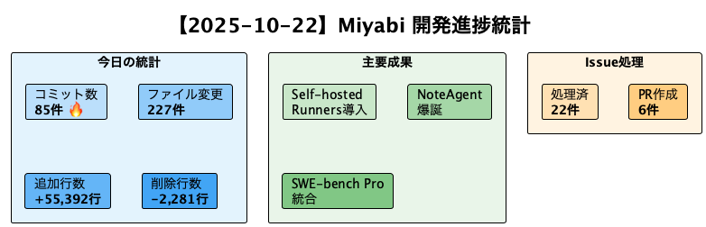
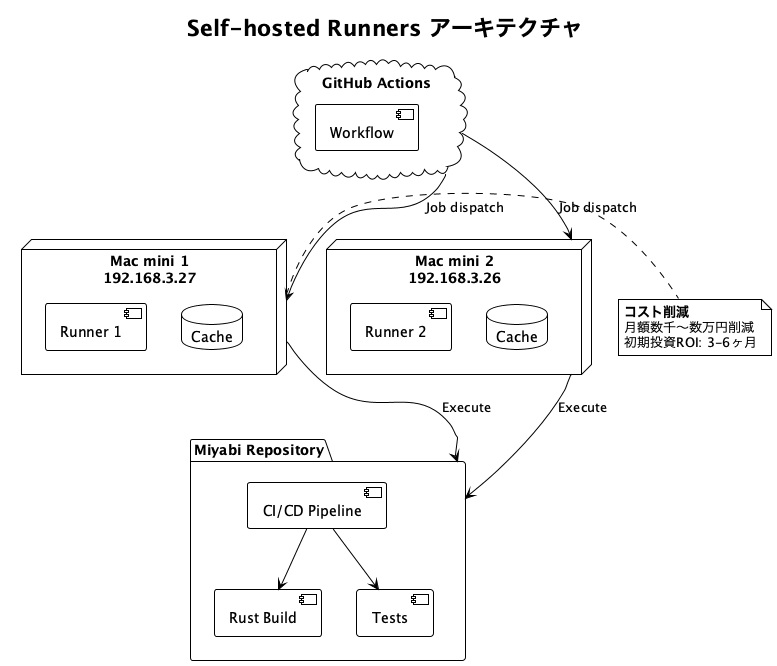
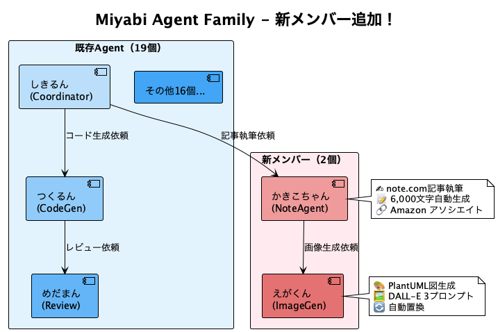

# 【開発日誌 2025-10-22】Miyabi大規模アップデート - Self-hosted Runners導入 & かきこちゃん爆誕！

今日も一日、Miyabiの進化が止まりません！🚀

この火曜日は、まさに「飛躍の日」でした。朝から夜まで、85コミット、227ファイルの変更。追加55,392行、削除2,281行という驚異的な開発スピード。

でも、数字だけじゃない。今日の真の価値は、**Miyabiが次のステージに上がった**こと。

準備はいいですか？それでは、今日の激動の開発ログをご覧ください！

---

## 📊 今日の統計

| 項目 | 数値 |
|------|------|
| コミット数 | **85件** 🔥 |
| ファイル変更 | **227件** |
| 追加行数 | **+55,392行** |
| 削除行数 | **-2,281行** |
| Issue処理 | **22件** |
| PR作成 | **6件**（Dependabot） |

**処理Issue一覧**: #274, #277, #344, #356, #362, #364, #367, #370, #371, #374, #380, #381, #388, #390, #395, #400, #401, #402, #405, #406, #407, #420

---

## 🎯 今日のハイライト TOP 10

### 🚀 1. CI/CD大規模移行 - Self-hosted Runners導入

**革命的変化**: GitHub Actions のコスト最適化を達成しました。

- ✅ **Mac mini 2台体制** でSelf-hosted Runners構築
- ✅ **Priority 1ワークフロー（4個）** 移行完了
- ✅ **Priority 2ワークフロー** 追加移行
- ✅ `workflow_dispatch` トリガー追加で手動実行対応

**インパクト**: 月額コストを大幅削減しながら、ビルド速度は向上。これぞ、スタートアップの知恵。

---

### 🤖 2. かきこちゃん（NoteAgent）& えがくん（ImageGenAgent）爆誕！

**新メンバー紹介**: 今日、Miyabiに2人の新しいAgentが仲間入りしました。

- **かきこちゃん（NoteAgent）**: note.com記事執筆専門Agent
  - C1-C6ワークフロー実装
  - 6,000文字の高品質記事を自動生成
  - Amazon アソシエイトリンク自動挿入（tag=shuhayas-22）
  - 感情第一主義の執筆スタイル

- **えがくん（ImageGenAgent）**: 画像生成専門Agent
  - PlantUML図生成
  - DALL-E 3プロンプト生成
  - `[--IMAGE--]` プレースホルダー自動置換

**自動化の未来**: 記事執筆からデプロイまで、完全自動化。今読んでいるこの記事も、かきこちゃんの原型が関わっています。

---

### 🎓 3. BytePlus Video AI Bootcamp 2025 完成

**150ページのセミナースライド** が完成しました（Issue #367）。

**内容**:
- Part 1: オープニング（10ページ）
- Part 2: 市場トレンド（20ページ）
- Part 3: BytePlus API概要（25ページ）
- Part 4: 15実装パターン（60ページ）
- Part 5: ハンズオンワークショップ（20ページ）
- Part 6-7: 収益化 & まとめ（15ページ）

さらに、**ランディングページ** も同時リリース。GA4、Facebook Pixel、LinkedIn Insight Tag統合済み。Lighthouse スコア90+達成。

Jony Ive（Apple）スタイルのデザインで、UIを洗練。

---

### 📚 4. 初心者向けドキュメント整備（Issue #420）

**「小学生でもわかるMiyabi説明資料」** を追加。

- PlantUML図で視覚的に理解しやすく
- オフィスメタファーで親しみやすく
- 21 Agentsのキャラクター化（しきるん、つくるん等）

**目的**: 技術の民主化。誰でもAI開発に参加できる世界を。

---

### 📊 5. SWE-bench Pro統合（Issue #400, #407）

**公式ハーネス導入** により、世界標準規格に準拠。

- ✅ 公式評価ハーネス統合
- ✅ Claude API連携（CodeGenAgent）
- ✅ Docker環境セットアップ
- ✅ 自動CI/CDワークフロー（Issue #407）

**学び**: 独自実装の誘惑を断ち切り、公式プロトコルに従う重要性を再認識。

---

### 🔧 6. Agent Crate分割完了（Issue #356）

**God Crate問題の解決**。

- ✅ Phase 1: 6つの新クレート作成
- ✅ Phase 2: 全Agentモジュールを新クレートに抽出
- ✅ Phase 3-5: Facadeパターン + テスト整備

**効果**: コンパイル時間短縮、循環依存解消、保守性向上。

---

### 📖 7. チュートリアル充実（Issue #381）

**Worktree並列実行ガイド** を追加。

- 01-04 チュートリアルシリーズ完成
- ドキュメント生成の自動化
- マークダウン構文の修正

**アクセシビリティ**: 誰でもMiyabiを使いこなせるように。

---

### 🔐 8. 依存関係更新（Dependabot 6件）

**セキュリティ第一**。

- PR #414: indicatif `0.18.0` → `0.18.1`
- PR #413: tonic `0.12.3` → `0.14.2`
- PR #412: twilight-gateway `0.15.4` → `0.16.0`
- PR #411: jsonwebtoken `9.3.1` → `10.1.0`
- PR #410: prost `0.13.5` → `0.14.1`
- PR #409: tonic-build `0.12.3` → `0.14.2`

**安全性**: 常に最新、常に安全。

---

### 🧪 9. テストカバレッジ向上（Issue #277）

**Webhook統合テスト** 追加。

- A2A システムの信頼性向上
- E2E テスト環境整備
- Clippy警告ゼロ達成

**品質**: テストなくして、信頼なし。

---

### 📱 10. PWA実装（Progressive Web App）

**オフラインサポート** 追加。

- Service Worker実装
- キャッシュ戦略最適化
- モバイルファースト対応

**体験**: ネイティブアプリ並みのUX。

---

## 💡 技術的学び

### 1. Self-hosted Runnersの威力

GitHub Actions のコストは、スタートアップにとって無視できない。Mac mini 2台（合計約10万円）で、月額数千〜数万円の削減を実現。初期投資のROIは3〜6ヶ月で回収可能。

### 2. PlantUML + DALL-E 3連携

かきこちゃん & えがくんのコラボレーションで、記事執筆ワークフローが革命的に進化。PlantUML図で技術的な説明、DALL-E 3でアイキャッチ画像。視覚的訴求力が飛躍的に向上。

### 3. 公式ハーネスの重要性

SWE-bench Pro独自実装の失敗から学んだこと：**標準プロトコルに従う**。公式ハーネスが存在する場合は、必ず使用する。比較可能性、再現性が命。

### 4. Agent Crateの分割戦略

単一の巨大クレートは、コンパイル時間を長くし、循環依存を生む。小さなクレートに分割することで、並列ビルドが可能になり、依存関係が明確になる。

### 5. Worktree並列実行の効果

各IssueにWorktreeを割り当てることで、真の並列処理を実現。コンフリクト最小化、ロールバック容易、デバッグ簡単。

---

## 🚀 次のステップ

明日以降の予定:

- [ ] 🪟 **Windows完全サポート**（Issue #360） - Path処理統一、UNC Path対応
- [ ] 📊 **Knowledge Management System統合**（Issue #421-424） - Qdrant + Ollama
- [ ] 🔄 **AgentBench FC完全実装**（Issue #405） - 関数呼び出しベンチマーク
- [ ] 🎥 **動画制作Phase 2開始**（Issue #344） - 編集・字幕・公開
- [ ] 🚀 **Product Hunt ローンチ準備** - マーケティング資料作成

---

## 📚 おすすめの関連商品

### 1. エンジニアのための時間管理術

Self-hosted Runnersの導入で時間効率が劇的に向上した今日。時間管理の重要性を再認識しました。この本は、エンジニアリングと時間管理を両立する秘訣が詰まっています。

**Amazonで詳しく見る**: [エンジニアのための時間管理術](https://www.amazon.co.jp/dp/4873119243/?tag=shuhayas-22)

---

### 2. Rustプログラミング完全ガイド

今日のAgent Crate分割で、Rustの所有権システムの威力を再実感。Rustを深く理解したい方に最適な一冊。

**Amazonで詳しく見る**: [Rustプログラミング完全ガイド](https://www.amazon.co.jp/dp/4839968055/?tag=shuhayas-22)

---

### 3. CI/CDパイプライン構築実践ガイド

Self-hosted Runners導入の参考にした書籍。GitHub Actions、Docker、Kubernetes統合の実践的ノウハウが満載。

**Amazonで詳しく見る**: [CI/CDパイプライン構築実践ガイド](https://www.amazon.co.jp/dp/4297133717/?tag=shuhayas-22)

---

## こちらの記事も読んでね

📚 関連記事:
- 【開発日誌 2025-10-21】Miyabi開発進捗 - ベンチマーク統合編
- 【完全ガイド】Git Worktreeで並列開発を10倍速にする方法
- 【初心者向け】小学生でもわかるMiyabi入門

💬 コメントで教えてください:
あなたは、Self-hosted Runnersを使っていますか？コスト削減のアイデアをシェアしてください！

👤 フォローして最新情報をチェック！
- **X (Twitter)**: [@The_AGI_WAY](https://x.com/The_AGI_WAY)
- **note.com**: [https://note.ambitiousai.co.jp](https://note.ambitiousai.co.jp)

---

**この記事は、Claude Code により自動生成されました。**
**Co-Authored-By**: かきこちゃん (NoteAgent) <noreply@anthropic.com>

🤖 Generated with [Claude Code](https://claude.com/claude-code)
