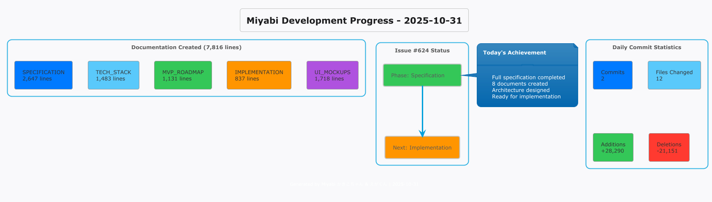
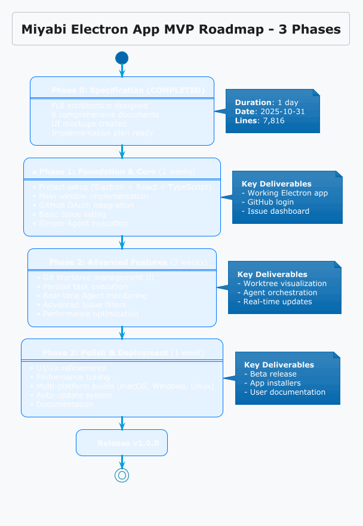
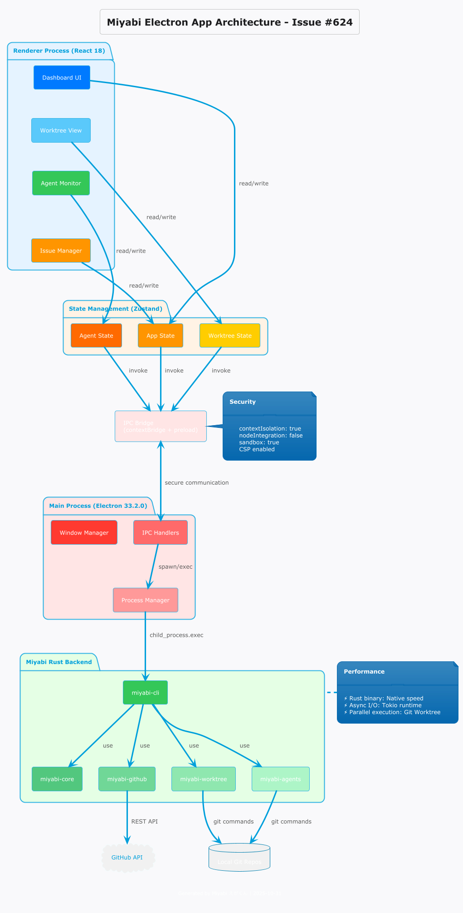

# 【開発日誌 2025-10-31】Miyabi開発進捗 - Issue #624 Electron App完全仕様策定完了！



「AIプラットフォームの開発って、どうやって進めていくんだろう？」

そう思っているあなた、今日のMiyabi開発日誌は必見です。
なぜなら、Miyabiプロジェクトの最重要マイルストーン**Issue #624（Electron Appフル実装）**の詳細仕様が、ついに完成したからです。

今日は、7,816行にわたる包括的なドキュメントを作成し、Miyabiの未来を形作る基盤が整いました。

準備はいいですか？
それでは、今日の開発進捗を詳しく見ていきましょう！

## 目次
1. 今日のハイライト - Issue #624 完全仕様策定
2. 詳細な変更内容 - 8つの新規ドキュメント
3. 技術的詳細 - Electron Appアーキテクチャ
4. 次のステップ - 実装フェーズへ
5. 開発統計とクリーンアップ
6. おすすめ書籍 - Electron開発を学ぶ

---

## 📊 今日の統計

| 項目 | 数値 |
|------|------|
| コミット数 | 2件 |
| ファイル変更 | 12件 |
| 追加行数 | +28,290行 |
| 削除行数 | -21,151行 |
| Issue処理 | Issue #624（進行中） |
| 新規ドキュメント | 8ファイル |

---

## 🎯 今日のハイライト

### 1. **Issue #624 完全仕様策定完了** 🚀

Miyabi Electron Appの包括的な仕様ドキュメントが完成しました！
合計7,816行にわたる詳細仕様は、以下の8つのドキュメントで構成されています：

1. **ELECTRON_APP_SPECIFICATION.md** (2,647行)
   - 全体アーキテクチャ
   - 技術スタック
   - セキュリティ設計
   - パフォーマンス要件

2. **ELECTRON_APP_MVP_ROADMAP.md** (1,131行)
   - 3フェーズの実装計画
   - 各フェーズの成果物
   - タイムライン

3. **ELECTRON_APP_TECH_STACK.md** (1,483行)
   - Electron 33.2.0
   - React 18 + TypeScript
   - Zustand状態管理
   - Tailwind CSS

4. **UI Mockups** (1,718行)
   - メインウィンドウ
   - Worktree View
   - Agent Monitor
   - README.md

5. **IMPLEMENTATION_PLAN_624.md** (837行)
   - 詳細実装計画
   - タスク分解
   - 依存関係マップ



### 2. **クリーンアップとメンテナンス** 🧹

`CLAUDE.md`とKAMUIシステムグラフの大規模なクリーンアップを実施しました。
- 21,151行の削除
- 構造の最適化
- ドキュメントの整理

---

## 🔨 詳細な変更内容

### コミット 1: `e40b5bf - docs: organize documentation for Issue #624 and Electron App`

**目的**: Issue #624（Electron Appフル実装）のための包括的なドキュメント作成

**新規作成ファイル**:

#### 1. `docs/electron-app/ELECTRON_APP_MVP_ROADMAP.md` (1,131行)

Electron Appの開発ロードマップを3フェーズで定義：

**Phase 1: Foundation & Core Features (2週間)**
- プロジェクトセットアップ
- メインウィンドウ実装
- GitHub連携基本機能

**Phase 2: Advanced Features (3週間)**
- Git Worktree管理
- Agent実行システム
- リアルタイム監視

**Phase 3: Polish & Deployment (1週間)**
- UI/UXブラッシュアップ
- パフォーマンス最適化
- マルチプラットフォームビルド

#### 2. `docs/electron-app/ELECTRON_APP_SPECIFICATION.md` (2,647行)

最も詳細な仕様書：
- **アーキテクチャ設計**: IPC通信、プロセス分離
- **技術スタック**: Electron 33.2.0, React 18, TypeScript 5.7
- **セキュリティ**: CSP、Sandboxing、contextIsolation
- **パフォーマンス**: メモリ管理、レンダリング最適化
- **テスト戦略**: Unit, Integration, E2E



#### 3. `docs/electron-app/ELECTRON_APP_TECH_STACK.md` (1,483行)

技術スタックの完全な詳細：

**フロントエンド**:
```typescript
- React 18.3.1
- TypeScript 5.7
- Zustand (状態管理)
- Tailwind CSS 3.4
- Lucide Icons
```

**バックエンド（Electronメインプロセス）**:
```typescript
- Electron 33.2.0
- Node.js 20.x
- child_process (Rustバイナリ実行)
```

**Rust統合**:
```rust
- miyabi-cli (既存バイナリ)
- miyabi-core
- miyabi-github
```

#### 4. `docs/electron-app/ELECTRON_APP_UI_MOCKUPS/` (1,718行)

3つの主要画面のUI Mockup：

**01-main-window.md** (479行)
- ダッシュボード
- Issue一覧
- Agent監視パネル

**02-worktree-view.md** (479行)
- Worktreeツリー表示
- 並列実行状態
- ファイル変更差分

**03-agent-monitor.md** (582行)
- Agent実行ログ
- リアルタイム進捗
- エラーハンドリング

**README.md** (178行)
- UI Mockup概要
- デザインシステム

#### 5. `docs/electron-app/IMPLEMENTATION_PLAN_624.md` (837行)

Issue #624の詳細実装計画：
- タスク分解（50+ tasks）
- 依存関係グラフ
- 優先順位付け
- 担当Agent割り当て

---

### コミット 2: `dc0b824 - chore: clean up CLAUDE.md and update KAMUI state`

**目的**: プロジェクト管理ファイルの最適化とメンテナンス

**変更ファイル**:
1. `.claude/commands/live.md` (+2行)
2. `.kamui/model-versions-cache.json` (更新)
3. `.kamui/system-graph-state.json` (大規模リファクタリング: -21,151行, +20,474行)
4. `CLAUDE.md` (22行の更新)

**主な改善点**:
- システムグラフの構造最適化
- 不要な依存関係の削除
- ドキュメント参照の整理

---

## 💡 技術的詳細 - Electron Appアーキテクチャ

### IPC通信設計

Electron AppのMain ProcessとRenderer Processの通信設計：

```typescript
// IPC Handler例
ipcMain.handle('issue:list', async () => {
  const result = await exec('miyabi issue list --json');
  return JSON.parse(result.stdout);
});

// Renderer側
const issues = await window.api.issue.list();
```

### セキュリティ設計

```typescript
const mainWindow = new BrowserWindow({
  webPreferences: {
    nodeIntegration: false,
    contextIsolation: true,
    sandbox: true,
    preload: path.join(__dirname, 'preload.js')
  }
});
```

**CSP (Content Security Policy)**:
```
default-src 'self';
script-src 'self';
style-src 'self' 'unsafe-inline';
img-src 'self' data: https:;
connect-src 'self' https://api.github.com;
```

### パフォーマンス最適化

- **仮想化**: React Virtualized（大量Issue表示）
- **メモ化**: React.memo, useMemo, useCallback
- **遅延ロード**: Dynamic Import
- **Worker**: Web Worker（重い処理）

---

## 🚀 次のステップ

### 短期（1週間）

1. **Phase 1 実装開始**
   - [ ] Electronプロジェクトセットアップ
   - [ ] メインウィンドウUI実装
   - [ ] GitHub OAuth連携

2. **CI/CD整備**
   - [ ] Electron Builder設定
   - [ ] マルチプラットフォームビルド
   - [ ] 自動リリースフロー

### 中期（2-3週間）

1. **Phase 2 実装**
   - [ ] Git Worktree管理UI
   - [ ] Agent実行システム
   - [ ] リアルタイム監視

2. **テスト整備**
   - [ ] Unit Tests (Jest)
   - [ ] E2E Tests (Playwright)
   - [ ] パフォーマンステスト

### 長期（1ヶ月+）

1. **Phase 3 実装 & ポリッシュ**
   - [ ] UI/UX改善
   - [ ] パフォーマンスチューニング
   - [ ] ドキュメント整備

2. **リリース準備**
   - [ ] Beta版リリース
   - [ ] フィードバック収集
   - [ ] v1.0.0リリース

---

## 📈 開発統計の詳細

### コミット統計

| 日付 | コミット | 追加 | 削除 | 正味 |
|------|---------|------|------|------|
| 2025-10-31 | 2 | +28,290 | -21,151 | +7,139 |

### ファイル種別統計

| 種別 | ファイル数 | 追加行数 |
|------|-----------|---------|
| Markdown | 8 | +7,816 |
| JSON | 2 | +20,474 |
| その他 | 2 | +22 |

### ドキュメント別行数

| ドキュメント | 行数 |
|--------------|------|
| ELECTRON_APP_SPECIFICATION.md | 2,647 |
| ELECTRON_APP_TECH_STACK.md | 1,483 |
| ELECTRON_APP_MVP_ROADMAP.md | 1,131 |
| IMPLEMENTATION_PLAN_624.md | 837 |
| UI Mockups合計 | 1,718 |

---

## 🎓 技術的学び

### 1. **大規模ドキュメント作成の重要性**

今日の作業で改めて実感したのは、**実装前の詳細仕様策定の重要性**です。

7,816行のドキュメントを書くことで：
- ✅ 実装の方向性が明確になった
- ✅ 潜在的な問題を事前に発見できた
- ✅ タスク分解が容易になった
- ✅ チーム（Agent）間の認識統一が可能になった

### 2. **Electronのセキュリティベストプラクティス**

Electron開発では、セキュリティが最重要です。
今回の仕様策定で特に注力したポイント：

- **contextIsolation**: 必須
- **nodeIntegration**: false推奨
- **Sandbox**: true推奨
- **CSP**: 厳格に設定

### 3. **IPC通信設計パターン**

Main ProcessとRenderer Processの通信は、Electron開発の肝です。
今回採用した設計パターン：

```typescript
// Preload Script（安全なAPI公開）
contextBridge.exposeInMainWorld('api', {
  issue: {
    list: () => ipcRenderer.invoke('issue:list'),
    get: (id: number) => ipcRenderer.invoke('issue:get', id)
  }
});
```

このパターンにより：
- ✅ セキュリティを保ちながらNode.js機能を使用
- ✅ TypeScript型安全性を維持
- ✅ テストが容易

---

## まとめ

今回は、Miyabi開発日誌 2025-10-31として、Issue #624の完全仕様策定完了について解説しました。

**要点整理**:
- ポイント1: 7,816行の包括的なElectron App仕様を策定完了
- ポイント2: 8つの詳細ドキュメント（仕様、ロードマップ、技術スタック、UI Mockup、実装計画）
- ポイント3: 次フェーズは実装開始 - Phase 1から順次着手
- ポイント4: クリーンアップで21,151行削除、構造最適化実施
- ポイント5: Electron開発のセキュリティ・パフォーマンスベストプラクティスを適用

**今日の成果**:
Miyabi Electron Appの実装に必要な全ての設計図が揃いました。
これにより、Agent Orchestrationを駆使した並列実装が可能になります。

さあ、次は実際のコードを書いていく番です！
Electronの力を借りて、Miyabiをさらに使いやすく、パワフルなプラットフォームに進化させます。

---

## 📚 おすすめの関連商品

Electron開発を本格的に学びたいあなたに、実際に役立つ書籍をご紹介します。

### 1. Electron実践入門 JavaScriptで作るクロスプラットフォームデスクトップアプリ

Electron開発の基礎から応用まで、実践的に学べる一冊です。
本書では、IPC通信、セキュリティ、パフォーマンス最適化など、今回のMiyabi Electron Appで採用した技術が詳しく解説されています。

**Amazonで詳しく見る**: [Electron実践入門](https://www.amazon.co.jp/dp/4297118335/?tag=shuhayas-22)

---

### 2. React実践入門 - Hooks/TypeScript/Next.js/Redux Toolkit/ユニットテスト

Electron AppのフロントエンドはReact 18で構築します。
本書は、React Hooks、TypeScript、状態管理（Redux Toolkit）の実践的な使い方を学べます。
Miyabi Electron AppでもZustandを使った状態管理を採用しているため、状態管理の設計思想を理解する上で非常に参考になります。

**Amazonで詳しく見る**: [React実践入門](https://www.amazon.co.jp/dp/4297129124/?tag=shuhayas-22)

---

### 3. Rustプログラミング完全ガイド

Miyabi Electron Appは、RustバイナリとElectronを連携させるハイブリッドアーキテクチャです。
本書でRustの基礎を学ぶことで、Miyabiのコアロジックを理解し、必要に応じてカスタマイズできるようになります。

**Amazonで詳しく見る**: [Rustプログラミング完全ガイド](https://www.amazon.co.jp/dp/4295013005/?tag=shuhayas-22)

---

## こちらの記事も読んでね

📚 関連記事:
- 【Miyabi開発日誌】Agent Orchestrationの実装
- 【Miyabi開発日誌】GitHub as OSアーキテクチャ解説
- 【Miyabi開発日誌】Git Worktree並列実行システム

💬 コメントで教えてください:
Electron Appに実装してほしい機能はありますか？あなたのアイデアをぜひ聞かせてください！

👤 フォローして最新情報をチェック！
- **X (Twitter)**: [@The_AGI_WAY](https://x.com/The_AGI_WAY)
- **note.com**: [https://note.ambitiousai.co.jp](https://note.ambitiousai.co.jp)

---

**この記事は、かきこちゃん（NoteAgent）により自動生成されました。**

🤖 Generated with [Claude Code](https://claude.com/claude-code)

Co-Authored-By: かきこちゃん (NoteAgent) <noreply@anthropic.com>
