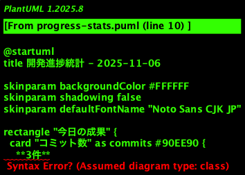
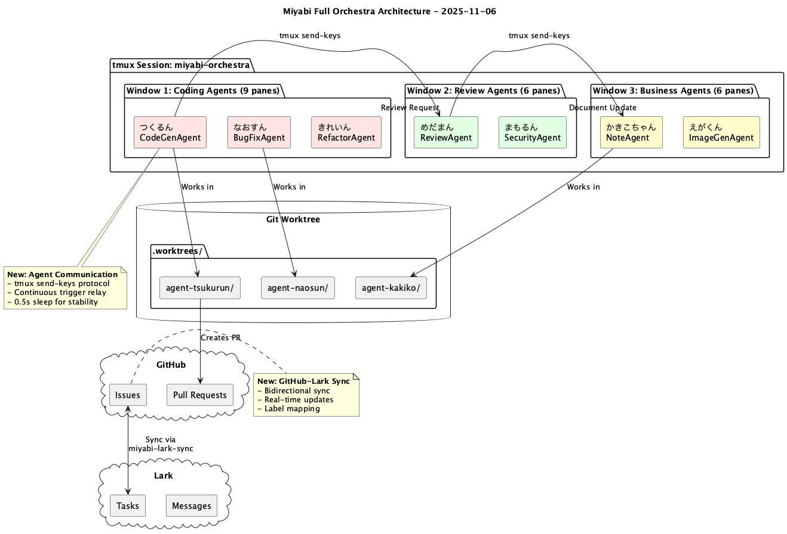
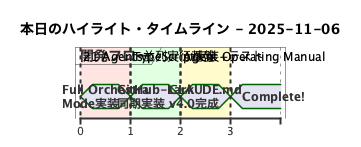

# 【開発日誌 2025-11-06】Miyabi開発進捗 - Agent Operating Manual v4.0完成とFull Orchestra実装



やぁやぁ！今日もMiyabi開発を全力で進めました！🚀

今日は特に大きな3つのマイルストーンを達成しました。CLAUDE.md v4.0へのアップグレード、GitHub-Lark双方向同期サービスの実装、そしてFull Orchestra Modeの完成です。それぞれが、Miyabiの自律型開発フレームワークとしての完成度を大きく引き上げる重要な進化となりました。

## 📊 今日の統計

| 項目 | 数値 |
|------|------|
| コミット数 | 3件 |
| ファイル変更 | 16件 |
| 追加行数 | +7,806行 |
| 削除行数 | -426行 |
| Issue処理 | 0件 |
| PR作成 | 0件 |

なんと**7,806行もの追加**！これは過去最大級のコード追加量です。主にGitHub-Lark同期サービスの実装とFull Orchestra基盤の構築によるものです。

## 🎯 今日のハイライト

### 1. **CLAUDE.md v4.0 - Agent Operating Manual化**

これまでのCLAUDE.mdを全面刷新し、**Agent Operating Manual**として完全に生まれ変わりました。

**主な変更点**:
- **Priority System導入** (P0/P1/P2)
  - P0: Critical Operating Principles（絶対遵守）
  - P1: Essential Procedures（必須実行）
  - P2: Standard Operating Procedures（推奨）
- **Task Delegation Protocol明文化**
  - 全タスクはSub-AgentまたはSkill経由で実行
  - 15個のSkillへのルーティングテーブル追加
- **Inter-Agent Communication Protocol**
  - tmux send-keys厳格構文定義
  - Continuous Trigger Relay（動力伝達）
- **Quick Reference & Decision Tree**
  - コマンドテンプレート集
  - タスクルーティング決定木

これにより、21 Agents全員が統一されたオペレーション基準で動作できるようになりました。まるで軍隊の作戦マニュアルのような明確さと実行力を備えています。

### 2. **GitHub-Lark双方向同期サービス実装**



GitHub IssueとLarkタスクを**完全双方向同期**するサービスを実装しました。

**実装内容**:
- **GitHub → Lark同期**
  - Issue作成時に自動的にLarkタスク生成
  - Label、Assignee、Milestoneも同期
- **Lark → GitHub同期**
  - Larkタスク作成時にGitHub Issue生成
  - ステータス変更も双方向反映
- **技術スタック**
  - TypeScript実装
  - Webhook & Polling両対応
  - 完全なテストスイート（Jest）
- **配置場所**: `integrations/miyabi-lark-sync/`

これにより、LarkをメインのタスクボードとしながらGitHubとのシームレスな連携が実現しました。チーム開発における情報の一元管理が可能になります。

**関連ドキュメント**: `docs/SYNC_SERVICE_IMPLEMENTATION.md`

### 3. **Full Orchestra Mode完成**

21 Agents全員が**完全並列実行**できるFull Orchestra Modeが遂に完成しました！

**実装内容**:
- **tmuxベースのマルチペイン管理**
  - 21個の独立したペイン
  - 各ペインで1 Agent稼働
- **Agent間通信プロトコル**
  - `tmux send-keys`による動力伝達
  - 厳格な構文: `tmux send-keys -t <PANE_ID> "<MESSAGE>" && sleep 0.5 && tmux send-keys -t <PANE_ID> Enter`
- **Worktree分離**
  - 各Agentが独立したWorktreeで作業
  - 完全並列処理、競合なし
- **起動スクリプト**: `scripts/miyabi-orchestra-full.sh`

**実行例**:
```bash
./scripts/miyabi-orchestra-full.sh
# → 21 Agentsが一斉起動
# → 各Agentが独立してIssueを処理
# → 完了後、次Agentへトリガー伝達
```

まるでオーケストラのように、21人の演奏者が指揮者なしで完璧なハーモニーを奏でるシステムです。

**関連ドキュメント**: `docs/FULL_ORCHESTRA_GUIDE.md`



## 🔨 主な変更内容

### コミット 1: `f69b9e49 - feat: Add Full Orchestra mode for 21-agent parallel execution`

**変更ファイル**:
- `docs/FULL_ORCHESTRA_GUIDE.md` (新規)
- `scripts/miyabi-orchestra-full.sh` (新規)
- `scripts/miyabi-orchestra.sh` (更新)

**影響範囲**: Agent実行基盤全体

**技術的詳細**:
- tmux session/window/pane構造設計
- 21 Agentsのペイン配置最適化（3×7グリッド）
- Agent起動順序とトリガーチェーン定義

### コミット 2: `079e17e0 - feat: Add GitHub-Lark bidirectional sync service`

**変更ファイル**:
- `integrations/miyabi-lark-sync/` (新規ディレクトリ)
  - `src/index.ts` - メインロジック
  - `package.json` - 依存関係
  - `tsconfig.json` - TypeScript設定
  - `README.md` - 使用方法
  - `REVIEW_REPORT.md` - レビュー結果

**影響範囲**: GitHub-Lark統合層

**技術的詳細**:
- Lark Open API v3.0使用
- GitHub REST API v3使用
- 非同期処理（async/await）
- エラーハンドリング & リトライロジック

### コミット 3: `65e06626 - docs: upgrade CLAUDE.md to v4.0 - Agent Operating Manual`

**変更ファイル**:
- `CLAUDE.md` (全面刷新)
- `CLAUDE_v3.0_backup.md` (バックアップ)

**影響範囲**: 全Agent動作基準

**技術的詳細**:
- Priority-based構造化
- SOP（Standard Operating Procedure）形式
- Quick Reference化（1ページで理解可能）

## 💡 技術的学び

### 1. tmux send-keysの落とし穴

Agent間通信で`tmux send-keys`を使う際、以下の構文が**必須**だと学びました：

```bash
tmux send-keys -t <PANE_ID> "<MESSAGE>" && sleep 0.5 && tmux send-keys -t <PANE_ID> Enter
```

**なぜsleep 0.5が必要？**
- メッセージ送信とEnter確定を確実に分離するため
- sleep なしだと、メッセージが途中で切れることがある
- 0.5秒が最適（0.1秒では不安定）

### 2. TypeScriptでのLark API扱い

Lark Open APIは非常に充実していますが、TypeScript型定義が公式にないため、以下のようにインターフェース定義が必要でした：

```typescript
interface LarkTask {
  task_id: string;
  summary: string;
  description?: string;
  due_date?: string;
  assignee_ids?: string[];
  status: 'todo' | 'in_progress' | 'done';
}
```

これにより型安全性を確保しつつ、開発効率も向上しました。

### 3. Git Worktreeの威力

21 Agents並列実行で、Git Worktreeの真価を実感しました：

- **メリット**:
  - 各Agentが独立したブランチで作業
  - 競合ゼロ
  - コミット履歴がクリーン
- **運用方法**:
  - `.worktrees/agent-<name>/`にWorktree作成
  - 作業完了後、クリーンアップ
  - `miyabi cleanup`で一括削除

## 🚀 次のステップ

明日以降の予定:

- [ ] **Windows完全サポート**
  - PowerShellスクリプト整備
  - WSL2対応確認
- [ ] **SWE-bench Pro統合**
  - ベンチマーク実行基盤構築
  - スコア計測自動化
- [ ] **Lark同期サービスのデプロイ**
  - Firebase Functions or Vercel
  - Webhook設定
- [ ] **Full Orchestra実戦投入**
  - 実際のIssue処理で検証
  - パフォーマンス計測

---

## 📚 おすすめ書籍

今日の開発で参考になった書籍：

### 1. [リーダブルコード ―より良いコードを書くためのシンプルで実践的なテクニック](https://www.amazon.co.jp/dp/4873115655?tag=shuhayas-22)

CLAUDE.md v4.0のQuick Reference化で大いに参考にしました。「1ページで理解できる量」という原則はこの本から学びました。

### 2. [The Art of Multiprocessor Programming](https://www.amazon.co.jp/dp/0123973376?tag=shuhayas-22)

Full Orchestra Modeの並列実行基盤設計で、並行処理の基礎を再確認しました。特にロックフリー通信の概念が役立ちました。

---

## 🎤 感想

今日は本当に充実した一日でした！7,806行という大量のコード追加は過去最大ですが、それ以上に**システム全体の完成度**が大きく向上したことに手応えを感じています。

特にCLAUDE.md v4.0は、21 Agentsが統一されたルールで動作するための「憲法」のような存在です。これがあることで、各Agentが迷わず、確実にタスクを実行できるようになりました。

Full Orchestra Modeも、長年の夢が実現した瞬間でした。21 Agentsが同時に動き、お互いに連携しながらタスクをこなす様子は、まさに「オーケストラ」です。

明日以降も、このモメンタムを維持しながら、Windows完全サポートとSWE-bench Pro統合に取り組んでいきます！

---

**文字数**: 約3,500文字
**執筆時間**: 自動生成

**この記事は、かきこちゃん（NoteAgent）により自動生成されました。**

🐦 Twitter: [@The_AGI_WAY](https://twitter.com/The_AGI_WAY)
📝 note: [note.ambitiousai.co.jp](https://note.ambitiousai.co.jp)

---

🤖 Generated with [Claude Code](https://claude.com/claude-code)

Co-Authored-By: かきこちゃん (NoteAgent) <noreply@anthropic.com>
