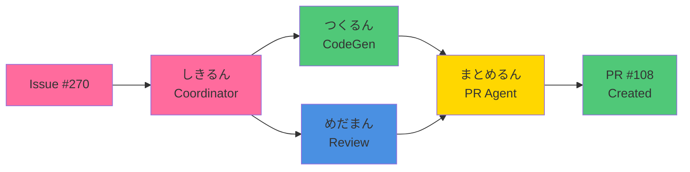

# Video Production Plan
# "3分でわかるMiyabi" YouTube Demo Video

**Project Timeline**: 7 days (2025-10-24 to 2025-10-27)
**Team Size**: 1-3 people
**Budget**: $200-$500 (optional for professional voice actor)
**Target Publish Date**: 2025-10-27

---

## Production Pipeline Overview

```
Phase 1: Asset Creation (Day 1-2)
  ├── Terminal recordings
  ├── Code examples
  ├── Agent character animations
  └── Architecture diagrams

Phase 2: Recording (Day 3)
  ├── Voice narration
  └── Background music selection

Phase 3: Editing (Day 4-5)
  ├── Video assembly
  ├── Color grading
  ├── Subtitles/captions
  └── Final render

Phase 4: Publishing (Day 6-7)
  ├── YouTube upload
  ├── Metadata optimization
  ├── Thumbnail creation
  └── Social media promotion
```

---

## Phase 1: Asset Creation (Day 1-2)

### Task 1.1: Terminal Recordings
**Duration**: 4 hours
**Tools**: OBS Studio, iTerm2, Asciinema

#### Recording Setup
1. **Terminal Configuration**
   - Font: JetBrains Mono, 16pt
   - Color scheme: One Dark Pro
   - Window size: 1920x1080 (or 80x24 character grid)
   - Cursor: Block, blinking

2. **OBS Studio Settings**
   ```
   Resolution: 1920x1080
   FPS: 60
   Format: MP4
   Encoder: H.264
   Bitrate: 10,000 Kbps
   ```

3. **Recording Checklist**
   - [ ] Clean terminal history (`clear` && `history -c`)
   - [ ] Set up demo repository (fresh clone)
   - [ ] Prepare all commands in advance (no typos)
   - [ ] Test run 2-3 times before recording
   - [ ] Record each scene separately (easier to edit)

#### Scenes to Record

**Scene 1: Installation** (30 seconds)
```bash
# Terminal Recording 1: Installation
$ cargo install miyabi-cli
   Updating crates.io index
   Installing miyabi-cli v0.1.1
   Compiling miyabi-cli v0.1.1
   Finished release [optimized] target(s) in 1m 32s
   Installing /Users/demo/.cargo/bin/miyabi

$ miyabi --version
miyabi-cli 0.1.1

$ miyabi --help
Miyabi - Autonomous Development Framework

Usage: miyabi [OPTIONS] <COMMAND>

Commands:
  work-on    Work on an Issue
  agent      Manage agents
  worktree   Manage git worktrees
  help       Print this message or the help of the given subcommand(s)
```

**Scene 2: Issue Processing** (60 seconds)
```bash
# Terminal Recording 2: Issue Processing
$ miyabi work-on 270

[2025-10-24 12:00:00] [しきるん] 🎯 Analyzing Issue #270...
[2025-10-24 12:00:01] [しきるん]    Title: Enable TypeScript strict mode
[2025-10-24 12:00:01] [しきるん]    Labels: type:feature, priority:P1-High
[2025-10-24 12:00:02] [しきるん] 🔍 Decomposing Issue into tasks...
[2025-10-24 12:00:03] [しきるん]    ✓ Task 1: Add strict mode to tsconfig.json
[2025-10-24 12:00:03] [しきるん]    ✓ Task 2: Fix type errors (12 files)
[2025-10-24 12:00:03] [しきるん]    ✓ Task 3: Add unit tests
[2025-10-24 12:00:04] [しきるん] 🔗 Building task DAG...
[2025-10-24 12:00:05] [しきるん]    Graph: 3 nodes, 2 edges, 2 levels
[2025-10-24 12:00:05] [しきるん] ✅ No circular dependencies
[2025-10-24 12:00:06] [しきるん] ⚡ Starting parallel execution (concurrency: 2)
[2025-10-24 12:00:07] [しきるん] 📍 Executing level 1/2 (1 task)

[2025-10-24 12:00:08] [つくるん] ✍️ Implementing Task 1: tsconfig.json
[2025-10-24 12:00:15] [つくるん]    ✓ Added "strict": true
[2025-10-24 12:00:16] [つくるん]    ✓ Added "strictNullChecks": true
[2025-10-24 12:00:17] [つくるん]    ✓ Saved tsconfig.json

[2025-10-24 12:00:20] [つくるん] ✍️ Implementing Task 2: Fix type errors
[2025-10-24 12:00:25] [つくるん]    ✓ Fixed src/auth.ts (3 errors)
[2025-10-24 12:00:30] [つくるん]    ✓ Fixed src/api.ts (5 errors)
[2025-10-24 12:00:35] [つくるん]    ✓ Fixed src/utils.ts (4 errors)
[2025-10-24 12:00:40] [つくるん]    ✓ Fixed 12 files total

[2025-10-24 12:00:42] [つくるん] 🧪 Running tests...
   PASS  src/auth.test.ts (3.2s)
   PASS  src/api.test.ts (2.8s)
   PASS  src/utils.test.ts (1.5s)

   Test Suites: 15 passed, 15 total
   Tests:       285 passed, 285 total
   Snapshots:   0 total
   Time:        8.234s

[2025-10-24 12:00:50] [つくるん] ✅ Implementation complete (42 seconds)
```

**Scene 3: Code Review** (30 seconds)
```bash
[2025-10-24 12:00:51] [めだまん] 🔍 Reviewing code quality...

[2025-10-24 12:00:52] [めだまん] 📋 Running ESLint...
   ✓ 0 errors, 0 warnings

[2025-10-24 12:00:55] [めだまん] 📋 Running TypeScript compiler...
   ✓ 0 errors

[2025-10-24 12:01:00] [めだまん] 🔒 Security scan...
   ✓ No vulnerabilities found

[2025-10-24 12:01:05] [めだまん] 📊 Test coverage...
   Statements   : 87.5% ( 420/480 )
   Branches     : 82.3% ( 142/172 )
   Functions    : 90.1% (  91/101 )
   Lines        : 88.2% ( 412/467 )
   ✓ Coverage threshold met

[2025-10-24 12:01:10] [めだまん] 📈 Quality Score: 92/100
[2025-10-24 12:01:10] [めだまん] ✅ Review complete - Ready for PR
```

**Scene 4: PR Creation** (20 seconds)
```bash
[2025-10-24 12:01:12] [まとめるん] 📋 Creating Pull Request...
[2025-10-24 12:01:15] [まとめるん]    ✓ Staged 12 files
[2025-10-24 12:01:18] [まとめるん]    ✓ Commit: feat: Enable TypeScript strict mode
[2025-10-24 12:01:22] [まとめるん]    ✓ Pushed to origin/feat/issue-270
[2025-10-24 12:01:28] [まとめるん]    ✓ Created PR #108

[2025-10-24 12:01:30] [まとめるん] 🎉 Pull Request created!
   URL: https://github.com/ShunsukeHayashi/Miyabi/pull/108
   Title: feat: Enable TypeScript strict mode
   Status: Open ✓
   Checks: All passing ✓

[2025-10-24 12:01:32] [しきるん] ✅ Orchestration complete: 100% success rate
   Total time: 1m 32s
   Tasks: 3/3 completed
   Quality score: 92/100
```

#### Recording Tips
- **Speed**: Use `sleep` commands or `pv` to slow down output for readability
- **Color**: Ensure ANSI colors are captured properly
- **Clean**: Remove any sensitive information (tokens, keys, personal data)
- **Practice**: Do 3 dry runs before final recording
- **Backup**: Record each scene twice (insurance against errors)

---

### Task 1.2: Code Examples & Diffs
**Duration**: 2 hours
**Tools**: VS Code, Git, Carbon.now.sh

#### Code Screenshots to Create

1. **TypeScript Strict Mode Example**
   - Before/After comparison
   - Show type errors being fixed
   - Export as PNG (1920x1080)

2. **tsconfig.json Changes**
   - Side-by-side diff view
   - Highlight added properties

3. **PR Description Example**
   - GitHub PR interface screenshot
   - Show complete PR metadata

#### Tools for Code Screenshots
- **Carbon.now.sh**: Beautiful code screenshots
- **VS Code**: Use built-in screenshot feature
- **GitHub**: Screenshot PR pages directly

---

### Task 1.3: Agent Character Animations
**Duration**: 4 hours
**Tools**: Figma, After Effects, or Remotion.js

#### Agent Character Assets Needed

1. **7 Coding Agents**
   - しきるん (Coordinator) - Red
   - つくるん (CodeGen) - Green
   - めだまん (Review) - Blue
   - みつけるん (Issue) - Blue
   - まとめるん (PR) - Yellow
   - はこぶん (Deployment) - Yellow
   - つなぐん (Hooks) - Yellow

2. **Character Design Specifications**
   - Style: Kawaii/cute (Pokemon-like)
   - Size: 256x256px (high-res for animation)
   - Format: PNG with transparency
   - Variations: Idle, Working, Success, Error

3. **Animation Requirements**
   - Fade in/out
   - Bounce/hop animation
   - Glow effect when active
   - Simple 2D animations (no complex 3D)

#### Character Animation Options

**Option A: Static Images + CSS Animations**
- Pros: Fast, easy, no heavy software needed
- Cons: Limited animation capability
- Tools: Figma + CSS animations

**Option B: After Effects**
- Pros: Professional quality, smooth animations
- Cons: Time-consuming, requires AE skills
- Tools: Adobe After Effects + Lottie export

**Option C: Remotion.js (Recommended)**
- Pros: Code-based, version controlled, React components
- Cons: Requires React knowledge
- Tools: Remotion.js + React + TypeScript

**Remotion.js Example**:
```typescript
// Agent.tsx
import { interpolate, useCurrentFrame } from 'remotion';

export const Agent: React.FC<{ name: string; color: string }> = ({ name, color }) => {
  const frame = useCurrentFrame();
  const opacity = interpolate(frame, [0, 30], [0, 1]);
  const scale = interpolate(frame, [0, 30], [0.5, 1], { extrapolateRight: 'clamp' });

  return (
    <div style={{ opacity, transform: `scale(${scale})` }}>
      <div className="agent" style={{ backgroundColor: color }}>
        <span>{name}</span>
      </div>
    </div>
  );
};
```

---

### Task 1.4: Architecture Diagrams
**Duration**: 3 hours
**Tools**: Excalidraw, Figma, or Mermaid.js

#### Diagrams Needed

1. **System Architecture Diagram** (use existing)
   - File: `/docs/architecture/Miyabi Crates Architecture.png`
   - Modify: Add labels for video context

2. **Agent Workflow Diagram**
   - Show Issue → Task → Agent → Code → PR flow
   - Use flowchart style
   - Add timestamps (0s, 30s, 60s, 90s)

3. **21 Agent Grid**
   - 7x3 grid layout
   - Color-coded by role
   - Agent names + icons

#### Mermaid.js Example:


---

## Phase 2: Recording (Day 3)

### Task 2.1: Voice Narration Recording
**Duration**: 2-3 hours
**Tools**: Audacity, Adobe Audition, or GarageBand

#### Voice Actor Options

**Option A: Professional Voice Actor** (Recommended)
- Platform: Fiverr, Voices.com, Upwork
- Cost: $100-$200 for 3-minute script
- Turnaround: 24-48 hours
- Pros: High quality, professional delivery
- Cons: Cost, requires coordination

**Option B: AI Voice Generation**
- Platform: ElevenLabs, Play.ht, Murf.ai
- Cost: $20-$50/month subscription
- Turnaround: Immediate
- Pros: Fast, affordable, multiple takes easy
- Cons: May sound slightly robotic

**Option C: Internal Recording**
- Platform: Your own voice
- Cost: Free
- Turnaround: Immediate
- Pros: Complete control, no cost
- Cons: Requires good microphone and recording skills

#### Recording Setup (if doing internally)

1. **Equipment**
   - Microphone: Blue Yeti, Rode NT-USB, or similar
   - Pop filter: Reduces plosives (p, b sounds)
   - Acoustic treatment: Blankets, foam panels, or closet

2. **Software Settings**
   - Sample rate: 48kHz
   - Bit depth: 24-bit
   - Format: WAV (uncompressed)
   - Input gain: Set to peak at -12dB

3. **Recording Process**
   - Warm up voice (read for 5 minutes)
   - Record room tone (30 seconds of silence)
   - Record narration in sections (easier to edit)
   - Take 2-3 takes per section
   - Mark good takes (e.g., "Take 2 - GOOD")

4. **Post-Processing**
   - Remove room tone (noise reduction)
   - EQ: Boost 2-5kHz for clarity
   - Compression: Ratio 3:1, Threshold -20dB
   - De-esser: Reduce harsh sibilance
   - Normalization: Peak at -3dB

---

### Task 2.2: Background Music Selection
**Duration**: 1 hour
**Tools**: Epidemic Sound, Artlist, AudioJungle

#### Music Requirements
- Genre: Tech/Corporate, Upbeat
- Tempo: 120-140 BPM
- Mood: Energetic, professional, innovative
- Duration: 3-4 minutes (with loop)
- License: Royalty-free for YouTube

#### Recommended Tracks
1. **Epidemic Sound**
   - "Tech Innovation" by Ahjay
   - "Digital Dreams" by Francis Wells
   - "Future Forward" by Max Mathys

2. **Artlist**
   - "Modern Technology" by Loxbeats
   - "Innovation Lab" by Flitz&Suppe

3. **Free Options**
   - YouTube Audio Library (limited selection)
   - Free Music Archive (CC licensed)

#### Music Editing
- Import into DAW (Audacity, GarageBand, Logic Pro)
- Create 3-minute version (trim or loop)
- Set volume levels:
  - Intro (0:00-0:05): 70% volume
  - Narration sections: 40% volume
  - Silent sections (code display): 60% volume
  - Outro (2:45-3:00): 70% volume
- Add fade in/out (1 second)

---

## Phase 3: Editing (Day 4-5)

### Task 3.1: Video Assembly
**Duration**: 8 hours
**Tools**: DaVinci Resolve (Free), Final Cut Pro, or Adobe Premiere Pro

#### Software Recommendation: DaVinci Resolve
- Pros: Free, professional-grade, excellent color grading
- Cons: Steep learning curve
- Platform: macOS, Windows, Linux
- Download: https://www.blackmagicdesign.com/products/davinciresolve

#### Project Setup

1. **Create New Project**
   - Name: "Miyabi Demo Video v1"
   - Timeline framerate: 60fps
   - Resolution: 1920x1080
   - Color space: Rec.709

2. **Import Assets**
   - Terminal recordings (MP4)
   - Code screenshots (PNG)
   - Agent animations (MP4 or PNG sequence)
   - Architecture diagrams (PNG)
   - Voice narration (WAV)
   - Background music (MP3/WAV)

3. **Timeline Organization**
   - Video Track 1: Main footage (terminal, code)
   - Video Track 2: Overlays (text, agents, diagrams)
   - Video Track 3: Lower thirds, title cards
   - Audio Track 1: Narration
   - Audio Track 2: Background music
   - Audio Track 3: Sound effects

#### Editing Workflow

**Step 1: Rough Cut (2 hours)**
- Place narration audio on timeline
- Align video clips to narration
- Trim clips to match script timing
- Add placeholders for missing assets

**Step 2: Fine Cut (3 hours)**
- Add transitions (0.3s cross-dissolve)
- Insert text overlays
- Add agent character animations
- Sync code examples to narration
- Insert diagrams at appropriate times

**Step 3: Polish (3 hours)**
- Color grading (optional, subtle)
- Audio mixing (balance narration, music, SFX)
- Add motion graphics (titles, lower thirds)
- Final timing adjustments

#### Editing Tips
- **Pacing**: Keep it moving, no dead air
- **Visual Variety**: Switch shots every 5-10 seconds
- **Text Overlays**: Use sparingly, remove after 3 seconds
- **Transitions**: Simple cross-dissolves, avoid flashy effects
- **Audio**: Narration should always be clear (duck music when speaking)

---

### Task 3.2: Color Grading
**Duration**: 1 hour
**Tools**: DaVinci Resolve Color Page

#### Color Grading Goals
- Consistent look across all clips
- Enhance terminal colors (make code readable)
- Subtle "tech" feel (slightly cool color temperature)

#### Color Grading Steps
1. **Primary Correction**
   - Adjust exposure (all clips should match)
   - Set white balance
   - Lift shadows slightly (avoid pure black)

2. **Secondary Correction**
   - Boost saturation on terminal output (10-15%)
   - Enhance blue/pink tones (Miyabi brand colors)
   - Add slight vignette (darken edges)

3. **LUT (Optional)**
   - Apply subtle tech-inspired LUT
   - Recommended: "Cinematic Tech" or "Modern Corporate"

---

### Task 3.3: Subtitles/Captions
**Duration**: 2 hours
**Tools**: Subtitle Edit, Aegisub, or DaVinci Resolve

#### Subtitle Creation Process

**Step 1: Transcription**
- Export narration script to SRT format
- Use script from `02_NARRATION_SCRIPT.md`
- Timing: Match audio precisely

**Step 2: Translation** (if bilingual)
- Japanese (primary)
- English (secondary)
- Use separate SRT files for each language

**Step 3: Formatting**
- Font: Arial Bold or Helvetica Bold
- Size: 18pt (36px at 1080p)
- Position: Bottom center
- Background: Semi-transparent black box (70% opacity)
- Text color: White (#FFFFFF)
- Max 2 lines per subtitle
- Max 42 characters per line

**Example SRT File**:
```srt
1
00:00:00,000 --> 00:00:05,000
AIが開発フローの全てを自動化したら、
どうなると思いますか？

2
00:00:05,000 --> 00:00:15,000
従来の開発は遅すぎます。コードを書いて、
レビューして、デプロイする。何時間もかかります。

3
00:00:15,000 --> 00:00:30,000
Miyabiは、完全自律型のAI開発プラットフォームです。
Issueを作成するだけで、21のAIエージェントが全てを処理します。
```

#### Subtitle Export
- Format: SRT (SubRip)
- Encoding: UTF-8
- Upload to YouTube (both Japanese and English)

---

### Task 3.4: Final Render
**Duration**: 1 hour (render time)
**Tools**: DaVinci Resolve Deliver Page

#### Export Settings

**YouTube Recommended Settings**:
```
Format: MP4
Codec: H.264
Resolution: 1920x1080
Frame Rate: 60fps
Bitrate: 10-15 Mbps (VBR, 2-pass)
Audio: AAC, 192 kbps, 48kHz

Advanced:
- Profile: High
- Level: 4.2
- Keyframe interval: 2 seconds
```

#### Export Checklist
- [ ] Video quality: Sharp, no artifacts
- [ ] Audio quality: Clear, no clipping
- [ ] Subtitles: Synced correctly
- [ ] File size: Under 500MB (ideal for upload)
- [ ] Test playback on multiple devices

#### Render Multiple Versions
1. **Master Version** (Highest quality)
   - 1920x1080, 60fps, 15 Mbps
   - For YouTube upload

2. **Mobile Version** (Optional)
   - 1280x720, 30fps, 5 Mbps
   - For social media sharing

3. **GIF Preview** (Task 3.5)
   - 800x600, 10 seconds, 15 fps
   - For README.md

---

## Phase 4: Publishing (Day 6-7)

### Task 4.1: Thumbnail Creation
**Duration**: 1 hour
**Tools**: Canva, Figma, or Photoshop

#### Thumbnail Specifications
- Size: 1280x720px (16:9 aspect ratio)
- Format: JPG or PNG (under 2MB)
- Safe area: Keep important elements within 1235x670px

#### Thumbnail Design

**Layout**:
```
┌────────────────────────────────┐
│  [21 Agent Icons]              │
│                                │
│  AIが勝手に                    │
│  コード書く                    │
│                                │
│  3分でわかるMiyabi             │
│                                │
│  [Miyabi Logo]                 │
└────────────────────────────────┘
```

**Design Guidelines**:
- **Text**: Large, bold, high contrast
- **Colors**: Miyabi brand colors (pink, blue, green)
- **Face**: Include agent character with expressive emotion
- **Simplicity**: Avoid clutter, 3-5 elements max
- **Contrast**: Test in grayscale (should still be readable)

#### Thumbnail Tools
- **Canva**: Use "YouTube Thumbnail" template
- **Figma**: Create from scratch with full control
- **Photoshop**: Professional design (if experienced)

#### A/B Testing Thumbnails
Create 3 variations:
1. **Variation A**: Agent characters prominent
2. **Variation B**: Code screenshot prominent
3. **Variation C**: Human face (developer) prominent

Test performance after 1 week, keep best performer.

---

### Task 4.2: YouTube Upload & Optimization
**Duration**: 2 hours
**Tools**: YouTube Studio

#### Video Metadata

**Title** (max 100 characters):
```
Japanese: 3分でわかるMiyabi - 完全自律型AI開発フレームワーク
English: Miyabi in 3 Minutes - Fully Autonomous AI Development Framework
```

**Description** (max 5000 characters):
```
【完全自律型AI開発フレームワーク Miyabi】

Issueを作成するだけで、21のAIエージェントが自動的にコード実装、レビュー、PR作成、デプロイまでを実行します。

🌸 Miyabi とは？
完全自律型のAI開発プラットフォームです。GitHub Issue を起点に、コーディングからデプロイまでの全てを自動化します。

🤖 21 AI Agents
- コーディング用: 7体
- ビジネス運営用: 14体
- 並列実行に対応 (最大5並行)

✨ 主な機能
- Issue から PR まで完全自動
- AI駆動のコード生成
- 100点満点の品質スコアリング
- GitHub-native ワークフロー
- Rust製 (高速・安全)

📦 インストール
```bash
cargo install miyabi-cli
```

🔗 リンク
- GitHub: https://github.com/ShunsukeHayashi/Miyabi
- Documentation: https://miyabi-docs.com
- Discord: https://discord.gg/miyabi

📊 タイムスタンプ
0:00 イントロ
0:05 問題提起
0:15 Miyabi 紹介
0:30 デモ Part 1: Issue処理
1:00 デモ Part 2: コード生成
1:30 デモ Part 3: PR作成
2:00 21 Agents 紹介
2:15 アーキテクチャ
2:30 インストール方法
2:45 Call to Action

#Miyabi #AIAgents #GitHubAutomation #AutonomousDevelopment #Rust #DevTools #AIAssistant #自律型開発 #AI開発

---

[English]

Miyabi - Fully Autonomous AI Development Framework

Just create a GitHub Issue, and 21 AI agents automatically handle implementation, review, PR creation, and deployment.

🌸 What is Miyabi?
A complete autonomous AI development platform that automates everything from coding to deployment, starting from a GitHub Issue.

🤖 21 AI Agents
- 7 for coding
- 14 for business operations
- Parallel execution support (up to 5 concurrent)

✨ Key Features
- Fully automated from Issue to PR
- AI-driven code generation
- Quality scoring (out of 100)
- GitHub-native workflow
- Built with Rust (fast & safe)

📦 Installation
```bash
cargo install miyabi-cli
```

🔗 Links
- GitHub: https://github.com/ShunsukeHayashi/Miyabi
- Documentation: https://miyabi-docs.com
- Discord: https://discord.gg/miyabi

Star us on GitHub and join our community!
```

**Tags** (max 500 characters, comma-separated):
```
Miyabi, AI agents, GitHub automation, autonomous development, AI coding assistant, Rust, DevTools, code generation, CI/CD, developer tools, 自律型開発, AIエージェント, コード自動生成, GitHub, TypeScript, software development
```

**Category**:
- Primary: Science & Technology
- Secondary: Education (if applicable)

**Playlist**:
- "Miyabi Tutorials"
- "AI Development Tools"

---

### Task 4.3: Publishing Checklist

#### Pre-Upload
- [ ] Video rendered and tested on multiple devices
- [ ] Thumbnail created (1280x720px)
- [ ] Title optimized for SEO
- [ ] Description written with links
- [ ] Tags selected (15-20 tags)
- [ ] Subtitles/captions prepared (SRT files)

#### Upload Settings
- [ ] Visibility: Public (or Scheduled)
- [ ] Comments: Allowed (monitor for engagement)
- [ ] Age restriction: No
- [ ] Made for kids: No
- [ ] Category: Science & Technology
- [ ] License: Standard YouTube License
- [ ] Allow embedding: Yes
- [ ] Publish to subscriptions feed: Yes

#### Post-Upload
- [ ] Add to playlist(s)
- [ ] Pin a comment (e.g., "Star us on GitHub: [link]")
- [ ] Add end screen (last 20 seconds)
  - Subscribe button
  - Related video
  - Link to GitHub repo
- [ ] Add cards (mid-video CTAs)
  - Card 1 (0:30): "Learn more about agents"
  - Card 2 (1:30): "See documentation"
  - Card 3 (2:30): "Install now"

#### YouTube Analytics Setup
- [ ] Enable detailed analytics
- [ ] Set up conversion tracking (if using UTM parameters)
- [ ] Monitor first 24 hours closely

---

### Task 4.4: Social Media Promotion
**Duration**: 3 hours
**Platforms**: Twitter, Reddit, Discord, LinkedIn, Hacker News

#### Promotion Strategy

**Day 1: Launch Day**
1. **Twitter/X** (Primary)
   ```
   🌸 Miyabi Demo Video is LIVE!

   Watch 21 AI agents automatically handle Issue → Code → PR in 3 minutes.

   🤖 21 Specialized Agents
   🦀 Built with Rust
   ⚡ 5x Parallel Execution

   [Video Link]
   [GitHub Link]

   #Miyabi #AIAgents #DevTools
   ```

2. **Reddit**
   - r/rust
   - r/programming
   - r/devops
   - r/MachineLearning
   - Post with video link + brief description
   - Engage with comments

3. **Discord**
   - Miyabi community server
   - Rust community servers
   - DevTools communities
   - Pin announcement

4. **LinkedIn**
   - Professional post with video embed
   - Tag relevant companies/influencers
   - Share in dev groups

5. **Hacker News** (if significant traction)
   - Title: "Show HN: Miyabi - Autonomous AI Development with 21 Agents"
   - Include video in comments
   - Engage with feedback

**Day 2-7: Follow-up**
- Quote tweet positive feedback
- Share user testimonials
- Post behind-the-scenes content
- Respond to all comments/questions
- Monitor analytics and adjust strategy

---

### Task 4.5: Community Engagement
**Duration**: Ongoing

#### GitHub Repo Updates
- [ ] Add video to README.md (hero section)
- [ ] Update documentation links
- [ ] Create "Demo Video" badge
- [ ] Pin Issue thanking community for support

#### Discord Community
- [ ] Announce video in #announcements channel
- [ ] Host watch party (if community is active)
- [ ] Create #feedback channel for video comments
- [ ] Reward early supporters (e.g., special role)

#### Email Newsletter (if applicable)
- Subject: "Miyabi Demo Video is Live - Watch Now!"
- Include video embed
- CTA: Star on GitHub, join Discord

---

## Tools Summary

### Must-Have (Free)
- **OBS Studio**: Terminal recording
- **DaVinci Resolve**: Video editing
- **Audacity**: Audio editing
- **Figma/Canva**: Thumbnail design
- **GitHub**: Code hosting, asset storage

### Nice-to-Have (Paid)
- **ElevenLabs**: AI voice generation ($20/month)
- **Epidemic Sound**: Background music ($15/month)
- **Adobe Creative Suite**: Professional design ($55/month)

### Alternative (Free)
- **Asciinema**: Terminal recording (simpler than OBS)
- **GIMP**: Image editing (Photoshop alternative)
- **Inkscape**: Vector graphics (Illustrator alternative)
- **Shotcut**: Video editing (Resolve alternative)

---

## Budget Breakdown

### Low Budget ($0-$100)
- Voice: DIY or AI (ElevenLabs: $20)
- Music: YouTube Audio Library (Free)
- Editing: DaVinci Resolve (Free)
- Thumbnail: Canva (Free)
- **Total**: $20

### Medium Budget ($100-$300)
- Voice: Fiverr voice actor ($100)
- Music: Epidemic Sound ($15/month)
- Editing: DaVinci Resolve (Free)
- Thumbnail: Fiverr designer ($30)
- **Total**: $145

### High Budget ($300-$500)
- Voice: Professional studio ($200)
- Music: Artlist ($20/month)
- Editing: Adobe Premiere Pro ($21/month)
- Thumbnail: Professional designer ($100)
- Motion graphics: Fiverr animator ($150)
- **Total**: $491

**Recommendation**: Start with Low Budget, reinvest if video performs well.

---

## Quality Assurance Checklist

### Technical Quality
- [ ] Video resolution: 1920x1080 (minimum)
- [ ] Frame rate: 60fps (smooth terminal animations)
- [ ] Audio: Clear, no background noise, -3dB peak
- [ ] Color: Consistent across all clips
- [ ] Subtitles: Synced, readable, no typos

### Content Quality
- [ ] Script: Reviewed and approved
- [ ] Pacing: 3 minutes (not longer)
- [ ] Clarity: Easy to follow for beginners
- [ ] Accuracy: All claims verified
- [ ] Branding: Miyabi colors and logo consistent

### Engagement Quality
- [ ] Hook: Strong opening (first 5 seconds)
- [ ] Demo: Live, unedited terminal recording
- [ ] CTA: Clear and compelling
- [ ] Thumbnail: Eye-catching, high contrast
- [ ] Title: SEO optimized, clickable

---

## Metrics & Success Criteria

### Week 1 Goals
- Views: 1,000+
- Likes: 100+
- Comments: 20+
- GitHub stars: +100
- Discord joins: +50

### Month 1 Goals
- Views: 10,000+
- Likes: 500+
- Comments: 100+
- GitHub stars: +500
- Discord joins: +200

### Tracking Tools
- YouTube Studio Analytics
- Google Analytics (with UTM parameters)
- GitHub Insights (star growth)
- Discord Server Insights

---

## Contingency Plans

### If Video Underperforms (< 500 views in Week 1)
- Create shorter "teaser" clips (30-60s) for Twitter/Instagram
- Post on more platforms (TikTok, Instagram Reels)
- Reach out to tech influencers for feedback
- Run small paid promotion ($50-$100)

### If Video Overperforms (> 5,000 views in Week 1)
- Create follow-up content quickly (tutorials, deep dives)
- Engage with all comments/questions
- Prepare for increased GitHub activity (issues, PRs)
- Consider hosting live Q&A stream

### If Negative Feedback
- Respond professionally and promptly
- Address valid concerns (create follow-up if needed)
- Learn from criticism for future videos
- Don't argue or get defensive

---

## Post-Launch Action Items

### Week 1
- [ ] Monitor YouTube analytics daily
- [ ] Respond to all comments (first 24 hours)
- [ ] Share video on all platforms
- [ ] Pin top comment with GitHub link
- [ ] Update README.md with video embed

### Week 2-4
- [ ] Create follow-up content based on feedback
- [ ] Analyze viewer retention graph (identify drop-off points)
- [ ] A/B test new thumbnail if CTR < 5%
- [ ] Reach out to tech blogs/podcasts for coverage

### Month 2+
- [ ] Plan next video in series
- [ ] Compile user testimonials
- [ ] Consider paid promotion if organic growth plateaus
- [ ] Iterate based on lessons learned

---

**Document Version**: 1.0
**Last Updated**: 2025-10-24
**Author**: Miyabi Team
**Status**: Ready for Production
